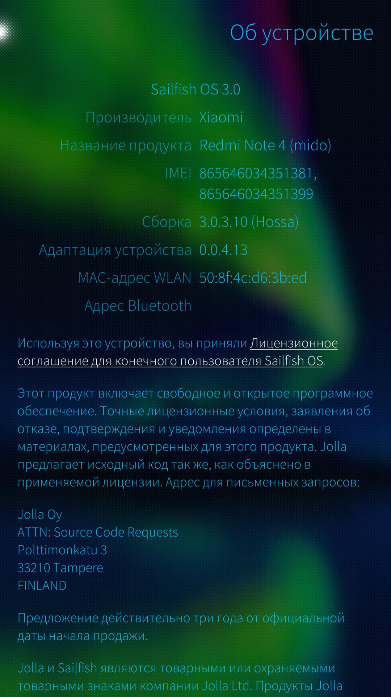

Попробуем заменить наши конфигурации для сборки Sailfish на конфигурации от piggz, пересобрать, и использовать с рабочим ядром Electrablue.<br>
Сделаем резервную копию
```console
PlatformSDK:~/hadk$ mkdir backup
PlatformSDK:~/hadk$ cp -r rpm ~/hadk/backup/rpm
PlatformSDK:~/hadk/rpm$ git remote add piggz https://github.com/piggz/droid-hal-mido
PlatformSDK:~/hadk/rpm$ git fetch --all
```
<details>
Fetching droid-hal-mido<br>
Fetching piggz<br>
warning: no common commits<br>
remote: Enumerating objects: 10, done.<br>
remote: Total 10 (delta 0), reused 0 (delta 0), pack-reused 10<br>
Unpacking objects: 100% (10/10), done.<br>
From https://github.com/piggz/droid-hal-mido<br>
 * [new branch]      master     -> piggz/master<br>
</details><br>

```console
PlatformSDK:~/hadk/rpm$ git reset --hard piggz/master
```
<details>
HEAD is now at f9fb090 Add user to media_rw for access to android_storage<br>
</details><br>
```console
PlatformSDK:~/hadk/rpm$ git add .
PlatformSDK:~/hadk/rpm$ git commit -m "Piggz repo"
```
<details>
[master 8fd1eb2] Piggz repo<br>
 1 file changed, 1 insertion(+), 1 deletion(-)<br>
</details><br>

```console
PlatformSDK:~/hadk/rpm$ git push --force droid-hal-mido master
```
<details>
Username for 'https://github.com': AndreevDmitry<br>
Password for 'https://AndreevDmitry@github.com':<br>
Counting objects: 12, done.<br>
Delta compression using up to 16 threads.<br>
Compressing objects: 100% (12/12), done.<br>
Writing objects: 100% (12/12), 1.42 KiB | 0 bytes/s, done.<br>
Total 12 (delta 3), reused 0 (delta 0)<br>
remote: Resolving deltas: 100% (3/3), done.<br>
To https://github.com/AndreevDmitry/droid-hal-mido.git<br>
 + 8be11af...8fd1eb2 master -> master (forced update)<br>
</details><br>

```console
PlatformSDK:~/hadk$ mkdir -p backup/hybris
PlatformSDK:~/hadk$ cp -r hybris/droid-configs ~/hadk/backup/hybris/droid-configs
PlatformSDK:~/hadk/hybris/droid-configs$ git remote add piggz https://github.com/piggz/droid-config-mido
PlatformSDK:~/hadk/hybris/droid-configs$ git fetch --all
```
<details>
Fetching dcm<br>
Fetching piggz<br>
warning: no common commits<br>
remote: Enumerating objects: 1, done.<br>
remote: Counting objects: 100% (1/1), done.<br>
remote: Total 478 (delta 0), reused 1 (delta 0), pack-reused 477<br>
Receiving objects: 100% (478/478), 76.75 KiB | 0 bytes/s, done.<br>
Resolving deltas: 100% (134/134), done.<br>
From https://github.com/piggz/droid-config-mido<br>
 * [new branch]      master     -> piggz/master<br>
 * [new tag]         0.4.0      -> 0.4.0<br>
From https://github.com/piggz/droid-config-mido<br>
 * [new tag]         0.0.5      -> 0.0.5<br>
 * [new tag]         0.0.6      -> 0.0.6<br>
 * [new tag]         0.0.7      -> 0.0.7<br>
 * [new tag]         0.0.8      -> 0.0.8<br>
 * [new tag]         0.0.9      -> 0.0.9<br>
 * [new tag]         0.1.0      -> 0.1.0<br>
 * [new tag]         0.1.1      -> 0.1.1<br>
 * [new tag]         0.1.2      -> 0.1.2<br>
 * [new tag]         0.1.3      -> 0.1.3<br>
 * [new tag]         0.1.4      -> 0.1.4<br>
 * [new tag]         0.1.5      -> 0.1.5<br>
 * [new tag]         0.2.0      -> 0.2.0<br>
 * [new tag]         0.2.1      -> 0.2.1<br>
 * [new tag]         0.2.2      -> 0.2.2<br>
 * [new tag]         0.2.3      -> 0.2.3<br>
 * [new tag]         0.2.4      -> 0.2.4<br>
 * [new tag]         0.2.5      -> 0.2.5<br>
 * [new tag]         0.2.6      -> 0.2.6<br>
 * [new tag]         0.2.7      -> 0.2.7<br>
 * [new tag]         0.2.8      -> 0.2.8<br>
 * [new tag]         0.2.9      -> 0.2.9<br>
 * [new tag]         0.3.0      -> 0.3.0<br>
 * [new tag]         0.3.1      -> 0.3.1<br>
 * [new tag]         0.3.2      -> 0.3.2<br>
 * [new tag]         0.3.3      -> 0.3.3<br>
 * [new tag]         0.3.4      -> 0.3.4<br>
 * [new tag]         0.3.5      -> 0.3.5<br>
 * [new tag]         0.3.6      -> 0.3.6<br>
 * [new tag]         0.3.7      -> 0.3.7<br>
 * [new tag]         v0.1       -> v0.1<br>
 * [new tag]         v0.2       -> v0.2<br>
 * [new tag]         v0.3       -> v0.3<br>
 * [new tag]         v0.4       -> v0.4<br>
 </details><br>

```console
PlatformSDK:~/hadk/hybris/droid-configs$ git reset --hard piggz/master
```
 <details>
 HEAD is now at c68d9d1 Update submodule<br>
 </details><br>
```console
PlatformSDK:~/hadk/hybris/droid-configs$ git add .
PlatformSDK:~/hadk/hybris/droid-configs$ git commit -m "Piggz repo"
```
 <details>
 [master 8834edf] Piggz repo<br>
  11 files changed, 286 insertions(+)<br>
  create mode 100644 documentation.list<br>
  create mode 100644 installroot/usr/share/kickstarts/Jolla-@RELEASE@-mido-@ARCH@.ks<br>
  create mode 100644 tmp/bluez4.files<br>
  create mode 100644 tmp/bluez5.files<br>
  create mode 100644 tmp/droid-config.files<br>
  create mode 100644 tmp/flashing.files<br>
  create mode 100644 tmp/kickstart-configuration.files<br>
  create mode 100644 tmp/policy-settings.files<br>
  create mode 100644 tmp/pulseaudio-settings.files<br>
  create mode 100644 tmp/sailfish-settings.files<br>
  create mode 100644 tmp/ssu-kickstarts.files<br>
 </details><br>

```console
PlatformSDK:~/hadk/hybris/droid-configs$ git push --force dcm master
```
<details>
Username for 'https://github.com': AndreevDmitry<br>
Password for 'https://AndreevDmitry@github.com':<br>
Counting objects: 494, done.<br>
Delta compression using up to 16 threads.<br>
Compressing objects: 100% (235/235), done.<br>
Writing objects: 100% (494/494), 81.06 KiB | 0 bytes/s, done.<br>
Total 494 (delta 134), reused 477 (delta 134)<br>
remote: Resolving deltas: 100% (134/134), done.<br>
To https://github.com/AndreevDmitry/droid-config-mido.git<br>
+ b6fd7ed...8834edf master -> master (forced update)<br>
</details><br>

```console
PlatformSDK:~/hadk/hybris$ cp -r droid-hal-version-mido ~/hadk/backup/hybris/droid-hal-version-mido
PlatformSDK:~/hadk/hybris$ cd droid-hal-version-mido
PlatformSDK:~/hadk/hybris/droid-hal-version-mido$ git remote add piggz https://github.com/piggz/droid-hal-version-mido
PlatformSDK:~/hadk/hybris/droid-hal-version-mido$ git fetch --all
```
<details>
Fetching dhvm<br>
Fetching piggz<br>
warning: no common commits<br>
remote: Enumerating objects: 19, done.<br>
remote: Total 19 (delta 0), reused 0 (delta 0), pack-reused 19<br>
Unpacking objects: 100% (19/19), done.<br>
From https://github.com/piggz/droid-hal-version-mido<br>
* [new branch]      master     -> piggz/master<br>
* [new tag]         0.0.4      -> 0.0.4<br>
From https://github.com/piggz/droid-hal-version-mido<br>
* [new tag]         0.0.1      -> 0.0.1<br>
* [new tag]         0.0.2      -> 0.0.2<br>
* [new tag]         0.0.3      -> 0.0.3<br>
</details><br>

```console
PlatformSDK:~/hadk/hybris/droid-hal-version-mido$ git reset --hard piggz/master
```
<details>
HEAD is now at 760dbde Fixup vibrator config<br>
</details><br>

```console
PlatformSDK:~/hadk/hybris/droid-hal-version-mido$ git add .
PlatformSDK:~/hadk/hybris/droid-hal-version-mido$ git commit -m "Piggz repo"
```
<details>
[master 0c41091] Piggz repo<br>
 2 files changed, 1 insertion(+), 1 deletion(-)<br>
 create mode 100644 documentation.list<br>
</details><br>

```console
PlatformSDK:~/hadk/hybris/droid-hal-version-mido$ git push --force dhvm master
```
<details>
Username for 'https://github.com': AndreevDmitry<br>
Password for 'https://AndreevDmitry@github.com':<br>
Counting objects: 21, done.<br>
Delta compression using up to 16 threads.<br>
Compressing objects: 100% (20/20), done.<br>
Writing objects: 100% (21/21), 2.32 KiB | 0 bytes/s, done.<br>
Total 21 (delta 5), reused 0 (delta 0)<br>
remote: Resolving deltas: 100% (5/5), done.<br>
To https://github.com/AndreevDmitry/droid-hal-version-mido.git<br>
 + a9825d4...0c41091 master -> master (forced update)<br>
</details><br>

Запустим сборку пакетов
```console
PlatformSDK:~/hadk$ rpm/dhd/helpers/build_packages.sh
```
<details>
* Building rpm/droid-hal-mido.spec<br>
   /bugreports<br>
   /d<br>
   /file_contexts.bin<br>
   /property_contexts<br>
   /sdcard<br>
   /selinux_version<br>
   /service_contexts<br>
   /vendor<br>
<br>
<br>
RPM build errors:<br>
    Installed (but unpackaged) file(s) found:<br>
   /bugreports<br>
   /d<br>
   /file_contexts.bin<br>
   /property_contexts<br>
   /sdcard<br>
   /selinux_version<br>
   /service_contexts<br>
   /vendor<br>
* Check /home/stalker/hadk/droid-hal-mido.log for full log.<br>
!! building of package failed<br>
</details><br>

Да, снова те же грабли...<br>
В HADK это ситуация описана в пункте 7.2.2, решается добавлением
```console
%define straggler_files \
/init.qcom.sh \
/init.qcom.usb.sh \
/bugreports \
/d \
/file_contexts.bin \
/property_contexts \
/sdcard \
/selinux_version \
/service_contexts \
/vendor \
%{nil}
```console
в тот же $ANDROID_ROOT/rpm/droid-hal-mido.spec

После добавления файл следующий
```console
PlatformSDK:~/hadk$ cat rpm/droid-hal-mido.spec
```
<details>
# These and other macros are documented in dhd/droid-hal-device.inc<br>
%define device mido<br>
%define vendor xiaomi<br>
%define vendor_pretty Xiaomi<br>
%define device_pretty Redmi Note 4 (mido)<br>
%define installable_zip 1<br>
%define droid_target_aarch64 1<br>
%define straggler_files \<br>
/init.qcom.sh \<br>
/init.qcom.usb.sh \<br>
/bugreports \<br>
/d \<br>
/file_contexts.bin \<br>
/property_contexts \<br>
/sdcard \<br>
/selinux_version \<br>
/service_contexts \<br>
/vendor \<br>
%{nil}<br>
<br>
%define additional_post_scripts \<br>
/usr/bin/groupadd-user media_rw || :\<br>
%{nil}<br>
<br>
%include rpm/dhd/droid-hal-device.inc<br>
</details><br>

```console
PlatformSDK:~/hadk$ cd rpm
PlatformSDK:~/hadk/rpm$ git add .
PlatformSDK:~/hadk/rpm$ git commit -m "Add straggler files... again"
```
<details>
[master 3cd9994] Add straggler files... again<br>
 1 file changed, 8 insertions(+)<br>
</details><br>

```console
PlatformSDK:~/hadk/rpm$ git push droid-hal-mido master
```
<details>
Username for 'https://github.com': AndreevDmitry<br>
Password for 'https://AndreevDmitry@github.com':<br>
Counting objects: 5, done.<br>
Delta compression using up to 16 threads.<br>
Compressing objects: 100% (3/3), done.<br>
Writing objects: 100% (3/3), 399 bytes | 0 bytes/s, done.<br>
Total 3 (delta 2), reused 0 (delta 0)<br>
remote: Resolving deltas: 100% (2/2), completed with 2 local objects.<br>
To https://github.com/AndreevDmitry/droid-hal-mido.git<br>
   8fd1eb2..3cd9994  master -> master<br>
</details><br>

Снова запустим сборщик пакетов
```console
PlatformSDK:~/hadk$ rpm/dhd/helpers/build_packages.sh
```
<details>
* Building rpm/droid-hal-mido.spec<br>
* Building successful, adding packages to repo<br>
Repository 'adaptation-community-common' is up to date.<br>
Repository 'hotfixes' is up to date.<br>
Repository 'jolla' is up to date.<br>
Retrieving repository 'local-mido-hal' metadata ...................................................................................[done]<br>
Building repository 'local-mido-hal' cache ........................................................................................[done]<br>
All repositories have been refreshed.<br>
* Building of droid-hal-mido finished successfully<br>
* Building rpm/droid-config-mido.spec<br>
* Building successful, adding packages to repo<br>
Repository 'adaptation-community-common' is up to date.<br>
Repository 'hotfixes' is up to date.<br>
Repository 'jolla' is up to date.<br>
Retrieving repository 'local-mido-hal' metadata ...................................................................................[done]<br>
Building repository 'local-mido-hal' cache ........................................................................................[done]<br>
All repositories have been refreshed.<br>
* Building of droid-configs finished successfully<br>
Changing domain from sales to sales<br>
DBus unavailable, falling back to libssu<br>
Forcing raw metadata refresh<br>
Retrieving repository 'adaptation-community-common' metadata ......................................................................[done]<br>
Forcing building of repository cache<br>
Building repository 'adaptation-community-common' cache ...........................................................................[done]<br>
Forcing raw metadata refresh<br>
Retrieving repository 'hotfixes' metadata .........................................................................................[done]<br>
Forcing building of repository cache<br>
Building repository 'hotfixes' cache ..............................................................................................[done]<br>
Forcing raw metadata refresh<br>
Retrieving repository 'jolla' metadata ............................................................................................[done]<br>
Forcing building of repository cache<br>
Building repository 'jolla' cache .................................................................................................[done]<br>
Forcing raw metadata refresh<br>
Retrieving repository 'local-mido-hal' metadata ...................................................................................[done]<br>
Forcing building of repository cache<br>
Building repository 'local-mido-hal' cache ........................................................................................[done]<br>
All repositories have been refreshed.<br>
Loading repository data...<br>
Reading installed packages...<br>
Resolving package dependencies...<br>
<br>
The following package is going to be upgraded:<br>
  droid-hal-mido-devel<br>
<br>
1 package to upgrade.<br>
Overall download size: 890.8 KiB. Already cached: 0 B. No additional space will be used or freed after the operation.<br>
Continue? [y/n/...? shows all options] (y): y<br>
Retrieving package droid-hal-mido-devel-0.0.6-201907291135.armv7hl                                  (1/1), 890.8 KiB (  7.0 MiB unpacked)<br>
Checking for file conflicts: ......................................................................................................[done]<br>
(1/1) Installing: droid-hal-mido-devel-0.0.6-201907291135.armv7hl .................................................................[done]<br>
There are some running programs that might use files deleted by recent upgrade. You may wish to check and restart some of them. Run 'zypper ps -s' to list these programs.<br>
Build libhybris? [Y/n/all]all<br>
* pulling updates...<br>
* enabling debugging in libhybris...<br>
* No spec file for package building specified, building all I can find.<br>
* Building rpm/libhybris.spec<br>
* Building successful, adding packages to repo<br>
Repository 'adaptation-community-common' is up to date.<br>
Repository 'hotfixes' is up to date.<br>
Repository 'jolla' is up to date.<br>
Retrieving repository 'local-mido-hal' metadata ...................................................................................[done]<br>
Building repository 'local-mido-hal' cache ........................................................................................[done]<br>
All repositories have been refreshed.<br>
* Building of libhybris finished successfully<br>
* pulling updates...<br>
* Building rpm/pulseaudio-modules-droid.spec<br>
* Building successful, adding packages to repo<br>
Repository 'adaptation-community-common' is up to date.<br>
Repository 'hotfixes' is up to date.<br>
Repository 'jolla' is up to date.<br>
Retrieving repository 'local-mido-hal' metadata ...................................................................................[done]<br>
Building repository 'local-mido-hal' cache ........................................................................................[done]<br>
All repositories have been refreshed.<br>
* Building of pulseaudio-modules-droid finished successfully<br>
* pulling updates...<br>
* No spec file for package building specified, building all I can find.<br>
* Building rpm/mce-plugin-libhybris.spec<br>
* Building successful, adding packages to repo<br>
Repository 'adaptation-community-common' is up to date.<br>
Repository 'hotfixes' is up to date.<br>
Repository 'jolla' is up to date.<br>
Retrieving repository 'local-mido-hal' metadata ...................................................................................[done]<br>
Building repository 'local-mido-hal' cache ........................................................................................[done]<br>
All repositories have been refreshed.<br>
* Building of mce-plugin-libhybris finished successfully<br>
* pulling updates...<br>
* Building rpm/ngfd-plugin-native-vibrator.spec<br>
* Building successful, adding packages to repo<br>
Repository 'adaptation-community-common' is up to date.<br>
Repository 'hotfixes' is up to date.<br>
Repository 'jolla' is up to date.<br>
Retrieving repository 'local-mido-hal' metadata ...................................................................................[done]<br>
Building repository 'local-mido-hal' cache ........................................................................................[done]<br>
All repositories have been refreshed.<br>
* Building of ngfd-plugin-droid-vibrator finished successfully<br>
* pulling updates...<br>
* Building rpm/qt5-feedback-haptics-native-vibrator.spec<br>
* Building successful, adding packages to repo<br>
Repository 'adaptation-community-common' is up to date.<br>
Repository 'hotfixes' is up to date.<br>
Repository 'jolla' is up to date.<br>
Retrieving repository 'local-mido-hal' metadata ...................................................................................[done]<br>
Building repository 'local-mido-hal' cache ........................................................................................[done]<br>
All repositories have been refreshed.<br>
* Building of qt5-feedback-haptics-droid-vibrator finished successfully<br>
* pulling updates...<br>
* No spec file for package building specified, building all I can find.<br>
* Building rpm/qt5-qpa-hwcomposer-plugin.spec<br>
* Building successful, adding packages to repo<br>
Repository 'adaptation-community-common' is up to date.<br>
Repository 'hotfixes' is up to date.<br>
Repository 'jolla' is up to date.<br>
Retrieving repository 'local-mido-hal' metadata ...................................................................................[done]<br>
Building repository 'local-mido-hal' cache ........................................................................................[done]<br>
All repositories have been refreshed.<br>
* Building of qt5-qpa-hwcomposer-plugin finished successfully<br>
* pulling updates...<br>
* No spec file for package building specified, building all I can find.<br>
* Building rpm/qt5-qpa-surfaceflinger-plugin.spec<br>
* Building successful, adding packages to repo<br>
Repository 'adaptation-community-common' is up to date.<br>
Repository 'hotfixes' is up to date.<br>
Repository 'jolla' is up to date.<br>
Retrieving repository 'local-mido-hal' metadata ...................................................................................[done]<br>
Building repository 'local-mido-hal' cache ........................................................................................[done]<br>
All repositories have been refreshed.<br>
* Building of qt5-qpa-surfaceflinger-plugin finished successfully<br>
* pulling updates...<br>
* Building rpm/qtscenegraph-adaptation-droid.spec<br>
* Building successful, adding packages to repo<br>
Repository 'adaptation-community-common' is up to date.<br>
Repository 'hotfixes' is up to date.<br>
Repository 'jolla' is up to date.<br>
Retrieving repository 'local-mido-hal' metadata ...................................................................................[done]<br>
Building repository 'local-mido-hal' cache ........................................................................................[done]<br>
All repositories have been refreshed.<br>
* Building of qtscenegraph-adaptation finished successfully<br>
* pulling updates...<br>
* Building rpm/sensorfw-qt5-hybris.spec<br>
* Building successful, adding packages to repo<br>
Repository 'adaptation-community-common' is up to date.<br>
Repository 'hotfixes' is up to date.<br>
Repository 'jolla' is up to date.<br>
Retrieving repository 'local-mido-hal' metadata ...................................................................................[done]<br>
Building repository 'local-mido-hal' cache ........................................................................................[done]<br>
All repositories have been refreshed.<br>
* Building of sensorfw finished successfully<br>
* pulling updates...<br>
* Building rpm/geoclue-providers-hybris.spec<br>
* Building successful, adding packages to repo<br>
Repository 'adaptation-community-common' is up to date.<br>
Repository 'hotfixes' is up to date.<br>
Repository 'jolla' is up to date.<br>
Retrieving repository 'local-mido-hal' metadata ...................................................................................[done]<br>
Building repository 'local-mido-hal' cache ........................................................................................[done]<br>
All repositories have been refreshed.<br>
* Building of geoclue-providers-hybris finished successfully<br>
* Building rpm/droid-hal-version-mido.spec<br>
* Building successful, adding packages to repo<br>
Repository 'adaptation-community-common' is up to date.<br>
Repository 'hotfixes' is up to date.<br>
Repository 'jolla' is up to date.<br>
Retrieving repository 'local-mido-hal' metadata ...................................................................................[done]<br>
Building repository 'local-mido-hal' cache ........................................................................................[done]<br>
All repositories have been refreshed.<br>
* Building of droid-hal-version-mido finished successfully<br>
----------------------DONE! Now proceed on creating the rootfs------------------<br>
</details><br>

Также возьмем kickstart-файл c канала sailfishos-porters-ci на gitlab
```console
PlatformSDK:~/hadk$ mv Jolla-\@RELEASE\@-mido-\@ARCH\@.ks Jolla-\@RELEASE\@-mido-\@ARCH\@_orig2.ks
stalker@stalkerPC:~/hadk$ wget https://gitlab.com/sailfishos-porters-ci/mido-ci/raw/master/Jolla-@RELEASE@-mido-@ARCH@.ks?inline=false
```
<details>
--2019-07-29 21:18:24--  https://gitlab.com/sailfishos-porters-ci/mido-ci/raw/master/Jolla-@RELEASE@-mido-@ARCH@.ks?inline=false<br>
Распознаётся gitlab.com (gitlab.com)… 35.231.145.151<br>
Подключение к gitlab.com (gitlab.com)|35.231.145.151|:443... соединение установлено.<br>
HTTP-запрос отправлен. Ожидание ответа… 200 OK<br>
Длина: 5087 (5,0K) [text/plain]<br>
Сохранение в: «Jolla-@RELEASE@-mido-@ARCH@.ks?inline=false»<br>
<br>
Jolla-@RELEASE@-mid 100%[===================>]   4,97K  --.-KB/s    за 0s<br>
<br>
2019-07-29 21:18:25 (81,2 MB/s) - «Jolla-@RELEASE@-mido-@ARCH@.ks?inline=false» сохранён [5087/5087]<br>
</details><br>

Снова соберем Sailfish 3.0.3.10 с конфигурациями от piggz
```console
PlatformSDK:~/hadk$ RELEASE=3.0.3.10
PlatformSDK:~/hadk$ EXTRA_NAME=-DmitryAndreev_with_Piggz_configs
PlatformSDK:~/hadk$ hybris/droid-configs/droid-configs-device/helpers/process_patterns.sh
PlatformSDK:~/hadk$ sudo mic create fs --arch=$PORT_ARCH --tokenmap=ARCH:$PORT_ARCH,RELEASE:$RELEASE,EXTRA_NAME:$EXTRA_NAME --record-pkgs=name,url --outdir=sfe-$DEVICE-$RELEASE$EXTRA_NAME --pack-to=sfe-$DEVICE-$RELEASE$EXTRA_NAME.tar.bz2 $ANDROID_ROOT/Jolla-@RELEASE@-$DEVICE-@ARCH@.ks
```
<details>
[07/29 11:07:40] : mic 0.14 (Sailfish OS 3.0.3.10 (Hossa))<br>
Info[07/29 11:07:40] : Substitute macro variable @RELEASE@ with 3.0.3.10<br>
Info[07/29 11:07:40] : Substitute macro variable @EXTRA_NAME@ with -DmitryAndreev_with_Piggz_configs<br>
Info[07/29 11:07:40] : Substitute macro variable @ARCH@ with armv7hl<br>
Info[07/29 11:07:40] : Retrieving repo metadata:<br>
Info[07/29 11:07:41] : Retrieving repomd.xml ...Info[07/29 11:07:41] : /var/tmp/mic/cache/adaptation-community-common-mido-3.0.3.10/4be1563ede15ca9a405a68cc7630dcbc949de74df1a17673c2249db99c575cbe-primary.xml checksum 3f258a9e3d4c8da275b466e6fe3910578eec1065e54d0feac031bf0b36bb8be4 matches cache<br>
Info[07/29 11:07:42] : Retrieving f28a6fcfa63cf371cbb487710831eea8bde956e0e9041b47f584dfad22d0393b-primary.xml.gz ...Info[07/29 11:07:42] : filename /var/tmp/mic/cache/adaptation-community-mido-3.0.3.10/f28a6fcfa63cf371cbb487710831eea8bde956e0e9041b47f584dfad22d0393b-primary.xml.gz gunzipped<br>
Info[07/29 11:07:42] : filename is now /var/tmp/mic/cache/adaptation-community-mido-3.0.3.10/f28a6fcfa63cf371cbb487710831eea8bde956e0e9041b47f584dfad22d0393b-primary.xml<br>
Info[07/29 11:07:42] : Retrieving c31c1973023feff31042c74a8b82f4a447237767cdf30a27142ef03f4f24f9bb-patterns.xml.gz ...Info[07/29 11:07:42] : filename /var/tmp/mic/cache/adaptation-community-mido-3.0.3.10/c31c1973023feff31042c74a8b82f4a447237767cdf30a27142ef03f4f24f9bb-patterns.xml.gz gunzipped<br>
Info[07/29 11:07:42] : filename is now /var/tmp/mic/cache/adaptation-community-mido-3.0.3.10/c31c1973023feff31042c74a8b82f4a447237767cdf30a27142ef03f4f24f9bb-patterns.xml<br>
Info[07/29 11:07:42] : Retrieving 63cd53bba2d139cb0a5a2df3e20882883bc33bf37970e960f1c97113a0fa1ecc-group.xml.gz ...Info[07/29 11:07:42] : filename /var/tmp/mic/cache/adaptation-community-mido-3.0.3.10/63cd53bba2d139cb0a5a2df3e20882883bc33bf37970e960f1c97113a0fa1ecc-group.xml.gz gunzipped<br>
Info[07/29 11:07:42] : filename is now /var/tmp/mic/cache/adaptation-community-mido-3.0.3.10/63cd53bba2d139cb0a5a2df3e20882883bc33bf37970e960f1c97113a0fa1ecc-group.xml<br>
Info[07/29 11:07:43] : Retrieving repomd.xml ...Info[07/29 11:07:43] : /var/tmp/mic/cache/apps-3.0.3.10/primary.xml checksum 07bf0cd8b6e57c5b071d1df25a0f9e7b4b35ea14 matches cache<br>
Info[07/29 11:07:44] : Retrieving repomd.xml ...Info[07/29 11:07:44] : /var/tmp/mic/cache/hotfixes-3.0.3.10/primary.xml checksum a79fecf5e7aed5576bee5d4cce635b4bfd57f850 matches cache<br>
Info[07/29 11:07:44] : Retrieving repomd.xml ...Info[07/29 11:07:44] : /var/tmp/mic/cache/jolla-3.0.3.10/primary.xml checksum 9d9e5bd7d5415017773c47921b9b65069dd87c37 matches cache<br>
Info[07/29 11:07:44] : /var/tmp/mic/cache/jolla-3.0.3.10/patterns.xml checksum f8fec5473c72db15d04a56bc736fe527530120c4 matches cache<br>
Info[07/29 11:07:44] : Retrieving repomd.xml.key ...[07/29 11:07:44] :  DONE<br>
Warning[07/29 11:07:45] : Can't get version info of /usr/bin/qemu-arm-static, please make sure it's higher than 0.13.0<br>
Info[07/29 11:07:45] : Running pre scripts ...<br>
Info[07/29 11:07:46] : Refreshing repository: adaptation-community-common-mido-3.0.3.10 ...<br>
Info[07/29 11:07:47] : Refreshing repository: hotfixes-3.0.3.10 ...<br>
Info[07/29 11:07:50] : Refreshing repository: jolla-3.0.3.10 ...<br>
Info[07/29 11:07:55] : Refreshing repository: adaptation-community-mido-3.0.3.10 ...<br>
Info[07/29 11:07:56] : Refreshing repository: apps-3.0.3.10 ...<br>
Info[07/29 11:08:00] : zypp architecture is armv7hl<br>
Info[07/29 11:08:00] : marking pattern jolla-configuration-mido 0.4.0-1.71.3.jolla to be installed<br>
Info[07/29 11:08:00] : Checking packages cache and packages integrity ...<br>
Info[07/29 11:08:15] : 722 packages to be installed, 671 packages gotten from cache, 51 packages to be downloaded<br>
Info[07/29 11:08:15] : Downloading packages ...<br>
Info[07/29 11:08:37] : Retrieving pulseaudio-modules-droid-common-12.2.78+master.20190515084647.12.g96c4e2e-1.10.7.jolla.armv7hl.rpm [20/Info[07/29 11:08:50] : Retrieving geoclue-provider-hybris-0.2.21-1.9.7.jolla.armv7hl.rpm [51/51] ...<br>
<br>
Info[07/29 11:09:50] : Installing: dbus                 +++++++++++++++++                  [371/722]Running in chroot, ignoring request.<br>
Running in chroot, ignoring request.<br>
<br>
Info[07/29 11:09:51] : Installing: buteo-syncfw-qt5     +++++++++++++++++                  [378/722]add-oneshot: /etc/oneshot.d/0/msyncd-storage-perm - job saved OK<br>
su: user 1000 does not exist<br>
su: user 1000 does not exist<br>
<br>
Info[07/29 11:09:52] : Installing: dconf                +++++++++++++++++                  [379/722]add-oneshot: /etc/oneshot.d/0/dconf-update - job saved OK<br>
Info[07/29 11:09:52] : Installing: nemo-qml-plugin-thum +++++++++++++++++                  [382/722]add-oneshot: /etc/oneshot.d/0/remove-obsolete-nemothumbs-cache-dir - job saved OK<br>
Info[07/29 11:09:53] : Installing: statefs              ++++++++++++++++++                 [388/722]Loader register default<br>
Register default<br>
add-oneshot: /etc/oneshot.d/0/statefs-02-register-default - job saved OK<br>
Running in chroot, ignoring request.<br>
su: user 1000 does not exist<br>
<br>
Info[07/29 11:09:54] : Installing: timed-qt5            ++++++++++++++++++                 [389/722]add-oneshot: /etc/oneshot.d/0/setcaps-timed-qt5.sh - job saved OK<br>
su: user 1000 does not exist<br>
su: user 1000 does not exist<br>
<br>
Info[07/29 11:09:56] : Installing: statefs-loader-qt5   ++++++++++++++++++                 [395/722]Loader register qt5<br>
Register qt5<br>
add-oneshot: /etc/oneshot.d/0/statefs-02-register-qt5 - job saved OK<br>
Info[07/29 11:09:56] : Installing: signon-qt5           ++++++++++++++++++                 [397/722]add-oneshot: /etc/oneshot.d/0/signon-storage-perm - job saved OK<br>
Info[07/29 11:09:57] : Installing: statefs-provider-pow ++++++++++++++++++                 [400/722]Register power_udev<br>
add-oneshot: /etc/oneshot.d/0/statefs-03-register-power_udev - job saved OK<br>
Info[07/29 11:09:57] : Installing: sensorfw-qt5         +++++++++++++++++++                [406/722]Running in chroot, ignoring request.<br>
Running in chroot, ignoring request.<br>
<br>
Info[07/29 11:09:58] : Installing: sailfish-content-gra +++++++++++++++++++                [407/722]add-oneshot: /etc/oneshot.d/0/dconf-update - job saved OK<br>
Info[07/29 11:09:58] : Installing: jolla-ambient-sound- +++++++++++++++++++                [408/722]add-oneshot: /etc/oneshot.d/0/dconf-update - job saved OK<br>
Info[07/29 11:09:59] : Installing: contactsd            +++++++++++++++++++                [413/722]su: user 1000 does not exist<br>
su: user 1000 does not exist<br>
<br>
Info[07/29 11:10:10] : Installing: vault                ++++++++++++++++++++               [437/722]su: user 1000 does not exist<br>
<br>
Info[07/29 11:10:11] : Installing: statefs-provider-mce +++++++++++++++++++++              [454/722]Register mce<br>
add-oneshot: /etc/oneshot.d/0/statefs-03-register-mce - job saved OK<br>
Info[07/29 11:10:12] : Installing: bluez5-obexd         +++++++++++++++++++++              [462/722]su: user 1000 does not exist<br>
su: user 1000 does not exist<br>
<br>
Info[07/29 11:10:13] : Installing: kf5bluezqt-bluez5    +++++++++++++++++++++              [463/722]Running in chroot, ignoring request.<br>
<br>
Info[07/29 11:10:13] : Installing: bluez5               +++++++++++++++++++++              [464/722]Running in chroot, ignoring request.<br>
Running in chroot, ignoring request.<br>
<br>
Info[07/29 11:10:14] : Installing: ofono                +++++++++++++++++++++              [468/722]Running in chroot, ignoring request.<br>
<br>
Info[07/29 11:10:14] : Installing: connman              ++++++++++++++++++++++             [470/722]Running in chroot, ignoring request.<br>
<br>
Info[07/29 11:10:15] : Installing: ssu-vendor-data-joll ++++++++++++++++++++++             [474/722]add-oneshot: /etc/oneshot.d/0/ssu-update-repos - job saved OK<br>
Info[07/29 11:10:15] : Installing: statefs-provider-ofo ++++++++++++++++++++++             [476/722]Register ofono<br>
add-oneshot: /etc/oneshot.d/0/statefs-03-register-ofono - job saved OK<br>
Info[07/29 11:10:16] : Installing: connectionagent-qt5  ++++++++++++++++++++++             [482/722]su: user 1000 does not exist<br>
su: user 1000 does not exist<br>
<br>
Info[07/29 11:10:16] : Installing: statefs-provider-con ++++++++++++++++++++++             [487/722]Register connman<br>
add-oneshot: /etc/oneshot.d/0/statefs-03-register-connman - job saved OK<br>
Info[07/29 11:10:17] : Installing: mms-engine           ++++++++++++++++++++++             [488/722]Warning: Schema ?org.freedesktop.Geoclue? has path ?/apps/geoclue/?.  Paths starting with ?/apps/?, ?/desktop/? or ?/system/? are deprecated.<br>
<br>
Info[07/29 11:10:17] : Installing: statefs-provider-blu ++++++++++++++++++++++             [489/722]Register bluez<br>
add-oneshot: /etc/oneshot.d/0/statefs-03-register-bluez - job saved OK<br>
Info[07/29 11:10:17] : Installing: thumbnaild           +++++++++++++++++++++++            [494/722]add-oneshot: /etc/oneshot.d/0/remove-obsolete-tumbler-cache-dir - job saved OK<br>
Info[07/29 11:10:18] : Installing: ngfd                 +++++++++++++++++++++++            [502/722]su: user 1000 does not exist<br>
su: user 1000 does not exist<br>
<br>
Info[07/29 11:10:22] : Installing: jolla-common-configu ++++++++++++++++++++++++           [519/722]add-oneshot: /etc/oneshot.d/0/preload-privileged - job saved OK<br>
add-oneshot: /etc/oneshot.d/0/remove-swap-from-fstab - job saved OK<br>
Info[07/29 11:10:22] : Installing: dsme                 ++++++++++++++++++++++++           [520/722]Running in chroot, ignoring request.<br>
Running in chroot, ignoring request.<br>
<br>
Info[07/29 11:10:22] : Installing: mce                  ++++++++++++++++++++++++           [521/722]Running in chroot, ignoring request.<br>
Running in chroot, ignoring request.<br>
<br>
Info[07/29 11:10:23] : Installing: buteo-syncfw-qt5-msy ++++++++++++++++++++++++           [523/722]Warning: Schema ?org.freedesktop.Geoclue? has path ?/apps/geoclue/?.  Paths starting with ?/apps/?, ?/desktop/? or ?/system/? are deprecated.<br>
<br>
Info[07/29 11:10:23] : Installing: sociald              ++++++++++++++++++++++++           [524/722]su: user 1000 does not exist<br>
<br>
Info[07/29 11:10:24] : Installing: buteo-sync-plugin-ca ++++++++++++++++++++++++           [525/722]su: user 1000 does not exist<br>
<br>
Info[07/29 11:10:24] : Installing: buteo-sync-plugin-ca ++++++++++++++++++++++++           [526/722]su: user 1000 does not exist<br>
<br>
Info[07/29 11:10:25] : Installing: libsailfishkeyprovid +++++++++++++++++++++++++          [536/722]add-oneshot: /etc/oneshot.d/0/libsailfishkeyprovider-data-jolla-privileges - job saved OK<br>
Info[07/29 11:10:25] : Installing: sociald-vk-posts     +++++++++++++++++++++++++          [539/722]su: user 1000 does not exist<br>
<br>
Info[07/29 11:10:26] : Installing: sociald-vk-notificat +++++++++++++++++++++++++          [540/722]su: user 1000 does not exist<br>
<br>
Info[07/29 11:10:26] : Installing: sociald-vk-images    +++++++++++++++++++++++++          [541/722]su: user 1000 does not exist<br>
<br>
Info[07/29 11:10:27] : Installing: sociald-vk-contacts  +++++++++++++++++++++++++          [542/722]su: user 1000 does not exist<br>
<br>
Info[07/29 11:10:27] : Installing: sociald-vk-calendars +++++++++++++++++++++++++          [543/722]su: user 1000 does not exist<br>
<br>
Info[07/29 11:10:27] : Installing: sociald-twitter-post +++++++++++++++++++++++++          [544/722]su: user 1000 does not exist<br>
<br>
Info[07/29 11:10:28] : Installing: sociald-twitter-noti +++++++++++++++++++++++++          [545/722]su: user 1000 does not exist<br>
<br>
Info[07/29 11:10:28] : Installing: sociald-onedrive-sig +++++++++++++++++++++++++          [546/722]su: user 1000 does not exist<br>
<br>
Info[07/29 11:10:29] : Installing: sociald-onedrive-ima +++++++++++++++++++++++++          [547/722]su: user 1000 does not exist<br>
<br>
Info[07/29 11:10:29] : Installing: sociald-onedrive-bac +++++++++++++++++++++++++          [548/722]su: user 1000 does not exist<br>
<br>
Info[07/29 11:10:30] : Installing: sociald-google-signo +++++++++++++++++++++++++          [549/722]su: user 1000 does not exist<br>
<br>
Info[07/29 11:10:30] : Installing: sociald-google-conta +++++++++++++++++++++++++          [550/722]su: user 1000 does not exist<br>
<br>
Info[07/29 11:10:31] : Installing: sociald-google-calen +++++++++++++++++++++++++          [551/722]su: user 1000 does not exist<br>
<br>
Info[07/29 11:10:31] : Installing: sociald-facebook-sig +++++++++++++++++++++++++          [553/722]su: user 1000 does not exist<br>
<br>
Info[07/29 11:10:32] : Installing: sociald-facebook-ima +++++++++++++++++++++++++          [554/722]su: user 1000 does not exist<br>
<br>
Info[07/29 11:10:32] : Installing: sociald-facebook-con +++++++++++++++++++++++++          [555/722]su: user 1000 does not exist<br>
<br>
Info[07/29 11:10:32] : Installing: sociald-facebook-cal ++++++++++++++++++++++++++         [556/722]su: user 1000 does not exist<br>
<br>
Info[07/29 11:10:33] : Installing: sociald-dropbox-imag ++++++++++++++++++++++++++         [557/722]su: user 1000 does not exist<br>
<br>
Info[07/29 11:10:33] : Installing: sociald-dropbox-back ++++++++++++++++++++++++++         [558/722]su: user 1000 does not exist<br>
<br>
Info[07/29 11:10:34] : Installing: simkit               ++++++++++++++++++++++++++         [559/722]su: user 1000 does not exist<br>
<br>
Info[07/29 11:10:35] : Installing: jolla-devicelock-dae ++++++++++++++++++++++++++         [562/722]qemu: Unsupported syscall: 384<br>
Created symlink from /etc/systemd/system/nemo-devicelock.service to /lib/systemd/system/jolla-devicelock-encsfa.service.<br>
<br>
Info[07/29 11:10:35] : Installing: voicecall-qt5        ++++++++++++++++++++++++++         [564/722]su: user 1000 does not exist<br>
su: user 1000 does not exist<br>
<br>
Info[07/29 11:10:36] : Installing: jolla-sessions-qt5   ++++++++++++++++++++++++++         [567/722]add-oneshot: /etc/oneshot.d/0/zz-env-dir-for-users - job saved OK<br>
Info[07/29 11:10:36] : Installing: statefs-provider-pro ++++++++++++++++++++++++++         [569/722]Register profile<br>
add-oneshot: /etc/oneshot.d/0/statefs-03-register-profile - job saved OK<br>
Info[07/29 11:10:37] : Installing: ohm-plugins-misc     ++++++++++++++++++++++++++         [573/722]su: user 1000 does not exist<br>
su: user 1000 does not exist<br>
<br>
Info[07/29 11:10:38] : Installing: ohm                  +++++++++++++++++++++++++++        [582/722]Running in chroot, ignoring request.<br>
Running in chroot, ignoring request.<br>
<br>
Info[07/29 11:10:38] : Installing: udisks2              +++++++++++++++++++++++++++        [591/722]add-oneshot: /etc/oneshot.d/0/late/udisks2-symlink-mount-path - job saved OK<br>
Running in chroot, ignoring request.<br>
Running in chroot, ignoring request.<br>
qemu: Unsupported syscall: 384<br>
<br>
Info[07/29 11:10:39] : Installing: tracker              +++++++++++++++++++++++++++        [593/722]add-oneshot: /etc/oneshot.d/default/tracker-configs.sh - job saved OK<br>
Warning: Schema ?org.freedesktop.Geoclue? has path ?/apps/geoclue/?.  Paths starting with ?/apps/?, ?/desktop/? or ?/system/? are deprecated.<br>
su: user 1000 does not exist<br>
su: user 1000 does not exist<br>
<br>
Info[07/29 11:10:40] : Installing: sailfish-content-gal +++++++++++++++++++++++++++        [595/722]add-oneshot: /etc/oneshot.d/default/preload-content - job saved OK<br>
add-oneshot: /etc/oneshot.d/0/preload-copyright - job saved OK<br>
add-oneshot: /etc/oneshot.d/0/preload-apks - job saved OK<br>
Info[07/29 11:10:41] : Installing: jolla-firstsession   +++++++++++++++++++++++++++        [597/722]add-oneshot: /etc/oneshot.d/default/00-initial-user-setup - job saved OK<br>
add-oneshot: /etc/oneshot.d/default/zz-initialize-tracker-index - job saved OK<br>
add-oneshot: /etc/oneshot.d/0/00-disable-defaultpasswords - job saved OK<br>
Info[07/29 11:10:42] : Installing: jolla-signon-ui      ++++++++++++++++++++++++++++       [609/722]su: user 1000 does not exist<br>
su: user 1000 does not exist<br>
<br>
Info[07/29 11:10:43] : Installing: jolla-settings       ++++++++++++++++++++++++++++       [610/722]add-oneshot: /etc/oneshot.d/0/dconf-update - job saved OK<br>
Info[07/29 11:10:43] : Installing: usb-moded            ++++++++++++++++++++++++++++       [613/722]Running in chroot, ignoring request.<br>
<br>
Info[07/29 11:10:43] : Installing: jolla-developer-mode ++++++++++++++++++++++++++++       [615/722]Running in chroot, ignoring request.<br>
Running in chroot, ignoring request.<br>
Running in chroot, ignoring request.<br>
<br>
Info[07/29 11:10:44] : Installing: jolla-settings-syste ++++++++++++++++++++++++++++       [617/722]add-oneshot: /etc/oneshot.d/default/late/jolla-settings-system-gps-clean - job saved OK<br>
Info[07/29 11:10:45] : Installing: lipstick-jolla-home- ++++++++++++++++++++++++++++       [620/722]add-oneshot: /etc/oneshot.d/default/enable-lipstick-hints - job saved OK<br>
Info[07/29 11:10:45] : Installing: jolla-settings-netwo +++++++++++++++++++++++++++++      [622/722]add-oneshot: /etc/oneshot.d/default/settings-cleanup-deprecated-dconf - job saved OK<br>
Could not parse file "/usr/share/applications/simkit.desktop": Key file does not have group ?Desktop Entry?<br>
<br>
Info[07/29 11:10:56] : Installing: sailfish-content-amb +++++++++++++++++++++++++++++      [637/722]add-oneshot: /etc/oneshot.d/default/late/preload-ambience - job saved OK<br>
Info[07/29 11:10:57] : Installing: jolla-gallery        ++++++++++++++++++++++++++++++     [653/722]add-oneshot: /etc/oneshot.d/default/enable-gallery-hints - job saved OK<br>
Info[07/29 11:10:57] : Installing: jolla-camera         ++++++++++++++++++++++++++++++     [657/722]add-oneshot: /etc/oneshot.d/0/dconf-update - job saved OK<br>
add-oneshot: /etc/oneshot.d/default/camera-enable-hints - job saved OK<br>
Info[07/29 11:10:58] : Installing: voicecall-ui-jolla   +++++++++++++++++++++++++++++++    [669/722]add-oneshot: /etc/oneshot.d/default/enable-voicecall-hints - job saved OK<br>
su: user 1000 does not exist<br>
su: user 1000 does not exist<br>
<br>
Info[07/29 11:10:59] : Installing: jolla-messages       +++++++++++++++++++++++++++++++    [673/722]add-oneshot: /etc/oneshot.d/default/enable-messages-hints - job saved OK<br>
Info[07/29 11:11:00] : Installing: droid-config-mido-sa +++++++++++++++++++++++++++++++    [684/722]add-oneshot: /etc/oneshot.d/0/dconf-update - job saved OK<br>
Info[07/29 11:11:00] : Installing: droid-hal-mido-0.0.6 ++++++++++++++++++++++++++++++++   [686/722]creating droid users and groups<br>
groupadd: group 'bluetooth' already exists<br>
groupadd: group 'input' already exists<br>
useradd: group '1004' does not exist<br>
groupadd: group 'audio' already exists<br>
groupadd: group 'mtp' already exists<br>
groupadd: group 'nobody' already exists<br>
useradd: user 'nobody' already exists<br>
<br>
Info[07/29 11:11:21] : Installing: sailfish-browser     ++++++++++++++++++++++++++++++++   [698/722]add-oneshot: /etc/oneshot.d/default/late/browser-update-default-data - job saved OK<br>
Info[07/29 11:11:21] : Installing: jolla-settings-netwo ++++++++++++++++++++++++++++++++   [700/722]add-oneshot: /etc/oneshot.d/0/dconf-update - job saved OK<br>
Info[07/29 11:11:21] : Installing: csd                  ++++++++++++++++++++++++++++++++   [701/722]add-oneshot: /etc/oneshot.d/0/dconf-update - job saved OK<br>
add-oneshot: /etc/oneshot.d/default/late/csd-cleanup-database - job saved OK<br>
Info[07/29 11:11:22] : Installing: mce-plugin-libhybris ++++++++++++++++++++++++++++++++   [705/722]Running in chroot, ignoring request.<br>
<br>
Info[07/29 11:11:22] : Installing: ngfd-plugin-native-v +++++++++++++++++++++++++++++++++  [709/722]qemu: Unsupported syscall: 311<br>
qemu: Unsupported syscall: 311<br>
su: failed to execute /sbin/nologin: Resource temporarily unavailable<br>
qemu: Unsupported syscall: 311<br>
qemu: Unsupported syscall: 311<br>
su: failed to execute /sbin/nologin: Resource temporarily unavailable<br>
<br>
Info[07/29 11:11:24] : Installing: strace               ++++++++++++++++++++++++++++++++++ [722/722]<br>
Register timed<br>
add-oneshot: /etc/oneshot.d/0/statefs-03-register-timed - job saved OK<br>
Info[07/29 11:11:26] : Copying attachment files...<br>
Info[07/29 11:11:26] : Applying configurations ...<br>
Removing password for user root.<br>
passwd: Success<br>
Info[07/29 11:11:27] : Running post scripts ...<br>
Rebuilding db using target rpm..done<br>
qemu: Unsupported syscall: 311<br>
oneshot: /etc/oneshot.d/0/00-disable-defaultpasswords - OK<br>
Unsupported ancillary data: 1/2<br>
<br>
(/usr/bin/dconf:9566): GLib-GIO-CRITICAL **: 16:11:32.675: g_dbus_connection_emit_signal: assertion 'object_path != NULL && g_variant_is_object_path (object_path)' failed<br>
Unsupported ancillary data: 1/2<br>
Unsupported ancillary data: 1/2<br>
oneshot: /etc/oneshot.d/0/dconf-update - FAIL<br>
oneshot: /etc/oneshot.d/0/groupadd-user.later - OK<br>
changed ownership of `/usr/share/libsailfishkeyprovider/storedkeys.ini' to nemo:privileged<br>
oneshot: /etc/oneshot.d/0/libsailfishkeyprovider-data-jolla-privileges - OK<br>
oneshot: /etc/oneshot.d/0/msyncd-storage-perm - FAIL<br>
Reading file: /usr/share/jolla-preload-content/2k<br>
Using content configuration(s): 2k<br>
Can't reach the default host. Using ssu credentials to download demo content.<br>
Device is not registered, can't update credentials<br>
Failed to parse ssu credentials.<br>
Downloading ...<br>
-=#=- #    #      #<br>
curl: (22) The requested URL returned error: 401<br>
Failed to download a file: https://dav.jollamobile.com/democontent//2k/apks/apks.list<br>
oneshot: /etc/oneshot.d/0/preload-apks - OK<br>
Reading file: /usr/share/jolla-preload-content/2k<br>
Using content configuration(s): 2k<br>
Can't reach the default host. Using ssu credentials to download demo content.<br>
Device is not registered, can't update credentials<br>
Failed to parse ssu credentials.<br>
Downloading ...<br>
#=#=-#    #<br>
curl: (22) The requested URL returned error: 401<br>
Failed to download a file: https://dav.jollamobile.com/democontent//2k/copyright/copyrights.list<br>
oneshot: /etc/oneshot.d/0/preload-copyright - OK<br>
oneshot: /etc/oneshot.d/0/preload-privileged - OK<br>
oneshot: /etc/oneshot.d/0/remove-obsolete-nemothumbs-cache-dir - OK<br>
oneshot: /etc/oneshot.d/0/remove-obsolete-tumbler-cache-dir - OK<br>
oneshot: /etc/oneshot.d/0/remove-swap-from-fstab - OK<br>
oneshot: /etc/oneshot.d/0/setcaps-timed-qt5.sh - OK<br>
oneshot: /etc/oneshot.d/0/signon-storage-perm - FAIL<br>
oneshot: /etc/oneshot.d/0/ssu-update-repos - FAIL<br>
Dumping loader "/usr/lib/statefs/libloader-default.so"<br>
Dumping loader "/usr/lib/statefs/libloader-default.so"<br>
Trying to dump default provider "/usr/lib/statefs/libprovider-power_udev.so"<br>
DTOR:/usr/lib/statefs/libprovider-power_udev.so<br>
provider-udev<br>
Dumping loader "/usr/lib/statefs/libloader-inout.so"<br>
Dumping loader "/usr/lib/statefs/libloader-inout.so"<br>
Trying to dump inout provider "/etc/timed-statefs.conf"<br>
provider-timed-qt5<br>
oneshot: /etc/oneshot.d/0/statefs-02-register-default - OK<br>
Dumping loader "/usr/lib/statefs/libloader-qt5.so"<br>
Dumping loader "/usr/lib/statefs/libloader-qt5.so"<br>
Trying to dump qt5 provider "/usr/lib/statefs/libprovider-profile.so"<br>
Qt5 loader: loading /usr/lib/statefs/libprovider-profile.so<br>
provider-profile<br>
Trying to dump qt5 provider "/usr/lib/statefs/libprovider-connman.so"<br>
Qt5 loader: loading /usr/lib/statefs/libprovider-connman.so<br>
provider-connman<br>
Trying to dump qt5 provider "/usr/lib/statefs/libprovider-ofono.so"<br>
Qt5 loader: loading /usr/lib/statefs/libprovider-ofono.so<br>
provider-ofono<br>
Trying to dump qt5 provider "/usr/lib/statefs/libprovider-mce.so"<br>
Qt5 loader: loading /usr/lib/statefs/libprovider-mce.so<br>
provider-mce<br>
Trying to dump qt5 provider "/usr/lib/statefs/libprovider-bluez.so"<br>
Qt5 loader: loading /usr/lib/statefs/libprovider-bluez.so<br>
provider-bluez<br>
oneshot: /etc/oneshot.d/0/statefs-02-register-qt5 - OK<br>
Trying to dump qt5 provider "/usr/lib/statefs/libprovider-bluez.so"<br>
Qt5 loader: loading /usr/lib/statefs/libprovider-bluez.so<br>
provider-bluez<br>
oneshot: /etc/oneshot.d/0/statefs-03-register-bluez - OK<br>
Trying to dump qt5 provider "/usr/lib/statefs/libprovider-connman.so"<br>
Qt5 loader: loading /usr/lib/statefs/libprovider-connman.so<br>
provider-connman<br>
oneshot: /etc/oneshot.d/0/statefs-03-register-connman - OK<br>
Trying to dump qt5 provider "/usr/lib/statefs/libprovider-mce.so"<br>
Qt5 loader: loading /usr/lib/statefs/libprovider-mce.so<br>
provider-mce<br>
oneshot: /etc/oneshot.d/0/statefs-03-register-mce - OK<br>
Trying to dump qt5 provider "/usr/lib/statefs/libprovider-ofono.so"<br>
Qt5 loader: loading /usr/lib/statefs/libprovider-ofono.so<br>
provider-ofono<br>
oneshot: /etc/oneshot.d/0/statefs-03-register-ofono - OK<br>
Trying to dump default provider "/usr/lib/statefs/libprovider-power_udev.so"<br>
DTOR:/usr/lib/statefs/libprovider-power_udev.so<br>
provider-udev<br>
oneshot: /etc/oneshot.d/0/statefs-03-register-power_udev - OK<br>
Trying to dump qt5 provider "/usr/lib/statefs/libprovider-profile.so"<br>
Qt5 loader: loading /usr/lib/statefs/libprovider-profile.so<br>
provider-profile<br>
oneshot: /etc/oneshot.d/0/statefs-03-register-profile - OK<br>
Trying to dump inout provider "/etc/timed-statefs.conf"<br>
provider-timed-qt5<br>
oneshot: /etc/oneshot.d/0/statefs-03-register-timed - OK<br>
oneshot: /etc/oneshot.d/0/zz-env-dir-for-users - OK<br>
qemu: Unsupported syscall: 311<br>
qemu: Unsupported syscall: 384<br>
oneshot: /etc/oneshot.d/100000/00-initial-user-setup - OK<br>
Unsupported ancillary data: 1/2<br>
oneshot: /etc/oneshot.d/100000/camera-enable-hints - OK<br>
Unsupported ancillary data: 1/2<br>
oneshot: /etc/oneshot.d/100000/enable-gallery-hints - OK<br>
Unsupported ancillary data: 1/2<br>
oneshot: /etc/oneshot.d/100000/enable-lipstick-hints - OK<br>
Unsupported ancillary data: 1/2<br>
oneshot: /etc/oneshot.d/100000/enable-messages-hints - OK<br>
Unsupported ancillary data: 1/2<br>
Unsupported ancillary data: 1/2<br>
oneshot: /etc/oneshot.d/100000/enable-voicecall-hints - OK<br>
Reading file: /usr/share/jolla-preload-content/2k<br>
Using content configuration(s): 2k<br>
Can't reach the default host. Using ssu credentials to download demo content.<br>
WARNING: ssu.ini does not seem to be writable. Setting values might not work.<br>
Device is not registered, can't update credentials<br>
Failed to parse ssu credentials.<br>
Downloading ...<br>
#=#=-#    #<br>
curl: (22) The requested URL returned error: 401<br>
Failed to download a file: https://dav.jollamobile.com/democontent//2k/videos/videos.list<br>
find: /home/nemo/Pictures/Default: No such file or directory<br>
oneshot: /etc/oneshot.d/100000/preload-content - OK<br>
Unsupported ancillary data: 1/2<br>
oneshot: /etc/oneshot.d/100000/settings-cleanup-deprecated-dconf - OK<br>
tracker-configs.sh - returning FAIL to postpone oneshot to first boot<br>
oneshot: /etc/oneshot.d/100000/tracker-configs.sh - FAIL<br>
Starting miners…<br>
Unsupported ancillary data: 1/2<br>
  ✓ File System<br>
  ✓ Extractor<br>
Unsupported ancillary data: 1/2<br>
Tracker miners initializing, waiting...<br>
Unsupported ancillary data: 1/2<br>
Tracker miners initializing, waiting...<br>
Unsupported ancillary data: 1/2<br>
Tracker miners initializing, waiting...<br>
Unsupported ancillary data: 1/2<br>
Tracker miners initializing, waiting...<br>
Unsupported ancillary data: 1/2<br>
Tracker miners initializing, waiting...<br>
Unsupported ancillary data: 1/2<br>
Tracker miners initializing, waiting...<br>
Unsupported ancillary data: 1/2<br>
Tracker miners initializing, waiting...<br>
Unsupported ancillary data: 1/2<br>
Tracker miners initializing, waiting...<br>
Unsupported ancillary data: 1/2<br>
Tracker miners initializing, waiting...<br>
Unsupported ancillary data: 1/2<br>
Tracker miners initializing, waiting...<br>
Unsupported ancillary data: 1/2<br>
Tracker miners initializing, waiting...<br>
Unsupported ancillary data: 1/2<br>
Tracker miners initializing, waiting...<br>
Unsupported ancillary data: 1/2<br>
Tracker miners initializing, waiting...<br>
Unsupported ancillary data: 1/2<br>
Tracker miners initializing, waiting...<br>
Unsupported ancillary data: 1/2<br>
Tracker miners initializing, waiting...<br>
Unsupported ancillary data: 1/2<br>
Tracker miners initializing, waiting...<br>
Unsupported ancillary data: 1/2<br>
Tracker miners initializing, waiting...<br>
Unsupported ancillary data: 1/2<br>
Tracker miners initializing, waiting...<br>
Unsupported ancillary data: 1/2<br>
Tracker miners initializing, waiting...<br>
Unsupported ancillary data: 1/2<br>
Unsupported ancillary data: 1/2<br>
Unsupported ancillary data: 1/2<br>
<br>
(tracker search:10428): GLib-GIO-WARNING **: 16:12:32.377: Can't find module 'gconf' specified in GSETTINGS_BACKEND<br>
Unsupported ancillary data: 1/2<br>
qemu: Unsupported syscall: 384<br>
Files:<br>
<br>
Found 0 PIDs…<br>
oneshot: /etc/oneshot.d/100000/zz-initialize-tracker-index - OK<br>
Changing release from latest to 3.0.3.10<br>
Your device is now in release mode!<br>
WARNING: DBus call failed, falling back to libssu: The permission of the setuid helper is not correct<br>
Setting device mode from 4 to 4<br>
WARNING: DBus call failed, falling back to libssu: The permission of the setuid helper is not correct<br>
Info[07/29 11:12:41] : Pack rootfs to /home/stalker/hadk/sfe-mido-3.0.3.10-DmitryAndreev_with_Piggz_configs/sfe-mido-3.0.3.10-DmitryAndreev_with_Piggz_configs.tar.bz2. Please wait...<br>
Info[07/29 11:14:16] : Running pack scripts ...<br>
/home/stalker/hadk/sfe-mido-3.0.3.10-DmitryAndreev_with_Piggz_configs /home/stalker/hadk<br>
/home/stalker/hadk/sfe-mido-3.0.3.10-DmitryAndreev_with_Piggz_configs/updater /home/stalker/hadk/sfe-mido-3.0.3.10-DmitryAndreev_with_Piggz_configs /home/stalker/hadk<br>
	zip warning: name not matched: sailfishos-mido-release-3.0.3.10-DmitryAndreev_with_Piggz_configs.ks<br>
  adding: META-INF/com/google/android/update-binary (deflated 54%)<br>
  adding: META-INF/com/google/android/updater-script (deflated 67%)<br>
  adding: updater-unpack.sh (deflated 27%)<br>
  adding: hybris-boot.img (deflated 8%)<br>
  adding: sailfishos-mido-release-3.0.3.10-DmitryAndreev_with_Piggz_configs.tar.bz2 (deflated 0%)<br>
/home/stalker/hadk/sfe-mido-3.0.3.10-DmitryAndreev_with_Piggz_configs /home/stalker/hadk<br>
/home/stalker/hadk<br>
Info[07/29 11:14:26] : The new image can be found here:<br>
  /home/stalker/hadk/sfe-mido-3.0.3.10-DmitryAndreev_with_Piggz_configs/Jolla-3.0.3.10-mido-armv7hl.ks<br>
  /home/stalker/hadk/sfe-mido-3.0.3.10-DmitryAndreev_with_Piggz_configs/Jolla-3.0.3.10-mido-armv7hl.ks<br>
  /home/stalker/hadk/sfe-mido-3.0.3.10-DmitryAndreev_with_Piggz_configs/Jolla-3.0.3.10-mido-armv7hl.packages<br>
  /home/stalker/hadk/sfe-mido-3.0.3.10-DmitryAndreev_with_Piggz_configs/Jolla-3.0.3.10-mido-armv7hl.urls<br>
  /home/stalker/hadk/sfe-mido-3.0.3.10-DmitryAndreev_with_Piggz_configs/sailfish-release<br>
  /home/stalker/hadk/sfe-mido-3.0.3.10-DmitryAndreev_with_Piggz_configs/sailfishos-mido-release-3.0.3.10-DmitryAndreev_with_Piggz_configs.zip<br>
  /home/stalker/hadk/sfe-mido-3.0.3.10-DmitryAndreev_with_Piggz_configs/sfe-mido-3.0.3.10-DmitryAndreev_with_Piggz_configs.tar.bz2<br>
<br>
Info[07/29 11:14:27] : Finished.<br>
</details><br>

Кладем результат в смартфон
```console
HOST:~$  adb push hadk/sfe-mido-3.0.3.10-DmitryAndreev_with_Piggz_configs/sfe-mido-3.0.3.10-DmitryAndreev_with_Piggz_configs.tar.bz2 /sdcard
```
<details>
hadk/sfe-mido-3.0.3.10-DmitryAndreev_with_Piggz_configs/sfe-mido-3...igs.tar.bz2: 1 file pushed. 24.9 MB/s (329295836 bytes in 12.608s)<br>
</details><br>

Итак зашиваем рабочее ядро с https://gitlab.com/sailfishos-porters-ci/mido-ci<br>
Загружаем смартфон в TWRP и прошиваем boot
```console
HOST:~$ adb shell
adb shell:~ # dd if=/sdcard/sailfish_3.0.2.8_gitlab/hybris-boot.img of=/dev/block/bootdevice/by-name/boot
```
<details>
23320+0 records in<br>
23320+0 records out<br>
11939840 bytes (11.4MB) copied, 0.889686 seconds, 12.8MB/s<br>
</details><br>

Заливаем вновь собранную Sailfish 3.0.3.10 и перезагружаемся
```console
adb shell:~ # rm -rf /data/.stowaways/sailfishos
adb shell:~ # mkdir -p /data/.stowaways/sailfishos
adb shell:~ # /sdcard/busybox_unzip/./busybox tar --numeric-owner -xvjf /sdcard/sfe-mido-3.0.3.10-DmitryAndreev_with_Piggz_configs.tar.bz2  -C /da
ta/.stowaways/sailfishos
adb shell:~ # reboot
```
Ура, графика загрузилась, видим экран выбора языка, подключимся по telnet и снимем логи для сравнения
```console
HOST:~$ telnet 192.168.2.15 2323
```
<details>
Trying 192.168.2.15...<br>
Connected to 192.168.2.15.<br>
Escape character is '^]'.<br>
<br>
Welcome to the Mer/SailfishOS Boat loader debug init system.<br>
<br>
Log so far is in /init.log<br>
<br>
To make post-switch_root halt before starting systemd, perform:<br>
  touch /init_enter_debug2<br>
(When run post-switch_root, telnet is on port 2323, not 23)<br>
</details><br>

Снимем логи ядра, журнал и логи systemd с нашей рабочей Sailfish 3.0.3.10
```console
sh-3.2# dmesg
```
<details>
[    0.624391] input: qpnp_pon as /devices/virtual/input/input0<br>
[    0.625207] pon_spare_reg: no parameters<br>
[    0.625311] qcom,qpnp-power-on qpnp-power-on-14: No PON config. specified<br>
[    0.625367] qcom,qpnp-power-on qpnp-power-on-14: PMIC@SID2 Power-on reason: Triggered from PON1 (secondary PMIC) and 'warm' boot<br>
[    0.625394] qcom,qpnp-power-on qpnp-power-on-14: PMIC@SID2: Power-off reason: Triggered from PS_HOLD (PS_HOLD/MSM controlled shutdown)<br>
[    0.625576] PMIC@SID0: (null) v1.0 options: 2, 2, 0, 0<br>
[    0.625678] PMIC@SID2: PMI8950 v2.0 options: 0, 0, 0, 0<br>
[    0.626250] ipa ipa2_uc_state_check:296 uC interface not initialized<br>
[    0.626264] ipa ipa_sps_irq_control_all:938 EP (2) not allocated.<br>
[    0.626275] ipa ipa_sps_irq_control_all:938 EP (5) not allocated.<br>
[    0.627658] sps:BAM 0x0000000007904000 is registered.<br>
[    0.628143] sps:BAM 0x0000000007904000 (va:0xffffff8001840000) enabled: ver:0x27, number of pipes:20<br>
[    0.631200] IPA driver initialization was successful.<br>
[    0.632156] gdsc_venus: no parameters<br>
[    0.632449] gdsc_mdss: no parameters<br>
[    0.632701] gdsc_jpeg: no parameters<br>
[    0.633140] gdsc_vfe: no parameters<br>
[    0.633568] gdsc_vfe1: no parameters<br>
[    0.633835] gdsc_cpp: no parameters<br>
[    0.634043] gdsc_oxili_gx: no parameters<br>
[    0.634132] gdsc_oxili_gx: supplied by msm_gfx_ldo<br>
[    0.634377] gdsc_venus_core0: fast normal<br>
[    0.634580] gdsc_oxili_cx: no parameters<br>
[    0.634774] gdsc_usb30: no parameters<br>
[    0.635710] mdss_pll_probe: MDSS pll label = MDSS DSI 0 PLL<br>
[    0.636423] dsi_pll_clock_register_8996: Registered DSI PLL ndx=0 clocks successfully<br>
[    0.636457] mdss_pll_probe: MDSS pll label = MDSS DSI 1 PLL<br>
[    0.637601] pll_is_pll_locked_8996: DSI PLL ndx=1 status=0 failed to Lock<br>
[    0.638072] dsi_pll_clock_register_8996: Registered DSI PLL ndx=1 clocks successfully<br>
[    0.638522] msm_iommu 1e00000.qcom,iommu: device apps_iommu (model: 500) mapped at ffffff8001e00000, with 21 ctx banks<br>
[    0.644354] msm_iommu_ctx 1e20000.qcom,iommu-ctx: context adsp_elf using bank 0<br>
[    0.644510] msm_iommu_ctx 1e21000.qcom,iommu-ctx: context adsp_sec_pixel using bank 1<br>
[    0.644663] msm_iommu_ctx 1e22000.qcom,iommu-ctx: context mdp_1 using bank 2<br>
[    0.644814] msm_iommu_ctx 1e23000.qcom,iommu-ctx: context venus_fw using bank 3<br>
[    0.644965] msm_iommu_ctx 1e24000.qcom,iommu-ctx: context venus_sec_non_pixel using bank 4<br>
[    0.645122] msm_iommu_ctx 1e25000.qcom,iommu-ctx: context venus_sec_bitstream using bank 5<br>
[    0.645277] msm_iommu_ctx 1e26000.qcom,iommu-ctx: context venus_sec_pixel using bank 6<br>
[    0.645454] msm_iommu_ctx 1e28000.qcom,iommu-ctx: context pronto_pil using bank 8<br>
[    0.645633] msm_iommu_ctx 1e29000.qcom,iommu-ctx: context q6 using bank 9<br>
[    0.645807] msm_iommu_ctx 1e2a000.qcom,iommu-ctx: context periph_rpm using bank 10<br>
[    0.645985] msm_iommu_ctx 1e2b000.qcom,iommu-ctx: context lpass using bank 11<br>
[    0.646163] msm_iommu_ctx 1e2f000.qcom,iommu-ctx: context adsp_io using bank 15<br>
[    0.646343] msm_iommu_ctx 1e30000.qcom,iommu-ctx: context adsp_opendsp using bank 16<br>
[    0.646523] msm_iommu_ctx 1e31000.qcom,iommu-ctx: context adsp_shared using bank 17<br>
[    0.646700] msm_iommu_ctx 1e32000.qcom,iommu-ctx: context cpp using bank 18<br>
[    0.646879] msm_iommu_ctx 1e33000.qcom,iommu-ctx: context jpeg_enc0 using bank 19<br>
[    0.647056] msm_iommu_ctx 1e34000.qcom,iommu-ctx: context vfe using bank 20<br>
[    0.647230] msm_iommu_ctx 1e35000.qcom,iommu-ctx: context mdp_0 using bank 21<br>
[    0.647410] msm_iommu_ctx 1e36000.qcom,iommu-ctx: context venus_ns using bank 22<br>
[    0.647587] msm_iommu_ctx 1e38000.qcom,iommu-ctx: context ipa using bank 24<br>
[    0.647766] msm_iommu_ctx 1e37000.qcom,iommu-ctx: context access_control using bank 23<br>
[    0.649876] /soc/qcom,cam_smmu/msm_cam_smmu_cb1: could not get #iommu-cells for /soc/qcom,iommu@1e00000<br>
[    0.649918] /soc/qcom,cam_smmu/msm_cam_smmu_cb3: could not get #iommu-cells for /soc/qcom,iommu@1e00000<br>
[    0.649949] /soc/qcom,cam_smmu/msm_cam_smmu_cb4: could not get #iommu-cells for /soc/qcom,iommu@1e00000<br>
[    0.651951] adreno_idler: version 1.1 by arter97<br>
[    0.652049] Advanced Linux Sound Architecture Driver Initialized.<br>
[    0.653215] cfg80211: Calling CRDA to update world regulatory domain<br>
[    0.653240] cfg80211: World regulatory domain updated:<br>
[    0.653250] cfg80211:  DFS Master region: unset<br>
[    0.653259] cfg80211:   (start_freq - end_freq @ bandwidth), (max_antenna_gain, max_eirp), (dfs_cac_time)<br>
[    0.653277] cfg80211:   (2402000 KHz - 2472000 KHz @ 40000 KHz), (N/A, 2000 mBm), (N/A)<br>
[    0.653291] cfg80211:   (2457000 KHz - 2482000 KHz @ 40000 KHz), (N/A, 2000 mBm), (N/A)<br>
[    0.653305] cfg80211:   (2474000 KHz - 2494000 KHz @ 20000 KHz), (N/A, 2000 mBm), (N/A)<br>
[    0.653318] cfg80211:   (5170000 KHz - 5250000 KHz @ 80000 KHz), (N/A, 2000 mBm), (N/A)<br>
[    0.653332] cfg80211:   (5250000 KHz - 5330000 KHz @ 80000 KHz), (N/A, 2000 mBm), (N/A)<br>
[    0.653345] cfg80211:   (5490000 KHz - 5710000 KHz @ 80000 KHz), (N/A, 2000 mBm), (N/A)<br>
[    0.653359] cfg80211:   (5735000 KHz - 5835000 KHz @ 80000 KHz), (N/A, 2000 mBm), (N/A)<br>
[    0.653373] cfg80211:   (57240000 KHz - 63720000 KHz @ 2160000 KHz), (N/A, 0 mBm), (N/A)<br>
[    0.653542] pcie:pcie_init.<br>
[    0.655024] ibb_reg: 4600 -- 6000 mV at 5500 mV<br>
[    0.655297] lab_reg: 4600 -- 6000 mV at 5500 mV<br>
[    0.655905] Switched to clocksource arch_sys_counter<br>
[    0.700901] bcl_peripheral:bcl_perph_init BCL Initialized<br>
[    0.702754] NET: Registered protocol family 2<br>
[    0.703155] TCP established hash table entries: 32768 (order: 6, 262144 bytes)<br>
[    0.703323] TCP bind hash table entries: 32768 (order: 7, 524288 bytes)<br>
[    0.703649] TCP: Hash tables configured (established 32768 bind 32768)<br>
[    0.703697] TCP: reno registered<br>
[    0.703710] UDP hash table entries: 2048 (order: 4, 65536 bytes)<br>
[    0.703765] UDP-Lite hash table entries: 2048 (order: 4, 65536 bytes)<br>
[    0.703940] NET: Registered protocol family 1<br>
[    0.703974] PCI: CLS 0 bytes, default 64<br>
[    0.706203] gcc-mdss-8953 1800000.qcom,gcc-mdss: Registered GCC MDSS clocks.<br>
[    0.706625] Trying to unpack rootfs image as initramfs...<br>
[    0.726436] Freeing initrd memory: 820K<br>
[    0.730559] futex hash table entries: 2048 (order: 5, 131072 bytes)<br>
[    0.730664] Initialise system trusted keyring<br>
[    0.730755] audit: initializing netlink subsys (disabled)<br>
[    0.730807] audit: type=2000 audit(0.727:1): initialized<br>
[    0.731178] vmscan: error setting kswapd cpu affinity mask<br>
[    0.735376] zbud: loaded<br>
[    0.735967] VFS: Disk quotas dquot_6.5.2<br>
[    0.736088] Dquot-cache hash table entries: 512 (order 0, 4096 bytes)<br>
[    0.737008] squashfs: version 4.0 (2009/01/31) Phillip Lougher<br>
[    0.737162] exFAT: Version 1.2.9<br>
[    0.737989] fuse init (API version 7.23)<br>
[    0.738479] msgmni has been set to 5615<br>
[    0.738524] SELinux:  Registering netfilter hooks<br>
[    0.740617] Key type asymmetric registered<br>
[    0.740630] Asymmetric key parser 'x509' registered<br>
[    0.740744] Block layer SCSI generic (bsg) driver version 0.4 loaded (major 247)<br>
[    0.740762] io scheduler noop registered<br>
[    0.740774] io scheduler deadline registered<br>
[    0.740796] io scheduler cfq registered<br>
[    0.740809] io scheduler zen registered<br>
[    0.740826] io scheduler fiops registered<br>
[    0.740838] io scheduler sio registered<br>
[    0.740850] io scheduler maple registered (default)<br>
[    0.740941] io scheduler bfq registered<br>
[    0.740950] BFQ I/O-scheduler: v7r8<br>
[    0.745185] i2c-msm-v2 78b6000.i2c: msm_bus_scale_register_client(mstr-id:86):0x2 (ok)<br>
[    0.745322] i2c-msm-v2 78b6000.i2c: NACK: slave not responding, ensure its powered: msgs(n:2 cur:0 tx) bc(rx:1 tx:1) mode:FIFO slv_addr:0x39 MSTR_STS:0x0d1300c8 OPER:0x00000010<br>
[    0.745370] msm_dba_helper_i2c_read: i2c read failed<br>
[    0.745384] adv7533_read: read err: addr 0x39, reg 0x0, size 0x1<br>
[    0.745394] adv7533_probe: Failed to read chip rev<br>
[    0.745452] adv7533: probe of 2-0039 failed with error -5<br>
[    0.745786] msm_dss_get_res_byname: 'vbif_nrt_phys' resource not found<br>
[    0.745803] mdss_mdp_probe+0x228/0x1108-msm_dss_ioremap_byname: 'vbif_nrt_phys' msm_dss_get_res_byname failed<br>
[    0.746226] mdss_mdp_irq_clk_register: unable to get clk: lut_clk<br>
[    0.746781] No change in context(0==0), skip<br>
[    0.747464] mdss_mdp_pipe_addr_setup: type:0 ftchid:-1 xinid:0 num:0 rect:0 ndx:0x1 prio:0<br>
[    0.747491] mdss_mdp_pipe_addr_setup: type:1 ftchid:-1 xinid:1 num:3 rect:0 ndx:0x8 prio:1<br>
[    0.747506] mdss_mdp_pipe_addr_setup: type:1 ftchid:-1 xinid:5 num:4 rect:0 ndx:0x10 prio:2<br>
[    0.747528] mdss_mdp_pipe_addr_setup: type:2 ftchid:-1 xinid:2 num:6 rect:0 ndx:0x40 prio:3<br>
[    0.747551] mdss_mdp_pipe_addr_setup: type:3 ftchid:-1 xinid:7 num:10 rect:0 ndx:0x400 prio:0<br>
[    0.747570] mdss_mdp_parse_dt_handler: Error from prop qcom,mdss-pipe-sw-reset-off : u32 array read<br>
[    0.747668] mdss_mdp_parse_dt_handler: Error from prop qcom,mdss-ib-factor-overlap : u32 array read<br>
[    0.747946] xlog_status: enable:1, panic:1, dump:2<br>
[    0.748619] mdss_mdp_probe: mdss version = 0x10100000, bootloader display is on, num 1, intf_sel=0x00000100<br>
[    0.750399] mdss_smmu_util_parse_dt_clock: clocks are not defined<br>
[    0.750452] mdss_smmu_probe: iommu v2 domain[0] mapping and clk register successful!<br>
[    0.750484] mdss_smmu_util_parse_dt_clock: clocks are not defined<br>
[    0.750523] mdss_smmu_probe: iommu v2 domain[2] mapping and clk register successful!<br>
[    0.752417] mdss_dsi_ctrl_probe: DSI Ctrl name = MDSS DSI CTRL-0<br>
[    0.752913] mdss_dsi_find_panel_of_node: cmdline:0:qcom,mdss_dsi_nt35532_fhd_video:1:none:cfg:single_dsi panel_name:qcom,mdss_dsi_nt35532_fhd_video<br>
[    0.752982] mdss_dsi_panel_init: Panel Name = nt35532 fhd video mode dsi panel<br>
[    0.753134] mdss_dsi_panel_timing_from_dt: found new timing "qcom,mdss_dsi_nt35532_fhd_video" (ffffffc0ae3c4000)<br>
[    0.753162] mdss_dsi_parse_dcs_cmds: failed, key=qcom,mdss-dsi-post-panel-on-command<br>
[    0.753178] mdss_dsi_parse_dcs_cmds: failed, key=qcom,mdss-dsi-timing-switch-command<br>
[    0.753191] mdss_dsi_panel_get_dsc_cfg_np: cannot find dsc config node:<br>
[    0.753308] mdss_dsi_parse_panel_features: ulps feature disabled<br>
[    0.753322] mdss_dsi_parse_panel_features: ulps during suspend feature disabled<br>
[    0.753336] mdss_dsi_parse_dms_config: dynamic switch feature enabled: 0<br>
[    0.753362] No valid panel-status-check-mode string<br>
[    0.753472] 1a94000.qcom,mdss_dsi_ctrl0 supply vdd not found, using dummy regulator<br>
[    0.753700] mdss_dsi_parse_ctrl_params:3947 Unable to read qcom,display-id, data=0000000000000000,len=20<br>
[    0.753721] mdss_dsi_parse_gpio_params: bklt_en gpio not specified<br>
[    0.753785] msm_dss_get_res_byname: 'dsi_phy_regulator' resource not found<br>
[    0.753801] mdss_dsi_retrieve_ctrl_resources+0x178/0x1fc-msm_dss_ioremap_byname: 'dsi_phy_regulator' msm_dss_get_res_byname failed<br>
[    0.753819] mdss_dsi_retrieve_ctrl_resources: ctrl_base=ffffff8001808000 ctrl_size=400 phy_base=ffffff800180a400 phy_size=580<br>
[    0.753837] dsi_panel_device_register: Using default BTA for ESD check<br>
[    0.753920] dsi_panel_device_register: Continuous splash enabled<br>
[    0.754184] mdss_register_panel: adding framebuffer device 1a94000.qcom,mdss_dsi_ctrl0<br>
[    0.755479] mdss_dsi_ctrl_probe: Dsi Ctrl-0 initialized, DSI rev:0x10040002, PHY rev:0x2<br>
[    0.755624] mdss_dsi_status_init: DSI status check interval:2500<br>
[    0.756540] mdss_register_panel: adding framebuffer device soc:qcom,mdss_wb_panel<br>
[    0.757081] mdss_fb_probe: fb0: split_mode:0 left:0 right:0<br>
[    0.757775] mdss_fb_register: FrameBuffer[0] 1080x1920 registered successfully!<br>
[    0.758103] mdss_fb_probe: fb1: split_mode:0 left:0 right:0<br>
[    0.758238] mdss_fb_register: FrameBuffer[1] 640x640 registered successfully!<br>
[    0.758319] mdss_mdp_splash_parse_dt: splash mem child node is not present<br>
[    0.758583] mdss_mdp_kcal_store_fb0_ctl panel name nt35532 fhd video mode dsi panel<br>
[    0.758597] mdss_mdp_kcal_store_fb0_ctl panel found...<br>
[    0.758642] kcal_ctrl_init: registered<br>
[    0.761230] IPC_RTR: msm_ipc_router_smd_driver_register Already driver registered IPCRTR<br>
[    0.761266] IPC_RTR: msm_ipc_router_smd_driver_register Already driver registered IPCRTR<br>
[    0.765082] In memshare_probe, Memshare probe success<br>
[    0.766965] msm_rpm_log_probe: OK<br>
[    0.768164] subsys-pil-tz soc:qcom,kgsl-hyp: for a506_zap segments only will be dumped.<br>
[    0.770052] subsys-pil-tz 1de0000.qcom,venus: for venus segments only will be dumped.<br>
[    0.773177] msm_serial_hs module loaded<br>
[    0.783811] platform 1c40000.qcom,kgsl-iommu:gfx3d_secure: assigned reserved memory node secure_region@0<br>
[    0.786486] Boeffla WL blocker: driver version 1.1.0 started<br>
[    0.790492] brd: module loaded<br>
[    0.792586] loop: module loaded<br>
[    0.792915] zram: Added device: zram0<br>
[    0.793371] QSEECOM: qseecom_probe: qseecom.qsee_version = 0x1000000<br>
[    0.793405] QSEECOM: qseecom_retrieve_ce_data: Device does not support PFE<br>
[    0.793420] QSEECOM: qseecom_probe: qseecom clocks handled by other subsystem<br>
[    0.793436] QSEECOM: qseecom_probe: qsee reentrancy support phase is not defined, setting to default 0<br>
[    0.793988] QSEECOM: qseecom_probe: qseecom.whitelist_support = 0<br>
[    0.796147] i2c-core: driver [tabla-i2c-core] using legacy suspend method<br>
[    0.796159] i2c-core: driver [tabla-i2c-core] using legacy resume method<br>
[    0.796242] i2c-core: driver [wcd9xxx-i2c-core] using legacy suspend method<br>
[    0.796253] i2c-core: driver [wcd9xxx-i2c-core] using legacy resume method<br>
[    0.796335] i2c-core: driver [tasha-i2c-core] using legacy suspend method<br>
[    0.796347] i2c-core: driver [tasha-i2c-core] using legacy resume method<br>
[    0.797045] QCE50: __qce_get_device_tree_data: BAM Apps EE is not defined, setting to default 1<br>
[    0.797615] qce 720000.qcedev: Qualcomm Crypto 5.3.3 device found @0x720000<br>
[    0.797631] qce 720000.qcedev: CE device = 0x0<br>
               , IO base, CE = 0xffffff8001f40000<br>
               , Consumer (IN) PIPE 2,    Producer (OUT) PIPE 3<br>
               IO base BAM = 0x          (null)<br>
               BAM IRQ 193<br>
               Engines Availability = 0x2010853<br>
[    0.797867] sps:BAM 0x0000000000704000 is registered.<br>
[    0.798050] sps:BAM 0x0000000000704000 (va:0xffffff8002100000) enabled: ver:0x27, number of pipes:8<br>
[    0.798267] QCE50: qce_sps_init:  Qualcomm MSM CE-BAM at 0x0000000000704000 irq 193<br>
[    0.801303] QCE50: __qce_get_device_tree_data: BAM Apps EE is not defined, setting to default 1<br>
[    0.802145] qcrypto 720000.qcrypto: Qualcomm Crypto 5.3.3 device found @0x720000<br>
[    0.802162] qcrypto 720000.qcrypto: CE device = 0x0<br>
               , IO base, CE = 0xffffff8002140000<br>
               , Consumer (IN) PIPE 4,    Producer (OUT) PIPE 5<br>
               IO base BAM = 0x          (null)<br>
               BAM IRQ 193<br>
               Engines Availability = 0x2010853<br>
[    0.802448] QCE50: qce_sps_init:  Qualcomm MSM CE-BAM at 0x0000000000704000 irq 193<br>
[    0.804739] qcrypto 720000.qcrypto: qcrypto-ecb-aes<br>
[    0.804833] qcrypto 720000.qcrypto: qcrypto-cbc-aes<br>
[    0.804917] qcrypto 720000.qcrypto: qcrypto-ctr-aes<br>
[    0.805000] qcrypto 720000.qcrypto: qcrypto-ecb-des<br>
[    0.805086] qcrypto 720000.qcrypto: qcrypto-cbc-des<br>
[    0.805172] qcrypto 720000.qcrypto: qcrypto-ecb-3des<br>
[    0.805256] qcrypto 720000.qcrypto: qcrypto-cbc-3des<br>
[    0.805340] qcrypto 720000.qcrypto: qcrypto-xts-aes<br>
[    0.805424] qcrypto 720000.qcrypto: qcrypto-sha1<br>
[    0.805507] qcrypto 720000.qcrypto: qcrypto-sha256<br>
[    0.805592] qcrypto 720000.qcrypto: qcrypto-aead-hmac-sha1-cbc-aes<br>
[    0.805681] qcrypto 720000.qcrypto: qcrypto-aead-hmac-sha1-cbc-des<br>
[    0.805765] qcrypto 720000.qcrypto: qcrypto-aead-hmac-sha1-cbc-3des<br>
[    0.805851] qcrypto 720000.qcrypto: qcrypto-aead-hmac-sha256-cbc-aes<br>
[    0.805938] qcrypto 720000.qcrypto: qcrypto-aead-hmac-sha256-cbc-des<br>
[    0.806023] qcrypto 720000.qcrypto: qcrypto-aead-hmac-sha256-cbc-3des<br>
[    0.806108] qcrypto 720000.qcrypto: qcrypto-hmac-sha1<br>
[    0.806195] qcrypto 720000.qcrypto: qcrypto-hmac-sha256<br>
[    0.806278] qcrypto 720000.qcrypto: qcrypto-aes-ccm<br>
[    0.806363] qcrypto 720000.qcrypto: qcrypto-rfc4309-aes-ccm<br>
[    0.807277] qcom_ice_get_device_tree_data: No vdd-hba-supply regulator, assuming not needed<br>
[    0.807419] ICE IRQ = 194<br>
[    0.808368] SCSI Media Changer driver v0.25<br>
[    0.809424] tun: Universal TUN/TAP device driver, 1.6<br>
[    0.809434] tun: (C) 1999-2004 Max Krasnyansky maxk@qualcomm.com<br>
[    0.809573] PPP generic driver version 2.4.2<br>
[    0.809693] PPP BSD Compression module registered<br>
[    0.809707] PPP Deflate Compression module registered<br>
[    0.809729] PPP MPPE Compression module registered<br>
[    0.809748] NET: Registered protocol family 24<br>
[    0.810348] wcnss_wlan probed in built-in mode<br>
[    0.811061] usbcore: registered new interface driver asix<br>
[    0.811146] usbcore: registered new interface driver ax88179_178a<br>
[    0.811188] usbcore: registered new interface driver cdc_ether<br>
[    0.811230] usbcore: registered new interface driver net1080<br>
[    0.811272] usbcore: registered new interface driver cdc_subset<br>
[    0.811313] usbcore: registered new interface driver zaurus<br>
[    0.811475] usbcore: registered new interface driver cdc_ncm<br>
[    0.811927] msm_sharedmem: sharedmem_register_qmi: qmi init successful<br>
[    0.812440] scm_call failed: func id 0x42000c16, ret: -1, syscall returns: 0x0, 0x0, 0x0<br>
[    0.812456] hyp_assign_table: Failed to assign memory protection, ret = -5<br>
[    0.812469] msm_sharedmem: setup_shared_ram_perms: hyp_assign_phys failed IPA=0x0160x00000000f4900000 size=1572864 err=-5<br>
[    0.812614] msm_sharedmem: msm_sharedmem_probe: Device created for client 'rmtfs'<br>
[    0.817982] msm-dwc3 7000000.ssusb: unable to get dbm device<br>
[    0.819386] ehci_hcd: USB 2.0 'Enhanced' Host Controller (EHCI) Driver<br>
[    0.819685] ehci-pci: EHCI PCI platform driver<br>
[    0.819730] ehci-msm: Qualcomm On-Chip EHCI Host Controller<br>
[    0.820080] usbcore: registered new interface driver cdc_acm<br>
[    0.820091] cdc_acm: USB Abstract Control Model driver for USB modems and ISDN adapters<br>
[    0.820148] usbcore: registered new interface driver usb-storage<br>
[    0.820185] usbcore: registered new interface driver ums-alauda<br>
[    0.820223] usbcore: registered new interface driver ums-cypress<br>
[    0.820261] usbcore: registered new interface driver ums-datafab<br>
[    0.820298] usbcore: registered new interface driver ums-freecom<br>
[    0.820336] usbcore: registered new interface driver ums-isd200<br>
[    0.820376] usbcore: registered new interface driver ums-jumpshot<br>
[    0.820417] usbcore: registered new interface driver ums-karma<br>
[    0.820454] usbcore: registered new interface driver ums-sddr09<br>
[    0.820493] usbcore: registered new interface driver ums-sddr55<br>
[    0.820531] usbcore: registered new interface driver ums-usbat<br>
[    0.820618] usbcore: registered new interface driver usbserial<br>
[    0.820664] usbcore: registered new interface driver usb_ehset_test<br>
[    0.821273] gbridge_init: gbridge_init successs.<br>
[    0.821634] mousedev: PS/2 mouse device common for all mice<br>
[    0.821837] usbcore: registered new interface driver xpad<br>
[    0.821852] tony_test:[ft5435_ts_init]<br>
[    0.822280] ~~~~~ ft5435_ts_probe start<br>
[    0.822290] [ft5435_ts_probe]CONFIG_FB is defined<br>
[    0.822299] [ft5435_ts_probe]CONFIG_PM is defined<br>
[    0.822343] [ft5435_get_dt_vkey]000<br>
[    0.822352] [ft5435_get_dt_vkey]111<br>
[    0.822359] [ft5435_get_dt_vkey]222<br>
[    0.822367] [ft5435_get_dt_vkey]333<br>
[    0.822377] [FTS]keycode = 172, x= 500, y=2040<br>
[    0.822388] [FTS]keycode = 139, x= 200, y=2040<br>
[    0.822398] [FTS]keycode = 158, x= 800, y=2040<br>
[    0.822407] [ft5435_get_dt_vkey]5555<br>
[    0.822544] input: ft5435_ts as /devices/soc/78b7000.i2c/i2c-3/3-0038/input/input1<br>
[    1.040251] i2c-msm-v2 78b7000.i2c: msm_bus_scale_register_client(mstr-id:86):0xf (ok)<br>
[    1.040457] ft5435_ts 3-0038: Device ID = 0x54<br>
[    1.040900] sps: BAM device 0x0000000007884000 is not registered yet.<br>
[    1.041106] sps:BAM 0x0000000007884000 is registered.<br>
[    1.041227] sps:BAM 0x0000000007884000 (va:0xffffff8001e60000) enabled: ver:0x19, number of pipes:12<br>
[    1.043128] ft5435_ts 3-0038: report rate = 110Hz<br>
[    1.043705] ft5435_ts 3-0038: Firmware version = 10.0.0<br>
[    1.043856] [Fu]fw_vendor_id=0x51<br>
[    1.043865] upgrade,fts_fw_vendor_id=0x51<br>
[    1.043875] ft5435_fw_upgrade_by_array_data, suspended=0<br>
[    1.043887] ft5435_ts 3-0038: Current firmware: 0x0a.0.0<br>
[    1.043898] ft5435_ts 3-0038: New firmware: 0x0a.0.0<br>
[    1.043909] ft5435_ts 3-0038: Exiting fw upgrade...<br>
[    1.043918] ft5435_fw_upgrade_by_array_data done<br>
[    1.043991] ~~~~~ tp_glove_register enable!!!!!<br>
[    1.044001] [fts]ft5435_fw_LockDownInfo_get_from_boot, fw_vendor_id=0x51<br>
[    1.424274] ft5435_fw_LockDownInfo_get_from_boot, FTS_UPGRADE_LOOP ok is  i = 0<br>
[    1.456292] ft5435_fw_LockDownInfo_get_from_boot: REG VAL = 0x34, j=0<br>
[    1.456304] ft5435_fw_LockDownInfo_get_from_boot: REG VAL = 0x35, j=1<br>
[    1.456315] ft5435_fw_LockDownInfo_get_from_boot: REG VAL = 0x32, j=2<br>
[    1.456326] ft5435_fw_LockDownInfo_get_from_boot: REG VAL = 0x01, j=3<br>
[    1.456337] ft5435_fw_LockDownInfo_get_from_boot: REG VAL = 0xc6, j=4<br>
[    1.456347] ft5435_fw_LockDownInfo_get_from_boot: REG VAL = 0x01, j=5<br>
[    1.456358] ft5435_fw_LockDownInfo_get_from_boot: REG VAL = 0x34, j=6<br>
[    1.456368] ft5435_fw_LockDownInfo_get_from_boot: REG VAL = 0x01, j=7<br>
[    1.456380] ft5435_fw_LockDownInfo_get_from_boot: reset the tp<br>
[    1.760041] tpd_probe, ft5x46_ctpm_LockDownInfo_get_from_boot, tp_lockdown_info=34353201c6013401<br>
[    1.760078] ft5435_ts 3-0038: Create proc entry success!<br>
[    1.760237] ~~~~~ ft5435_ts_probe end<br>
[    1.760286] [ TSP ] ist30xx_init()<br>
[    1.760573] [ TSP ] ### IMAGIS probe(ver:3.0.0.0, addr:0x50) ###<br>
[    1.760594] [ TSP ] ##### Device tree #####<br>
[    1.760604] [ TSP ]  reset gpio: 64<br>
[    1.760612] [ TSP ]  irq gpio: 65<br>
[    1.760620] [ TSP ] ist30xx_request_gpio<br>
[    1.760630] [ TSP ] unable to request reset gpio: 64<br>
[    1.760640] [ TSP ] Error, ist30xx init driver<br>
[    1.760787] input: s2w_pwrkey as /devices/virtual/input/input2<br>
[    1.761077] [sweep2wake]: sweep2wake_init done<br>
[    1.761211] --------gf_init start.--------<br>
[    1.761818] msm8953-pinctrl 1000000.pinctrl: invalid group "gpio135" for function "blsp_spi6"<br>
[    1.761838] msm8953-pinctrl 1000000.pinctrl: invalid group "gpio136" for function "blsp_spi6"<br>
[    1.761855] msm8953-pinctrl 1000000.pinctrl: invalid group "gpio137" for function "blsp_spi6"<br>
[    1.761873] msm8953-pinctrl 1000000.pinctrl: invalid group "gpio138" for function "blsp_spi6"<br>
[    1.761979] --------gf_probe start.--------<br>
[    1.762189] input: gf3208 as /devices/virtual/input/input3<br>
[    1.762297] --------gf_probe end---OK.--------<br>
[    1.762480]  status = 0x0<br>
[    1.762488] --------gf_init end---OK.--------<br>
[    1.763100] fpc1020 soc:fpc1020: fpc1020_probe: ok<br>
[    1.763199] fpc1020_init OK<br>
[    1.763910] input: hbtp_vm as /devices/virtual/input/input4<br>
[    1.764844] qcom,qpnp-rtc qpnp-rtc-8: rtc core: registered qpnp_rtc as rtc0<br>
[    1.765009] i2c /dev entries driver<br>
[    1.765734] lirc_dev: IR Remote Control driver registered, major 232<br>
[    1.765750] IR NEC protocol handler initialized<br>
[    1.765763] IR RC5(x/sz) protocol handler initialized<br>
[    1.765776] IR RC6 protocol handler initialized<br>
[    1.765789] IR JVC protocol handler initialized<br>
[    1.765801] IR Sony protocol handler initialized<br>
[    1.765814] IR SANYO protocol handler initialized<br>
[    1.765827] IR Sharp protocol handler initialized<br>
[    1.765840] IR LIRC bridge handler initialized<br>
[    1.765852] IR XMP protocol handler initialized<br>
[    1.770606] /soc/qcom,cam_smmu/msm_cam_smmu_cb1: could not get #iommu-cells for /soc/qcom,iommu@1e00000<br>
[    1.770875] /soc/qcom,cam_smmu/msm_cam_smmu_cb3: could not get #iommu-cells for /soc/qcom,iommu@1e00000<br>
[    1.771121] /soc/qcom,cam_smmu/msm_cam_smmu_cb4: could not get #iommu-cells for /soc/qcom,iommu@1e00000<br>
[    1.773416] msm_camera_get_dt_vreg_data:1115 number of entries is 0 or not present in dts<br>
[    1.776834] msm_camera_get_dt_vreg_data:1115 number of entries is 0 or not present in dts<br>
[    1.777617] msm_camera_get_dt_vreg_data:1115 number of entries is 0 or not present in dts<br>
[    1.778320] msm_camera_get_dt_vreg_data:1115 number of entries is 0 or not present in dts<br>
[    1.780367] msm_camera_get_dt_vreg_data:1115 number of entries is 0 or not present in dts<br>
[    1.781605] msm_camera_get_dt_vreg_data:1115 number of entries is 0 or not present in dts<br>
[    1.782838] msm_camera_get_dt_vreg_data:1115 number of entries is 0 or not present in dts<br>
[    1.783491] msm_camera_pinctrl_init:1277 Getting pinctrl handle failed<br>
[    1.783504] msm_actuator_platform_probe:1976 ERR:msm_actuator_platform_probe: Error in reading actuator pinctrl<br>
[    1.783625] qcom,actuator: probe of 1b0c000.qcom,cci:qcom,actuator@0 failed with error -22<br>
[    1.784389] msm_eeprom_platform_probe qcom,i2c-freq-mode read fail. Setting to 0 -22<br>
[    1.789859] msm_camera_config_single_vreg : can't find sub reg name<br>
[    1.798851] msm_cci_init:1426: hw_version = 0x10020005<br>
[    1.798886] read_eeprom_memory 158<br>
[    1.799328] msm_cci_irq:1778 MASTER_0 error 0x10000000<br>
[    1.799361] msm_cci_i2c_read:955 read_words = 0, exp words = 1<br>
[    1.799372] msm_cci_i2c_read_bytes:1038 failed rc -22<br>
[    1.799382] read_eeprom_memory 173 error<br>
[    1.799391] msm_eeprom_platform_probe read_eeprom_memory failed<br>
[    1.807664] msm_camera_config_single_vreg : can't find sub reg name<br>
[    1.811882] qcom,eeprom: probe of 1b0c000.qcom,cci:qcom,eeprom@0 failed with error -22<br>
[    1.812355] msm_eeprom_platform_probe qcom,i2c-freq-mode read fail. Setting to 0 -22<br>
[    1.818739] msm_camera_config_single_vreg : can't find sub reg name<br>
[    1.827824] msm_cci_init:1426: hw_version = 0x10020005<br>
[    1.827857] read_eeprom_memory 158<br>
[    1.828448] qcom,slave-addr = 0xB0<br>
[    1.828944] qcom,slave-addr = 0xB0<br>
[    1.829439] qcom,slave-addr = 0xB0<br>
[    1.830115] qcom,slave-addr = 0xB0<br>
[    1.830970] qcom,slave-addr = 0xB0<br>
[    1.831465] qcom,slave-addr = 0xB0<br>
[    1.832412] qcom,slave-addr = 0xB0<br>
[    1.833357] qcom,slave-addr = 0xB0<br>
[    2.051355] qcom,slave-addr = 0xB0<br>
[    2.170865] msm_camera_config_single_vreg : can't find sub reg name<br>
[    2.175636] msm_eeprom_platform_probe qcom,i2c-freq-mode read fail. Setting to 0 -22<br>
[    2.182000] msm_camera_config_single_vreg : can't find sub reg name<br>
[    2.191088] msm_cci_init:1426: hw_version = 0x10020005<br>
[    2.191121] read_eeprom_memory 158<br>
[    2.191711] qcom,slave-addr = 0xB0<br>
[    2.192299] qcom,slave-addr = 0xB0<br>
[    2.192975] qcom,slave-addr = 0xB0<br>
[    2.193831] qcom,slave-addr = 0xB0<br>
[    2.194867] qcom,slave-addr = 0xB0<br>
[    2.412874] qcom,slave-addr = 0xB0<br>
[    2.523582] qcom,slave-addr = 0xB0<br>
[    2.532478] msm_camera_config_single_vreg : can't find sub reg name<br>
[    2.537290] msm_eeprom_platform_probe qcom,i2c-freq-mode read fail. Setting to 0 -22<br>
[    2.558272] msm_cci_init:1426: hw_version = 0x10020005<br>
[    2.558303] read_eeprom_memory 158<br>
[    2.558745] msm_cci_irq:1784 MASTER_1 error 0x40000000<br>
[    2.558778] msm_cci_i2c_read:955 read_words = 0, exp words = 1<br>
[    2.558789] msm_cci_i2c_read_bytes:1038 failed rc -22<br>
[    2.558799] read_eeprom_memory 173 error<br>
[    2.558808] msm_eeprom_platform_probe read_eeprom_memory failed<br>
[    2.578190] qcom,eeprom: probe of 1b0c000.qcom,cci:qcom,eeprom@3 failed with error -22<br>
[    2.578654] msm_eeprom_platform_probe qcom,i2c-freq-mode read fail. Setting to 0 -22<br>
[    2.600300] msm_cci_init:1426: hw_version = 0x10020005<br>
[    2.600331] read_eeprom_memory 158<br>
[    2.600777] msm_cci_irq:1784 MASTER_1 error 0x40000000<br>
[    2.600810] msm_cci_i2c_read:955 read_words = 0, exp words = 1<br>
[    2.600821] msm_cci_i2c_read_bytes:1038 failed rc -22<br>
[    2.600831] read_eeprom_memory 173 error<br>
[    2.600840] msm_eeprom_platform_probe read_eeprom_memory failed<br>
[    2.620229] qcom,eeprom: probe of 1b0c000.qcom,cci:qcom,eeprom@4 failed with error -22<br>
[    2.620693] msm_eeprom_platform_probe qcom,i2c-freq-mode read fail. Setting to 0 -22<br>
[    2.642340] msm_cci_init:1426: hw_version = 0x10020005<br>
[    2.642371] read_eeprom_memory 158<br>
[    2.780944] msm_eeprom_platform_probe qcom,i2c-freq-mode read fail. Setting to 0 -22<br>
[    2.787325] msm_camera_config_single_vreg : can't find sub reg name<br>
[    2.796409] msm_cci_init:1426: hw_version = 0x10020005<br>
[    2.796443] read_eeprom_memory 158<br>
[    2.797033] qcom,slave-addr = 0xB0<br>
[    2.923375] qcom,slave-addr = 0xB0<br>
[    3.049712] qcom,slave-addr = 0xB0<br>
[    3.176035] qcom,slave-addr = 0xB0<br>
[    3.302355] qcom,slave-addr = 0xB0<br>
[    3.428679] qcom,slave-addr = 0xB0<br>
[    3.555011] qcom,slave-addr = 0xB0<br>
[    3.681342] qcom,slave-addr = 0xB0<br>
[    3.815893] msm_camera_config_single_vreg : can't find sub reg name<br>
[    3.820685] msm_eeprom_platform_probe qcom,i2c-freq-mode read fail. Setting to 0 -22<br>
[    3.827069] msm_camera_config_single_vreg : can't find sub reg name<br>
[    3.836171] msm_cci_init:1426: hw_version = 0x10020005<br>
[    3.836205] read_eeprom_memory 158<br>
[    3.836646] msm_cci_irq:1778 MASTER_0 error 0x10000000<br>
[    3.836679] msm_cci_i2c_read:955 read_words = 0, exp words = 1<br>
[    3.836691] msm_cci_i2c_read_bytes:1038 failed rc -22<br>
[    3.836701] read_eeprom_memory 173 error<br>
[    3.836710] msm_eeprom_platform_probe read_eeprom_memory failed<br>
[    3.844929] msm_camera_config_single_vreg : can't find sub reg name<br>
[    3.849152] qcom,eeprom: probe of 1b0c000.qcom,cci:qcom,eeprom@7 failed with error -22<br>
[    3.849582] msm_eeprom_platform_probe qcom,i2c-freq-mode read fail. Setting to 0 -22<br>
[    3.855950] msm_camera_config_single_vreg : can't find sub reg name<br>
[    3.865045] msm_cci_init:1426: hw_version = 0x10020005<br>
[    3.865078] read_eeprom_memory 158<br>
[    3.865668] qcom,slave-addr = 0xB0<br>
[    3.992011] qcom,slave-addr = 0xB0<br>
[    4.118344] qcom,slave-addr = 0xB0<br>
[    4.244669] qcom,slave-addr = 0xB0<br>
[    4.370990] qcom,slave-addr = 0xB0<br>
[    4.497313] qcom,slave-addr = 0xB0<br>
[    4.623634] qcom,slave-addr = 0xB0<br>
[    4.749959] qcom,slave-addr = 0xB0<br>
[    4.884521] msm_camera_config_single_vreg : can't find sub reg name<br>
[    4.889313] msm_eeprom_platform_probe qcom,i2c-freq-mode read fail. Setting to 0 -22<br>
[    4.895696] msm_camera_config_single_vreg : can't find sub reg name<br>
[    4.904787] msm_cci_init:1426: hw_version = 0x10020005<br>
[    4.904820] read_eeprom_memory 158<br>
[    4.905261] msm_cci_irq:1778 MASTER_0 error 0x10000000<br>
[    4.905294] msm_cci_i2c_read:955 read_words = 0, exp words = 1<br>
[    4.905305] msm_cci_i2c_read_bytes:1038 failed rc -22<br>
[    4.905315] read_eeprom_memory 173 error<br>
[    4.905324] msm_eeprom_platform_probe read_eeprom_memory failed<br>
[    4.913544] msm_camera_config_single_vreg : can't find sub reg name<br>
[    4.917764] qcom,eeprom: probe of 1b0c000.qcom,cci:qcom,eeprom@9 failed with error -22<br>
[    4.925505] MSM-CPP cpp_init_hardware:869 CPP HW Version: 0x40030003<br>
[    4.925529] MSM-CPP cpp_init_hardware:887 stream_cnt:0<br>
[    4.937420] __msm_jpeg_init:1537] Jpeg Device id 0<br>
[    4.942658] FG: fg_probe: FG Probe success - FG Revision DIG:3.1 ANA:1.2 PMIC subtype=17<br>
[    4.944630] thermal thermal_zone1: failed to read out thermal zone 1<br>
[    4.944865] thermal thermal_zone2: failed to read out thermal zone 2<br>
[    4.945221] thermal thermal_zone3: failed to read out thermal zone 3<br>
[    4.945722] qpnp_vadc_read: no vadc_chg_vote found<br>
[    4.945734] qpnp_vadc_get_temp: VADC read error with -22<br>
[    4.945746] thermal thermal_zone4: failed to read out thermal zone 4<br>
[    4.968246] device-mapper: uevent: version 1.0.3<br>
[    4.968535] device-mapper: ioctl: 4.28.0-ioctl (2014-09-17) initialised: dm-devel@redhat.com<br>
[    4.968634] device-mapper: req-crypt: dm-req-crypt successfully initalized.<br>
<br>
[    4.968695] ------------[ cut here ]------------<br>
[    4.968711] WARNING: CPU: 6 PID: 1 at /parentroot/parentroot/data/piggz/mer/android/droid.mido14/kernel/xiaomi/msm8953/fs/sysfs/dir.c:31 sysfs_warn_dup+0x70/0x88()<br>
[    4.968730] sysfs: cannot create duplicate filename '/devices/system/cpu/cpu0/cpufreq/stats'<br>
[    4.968744] Modules linked in:<br>
[    4.968758] CPU: 6 PID: 1 Comm: swapper/0 Tainted: G        W      3.18.105-ElectraBlue-11.0-mido #3<br>
[    4.968772] Hardware name: Qualcomm Technologies, Inc. MSM8953 + PMI8950 QRD SKU3 (DT)<br>
[    4.968786] Call trace:<br>
[    4.968797] [ffffffc00008a058] dump_backtrace+0x0/0x24c<br>
[    4.968809] [ffffffc00008a2c4] show_stack+0x20/0x28<br>
[    4.968822] [ffffffc000e0a2a0] dump_stack+0x80/0xa4<br>
[    4.968834] [ffffffc0000a67f8] warn_slowpath_common+0x94/0xb8<br>
[    4.968845] [ffffffc0000a68a4] warn_slowpath_fmt+0x88/0xac<br>
[    4.968856] [ffffffc000256774] sysfs_warn_dup+0x70/0x88<br>
[    4.968868] [ffffffc000256f10] internal_create_group+0xc8/0x1f4<br>
[    4.968879] [ffffffc000257068] sysfs_create_group+0x2c/0x38<br>
[    4.968893] [ffffffc0009b3ac0] __cpufreq_stats_create_table.part.3+0x78/0x1ac<br>
[    4.968906] [ffffffc001544404] cpufreq_stats_init+0x180/0x2bc<br>
[    4.968918] [ffffffc000082c10] do_one_initcall+0x194/0x1b0<br>
[    4.968931] [ffffffc0014fcb98] kernel_init_freeable+0x1d0/0x284<br>
[    4.968943] [ffffffc000e03928] kernel_init+0x20/0xe0<br>
[    4.968953] ---[ end trace 95939fc9f79b8dd0 ]---<br>
[    4.968975] ------------[ cut here ]------------<br>
[    4.968988] WARNING: CPU: 6 PID: 1 at /parentroot/parentroot/data/piggz/mer/android/droid.mido14/kernel/xiaomi/msm8953/fs/sysfs/dir.c:31 sysfs_warn_dup+0x70/0x88()<br>
[    4.969007] sysfs: cannot create duplicate filename '/devices/system/cpu/cpu0/cpufreq/stats'<br>
[    4.969019] Modules linked in:<br>
[    4.969031] CPU: 6 PID: 1 Comm: swapper/0 Tainted: G        W      3.18.105-ElectraBlue-11.0-mido #3<br>
[    4.969044] Hardware name: Qualcomm Technologies, Inc. MSM8953 + PMI8950 QRD SKU3 (DT)<br>
[    4.969056] Call trace:<br>
[    4.969066] [ffffffc00008a058] dump_backtrace+0x0/0x24c<br>
[    4.969077] [ffffffc00008a2c4] show_stack+0x20/0x28<br>
[    4.969088] [ffffffc000e0a2a0] dump_stack+0x80/0xa4<br>
[    4.969098] [ffffffc0000a67f8] warn_slowpath_common+0x94/0xb8<br>
[    4.969110] [ffffffc0000a68a4] warn_slowpath_fmt+0x88/0xac<br>
[    4.969121] [ffffffc000256774] sysfs_warn_dup+0x70/0x88<br>
[    4.969132] [ffffffc000256f10] internal_create_group+0xc8/0x1f4<br>
[    4.969144] [ffffffc000257068] sysfs_create_group+0x2c/0x38<br>
[    4.969156] [ffffffc0009b3ac0] __cpufreq_stats_create_table.part.3+0x78/0x1ac<br>
[    4.969169] [ffffffc001544404] cpufreq_stats_init+0x180/0x2bc<br>
[    4.969180] [ffffffc000082c10] do_one_initcall+0x194/0x1b0<br>
[    4.969192] [ffffffc0014fcb98] kernel_init_freeable+0x1d0/0x284<br>
[    4.969203] [ffffffc000e03928] kernel_init+0x20/0xe0<br>
[    4.969213] ---[ end trace 95939fc9f79b8dd1 ]---<br>
[    4.969235] ------------[ cut here ]------------<br>
[    4.969247] WARNING: CPU: 6 PID: 1 at /parentroot/parentroot/data/piggz/mer/android/droid.mido14/kernel/xiaomi/msm8953/fs/sysfs/dir.c:31 sysfs_warn_dup+0x70/0x88()<br>
[    4.969266] sysfs: cannot create duplicate filename '/devices/system/cpu/cpu0/cpufreq/stats'<br>
[    4.969278] Modules linked in:<br>
[    4.969290] CPU: 6 PID: 1 Comm: swapper/0 Tainted: G        W      3.18.105-ElectraBlue-11.0-mido #3<br>
[    4.969303] Hardware name: Qualcomm Technologies, Inc. MSM8953 + PMI8950 QRD SKU3 (DT)<br>
[    4.969315] Call trace:<br>
[    4.969324] [ffffffc00008a058] dump_backtrace+0x0/0x24c<br>
[    4.969336] [ffffffc00008a2c4] show_stack+0x20/0x28<br>
[    4.969347] [ffffffc000e0a2a0] dump_stack+0x80/0xa4<br>
[    4.969357] [ffffffc0000a67f8] warn_slowpath_common+0x94/0xb8<br>
[    4.969368] [ffffffc0000a68a4] warn_slowpath_fmt+0x88/0xac<br>
[    4.969380] [ffffffc000256774] sysfs_warn_dup+0x70/0x88<br>
[    4.969391] [ffffffc000256f10] internal_create_group+0xc8/0x1f4<br>
[    4.969403] [ffffffc000257068] sysfs_create_group+0x2c/0x38<br>
[    4.969415] [ffffffc0009b3ac0] __cpufreq_stats_create_table.part.3+0x78/0x1ac<br>
[    4.969428] [ffffffc001544404] cpufreq_stats_init+0x180/0x2bc<br>
[    4.969439] [ffffffc000082c10] do_one_initcall+0x194/0x1b0<br>
[    4.969451] [ffffffc0014fcb98] kernel_init_freeable+0x1d0/0x284<br>
[    4.969462] [ffffffc000e03928] kernel_init+0x20/0xe0<br>
[    4.969471] ---[ end trace 95939fc9f79b8dd2 ]---<br>
[    4.969493] ------------[ cut here ]------------<br>
[    4.969505] WARNING: CPU: 6 PID: 1 at /parentroot/parentroot/data/piggz/mer/android/droid.mido14/kernel/xiaomi/msm8953/fs/sysfs/dir.c:31 sysfs_warn_dup+0x70/0x88()<br>
[    4.969524] sysfs: cannot create duplicate filename '/devices/system/cpu/cpu0/cpufreq/stats'<br>
[    4.969536] Modules linked in:<br>
[    4.969548] CPU: 6 PID: 1 Comm: swapper/0 Tainted: G        W      3.18.105-ElectraBlue-11.0-mido #3<br>
[    4.969562] Hardware name: Qualcomm Technologies, Inc. MSM8953 + PMI8950 QRD SKU3 (DT)<br>
[    4.969574] Call trace:<br>
[    4.969582] [ffffffc00008a058] dump_backtrace+0x0/0x24c<br>
[    4.969594] [ffffffc00008a2c4] show_stack+0x20/0x28<br>
[    4.969605] [ffffffc000e0a2a0] dump_stack+0x80/0xa4<br>
[    4.969615] [ffffffc0000a67f8] warn_slowpath_common+0x94/0xb8<br>
[    4.969626] [ffffffc0000a68a4] warn_slowpath_fmt+0x88/0xac<br>
[    4.969638] [ffffffc000256774] sysfs_warn_dup+0x70/0x88<br>
[    4.969649] [ffffffc000256f10] internal_create_group+0xc8/0x1f4<br>
[    4.969660] [ffffffc000257068] sysfs_create_group+0x2c/0x38<br>
[    4.969672] [ffffffc0009b3ac0] __cpufreq_stats_create_table.part.3+0x78/0x1ac<br>
[    4.969685] [ffffffc001544404] cpufreq_stats_init+0x180/0x2bc<br>
[    4.969696] [ffffffc000082c10] do_one_initcall+0x194/0x1b0<br>
[    4.969708] [ffffffc0014fcb98] kernel_init_freeable+0x1d0/0x284<br>
[    4.969719] [ffffffc000e03928] kernel_init+0x20/0xe0<br>
[    4.969729] ---[ end trace 95939fc9f79b8dd3 ]---<br>
[    4.969750] ------------[ cut here ]------------<br>
[    4.969762] WARNING: CPU: 6 PID: 1 at /parentroot/parentroot/data/piggz/mer/android/droid.mido14/kernel/xiaomi/msm8953/fs/sysfs/dir.c:31 sysfs_warn_dup+0x70/0x88()<br>
[    4.969781] sysfs: cannot create duplicate filename '/devices/system/cpu/cpu0/cpufreq/stats'<br>
[    4.969793] Modules linked in:<br>
[    4.969805] CPU: 6 PID: 1 Comm: swapper/0 Tainted: G        W      3.18.105-ElectraBlue-11.0-mido #3<br>
[    4.969818] Hardware name: Qualcomm Technologies, Inc. MSM8953 + PMI8950 QRD SKU3 (DT)<br>
[    4.969830] Call trace:<br>
[    4.969840] [ffffffc00008a058] dump_backtrace+0x0/0x24c<br>
[    4.969851] [ffffffc00008a2c4] show_stack+0x20/0x28<br>
[    4.969862] [ffffffc000e0a2a0] dump_stack+0x80/0xa4<br>
[    4.969873] [ffffffc0000a67f8] warn_slowpath_common+0x94/0xb8<br>
[    4.969884] [ffffffc0000a68a4] warn_slowpath_fmt+0x88/0xac<br>
[    4.969895] [ffffffc000256774] sysfs_warn_dup+0x70/0x88<br>
[    4.969906] [ffffffc000256f10] internal_create_group+0xc8/0x1f4<br>
[    4.969918] [ffffffc000257068] sysfs_create_group+0x2c/0x38<br>
[    4.969930] [ffffffc0009b3ac0] __cpufreq_stats_create_table.part.3+0x78/0x1ac<br>
[    4.969943] [ffffffc001544404] cpufreq_stats_init+0x180/0x2bc<br>
[    4.969955] [ffffffc000082c10] do_one_initcall+0x194/0x1b0<br>
[    4.969966] [ffffffc0014fcb98] kernel_init_freeable+0x1d0/0x284<br>
[    4.969978] [ffffffc000e03928] kernel_init+0x20/0xe0<br>
[    4.969987] ---[ end trace 95939fc9f79b8dd4 ]---<br>
[    4.970010] ------------[ cut here ]------------<br>
[    4.970022] WARNING: CPU: 6 PID: 1 at /parentroot/parentroot/data/piggz/mer/android/droid.mido14/kernel/xiaomi/msm8953/fs/sysfs/dir.c:31 sysfs_warn_dup+0x70/0x88()<br>
[    4.970041] sysfs: cannot create duplicate filename '/devices/system/cpu/cpu0/cpufreq/stats'<br>
[    4.970053] Modules linked in:<br>
[    4.970065] CPU: 6 PID: 1 Comm: swapper/0 Tainted: G        W      3.18.105-ElectraBlue-11.0-mido #3<br>
[    4.970079] Hardware name: Qualcomm Technologies, Inc. MSM8953 + PMI8950 QRD SKU3 (DT)<br>
[    4.970090] Call trace:<br>
[    4.970099] [ffffffc00008a058] dump_backtrace+0x0/0x24c<br>
[    4.970111] [ffffffc00008a2c4] show_stack+0x20/0x28<br>
[    4.970122] [ffffffc000e0a2a0] dump_stack+0x80/0xa4<br>
[    4.970132] [ffffffc0000a67f8] warn_slowpath_common+0x94/0xb8<br>
[    4.970144] [ffffffc0000a68a4] warn_slowpath_fmt+0x88/0xac<br>
[    4.970155] [ffffffc000256774] sysfs_warn_dup+0x70/0x88<br>
[    4.970166] [ffffffc000256f10] internal_create_group+0xc8/0x1f4<br>
[    4.970178] [ffffffc000257068] sysfs_create_group+0x2c/0x38<br>
[    4.970190] [ffffffc0009b3ac0] __cpufreq_stats_create_table.part.3+0x78/0x1ac<br>
[    4.970203] [ffffffc001544404] cpufreq_stats_init+0x180/0x2bc<br>
[    4.970215] [ffffffc000082c10] do_one_initcall+0x194/0x1b0<br>
[    4.970226] [ffffffc0014fcb98] kernel_init_freeable+0x1d0/0x284<br>
[    4.970238] [ffffffc000e03928] kernel_init+0x20/0xe0<br>
[    4.970247] ---[ end trace 95939fc9f79b8dd5 ]---<br>
[    4.970268] ------------[ cut here ]------------<br>
[    4.970280] WARNING: CPU: 6 PID: 1 at /parentroot/parentroot/data/piggz/mer/android/droid.mido14/kernel/xiaomi/msm8953/fs/sysfs/dir.c:31 sysfs_warn_dup+0x70/0x88()<br>
[    4.970299] sysfs: cannot create duplicate filename '/devices/system/cpu/cpu0/cpufreq/stats'<br>
[    4.970311] Modules linked in:<br>
[    4.970323] CPU: 6 PID: 1 Comm: swapper/0 Tainted: G        W      3.18.105-ElectraBlue-11.0-mido #3<br>
[    4.970337] Hardware name: Qualcomm Technologies, Inc. MSM8953 + PMI8950 QRD SKU3 (DT)<br>
[    4.970349] Call trace:<br>
[    4.970358] [ffffffc00008a058] dump_backtrace+0x0/0x24c<br>
[    4.970369] [ffffffc00008a2c4] show_stack+0x20/0x28<br>
[    4.970380] [ffffffc000e0a2a0] dump_stack+0x80/0xa4<br>
[    4.970390] [ffffffc0000a67f8] warn_slowpath_common+0x94/0xb8<br>
[    4.970401] [ffffffc0000a68a4] warn_slowpath_fmt+0x88/0xac<br>
[    4.970413] [ffffffc000256774] sysfs_warn_dup+0x70/0x88<br>
[    4.970424] [ffffffc000256f10] internal_create_group+0xc8/0x1f4<br>
[    4.970435] [ffffffc000257068] sysfs_create_group+0x2c/0x38<br>
[    4.970447] [ffffffc0009b3ac0] __cpufreq_stats_create_table.part.3+0x78/0x1ac<br>
[    4.970460] [ffffffc001544404] cpufreq_stats_init+0x180/0x2bc<br>
[    4.970472] [ffffffc000082c10] do_one_initcall+0x194/0x1b0<br>
[    4.970483] [ffffffc0014fcb98] kernel_init_freeable+0x1d0/0x284<br>
[    4.970495] [ffffffc000e03928] kernel_init+0x20/0xe0<br>
[    4.970504] ---[ end trace 95939fc9f79b8dd6 ]---<br>
[    4.970827] sdhci: Secure Digital Host Controller Interface driver<br>
[    4.970839] sdhci: Copyright(c) Pierre Ossman<br>
[    4.970851] sdhci-pltfm: SDHCI platform and OF driver helper<br>
[    4.971556] qcom_ice_get_pdevice: found ice device ffffffc0ad1ac600<br>
[    4.971568] qcom_ice_get_pdevice: matching platform device ffffffc0af3ecc00<br>
[    4.975551] qcom_ice 7803000.sdcc1ice: QC ICE 2.1.44 device found @0xffffff8001d70000<br>
[    4.975987] sdhci_msm 7824900.sdhci: No vmmc regulator found<br>
[    4.976000] sdhci_msm 7824900.sdhci: No vqmmc regulator found<br>
[    4.976309] mmc0: SDHCI controller on 7824900.sdhci [7824900.sdhci] using 64-bit ADMA in CMDQ mode<br>
[    5.012606] sdhci_msm 7864900.sdhci: sdhci_msm_probe: ICE device is not enabled<br>
[    5.027154] sdhci_msm 7864900.sdhci: No vmmc regulator found<br>
[    5.027175] sdhci_msm 7864900.sdhci: No vqmmc regulator found<br>
[    5.027518] mmc1: SDHCI controller on 7864900.sdhci [7864900.sdhci] using 64-bit ADMA in legacy mode<br>
[    5.052786] mmc0: Out-of-interrupt timeout is 50[ms]<br>
[    5.052797] mmc0: BKOPS_EN equals 0x2<br>
[    5.052806] mmc0: eMMC FW version: 0x07<br>
[    5.052814] mmc0: CMDQ supported: depth: 16<br>
[    5.052823] mmc0: cache barrier support 0 flush policy 0<br>
[    5.062138] cmdq_host_alloc_tdl: desc_size: 768 data_sz: 253952 slot-sz: 24<br>
[    5.062327] mmc0: CMDQ enabled on card<br>
[    5.062342] mmc0: new HS400 MMC card at address 0001<br>
[    5.062638] sdhci_msm_pm_qos_cpu_init (): voted for group #0 (mask=0xf) latency=2<br>
[    5.062654] sdhci_msm_pm_qos_cpu_init (): voted for group #1 (mask=0xf0) latency=2<br>
[    5.062768] mmcblk0: mmc0:0001 RX1BMB 29.1 GiB<br>
[    5.062865] mmcblk0rpmb: mmc0:0001 RX1BMB partition 3 4.00 MiB<br>
[    5.064424]  mmcblk0: p1 p2 p3 p4 p5 p6 p7 p8 p9 p10 p11 p12 p13 p14 p15 p16 p17 p18 p19 p20 p21 p22 p23 p24 p25 p26 p27 p28 p29 p30 p31 p32 p33 p34 p35 p36 p37 p38 p39 p40 p41 p42 p43 p44 p45 p46 p47 p48 p49<br>
[    5.065082] qcom,leds-qpnp: probe of leds-qpnp-21 failed with error -10<br>
[    5.068749] tz_log 8600720.tz-log: Hyp log service is not supported<br>
[    5.070061] hidraw: raw HID events driver (C) Jiri Kosina<br>
[    5.070525] usbcore: registered new interface driver usbhid<br>
[    5.070537] usbhid: USB HID core driver<br>
[    5.071023] ashmem: initialized<br>
[    5.071145] logger: created 256K log 'log_main'<br>
[    5.071255] logger: created 256K log 'log_events'<br>
[    5.071366] logger: created 256K log 'log_radio'<br>
[    5.071481] logger: created 256K log 'log_system'<br>
[    5.072045] qpnp_coincell_charger_show_state: enabled=Y, voltage=3200 mV, resistance=2100 ohm<br>
[    5.076558] bimc-bwmon 408000.qcom,cpu-bwmon: BW HWmon governor registered.<br>
[    5.078994] devfreq soc:qcom,cpubw: Couldn't update frequency transition information.<br>
[    5.079164] devfreq soc:qcom,mincpubw: Couldn't update frequency transition information.<br>
[    5.083503] coresight-fuse a601c.fuse: Fuse initialized<br>
[    5.083869] coresight-cti: probe of 6010000.cti failed with error -1<br>
[    5.083902] coresight-cti: probe of 6011000.cti failed with error -1<br>
[    5.083934] coresight-cti: probe of 6012000.cti failed with error -1<br>
[    5.083965] coresight-cti: probe of 6013000.cti failed with error -1<br>
[    5.083997] coresight-cti: probe of 6014000.cti failed with error -1<br>
[    5.084053] coresight-cti: probe of 6015000.cti failed with error -1<br>
[    5.084086] coresight-cti: probe of 6016000.cti failed with error -1<br>
[    5.084119] coresight-cti: probe of 6017000.cti failed with error -1<br>
[    5.084151] coresight-cti: probe of 6018000.cti failed with error -1<br>
[    5.084183] coresight-cti: probe of 6019000.cti failed with error -1<br>
[    5.084215] coresight-cti: probe of 601a000.cti failed with error -1<br>
[    5.084246] coresight-cti: probe of 601b000.cti failed with error -1<br>
[    5.084278] coresight-cti: probe of 601c000.cti failed with error -1<br>
[    5.084309] coresight-cti: probe of 601d000.cti failed with error -1<br>
[    5.084341] coresight-cti: probe of 601e000.cti failed with error -1<br>
[    5.084373] coresight-cti: probe of 601f000.cti failed with error -1<br>
[    5.084405] coresight-cti: probe of 6198000.cti failed with error -1<br>
[    5.084437] coresight-cti: probe of 6199000.cti failed with error -1<br>
[    5.084469] coresight-cti: probe of 619a000.cti failed with error -1<br>
[    5.084501] coresight-cti: probe of 619b000.cti failed with error -1<br>
[    5.084533] coresight-cti: probe of 61b8000.cti failed with error -1<br>
[    5.084565] coresight-cti: probe of 61b9000.cti failed with error -1<br>
[    5.084597] coresight-cti: probe of 61ba000.cti failed with error -1<br>
[    5.084630] coresight-cti: probe of 61bb000.cti failed with error -1<br>
[    5.084661] coresight-cti: probe of 6128000.cti failed with error -1<br>
[    5.084693] coresight-cti: probe of 6124000.cti failed with error -1<br>
[    5.084725] coresight-cti: probe of 6134000.cti failed with error -1<br>
[    5.084756] coresight-cti: probe of 6139000.cti failed with error -1<br>
[    5.084788] coresight-cti: probe of 613c000.cti failed with error -1<br>
[    5.084819] coresight-cti: probe of 610c000.cti failed with error -1<br>
[    5.085190] coresight-csr 6001000.csr: CSR initialized<br>
[    5.085546] coresight-tmc: probe of 6028000.tmc failed with error -1<br>
[    5.085686] coresight-tmc 6027000.tmc: failed to get flush cti<br>
[    5.085699] coresight-tmc 6027000.tmc: failed to get reset cti<br>
[    5.085863] coresight-tmc 6027000.tmc: TMC initialized<br>
[    5.087403] nidnt boot config: 2<br>
[    5.087412] NIDnT disabled, only sd mode supported.<br>
[    5.087424] coresight-tpiu 6020000.tpiu: NIDnT hw support disabled<br>
[    5.087436] coresight-tpiu 6020000.tpiu: NIDnT on SDCARD only mode<br>
[    5.087504] coresight-tpiu 6020000.tpiu: TPIU initialized<br>
[    5.089106] coresight-replicator 6026000.replicator: REPLICATOR initialized<br>
[    5.089519] coresight-stm: probe of 6002000.stm failed with error -1<br>
[    5.089942] coresight-hwevent 6101000.hwevent: Hardware Event driver initialized<br>
[    5.090861] usbcore: registered new interface driver snd-usb-audio<br>
[    5.104330] msm-pcm-lpa soc:qcom,msm-pcm-lpa: msm_pcm_probe: dev name soc:qcom,msm-pcm-lpa<br>
[    5.109478] u32 classifier<br>
[    5.109492]     Actions configured<br>
[    5.109539] Netfilter messages via NETLINK v0.30.<br>
[    5.109591] nf_conntrack version 0.5.0 (16384 buckets, 65536 max)<br>
[    5.109877] ctnetlink v0.93: registering with nfnetlink.<br>
[    5.110462] xt_time: kernel timezone is -0000<br>
[    5.110516] wireguard: WireGuard 0.0.20180809 loaded. See www.wireguard.com for information.<br>
[    5.110529] wireguard: Copyright (C) 2015-2018 Jason A. Donenfeld Jason@zx2c4.com. All Rights Reserved.<br>
[    5.110724] ip_tables: (C) 2000-2006 Netfilter Core Team<br>
[    5.110880] arp_tables: (C) 2002 David S. Miller<br>
[    5.110929] TCP: cubic registered<br>
[    5.110940] TCP: highspeed registered<br>
[    5.110952] TCP: htcp registered<br>
[    5.110963] TCP: vegas registered<br>
[    5.110974] TCP: veno registered<br>
[    5.110986] TCP: scalable registered<br>
[    5.110997] TCP: lp registered<br>
[    5.111009] TCP: yeah registered<br>
[    5.111020] TCP: illinois registered<br>
[    5.111039] Initializing XFRM netlink socket<br>
[    5.111410] NET: Registered protocol family 10<br>
[    5.112199] mip6: Mobile IPv6<br>
[    5.112227] ip6_tables: (C) 2000-2006 Netfilter Core Team<br>
[    5.112367] sit: IPv6 over IPv4 tunneling driver<br>
[    5.112718] NET: Registered protocol family 17<br>
[    5.112749] NET: Registered protocol family 15<br>
[    5.112790] bridge: automatic filtering via arp/ip/ip6tables has been deprecated. Update your scripts to load br_netfilter if you need this.<br>
[    5.112820] Bridge firewalling registered<br>
[    5.112833] Ebtables v2.0 registered<br>
[    5.112951] l2tp_core: L2TP core driver, V2.0<br>
[    5.112972] l2tp_ppp: PPPoL2TP kernel driver, V2.0<br>
[    5.112985] l2tp_ip: L2TP IP encapsulation support (L2TPv3)<br>
[    5.113010] l2tp_netlink: L2TP netlink interface<br>
[    5.113039] l2tp_eth: L2TP ethernet pseudowire support (L2TPv3)<br>
[    5.113071] l2tp_debugfs: L2TP debugfs support<br>
[    5.113084] l2tp_ip6: L2TP IP encapsulation support for IPv6 (L2TPv3)<br>
[    5.113107] 8021q: 802.1Q VLAN Support v1.8<br>
[    5.113887] NET: Registered protocol family 27<br>
[    5.119179] subsys-pil-tz a21b000.qcom,pronto: for wcnss segments only will be dumped.<br>
[    5.121466] pil-q6v5-mss 4080000.qcom,mss: for modem segments only will be dumped.<br>
[    5.125190] sps:BAM 0x0000000007104000 is registered.<br>
[    5.128169] qpnp-smbcharger qpnp-smbcharger-18: node /soc/qcom,spmi@200f000/qcom,pmi8950@2/qcom,qpnp-smbcharger IO resource absent!<br>
[    5.128348] smbcharger_charger_otg: no parameters<br>
[    5.128450] SMBCHG: smbchg_hvdcp_enable_cb: smbchg_hvdcp_enable_cb  enable 0 last_enable 0<br>
[    5.129224] smbchg_hw_init:read OTG_CFG=78<br>
[    6.628058] SMBCHG: wait_for_usbin_uv: usbin uv didnt go to a risen state, still at low, tries = 2, rc = 0<br>
[    6.628078] SMBCHG: rerun_apsd: wait for usbin uv failed rc = -22<br>
[    6.631661] qpnp-smbcharger qpnp-smbcharger-18: node /soc/qcom,spmi@200f000/qcom,pmi8950@2/qcom,qpnp-smbcharger IO resource absent!<br>
[    6.661961] qpnp-smbcharger qpnp-smbcharger-18: SMBCHG successfully probe Charger version=SCHG_LITE Revision DIG:0.0 ANA:0.1 batt=1 dc=0 usb=1<br>
[    6.663403] EDAC DEVICE0: Giving out device to module soc:arm64-cpu-erp controller cache: DEV soc:arm64-cpu-erp (INTERRUPT)<br>
[    6.663830] ARM64 CPU ERP: Could not find cci-irq IRQ property. Proceeding anyway.<br>
[    6.663843] ARM64 CPU ERP: SBE detection is disabled.<br>
[    6.665113] Registered cp15_barrier emulation handler<br>
[    6.665137] Registered setend emulation handler<br>
[    6.665794] Loading compiled-in X.509 certificates<br>
[    6.667314] Key type encrypted registered<br>
[    6.749986] fastrpc soc:qcom,adsprpc-mem: for adsp_rh segments only will be dumped.<br>
[    6.752355] RNDIS_IPA module is loaded.<br>
[    6.752759] file system registered<br>
[    6.752817] mbim_init: initialize 1 instances<br>
[    6.752915] mbim_init: Initialized 1 ports<br>
[    6.754428] rndis_qc_init: initialize rndis QC instance<br>
[    6.754662] Number of LUNs=8<br>
[    6.754674] Mass Storage Function, version: 2009/09/11<br>
[    6.754686] LUN: removable file: (no medium)<br>
[    6.754704] Number of LUNs=1<br>
[    6.754750] LUN: removable file: (no medium)<br>
[    6.754760] Number of LUNs=1<br>
[    6.755077] android_usb gadget: android_usb ready<br>
[    6.756451] input: gpio-keys as /devices/soc/soc:gpio_keys/input/input5<br>
[    6.756839] qcom,qpnp-rtc qpnp-rtc-8: setting system clock to 1970-03-12 22:26:38 UTC (6128798)<br>
[    6.757242] pwm-ir soc:pwm_ir: reg-id = vdd, low-active = 0, use-timer = 0<br>
[    6.757525] Registered IR keymap rc-lirc<br>
[    6.757688] input: pwm-ir as /devices/soc/soc:pwm_ir/rc/rc0/input6<br>
[    6.757797] rc0: pwm-ir as /devices/soc/soc:pwm_ir/rc/rc0<br>
[    6.757971] rc rc0: lirc_dev: driver ir-lirc-codec (pwm-ir) registered at minor = 0<br>
[    6.761421] msm-core initialized without polling period<br>
[    6.764878] parse_cpu_levels: idx 1 276<br>
[    6.764902] calculate_residency: residency  0 for LPM<br>
[    6.765063] parse_cpu_levels: idx 1 286<br>
[    6.765078] calculate_residency: residency  0 for LPM<br>
[    6.768767] qcom,qpnp-flash-led qpnp-flash-led-25: Unable to acquire pinctrl<br>
[    6.770825] rmnet_ipa started initialization<br>
[    6.770840] IPA SSR support = True<br>
[    6.770849] IPA ipa-loaduC = True<br>
[    6.770858] IPA SG support = True<br>
[    6.772917] ipa ipa_sps_irq_control_all:938 EP (5) not allocated.<br>
[    6.772932] ipa ipa2_uc_state_check:301 uC is not loaded<br>
[    6.773927] rmnet_ipa completed initialization<br>
[    6.778751] qcom,cc-debug-8953 1874000.qcom,cc-debug: Registered Debug Mux successfully<br>
[    6.779283] msm8x16_wcd_spmi_probe(6272):slave ID = 0x1<br>
[    6.779320] msm8x16_wcd_spmi_probe(6272):slave ID = 0x1<br>
[    6.790009] msm8952-asoc-wcd c051000.sound: default codec configured<br>
[    6.793545] msm8952-asoc-wcd c051000.sound: ASoC: platform (null) not registered<br>
[    6.793596] msm8952-asoc-wcd c051000.sound: snd_soc_register_card failed (-517)<br>
[    6.794665] apc_mem_acc_corner: disabling<br>
[    6.794678] gfx_mem_acc_corner: disabling<br>
[    6.794720] adv_vreg: disabling<br>
[    6.794729] vdd_vreg: disabling<br>
[    6.794775] clock_late_init: Removing enables held for handed-off clocks<br>
[    6.798599] ALSA device list:<br>
[    6.798608]   No soundcards found.<br>
[    6.799088] Freeing unused kernel memory: 892K<br>
[    6.799129] Freeing alternatives memory: 84K<br>
[    8.944176] of_batterydata_get_best_profile: qrd_msm8953_sunwoda_atl_4100mah found<br>
[    8.950435] FG: fg_batt_profile_init: Battery SOC: 92, V: 4262517uV<br>
[    8.950797] of_batterydata_get_best_profile: qrd_msm8953_sunwoda_atl_4100mah found<br>
[    9.205064] EXT3-fs (mmcblk0p49): error: couldn't mount because of unsupported optional features (40)<br>
[    9.205371] EXT2-fs (mmcblk0p49): error: couldn't mount because of unsupported optional features (40)<br>
[    9.207505] EXT4-fs (mmcblk0p49): warning: maximal mount count reached, running e2fsck is recommended<br>
[    9.208543] EXT4-fs (mmcblk0p49): mounted filesystem with ordered data mode. Opts: (null)<br>
[    9.249244] enable_store: android_usb: already disabled<br>
[    9.621513] composite_setup:config is not active. send stall<br>
[    9.621623] android_work: android_work: sent uevent USB_STATE=CONNECTED<br>
[    9.623534] composite_setup:config is not active. send stall<br>
[    9.625520] composite_setup:config is not active. send stall<br>
[    9.630139] android_work: android_work: sent uevent USB_STATE=DISCONNECTED<br>
[    9.751986] dwc3 7000000.dwc3: request ffffffc0ac4f7200 was not queued to ep0out<br>
[    9.752799] rndis_function_bind_config: rndis_function_bind_config MAC: 00:00:00:00:00:00<br>
[    9.752844] android_usb gadget: using random self ethernet address<br>
[    9.752863] android_usb gadget: using random host ethernet address<br>
[    9.753340] rndis0: MAC a6:e4:1b:fa:8e:07<br>
[    9.753352] rndis0: HOST MAC 2a:a4:82:c2:9c:d2<br>
[    9.753539] hid keyboard<br>
[    9.753551] hidg_bind: creating device ffffffc0acfe1800<br>
[    9.753697] hid mouse<br>
[    9.753707] hidg_bind: creating device ffffffc0acfe1a00<br>
[    9.794078] IPv6: ADDRCONF(NETDEV_UP): rndis0: link is not ready<br>
[    9.897317] dwc3_gadget_suspend_interrupt(): state:0. Ignore SUSPEND.<br>
[    9.936376] android_work: android_work: did not send uevent (0 0 0000000000000000)<br>
[   10.315780] android_work: android_work: did not send uevent (0 0 0000000000000000)<br>
[   10.440695] android_work: android_work: sent uevent USB_STATE=CONNECTED<br>
[   10.447706] android_work: android_work: sent uevent USB_STATE=DISCONNECTED<br>
[   10.592685] android_work: android_work: sent uevent USB_STATE=CONNECTED<br>
[   10.627599] android_usb gadget: high-speed config #1: 86000c8.android_usb<br>
[   10.627776] msm-dwc3 7000000.ssusb: Avail curr from USB = 500<br>
[   10.627834] IPv6: ADDRCONF(NETDEV_CHANGE): rndis0: link becomes ready<br>
[   10.684071] android_work: android_work: sent uevent USB_STATE=CONFIGURED<br>
[   10.853117] dwc3 7000000.dwc3: request ffffffc0ac4f7200 was not queued to ep0out<br>
[   10.853385] hidg_unbind: destroying device ffffffc0acfe1800<br>
[   10.853554] hidg_unbind: destroying device ffffffc0acfe1a00<br>
[   10.858204] [RMNET:HI] rmnet_config_notify_cb(): Kernel is trying to unregister rndis0<br>
[   10.876088] [RMNET:HI] rmnet_config_notify_cb(): Kernel is trying to unregister rndis0<br>
[   10.876453] rndis_function_bind_config: rndis_function_bind_config MAC: 2A:A4:82:C2:9C:D2<br>
[   10.876498] android_usb gadget: using random self ethernet address<br>
[   10.876511] android_usb gadget: using previous host ethernet address<br>
[   10.876954] rndis0: MAC 26:7e:78:53:04:8a<br>
[   10.876966] rndis0: HOST MAC 2a:a4:82:c2:9c:d2<br>
[   10.877034] hid keyboard<br>
[   10.877045] hidg_bind: creating device ffffffc0ac47f800<br>
[   10.877186] hid mouse<br>
[   10.877197] hidg_bind: creating device ffffffc0ac47fa00<br>
[   11.021335] dwc3_gadget_suspend_interrupt(): state:0. Ignore SUSPEND.<br>
[   11.284082] msm-dwc3 7000000.ssusb: Avail curr from USB = 0<br>
[   11.284353] android_work: android_work: sent uevent USB_STATE=DISCONNECTED<br>
[   11.413791] android_work: android_work: sent uevent USB_STATE=CONNECTED<br>
[   11.417933] dwc3 7000000.dwc3: request ffffffc0ac4f7200 was not queued to ep0out<br>
[   11.417957] hidg_unbind: destroying device ffffffc0ac47f800<br>
[   11.418094] hidg_unbind: destroying device ffffffc0ac47fa00<br>
[   11.418700] [RMNET:HI] rmnet_config_notify_cb(): Kernel is trying to unregister rndis0<br>
[   11.420356] android_work: android_work: sent uevent USB_STATE=DISCONNECTED<br>
[   11.432112] [RMNET:HI] rmnet_config_notify_cb(): Kernel is trying to unregister rndis0<br>
[   11.432986] rndis_function_bind_config: rndis_function_bind_config MAC: 2A:A4:82:C2:9C:D2<br>
[   11.433030] android_usb gadget: using random self ethernet address<br>
[   11.433043] android_usb gadget: using previous host ethernet address<br>
[   11.433486] rndis0: MAC 5e:b3:9e:bb:c3:63<br>
[   11.433497] rndis0: HOST MAC 2a:a4:82:c2:9c:d2<br>
[   11.433557] hid keyboard<br>
[   11.433568] hidg_bind: creating device ffffffc0ac47f600<br>
[   11.433708] hid mouse<br>
[   11.433718] hidg_bind: creating device ffffffc0ac47fc00<br>
[   11.503787] random: nonblocking pool is initialized<br>
[   11.598047] dwc3 7000000.dwc3: request ffffffc0ac4f7200 was not queued to ep0out<br>
[   11.598085] hidg_unbind: destroying device ffffffc0ac47f600<br>
[   11.598236] hidg_unbind: destroying device ffffffc0ac47fc00<br>
[   11.598803] [RMNET:HI] rmnet_config_notify_cb(): Kernel is trying to unregister rndis0<br>
[   11.612109] [RMNET:HI] rmnet_config_notify_cb(): Kernel is trying to unregister rndis0<br>
[   11.612561] rndis_function_bind_config: rndis_function_bind_config MAC: 2A:A4:82:C2:9C:D2<br>
[   11.612605] android_usb gadget: using random self ethernet address<br>
[   11.612617] android_usb gadget: using previous host ethernet address<br>
[   11.613020] rndis0: MAC de:33:50:e1:8f:cd<br>
[   11.613030] rndis0: HOST MAC 2a:a4:82:c2:9c:d2<br>
[   11.613087] hid keyboard<br>
[   11.613098] hidg_bind: creating device ffffffc0ac47f800<br>
[   11.613224] hid mouse<br>
[   11.613234] hidg_bind: creating device ffffffc0ac47fe00<br>
[   11.653933] dwc3 7000000.dwc3: request ffffffc0ac4f7200 was not queued to ep0out<br>
[   11.653971] hidg_unbind: destroying device ffffffc0ac47f800<br>
[   11.654119] hidg_unbind: destroying device ffffffc0ac47fe00<br>
[   11.654691] [RMNET:HI] rmnet_config_notify_cb(): Kernel is trying to unregister rndis0<br>
[   11.672085] [RMNET:HI] rmnet_config_notify_cb(): Kernel is trying to unregister rndis0<br>
[   11.673190] rndis_function_bind_config: rndis_function_bind_config MAC: 2A:A4:82:C2:9C:D2<br>
[   11.673248] android_usb gadget: using random self ethernet address<br>
[   11.673261] android_usb gadget: using previous host ethernet address<br>
[   11.673650] rndis0: MAC 6e:31:ca:1f:7a:2b<br>
[   11.673660] rndis0: HOST MAC 2a:a4:82:c2:9c:d2<br>
[   11.673718] hid keyboard<br>
[   11.673729] hidg_bind: creating device ffffffc0af5e2a00<br>
[   11.673858] hid mouse<br>
[   11.673868] hidg_bind: creating device ffffffc0af5e2c00<br>
[   11.712287] IPv6: ADDRCONF(NETDEV_UP): rndis0: link is not ready<br>
[   12.256877] android_work: android_work: sent uevent USB_STATE=CONNECTED<br>
[   12.290795] android_usb gadget: high-speed config #1: 86000c8.android_usb<br>
[   12.290931] msm-dwc3 7000000.ssusb: Avail curr from USB = 500<br>
[   12.290982] IPv6: ADDRCONF(NETDEV_CHANGE): rndis0: link becomes ready<br>
[   12.344047] android_work: android_work: sent uevent USB_STATE=CONFIGURED<br>
[   12.766980] EXT4-fs (mmcblk0p49): re-mounted. Opts: (null)<br>
[   12.784851] preinit: (12.78) Welcome to Sailfish OS 3.0.3.10 (Hossa)<br>
[   12.795582] preinit: (12.79) is_erase_needed: No : 0<br>
[   12.816615] preinit: (12.81) get_bootstate: USER : 0<br>
[   12.816992] preinit: (12.81) BOOTSTATE = USER<br>
[   12.818143] preinit: (12.81) Booting to default.target<br>
[   12.883834] systemd[1]: systemd 225 running in system mode. (+PAM -AUDIT -SELINUX +IMA -APPARMOR +SMACK -SYSVINIT +UTMP +LIBCRYPTSETUP +GCRYPT -GNUTLS +ACL +XZ -LZ4 -SECCOMP +BLKID -ELFUTILS +KMOD -IDN)<br>
[   12.884147] systemd[1]: Detected architecture arm64.<br>
[   12.884883] systemd[1]: Set hostname to Sailfish.<br>
[   12.886176] systemd[1]: Initializing machine ID from random generator.<br>
[   13.088361] systemd[1]: [/lib/systemd/system/camera-hal.service:8] Executable path is not absolute, ignoring: setprop persist.camera.HAL3.enabled 0<br>
[   13.088653] systemd[1]: camera-hal.service: Service lacks both ExecStart= and ExecStop= setting. Refusing.<br>
[   13.116168] systemd[1]: sys-fs-pstore.mount: Cannot create mount unit for API file system /sys/fs/pstore. Refusing.<br>
[   13.124996] systemd[1]: data.mount: Unit is bound to inactive unit dev-mmcblk0p49.device. Stopping, too.<br>
[   13.126511] systemd[1]: sys-fs-pstore.mount: Cannot add dependency job, ignoring: Unit sys-fs-pstore.mount failed to load: Invalid argument. See system logs and 'systemctl status sys-fs-pstore.mount' for details.<br>
[   13.127369] systemd[1]: camera-hal.service: Cannot add dependency job, ignoring: Unit camera-hal.service failed to load: Invalid argument. See system logs and 'systemctl status camera-hal.service' for details.<br>
[   13.130421] systemd[1]: Reached target Encrypted Volumes.<br>
[   13.130910] systemd[1]: Started Forward Password Requests to Wall Directory Watch.<br>
[   13.131088] systemd[1]: Reached target Login Prompts.<br>
[   13.131242] systemd[1]: Reached target Swap.<br>
[   13.131505] systemd[1]: Started Dispatch Password Requests to Console Directory Watch.<br>
[   13.132350] systemd[1]: Created slice Root Slice.<br>
[   13.132834] systemd[1]: Created slice User and Session Slice.<br>
[   13.133089] systemd[1]: Listening on udev Control Socket.<br>
[   13.133316] systemd[1]: Listening on /dev/initctl Compatibility Named Pipe.<br>
[   13.133642] systemd[1]: Listening on Journal Audit Socket.<br>
[   13.133921] systemd[1]: Listening on Journal Socket.<br>
[   13.134202] systemd[1]: Listening on Journal Socket (/dev/log).<br>
[   13.134678] systemd[1]: Created slice System Slice.<br>
[   13.136477] systemd[1]: Starting Create list of required static device nodes for the current kernel...<br>
[   13.137911] systemd[1]: Mounting FFS mount...<br>
[   13.138273] systemd[1]: tmp.mount: Directory /tmp to mount over is not empty, mounting anyway.<br>
[   13.139525] systemd[1]: Mounting Temporary Directory...<br>
[   13.141226] systemd[1]: Mounting Droid mount for /dev/cpuset...<br>
[   13.144490] cgroup: new mount options do not match the existing superblock, will be ignored<br>
[   13.144838] systemd[1]: Starting Remount Root and Kernel File Systems...<br>
[   13.145109] systemd[1]: Reached target Slices.<br>
[   13.146899] systemd[1]: Starting Setup Virtual Console...<br>
[   13.148582] systemd[1]: Starting Journal Service...<br>
[   13.150301] systemd[1]: Mounting Debug File System...<br>
[   13.150644] systemd[1]: Listening on udev Kernel Socket.<br>
[   13.155174] EXT4-fs (mmcblk0p49): re-mounted. Opts: (null)<br>
[   13.155731] systemd[1]: Mounted Debug File System.<br>
[   13.156262] systemd[1]: Mounted FFS mount.<br>
[   13.156458] systemd[1]: Mounted Temporary Directory.<br>
[   13.156638] systemd[1]: Mounted Droid mount for /dev/cpuset.<br>
[   13.159172] systemd[1]: Started Create list of required static device nodes for the current kernel.<br>
[   13.162047] systemd[1]: Started Setup Virtual Console.<br>
[   13.196065] systemd[1]: Started Remount Root and Kernel File Systems.<br>
[   13.265043] systemd[1]: Starting Create System Users...<br>
[   13.266690] systemd[1]: Starting Load/Save Random Seed...<br>
[   13.268327] systemd[1]: Starting Rebuild Dynamic Linker Cache...<br>
[   13.270625] systemd[1]: Starting Rebuild Hardware Database...<br>
[   13.272481] systemd[1]: Starting Clean RPM db region files at each reboot...<br>
[   13.275640] systemd[1]: Started Create System Users.<br>
[   13.276940] systemd[1]: Started Load/Save Random Seed.<br>
[   13.287703] systemd[1]: Started Clean RPM db region files at each reboot.<br>
[   13.322157] systemd[1]: Starting Create Static Device Nodes in /dev...<br>
[   13.340779] systemd[1]: Started Journal Service.<br>
[   13.408710] systemd-journald[704]: Received request to flush runtime journal from PID 1<br>
[   15.260884] EXT4-fs (mmcblk0p12): mounted filesystem with ordered data mode. Opts: (null)<br>
[   15.444727] EXT4-fs (mmcblk0p26): mounted filesystem with ordered data mode. Opts: (null)<br>
[   15.466572] EXT4-fs (mmcblk0p24): mounted filesystem with ordered data mode. Opts: barrier=1<br>
[   15.622479] Loading modules backported from Linux version next-20160324-0-g6f30d29<br>
[   15.622517] Backport generated by backports.git backports-20160324-0-g7dba139<br>
[   15.692350] Bluetooth: Core ver 2.21<br>
[   15.692444] NET: Registered protocol family 31<br>
[   15.692457] Bluetooth: HCI device and connection manager initialized<br>
[   15.692499] Bluetooth: HCI socket layer initialized<br>
[   15.692515] Bluetooth: L2CAP socket layer initialized<br>
[   15.692554] Bluetooth: SCO socket layer initialized<br>
[   15.919753] hcismd_set_enable 0<br>
[   15.919788] Bluetooth: Cannot open the command channel<br>
[   15.948332] [info] goodix_fb_state_chg_callback go to the goodix_fb_state_chg_callback value = 16<br>
[   16.095326] droid-hal-init: init first stage started!<br>
[   16.096989] droid-hal-init: init second stage started!<br>
[   16.098049] dwc3 7000000.dwc3: request ffffffc0ac4f7200 was not queued to ep0out<br>
[   16.098768] hidg_unbind: destroying device ffffffc0af5e2a00<br>
[   16.099150] hidg_unbind: destroying device ffffffc0af5e2c00<br>
[   16.104759] [RMNET:HI] rmnet_config_notify_cb(): Kernel is trying to unregister rndis0<br>
[   16.107222] droid-hal-init: Failed to initialize property area<br>
[   16.107666] droid-hal-init: Running restorecon...<br>
[   16.107760] droid-hal-init: waitpid failed: No child processes<br>
[   16.108530] droid-hal-init: (Loading properties from /default.prop took 0.00s.)<br>
[   16.113719] droid-hal-init: (Parsing /init.environ.rc took 0.00s.)<br>
[   16.116344] droid-hal-init: /init.qcom.rc: 636: invalid keyword 'system'<br>
[   16.117138] droid-hal-init: init.target.rc: 176: invalid keyword 'load_all_props'<br>
[   16.117254] droid-hal-init: (Parsing init.target.rc took 0.00s.)<br>
[   16.117275] droid-hal-init: (Parsing /init.qcom.rc took 0.00s.)<br>
[   16.118408] droid-hal-init: (Parsing /init.usb.configfs.rc took 0.00s.)<br>
[   16.118940] droid-hal-init: (Parsing /init.zygote64_32.rc took 0.00s.)<br>
[   16.120158] droid-hal-init: (Parsing /init.cm.rc took 0.00s.)<br>
[   16.120179] droid-hal-init: (Parsing /init.rc took 0.01s.)<br>
[   16.120678] droid-hal-init: Waiting for /dev/.coldboot_done...<br>
[   16.120708] droid-hal-init: Waiting for /dev/.coldboot_done took 0.00s.<br>
[   16.120746] droid-hal-init: /dev/hw_random not found<br>
[   16.120801] keychord: using input dev qpnp_pon for fevent<br>
[   16.120814] keychord: using input dev ft5435_ts for fevent<br>
[   16.120826] keychord: using input dev s2w_pwrkey for fevent<br>
[   16.120838] keychord: using input dev gf3208 for fevent<br>
[   16.120855] keychord: using input dev gpio-keys for fevent<br>
[   16.121297] droid-hal-init: loglevel: invalid log level'64'<br>
[   16.122175] droid-hal-init: write_file: Unable to open '/proc/sys/kernel/hung_task_timeout_secs': No such file or directory<br>
[   16.123446] droid-hal-init: write_file: Unable to open '/dev/cpuset/foreground/cpus': Permission denied<br>
[   16.123489] droid-hal-init: write_file: Unable to open '/dev/cpuset/foreground/mems': Permission denied<br>
[   16.123618] droid-hal-init: write_file: Unable to open '/dev/cpuset/foreground/boost/cpus': Permission denied<br>
[   16.123660] droid-hal-init: write_file: Unable to open '/dev/cpuset/foreground/boost/mems': Permission denied<br>
[   16.123793] droid-hal-init: write_file: Unable to open '/dev/cpuset/background/cpus': Permission denied<br>
[   16.123834] droid-hal-init: write_file: Unable to open '/dev/cpuset/background/mems': Permission denied<br>
[   16.123960] droid-hal-init: write_file: Unable to open '/dev/cpuset/system-background/cpus': Permission denied<br>
[   16.124002] droid-hal-init: write_file: Unable to open '/dev/cpuset/system-background/mems': Permission denied<br>
[   16.124166] droid-hal-init: write_file: Unable to open '/dev/cpuset/top-app/cpus': Permission denied<br>
[   16.124207] droid-hal-init: write_file: Unable to open '/dev/cpuset/top-app/mems': Permission denied<br>
[   16.124983] Registered swp emulation handler<br>
[   16.125759] droid-hal-init: /dev/hw_random not found<br>
[   16.125843] droid-hal-init: Starting service 'droid_init_done'...<br>
[   16.126688] fs_mgr: Cannot open file fstab.qcom<br>
[   16.126721] droid-hal-init: fs_mgr_mount_all returned an error<br>
[   16.140354] [RMNET:HI] rmnet_config_notify_cb(): Kernel is trying to unregister rndis0<br>
[   16.150173] droid-hal-init: (Parsing /usr/libexec/droid-hybris/system/etc/init/atrace.rc took 0.01s.)<br>
[   16.150834] droid-hal-init: (Parsing /usr/libexec/droid-hybris/system/etc/init/bootanim.rc took 0.00s.)<br>
[   16.152839] droid-hal-init: (Parsing /usr/libexec/droid-hybris/system/etc/init/bootstat.rc took 0.00s.)<br>
[   16.154494] droid-hal-init: (Parsing /usr/libexec/droid-hybris/system/etc/init/debuggerd.rc took 0.00s.)<br>
[   16.155105] droid-hal-init: (Parsing /usr/libexec/droid-hybris/system/etc/init/drmserver.rc took 0.00s.)<br>
[   16.156746] droid-hal-init: (Parsing /usr/libexec/droid-hybris/system/etc/init/dumpstate.rc took 0.00s.)<br>
[   16.157920] droid-hal-init: (Parsing /usr/libexec/droid-hybris/system/etc/init/gatekeeperd.rc took 0.00s.)<br>
[   16.158895] droid-hal-init: (Parsing /usr/libexec/droid-hybris/system/etc/init/init-debug.rc took 0.00s.)<br>
[   16.159675] droid-hal-init: (Parsing /usr/libexec/droid-hybris/system/etc/init/installd.rc took 0.00s.)<br>
[   16.160760] droid-hal-init: (Parsing /usr/libexec/droid-hybris/system/etc/init/logcatd.rc took 0.00s.)<br>
[   16.161903] droid-hal-init: (Parsing /usr/libexec/droid-hybris/system/etc/init/logd.rc took 0.00s.)<br>
[   16.162693] droid-hal-init: (Parsing /usr/libexec/droid-hybris/system/etc/init/mediacodec.rc took 0.00s.)<br>
[   16.163489] droid-hal-init: (Parsing /usr/libexec/droid-hybris/system/etc/init/mediadrmserver.rc took 0.00s.)<br>
[   16.164331] droid-hal-init: (Parsing /usr/libexec/droid-hybris/system/etc/init/mediaextractor.rc took 0.00s.)<br>
[   16.165049] droid-hal-init: (Parsing /usr/libexec/droid-hybris/system/etc/init/mtpd.rc took 0.00s.)<br>
[   16.165505] droid-hal-init: (Parsing /usr/libexec/droid-hybris/system/etc/init/perfprofd.rc took 0.00s.)<br>
[   16.165957] droid-hal-init: (Parsing /usr/libexec/droid-hybris/system/etc/init/racoon.rc took 0.00s.)<br>
[   16.166495] droid-hal-init: (Parsing /usr/libexec/droid-hybris/system/etc/init/rild.rc took 0.00s.)<br>
[   16.167205] droid-hal-init: (Parsing /usr/libexec/droid-hybris/system/etc/init/servicemanager.rc took 0.00s.)<br>
[   16.167266] droid-hal-init: Could not import file '/usr/libexec/droid-hybris/system/etc/init/superuser.rc'<br>
[   16.167682] droid-hal-init: (Parsing /usr/libexec/droid-hybris/system/etc/init/uncrypt.rc took 0.00s.)<br>
[   16.168201] droid-hal-init: (Parsing /usr/libexec/droid-hybris/system/etc/init/vdc.rc took 0.00s.)<br>
[   16.168795] droid-hal-init: fs_mgr_mount_all returned unexpected error 255<br>
[   16.169293] droid-hal-init: Starting service 'logd'...<br>
[   16.170436] droid-hal-init: couldn't write 2644 to /dev/cpuset/system-background/tasks: No space left on device<br>
[   16.173367] droid-hal-init: (Loading properties from /system/build.prop took 0.00s.)<br>
[   16.173438] droid-hal-init: (Loading properties from /vendor/build.prop took 0.00s.)<br>
[   16.173478] droid-hal-init: (Loading properties from /factory/factory.prop took 0.00s.)<br>
[   16.173745] fs_mgr: Cannot open file /fstab.qcom<br>
[   16.173765] droid-hal-init: unable to read fstab /fstab.qcom: No such file or directory<br>
[   16.173983] droid-hal-init: Starting service 'debuggerd'...<br>
[   16.174494] droid-hal-init: do_start: Service debuggerd64 not found<br>
[   16.174511] droid-hal-init: couldn't write 2645 to /dev/cpuset/system-background/tasks: No space left on device<br>
[   16.174521] droid-hal-init: do_start: Service vold not found<br>
[   16.179094] droid-hal-init: Not bootcharting.<br>
[   16.216495] wcnss_wlan triggered by userspace<br>
[   16.217088] wcnss_pm_qos_add_request: add request<br>
[   16.217118] wcnss_pm_qos_update_request: update request 100<br>
[   16.217627] wcnss_notif_cb: wcnss notification event: 2<br>
[   16.233481] subsys-pil-tz a21b000.qcom,pronto: wcnss: loading from 0x000000008e700000 to 0x000000008ed42000<br>
[   16.233639] wcnss_notif_cb: wcnss notification event: 6<br>
[   16.239035] wcnss: IRIS Reg: 04000004<br>
[   16.257820] rndis_function_bind_config: rndis_function_bind_config MAC: 4A:54:43:D1:4C:2B<br>
[   16.257915] android_usb gadget: using random self ethernet address<br>
[   16.257929] android_usb gadget: using previous host ethernet address<br>
[   16.258477] rndis0: MAC 8e:df:b9:10:9e:a0<br>
[   16.258502] rndis0: HOST MAC 2a:a4:82:c2:9c:d2<br>
[   16.258577] hid keyboard<br>
[   16.258591] hidg_bind: creating device ffffffc0ab5a5000<br>
[   16.259141] hid mouse<br>
[   16.259173] hidg_bind: creating device ffffffc0a496ac00<br>
[   16.279821] audit: type=1701 audit(1558503571.123:2): auid=4294967295 uid=0 gid=0 ses=4294967295 subj=kernel pid=2670 comm="vdc" exe="/system/bin/vdc" sig=6<br>
[   16.282748] IPv6: ADDRCONF(NETDEV_UP): rndis0: link is not ready<br>
[   16.286382] droid-hal-init: Starting service 'exec 1 (/system/bin/tzdatacheck)'...<br>
[   16.292595] capability: warning: `ofonod' uses 32-bit capabilities (legacy support in use)<br>
[   16.297990] droid-hal-init: Service 'exec 1 (/system/bin/tzdatacheck)' (pid 2675) exited with status 0<br>
[   16.320500] audit: type=1305 audit(1558503571.167:3): audit_pid=2644 old=0 auid=4294967295 ses=4294967295 subj=kernel res=1<br>
[   16.320615] logd.auditd: start<br>
[   16.320679] logd.klogd: 16320639731<br>
[   16.322981] droid-hal-init: Starting service 'perfd'...<br>
[   16.324773] droid-hal-init: couldn't write 2684 to /dev/cpuset/system-background/tasks: No space left on device<br>
[   16.341629] droid-hal-init: write_file: Unable to open '/sys/block/dm-0/queue/read_ahead_kb': No such file or directory<br>
[   16.341691] droid-hal-init: write_file: Unable to open '/sys/block/dm-1/queue/read_ahead_kb': No such file or directory<br>
[   16.348447] droid-hal-init: Starting service 'sysinit'...<br>
[   16.349779] droid-hal-init: (Loading properties from /data/local.prop took 0.00s.)<br>
[   16.369508] dwc3_gadget_suspend_interrupt(): state:0. Ignore SUSPEND.<br>
[   16.528531] msm-dwc3 7000000.ssusb: Avail curr from USB = 0<br>
[   16.529592] android_work: android_work: sent uevent USB_STATE=DISCONNECTED<br>
[   16.531843] subsys-pil-tz a21b000.qcom,pronto: wcnss: Brought out of reset<br>
[   16.657391] android_work: android_work: sent uevent USB_STATE=CONNECTED<br>
[   16.663939] android_work: android_work: sent uevent USB_STATE=DISCONNECTED<br>
[   16.677362] droid-hal-init: Service 'sysinit' (pid 2689) exited with status 0<br>
[   16.677471] droid-hal-init: Starting service 'logd-reinit'...<br>
[   16.678075] droid-hal-init: couldn't write 2811 to /dev/cpuset/system-background/tasks: No space left on device<br>
[   16.681886] subsys-pil-tz c200000.qcom,lpass: adsp: loading from 0x000000008d600000 to 0x000000008e700000<br>
[   16.689223] logd.daemon: reinit<br>
[   16.808492] android_work: android_work: sent uevent USB_STATE=CONNECTED<br>
[   16.811955] type=1325 audit(1558503571.655:5): table=filter family=2 entries=4<br>
[   16.812619] type=1300 audit(1558503571.655:5): arch=40000028 syscall=294 success=yes exit=0 a0=9 a1=0 a2=40 a3=4f8ad0 items=0 ppid=1 pid=2831 auid=4294967295 uid=0 gid=0 euid=0 suid=0 fsuid=0 egid=0 sgid=0 fsgid=0 tty=(none) ses=4294967295 comm="connmand" exe="/usr/sbin/connmand" subj=kernel key=(null)<br>
[   16.815395] type=1327 audit(1558503571.655:5): proctitle=2F7573722F7362696E2F636F6E6E6D616E64002D6E002D57006E6C3830323131002D2D6E6F6261636B7472616365002D2D73797374656D64002D2D6E6F706C7567696E3D77696669<br>
[   16.816009] type=1320 audit(1558503571.655:5):<br>
[   16.817355] type=1325 audit(1558503571.663:6): table=mangle family=2 entries=6<br>
[   16.817764] type=1300 audit(1558503571.663:6): arch=40000028 syscall=294 success=yes exit=0 a0=9 a1=0 a2=40 a3=4f8de0 items=0 ppid=1 pid=2831 auid=4294967295 uid=0 gid=0 euid=0 suid=0 fsuid=0 egid=0 sgid=0 fsgid=0 tty=(none) ses=4294967295 comm="connmand" exe="/usr/sbin/connmand" subj=kernel key=(null)<br>
[   16.817905] type=1327 audit(1558503571.663:6): proctitle=2F7573722F7362696E2F636F6E6E6D616E64002D6E002D57006E6C3830323131002D2D6E6F6261636B7472616365002D2D73797374656D64002D2D6E6F706C7567696E3D77696669<br>
[   16.818081] type=1320 audit(1558503571.663:6):<br>
[   16.823340] type=1325 audit(1558503571.667:7): table=nat family=2 entries=5<br>
[   16.823642] type=1300 audit(1558503571.667:7): arch=40000028 syscall=294 success=yes exit=0 a0=9 a1=0 a2=40 a3=4f8ca8 items=0 ppid=1 pid=2831 auid=4294967295 uid=0 gid=0 euid=0 suid=0 fsuid=0 egid=0 sgid=0 fsgid=0 tty=(none) ses=4294967295 comm="connmand" exe="/usr/sbin/connmand" subj=kernel key=(null)<br>
[   16.823785] type=1327 audit(1558503571.667:7): proctitle=2F7573722F7362696E2F636F6E6E6D616E64002D6E002D57006E6C3830323131002D2D6E6F6261636B7472616365002D2D73797374656D64002D2D6E6F706C7567696E3D77696669<br>
[   16.823970] type=1320 audit(1558503571.667:7):<br>
[   16.829716] type=1325 audit(1558503571.675:8): table=filter family=10 entries=4<br>
[   16.830010] type=1300 audit(1558503571.675:8): arch=40000028 syscall=294 success=yes exit=0 a0=9 a1=29 a2=40 a3=4f8d98 items=0 ppid=1 pid=2831 auid=4294967295 uid=0 gid=0 euid=0 suid=0 fsuid=0 egid=0 sgid=0 fsgid=0 tty=(none) ses=4294967295 comm="connmand" exe="/usr/sbin/connmand" subj=kernel key=(null)<br>
[   16.830156] type=1327 audit(1558503571.675:8): proctitle=2F7573722F7362696E2F636F6E6E6D616E64002D6E002D57006E6C3830323131002D2D6E6F6261636B7472616365002D2D73797374656D64002D2D6E6F706C7567696E3D77696669<br>
[   16.830357] type=1320 audit(1558503571.675:8):<br>
[   16.836082] type=1325 audit(1558503571.679:9): table=mangle family=10 entries=6<br>
[   16.836335] type=1300 audit(1558503571.679:9): arch=40000028 syscall=294 success=yes exit=0 a0=9 a1=29 a2=40 a3=4f90e8 items=0 ppid=1 pid=2831 auid=4294967295 uid=0 gid=0 euid=0 suid=0 fsuid=0 egid=0 sgid=0 fsgid=0 tty=(none) ses=4294967295 comm="connmand" exe="/usr/sbin/connmand" subj=kernel key=(null)<br>
[   16.836570] type=1327 audit(1558503571.679:9): proctitle=2F7573722F7362696E2F636F6E6E6D616E64002D6E002D57006E6C3830323131002D2D6E6F6261636B7472616365002D2D73797374656D64002D2D6E6F706C7567696E3D77696669<br>
[   16.836791] type=1320 audit(1558503571.679:9):<br>
[   16.841301] android_usb gadget: high-speed config #1: 86000c8.android_usb<br>
[   16.841502] msm-dwc3 7000000.ssusb: Avail curr from USB = 500<br>
[   16.841665] IPv6: ADDRCONF(NETDEV_CHANGE): rndis0: link becomes ready<br>
[   16.856735] type=1325 audit(1558503571.699:10): table=filter family=10 entries=4<br>
[   16.857026] type=1300 audit(1558503571.699:10): arch=40000028 syscall=294 success=yes exit=0 a0=9 a1=29 a2=40 a3=4f9fc0 items=0 ppid=1 pid=2831 auid=4294967295 uid=0 gid=0 euid=0 suid=0 fsuid=0 egid=0 sgid=0 fsgid=0 tty=(none) ses=4294967295 comm="connmand" exe="/usr/sbin/connmand" subj=kernel key=(null)<br>
[   16.857130] type=1327 audit(1558503571.699:10): proctitle=2F7573722F7362696E2F636F6E6E6D616E64002D6E002D57006E6C3830323131002D2D6E6F6261636B7472616365002D2D73797374656D64002D2D6E6F706C7567696E3D77696669<br>
[   16.857283] type=1320 audit(1558503571.699:10):<br>
[   16.862466] type=1325 audit(1558503571.707:11): table=filter family=10 entries=8<br>
[   16.862855] type=1300 audit(1558503571.707:11): arch=40000028 syscall=294 success=yes exit=0 a0=9 a1=29 a2=40 a3=4fa5a8 items=0 ppid=1 pid=2831 auid=4294967295 uid=0 gid=0 euid=0 suid=0 fsuid=0 egid=0 sgid=0 fsgid=0 tty=(none) ses=4294967295 comm="connmand" exe="/usr/sbin/connmand" subj=kernel key=(null)<br>
[   16.863231] type=1327 audit(1558503571.707:11): proctitle=2F7573722F7362696E2F636F6E6E6D616E64002D6E002D57006E6C3830323131002D2D6E6F6261636B7472616365002D2D73797374656D64002D2D6E6F706C7567696E3D77696669<br>
[   16.863584] type=1320 audit(1558503571.707:11):<br>
[   16.870442] type=1325 audit(1558503571.715:12): table=filter family=2 entries=4<br>
[   16.870727] type=1300 audit(1558503571.715:12): arch=40000028 syscall=294 success=yes exit=0 a0=9 a1=0 a2=40 a3=4f9dd0 items=0 ppid=1 pid=2831 auid=4294967295 uid=0 gid=0 euid=0 suid=0 fsuid=0 egid=0 sgid=0 fsgid=0 tty=(none) ses=4294967295 comm="connmand" exe="/usr/sbin/connmand" subj=kernel key=(null)<br>
[   16.870867] type=1327 audit(1558503571.715:12): proctitle=2F7573722F7362696E2F636F6E6E6D616E64002D6E002D57006E6C3830323131002D2D6E6F6261636B7472616365002D2D73797374656D64002D2D6E6F706C7567696E3D77696669<br>
[   16.871048] type=1320 audit(1558503571.715:12):<br>
[   16.875769] type=1325 audit(1558503571.719:13): table=filter family=2 entries=8<br>
[   16.876153] type=1300 audit(1558503571.719:13): arch=40000028 syscall=294 success=yes exit=0 a0=9 a1=0 a2=40 a3=4fa2f0 items=0 ppid=1 pid=2831 auid=4294967295 uid=0 gid=0 euid=0 suid=0 fsuid=0 egid=0 sgid=0 fsgid=0 tty=(none) ses=4294967295 comm="connmand" exe="/usr/sbin/connmand" subj=kernel key=(null)<br>
[   16.876371] type=1327 audit(1558503571.719:13): proctitle=2F7573722F7362696E2F636F6E6E6D616E64002D6E002D57006E6C3830323131002D2D6E6F6261636B7472616365002D2D73797374656D64002D2D6E6F706C7567696E3D77696669<br>
[   16.876598] type=1320 audit(1558503571.719:13):<br>
[   16.877836] type=1006 audit(1558503571.723:14): pid=2875 uid=0 subj=kernel old-auid=4294967295 auid=100000 old-ses=4294967295 ses=1 res=1<br>
[   16.880178] audit: audit_lost=1 audit_rate_limit=20 audit_backlog_limit=64<br>
[   16.880210] audit: rate limit exceeded<br>
[   16.880971] type=1325 audit(1558503571.723:15): table=filter family=10 entries=9<br>
[   16.881291] type=1300 audit(1558503571.723:15): arch=40000028 syscall=294 success=yes exit=0 a0=9 a1=29 a2=40 a3=4fa978 items=0 ppid=1 pid=2831 auid=4294967295 uid=0 gid=0 euid=0 suid=0 fsuid=0 egid=0 sgid=0 fsgid=0 tty=(none) ses=4294967295 comm="connmand" exe="/usr/sbin/connmand" subj=kernel key=(null)<br>
[   16.896143] android_work: android_work: sent uevent USB_STATE=CONFIGURED<br>
[   16.936776] subsys-pil-tz c200000.qcom,lpass: adsp: Brought out of reset<br>
[   16.974276] subsys-pil-tz c200000.qcom,lpass: adsp: Power/Clock ready interrupt received<br>
[   16.974279] subsys-pil-tz c200000.qcom,lpass: Subsystem error monitoring/handling services are up<br>
[   16.974393] L-Notify: Generel: 7<br>
[   16.974619] sensors-ssc soc:qcom,msm-ssc-sensors: slpi_loader_do: pil get failed,<br>
[   16.974637] sensors-ssc soc:qcom,msm-ssc-sensors: slpi_loader_do: SLPI image loading failed<br>
[   16.974796] droid-hal-init: Service 'logd-reinit' (pid 2811) exited with status 0<br>
[   16.977379] droid-hal-init: Starting service 'irsc_util'...<br>
[   16.977904] droid-hal-init: Starting service 'rmt_storage'...<br>
[   16.978366] droid-hal-init: Starting service 'tftp_server'...<br>
[   16.978565] droid-hal-init: couldn't write 2966 to /dev/cpuset/system-background/tasks: No space left on device<br>
[   16.978791] droid-hal-init: Starting service 'config_bt_addr'...<br>
[   16.979111] droid-hal-init: couldn't write 2967 to /dev/cpuset/system-background/tasks: No space left on device<br>
[   16.979237] droid-hal-init: Starting service 'config_bluetooth'...<br>
[   16.979860] droid-hal-init: Starting service 'sensors'...<br>
[   16.980476] droid-hal-init: Starting service 'gx_fpd'...<br>
[   16.980907] droid-hal-init: Starting service 'per_mgr'...<br>
[   16.981379] droid-hal-init: Starting service 'servicemanager'...<br>
[   16.981967] droid-hal-init: Starting service 'cnd'...<br>
[   16.982391] droid-hal-init: Starting service 'netmgrd'...<br>
[   16.982804] droid-hal-init: Starting service 'qti'...<br>
[   16.982847] droid-hal-init: couldn't write 2974 to /dev/cpuset/system-background/tasks: No space left on device<br>
[   16.983279] droid-hal-init: Starting service 'ril-daemon2'...<br>
[   16.983689] droid-hal-init: Starting service 'thermal-engine'...<br>
[   16.984009] droid-hal-init: couldn't write 2977 to /dev/cpuset/system-background/tasks: No space left on device<br>
[   16.984285] droid-hal-init: couldn't write 2973 to /dev/cpuset/system-background/tasks: No space left on device<br>
[   16.984588] droid-hal-init: Starting service 'wcnss-service'...<br>
[   16.985131] droid-hal-init: Starting service 'imsqmidaemon'...<br>
[   16.985575] droid-hal-init: couldn't write 2976 to /dev/cpuset/system-background/tasks: No space left on device<br>
[   16.985579] droid-hal-init: Starting service 'adsprpcd'...<br>
[   16.985924] droid-hal-init: couldn't write 2979 to /dev/cpuset/system-background/tasks: No space left on device<br>
[   16.985979] droid-hal-init: Starting service 'hvdcp_opti'...<br>
[   16.986421] droid-hal-init: Starting service 'energy-awareness'...<br>
[   16.986867] droid-hal-init: Starting service 'drm'...<br>
[   16.987336] droid-hal-init: Starting service 'installd'...<br>
[   16.987722] droid-hal-init: Starting service 'mediacodec'...<br>
[   16.987981] droid-hal-init: couldn't write 2975 to /dev/cpuset/system-background/tasks: No space left on device<br>
[   16.988343] droid-hal-init: couldn't write 2972 to /dev/cpuset/system-background/tasks: No space left on device<br>
[   16.988713] droid-hal-init: couldn't write 2970 to /dev/cpuset/system-background/tasks: No space left on device<br>
[   16.989261] droid-hal-init: couldn't write 2985 to /dev/cpuset/foreground/tasks: No space left on device<br>
[   16.989656] droid-hal-init: couldn't write 2987 to /dev/cpuset/foreground/tasks: No space left on device<br>
[   16.989898] droid-hal-init: couldn't write 2981 to /dev/cpuset/system-background/tasks: No space left on device<br>
[   16.989950] droid-hal-init: Starting service 'mediadrm'...<br>
[   16.991195] droid-hal-init: Starting service 'mediaextractor'...<br>
[   16.991777] droid-hal-init: Starting service 'ril-daemon'...<br>
[   16.992346] droid-hal-init: couldn't write 2989 to /dev/cpuset/foreground/tasks: No space left on device<br>
[   16.992362] droid-hal-init: couldn't write 2988 to /dev/cpuset/foreground/tasks: No space left on device<br>
[   16.994430] subsys-pil-tz a21b000.qcom,pronto: wcnss: Power/Clock ready interrupt received<br>
[   16.994511] wcnss_notif_cb: wcnss notification event: 7<br>
[   17.002893] droid-hal-init: Starting service 'minimedia'...<br>
[   17.003489] droid-hal-init: Starting service 'minisf'...<br>
[   17.004109] droid-hal-init: Starting service 'miniaf'...<br>
[   17.010370] droid-hal-init: write_file: Unable to open '/proc/sys/net/ipv6/conf/rmnet0/accept_ra': No such file or directory<br>
[   17.010440] droid-hal-init: write_file: Unable to open '/proc/sys/net/ipv6/conf/rmnet1/accept_ra': No such file or directory<br>
[   17.010486] droid-hal-init: write_file: Unable to open '/proc/sys/net/ipv6/conf/rmnet2/accept_ra': No such file or directory<br>
[   17.010532] droid-hal-init: write_file: Unable to open '/proc/sys/net/ipv6/conf/rmnet3/accept_ra': No such file or directory<br>
[   17.010578] droid-hal-init: write_file: Unable to open '/proc/sys/net/ipv6/conf/rmnet4/accept_ra': No such file or directory<br>
[   17.010628] droid-hal-init: write_file: Unable to open '/proc/sys/net/ipv6/conf/rmnet5/accept_ra': No such file or directory<br>
[   17.010673] droid-hal-init: write_file: Unable to open '/proc/sys/net/ipv6/conf/rmnet6/accept_ra': No such file or directory<br>
[   17.010721] droid-hal-init: write_file: Unable to open '/proc/sys/net/ipv6/conf/rmnet7/accept_ra': No such file or directory<br>
[   17.010768] droid-hal-init: write_file: Unable to open '/proc/sys/net/ipv6/conf/rmnet_sdio0/accept_ra': No such file or directory<br>
[   17.010814] droid-hal-init: write_file: Unable to open '/proc/sys/net/ipv6/conf/rmnet_sdio1/accept_ra': No such file or directory<br>
[   17.010860] droid-hal-init: write_file: Unable to open '/proc/sys/net/ipv6/conf/rmnet_sdio2/accept_ra': No such file or directory<br>
[   17.010907] droid-hal-init: write_file: Unable to open '/proc/sys/net/ipv6/conf/rmnet_sdio3/accept_ra': No such file or directory<br>
[   17.010955] droid-hal-init: write_file: Unable to open '/proc/sys/net/ipv6/conf/rmnet_sdio4/accept_ra': No such file or directory<br>
[   17.011001] droid-hal-init: write_file: Unable to open '/proc/sys/net/ipv6/conf/rmnet_sdio5/accept_ra': No such file or directory<br>
[   17.011046] droid-hal-init: write_file: Unable to open '/proc/sys/net/ipv6/conf/rmnet_sdio6/accept_ra': No such file or directory<br>
[   17.011092] droid-hal-init: write_file: Unable to open '/proc/sys/net/ipv6/conf/rmnet_sdio7/accept_ra': No such file or directory<br>
[   17.011138] droid-hal-init: write_file: Unable to open '/proc/sys/net/ipv6/conf/rmnet_usb0/accept_ra': No such file or directory<br>
[   17.011185] droid-hal-init: write_file: Unable to open '/proc/sys/net/ipv6/conf/rmnet_usb1/accept_ra': No such file or directory<br>
[   17.011232] droid-hal-init: write_file: Unable to open '/proc/sys/net/ipv6/conf/rmnet_usb2/accept_ra': No such file or directory<br>
[   17.011278] droid-hal-init: write_file: Unable to open '/proc/sys/net/ipv6/conf/rmnet_usb3/accept_ra': No such file or directory<br>
[   17.014530] subsys-pil-tz a21b000.qcom,pronto: Subsystem error monitoring/handling services are up<br>
[   17.015438] droid-hal-init: sanitize_path: Failed to locate path /dev/block/bootdevice/by-name/rawdump: No such file or directory<br>
[   17.015486] droid-hal-init: do_chown: sanitize_path failed for path: /dev/block/bootdevice/by-name/rawdump prefix:/dev/block/<br>
[   17.015534] droid-hal-init: sanitize_path: Failed to locate path /dev/block/bootdevice/by-name/rawdump: No such file or directory<br>
[   17.015559] droid-hal-init: do_chmod: failed for /dev/block/bootdevice/by-name/rawdump..prefix(/dev/block/) match err<br>
[   17.015664] droid-hal-init: write_file: Unable to open '/dev/cpuset/top-app/cpus': Permission denied<br>
[   17.015705] droid-hal-init: write_file: Unable to open '/dev/cpuset/top-app/boost/cpus': No such file or directory<br>
[   17.015753] droid-hal-init: write_file: Unable to open '/dev/cpuset/foreground/cpus': Permission denied<br>
[   17.015777] wcnss_notif_cb: wcnss notification event: 3<br>
[   17.015799] droid-hal-init: write_file: Unable to open '/dev/cpuset/foreground/boost/cpus': Permission denied<br>
[   17.015804] wcnss_pm_qos_update_request: update request -1<br>
[   17.015818] wcnss_pm_qos_remove_request: remove request<br>
[   17.015849] droid-hal-init: write_file: Unable to open '/dev/cpuset/background/cpus': Permission denied<br>
[   17.015897] droid-hal-init: write_file: Unable to open '/dev/cpuset/system-background/cpus': Permission denied<br>
[   17.016801] hcismd_set_enable 1<br>
[   17.016845] Bluetooth: Cannot open the command channel<br>
[   17.016884] msm8x16_wcd_spmi_probe(6272):slave ID = 0x1<br>
[   17.019552] msm8x16_wcd_spmi_probe(6272):slave ID = 0x1<br>
[   17.020589] diag: In diag_send_feature_mask_update, control channel is not open, p: 2, 0000000000000000<br>
[   17.025169] 'opened /dev/adsprpc-smd c 227 0'<br>
[   17.025598] diag: In diag_send_feature_mask_update, control channel is not open, p: 1, 0000000000000000<br>
[   17.032820] droid-hal-init: Service 'irsc_util' (pid 2965) exited with status 0<br>
[   17.032962] droid-hal-init: write_file: Unable to open '/dev/cpuset/camera-daemon/cpus': Permission denied<br>
[   17.033013] droid-hal-init: write_file: Unable to open '/dev/cpuset/camera-daemon/mems': Permission denied<br>
[   17.035620] droid-hal-init: Starting service 'dpmd'...<br>
[   17.041875] sysmon-qmi: sysmon_clnt_svc_arrive: Connection established between QMI handle and adsp's SSCTL service<br>
[   17.047943] apr_tal:Q6 Is Up<br>
[   17.051705] msm8952-asoc-wcd c051000.sound: default codec configured<br>
[   17.064851] msm8952-asoc-wcd c051000.sound: ASoC: platform (null) not registered<br>
[   17.064925] msm8952-asoc-wcd c051000.sound: snd_soc_register_card failed (-517)<br>
[   17.068104] droid-hal-init: couldn't write 3017 to /dev/cpuset/system-background/tasks: No space left on device<br>
[   17.068515] droid-hal-init: Starting service 'loc_launcher'...<br>
[   17.069050] droid-hal-init: Starting service 'qcom-sh'...<br>
[   17.069609] droid-hal-init: Starting service 'qseeproxydaemon'...<br>
[   17.070158] droid-hal-init: Starting service 'qcamerasvr'...<br>
[   17.070648] droid-hal-init: Starting service 'audiod'...<br>
[   17.071145] droid-hal-init: Starting service 'gatekeeperd'...<br>
[   17.076726] droid-hal-init: couldn't write 3072 to /dev/cpuset/system-background/tasks: No space left on device<br>
[   17.080312] droid-hal-init: couldn't write 3067 to /dev/cpuset/system-background/tasks: No space left on device<br>
[   17.081887] droid-hal-init: couldn't write 3066 to /dev/cpuset/system-background/tasks: No space left on device<br>
[   17.089032] msm8952-asoc-wcd c051000.sound: default codec configured<br>
[   17.091183] droid-hal-init: couldn't write 3062 to /dev/cpuset/system-background/tasks: No space left on device<br>
[   17.092194] droid-hal-init: Starting service 'perfprofd'...<br>
[   17.093085] droid-hal-init: Service 'config_bt_addr' (pid 2968) exited with status 0<br>
[   17.093691] droid-hal-init: Starting service 'console'...<br>
[   17.094437] droid-hal-init: Starting service 'per_proxy'...<br>
[   17.095775] wcd-spmi-core msm8x16_wcd_codec-11: Error: regulator not found:cdc-vdd-spkdrv<br>
[   17.098060] droid-hal-init: couldn't write 3098 to /dev/cpuset/system-background/tasks: No space left on device<br>
[   17.100617] droid-hal-init: Starting service 'imsdatadaemon'...<br>
[   17.113121] msm-pcm-routing soc:qcom,msm-pcm-routing: ASoC: no dapm match for MM_DL5 -- MultiMedia5 -- TERT_MI2S_RX Audio Mixer<br>
[   17.113181] msm-pcm-routing soc:qcom,msm-pcm-routing: ASoC: Failed to add route MM_DL5 - MultiMedia5 - TERT_MI2S_RX Audio Mixer<br>
[   17.113252] msm-pcm-routing soc:qcom,msm-pcm-routing: ASoC: no dapm match for MM_DL8 -- MultiMedia8 -- TERT_MI2S_RX Audio Mixer<br>
[   17.113273] msm-pcm-routing soc:qcom,msm-pcm-routing: ASoC: Failed to add route MM_DL8 - MultiMedia8 - TERT_MI2S_RX Audio Mixer<br>
[   17.113277] droid-hal-init: couldn't write 3110 to /dev/cpuset/system-background/tasks: No space left on device<br>
[   17.113676] msm-pcm-routing soc:qcom,msm-pcm-routing: ASoC: no dapm match for INT_FM_TX -- INTERNAL_FM_TX -- SEC_MI2S_RX Port Mixer<br>
[   17.113709] msm-pcm-routing soc:qcom,msm-pcm-routing: ASoC: Failed to add route INT_FM_TX - INTERNAL_FM_TX - SEC_MI2S_RX Port Mixer<br>
[   17.115223] droid-hal-init: couldn't write 3096 to /dev/cpuset/system-background/tasks: No space left on device<br>
[   17.124650] msm-pcm-routing soc:qcom,msm-pcm-routing: ASoC: no dapm match for VOICEMMODE1_DL -- VoiceMMode1 -- SEC_MI2S_RX_Voice Mixer<br>
[   17.124694] msm-pcm-routing soc:qcom,msm-pcm-routing: ASoC: Failed to add route VOICEMMODE1_DL - VoiceMMode1 - SEC_MI2S_RX_Voice Mixer<br>
[   17.124726] msm-pcm-routing soc:qcom,msm-pcm-routing: ASoC: no dapm match for VOICEMMODE2_DL -- VoiceMMode2 -- SEC_MI2S_RX_Voice Mixer<br>
[   17.124746] msm-pcm-routing soc:qcom,msm-pcm-routing: ASoC: Failed to add route VOICEMMODE2_DL - VoiceMMode2 - SEC_MI2S_RX_Voice Mixer<br>
[   17.127484] msm-pcm-routing soc:qcom,msm-pcm-routing: ASoC: no source widget found for AUDIO_REF_EC_UL3 MUX<br>
[   17.127526] msm-pcm-routing soc:qcom,msm-pcm-routing: ASoC: Failed to add route AUDIO_REF_EC_UL3 MUX - direct - MM_UL3<br>
[   17.136422] msm-pcm-routing soc:qcom,msm-pcm-routing: ASoC: no dapm match for SEC_MI2S_TX -- SEC_MI2S_TX -- SLIMBUS_0_RX Port Mixer<br>
[   17.136468] msm-pcm-routing soc:qcom,msm-pcm-routing: ASoC: Failed to add route SEC_MI2S_TX - SEC_MI2S_TX - SLIMBUS_0_RX Port Mixer<br>
[   17.137022] msm-pcm-routing soc:qcom,msm-pcm-routing: ASoC: no dapm match for VOICE2_STUB_DL -- Voice2 Stub -- INTERNAL_BT_SCO_RX_Voice Mixer<br>
[   17.137053] msm-pcm-routing soc:qcom,msm-pcm-routing: ASoC: Failed to add route VOICE2_STUB_DL - Voice2 Stub - INTERNAL_BT_SCO_RX_Voice Mixer<br>
[   17.138459] msm-pcm-routing soc:qcom,msm-pcm-routing: ASoC: no sink widget found for SENARY_MI2S_TX<br>
[   17.138498] msm-pcm-routing soc:qcom,msm-pcm-routing: ASoC: Failed to add route BE_IN - direct - SENARY_MI2S_TX<br>
[   17.141300] wlan: module is from the staging directory, the quality is unknown, you have been warned.<br>
[   17.160260] msm_thermal:set_enabled enabled = 0<br>
[   17.177309] wcnss_wlan_ctrl_probe: SMD ctrl channel up<br>
[   17.177684] wcnss: version 01050102<br>
[   17.177703] wcnss: schedule dnld work for pronto<br>
[   17.177968] wcnss: build version CNSS-PR-4-0-00328<br>
[   17.212766] subsys-restart: __subsystem_get(): Changing subsys fw_name to modem<br>
[   17.213730] IPA received MPSS BEFORE_POWERUP<br>
[   17.214210] ipa ipa2_uc_state_check:301 uC is not loaded<br>
[   17.214255] ipa ipa_sps_irq_control_all:938 EP (5) not allocated.<br>
[   17.215724] IPA BEFORE_POWERUP handling is complete<br>
[   17.227655] msm-pcm-routing soc:qcom,msm-pcm-routing: ASoC: Failed to create SEC_MI2S_RX Port Mixer debugfs file<br>
[   17.247727] droid-hal-init: Service 'droid_init_done' (pid 2638) exited with status 0<br>
[   17.296620] msm-pcm-routing soc:qcom,msm-pcm-routing: ASoC: mux SLIM_0_RX AANC MUX has no paths<br>
[   17.315174] wcd-spmi-core msm8x16_wcd_codec-11: ASoC: mux RX3 MIX1 INP3 has no paths<br>
[   17.315683] wcd-spmi-core msm8x16_wcd_codec-11: ASoC: mux RX2 MIX1 INP3 has no paths<br>
[   17.332016] wlan: loading driver v3.0.11.66<br>
[   17.334777] droid-hal-init: Starting service 'msm_irqbalance'...<br>
[   17.399572] msm8952-asoc-wcd c051000.sound: control 3:0:0:IEC958 Playback PCM Stream:0 is already present<br>
[   17.399613] msm-hdmi-dba-codec-rx soc:qcom,msm-hdmi-dba-codec-rx: ASoC: Failed to add IEC958 Playback PCM Stream: -16<br>
[   17.399631] msm_dba_get_probed_device: Device not found (adv7533, 0)<br>
[   17.399642] msm_dba_register_client: Device not found (adv7533, 0)<br>
[   17.399654] msm_hdmi_dba_codec_rx_init_dba: error in registering audio client 0<br>
[   17.463129] pil-q6v5-mss 4080000.qcom,mss: modem: loading from 0x0000000086c00000 to 0x000000008c200000<br>
[   17.484871] input: msm8953-snd-card-mtp Headset Jack as /devices/soc/c051000.sound/sound/card0/input7<br>
[   17.485137] input: msm8953-snd-card-mtp Button Jack as /devices/soc/c051000.sound/sound/card0/input8<br>
[   17.579458] droid-hal-init: Service 'config_bluetooth' (pid 2969) exited with status 0<br>
[   17.585193] hidp: disagrees about version of symbol l2cap_unregister_user<br>
[   17.585203] hidp: Unknown symbol l2cap_unregister_user (err -22)<br>
[   17.585346] hidp: disagrees about version of symbol l2cap_conn_get<br>
[   17.585350] hidp: Unknown symbol l2cap_conn_get (err -22)<br>
[   17.585385] hidp: disagrees about version of symbol l2cap_register_user<br>
[   17.585389] hidp: Unknown symbol l2cap_register_user (err -22)<br>
[   17.585499] hidp: disagrees about version of symbol l2cap_conn_put<br>
[   17.585503] hidp: Unknown symbol l2cap_conn_put (err -22)<br>
[   17.590089] droid-hal-init: Service 'energy-awareness' (pid 2984) exited with status 0<br>
[   17.603139] Bluetooth: BNEP (Ethernet Emulation) ver 1.3<br>
[   17.603150] Bluetooth: BNEP filters: protocol multicast<br>
[   17.603183] Bluetooth: BNEP socket layer initialized<br>
[   17.773413] pil-q6v5-mss 4080000.qcom,mss: Debug policy not present - msadp. Continue.<br>
[   17.777601] pil-q6v5-mss 4080000.qcom,mss: Loading MBA and DP (if present) from 0x00000000f4b00000 to 0x00000000f4c00000 size 100000<br>
[   17.916467] pil-q6v5-mss 4080000.qcom,mss: MBA boot done<br>
[   18.028725] hcismd_set_enable 1<br>
[   18.028768] Bluetooth: Cannot open the command channel<br>
[   18.175236] QSEECOM: qseecom_load_app: App (goodixfp) does'nt exist, loading apps for first time<br>
[   18.276214] QSEECOM: qseecom_load_app: App with id 5 (goodixfp) now loaded<br>
[   18.278168] --------driver_init_partial start.--------<br>
[   18.278197] --------gf_parse_dts start.--------<br>
[   18.278245] goodix_fp soc:goodix_fp: goodix,gpio_reset 140<br>
[   18.278270] goodix_fp soc:goodix_fp: goodix,gpio_irq 48<br>
[   18.278534] msm8953-pinctrl 1000000.pinctrl: invalid group "gpio135" for function "blsp_spi6"<br>
[   18.278555] msm8953-pinctrl 1000000.pinctrl: invalid group "gpio136" for function "blsp_spi6"<br>
[   18.278574] msm8953-pinctrl 1000000.pinctrl: invalid group "gpio137" for function "blsp_spi6"<br>
[   18.278592] msm8953-pinctrl 1000000.pinctrl: invalid group "gpio138" for function "blsp_spi6"<br>
[   18.278684] found pin control goodixfp_reset_reset<br>
[   18.278688] found pin control goodixfp_reset_active<br>
[   18.278691] found pin control goodixfp_irq_active<br>
[   18.278707] goodix_fp soc:goodix_fp: Selected 'goodixfp_reset_active'<br>
[   18.278726] goodix_fp soc:goodix_fp: Selected 'goodixfp_irq_active'<br>
[   18.278737] --------gf_parse_dts end---OK.--------<br>
[   18.279090] ------------[ cut here ]------------<br>
[   18.279118] WARNING: CPU: 1 PID: 2972 at /parentroot/parentroot/data/piggz/mer/android/droid.mido14/kernel/xiaomi/msm8953/kernel/irq/manage.c:448 __enable_irq+0x4c/0x90()<br>
[   18.279138] Unbalanced enable for IRQ 55<br>
[   18.279147] Modules linked in: bnep(O) wlan(C+) hci_smd(O) bluetooth(O) compat(O) skcipher(O) autofs4<br>
[   18.279169] CPU: 1 PID: 2972 Comm: gx_fpd Tainted: G        WC O   3.18.105-ElectraBlue-11.0-mido #3<br>
[   18.279173] Hardware name: Qualcomm Technologies, Inc. MSM8953 + PMI8950 QRD SKU3 (DT)<br>
[   18.279177] Call trace:<br>
[   18.279191] [ffffffc00008a058] dump_backtrace+0x0/0x24c<br>
[   18.279196] [ffffffc00008a2c4] show_stack+0x20/0x28<br>
[   18.279204] [ffffffc000e0a2a0] dump_stack+0x80/0xa4<br>
[   18.279209] [ffffffc0000a67f8] warn_slowpath_common+0x94/0xb8<br>
[   18.279214] [ffffffc0000a68a4] warn_slowpath_fmt+0x88/0xac<br>
[   18.279219] [ffffffc000102a18] __enable_irq+0x4c/0x90<br>
[   18.279223] [ffffffc000102ae0] enable_irq+0x84/0xac<br>
[   18.279231] [ffffffc00082eaa4] gf_ioctl+0x268/0x4e8<br>
[   18.279238] [ffffffc0001f2368] do_vfs_ioctl+0x4ec/0x5e0<br>
[   18.279242] [ffffffc0001f24c8] SyS_ioctl+0x6c/0x94<br>
[   18.279246] ---[ end trace 95939fc9f79b8dd8 ]---<br>
[   18.279270] goodix_fp soc:goodix_fp: Selected 'goodixfp_reset_reset'<br>
[   18.282304] goodix_fp soc:goodix_fp: Selected 'goodixfp_reset_active'<br>
[   18.282340] goodix_fp soc:goodix_fp: IRQ after reset 0<br>
[   18.322506] type=1325 audit(1558503573.167:47): table=mangle family=2 entries=14<br>
[   18.322881] type=1300 audit(1558503573.167:47): arch=c00000b7 syscall=208 success=yes exit=0 a0=b a1=0 a2=40 a3=7f9e614800 items=0 ppid=2976 pid=3670 auid=4294967295 uid=0 gid=0 euid=0 suid=0 fsuid=0 egid=0 sgid=0 fsgid=0 tty=(none) ses=4294967295 comm="iptables" exe="/system/bin/iptables" subj=kernel key=(null)<br>
[   18.323414] type=1327 audit(1558503573.167:47): proctitle=2F73797374656D2F62696E2F69707461626C6573002D77002D74006D616E676C65002D4E0071636F6D5F716F735F72657365745F504F5354524F5554494E47<br>
[   18.323636] type=1320 audit(1558503573.167:47):<br>
[   18.335455] type=1325 audit(1558503573.179:48): table=mangle family=2 entries=16<br>
[   18.335725] type=1300 audit(1558503573.179:48): arch=c00000b7 syscall=208 success=yes exit=0 a0=b a1=0 a2=40 a3=7f97a15400 items=0 ppid=2976 pid=3673 auid=4294967295 uid=0 gid=0 euid=0 suid=0 fsuid=0 egid=0 sgid=0 fsgid=0 tty=(none) ses=4294967295 comm="iptables" exe="/system/bin/iptables" subj=kernel key=(null)<br>
[   18.336167] type=1327 audit(1558503573.179:48): proctitle=2F73797374656D2F62696E2F69707461626C6573002D77002D74006D616E676C65002D4100504F5354524F5554494E47002D6A0071636F6D5F716F735F72657365745F504F5354524F5554494E47<br>
[   18.336362] type=1320 audit(1558503573.179:48):<br>
[   18.350631] type=1325 audit(1558503573.191:49): table=mangle family=10 entries=6<br>
[   18.351052] type=1300 audit(1558503573.191:49): arch=c00000b7 syscall=208 success=yes exit=0 a0=b a1=29 a2=40 a3=7fb423f000 items=0 ppid=2976 pid=3675 auid=4294967295 uid=0 gid=0 euid=0 suid=0 fsuid=0 egid=0 sgid=0 fsgid=0 tty=(none) ses=4294967295 comm="ip6tables" exe="/system/bin/ip6tables" subj=kernel key=(null)<br>
[   18.354349] type=1327 audit(1558503573.191:49): proctitle=2F73797374656D2F62696E2F6970367461626C6573002D77002D74006D616E676C65002D4E0071636F6D5F716F735F72657365745F504F5354524F5554494E47<br>
[   18.354893] type=1320 audit(1558503573.191:49):<br>
[   18.361373] type=1325 audit(1558503573.207:50): table=mangle family=10 entries=8<br>
[   18.361618] type=1300 audit(1558503573.207:50): arch=c00000b7 syscall=208 success=yes exit=0 a0=b a1=29 a2=40 a3=7f95a47000 items=0 ppid=2976 pid=3680 auid=4294967295 uid=0 gid=0 euid=0 suid=0 fsuid=0 egid=0 sgid=0 fsgid=0 tty=(none) ses=4294967295 comm="ip6tables" exe="/system/bin/ip6tables" subj=kernel key=(null)<br>
[   18.361929] type=1327 audit(1558503573.207:50): proctitle=2F73797374656D2F62696E2F6970367461626C6573002D77002D74006D616E676C65002D4100504F5354524F5554494E47002D6A0071636F6D5F716F735F72657365745F504F5354524F5554494E47<br>
[   18.362126] type=1320 audit(1558503573.207:50):<br>
[   18.377487] type=1325 audit(1558503573.223:51): table=mangle family=2 entries=17<br>
[   18.377752] type=1300 audit(1558503573.223:51): arch=c00000b7 syscall=208 success=yes exit=0 a0=b a1=0 a2=40 a3=7f8023b000 items=0 ppid=2976 pid=3685 auid=4294967295 uid=0 gid=0 euid=0 suid=0 fsuid=0 egid=0 sgid=0 fsgid=0 tty=(none) ses=4294967295 comm="iptables" exe="/system/bin/iptables" subj=kernel key=(null)<br>
[   18.378057] type=1327 audit(1558503573.223:51): proctitle=2F73797374656D2F62696E2F69707461626C6573002D77002D74006D616E676C65002D4E0071636F6D5F716F735F66696C7465725F504F5354524F5554494E47<br>
[   18.378362] type=1320 audit(1558503573.223:51):<br>
[   18.388633] audit: audit_lost=135 audit_rate_limit=20 audit_backlog_limit=64<br>
[   18.388672] audit: rate limit exceeded<br>
[   18.412370] msm_pm_qos_add_request: add request<br>
[   18.485561] msm_cci_init:1426: hw_version = 0x10020005<br>
[   18.485814] s5k5e8_ofilm probe succeeded<br>
[   18.514275] msm_cci_init:1426: hw_version = 0x10020005<br>
[   18.514504] s5k3l8_ofilm probe succeeded<br>
[   18.533186] msm_csid_init: CSID_VERSION = 0x30050001<br>
[   18.533892] msm_csid_irq CSID2_IRQ_STATUS_ADDR = 0x800<br>
[   18.534728] msm_csid_init: CSID_VERSION = 0x30050001<br>
[   18.535284] msm_csid_irq CSID0_IRQ_STATUS_ADDR = 0x800<br>
[   18.607161] pil-q6v5-mss 4080000.qcom,mss: modem: Brought out of reset<br>
[   18.608485] [info] goodix_fb_state_chg_callback go to the goodix_fb_state_chg_callback value = 16<br>
[   18.636529] subsys-pil-tz soc:qcom,kgsl-hyp: a506_zap: loading from 0x000000008f000000 to 0x000000008f002000<br>
[   18.642602] Doesn't support control clock.<br>
[   18.642614] This kernel doesn't support control clk in AP<br>
[   18.649958] IRQ has been disabled.<br>
[   18.650013] goodix_fp soc:goodix_fp: Selected 'goodixfp_reset_reset'<br>
[   18.653044] goodix_fp soc:goodix_fp: Selected 'goodixfp_reset_active'<br>
[   18.653071] goodix_fp soc:goodix_fp: IRQ after reset 0<br>
[   18.663772] subsys-pil-tz soc:qcom,kgsl-hyp: a506_zap: Brought out of reset<br>
[   18.664607] QSEECOM: qseecom_unload_app: App id 5 now unloaded<br>
[   18.665497] devfreq soc:qcom,kgsl-busmon: Couldn't update frequency transition information.<br>
[   18.669218] gf:[info]  entergf_cleanup<br>
[   18.669252] gf:remove irq_gpio success<br>
[   18.669265] gf:remove reset_gpio success<br>
[   18.669318] gf:gx  fingerprint_pinctrl  release success<br>
[   18.669491] ---- power off ----<br>
[   18.670095] droid-hal-init: Service 'gx_fpd' is being killed...<br>
[   18.670255] droid-hal-init: Starting service 'fingerprintd'...<br>
[   18.670895] droid-hal-init: couldn't write 3737 to /dev/cpuset/system-background/tasks: No space left on device<br>
[   18.672085] droid-hal-init: Service 'gx_fpd' (pid 2972) killed by signal 9<br>
[   18.672118] droid-hal-init: Service 'gx_fpd' (pid 2972) killing any children in process group<br>
[   18.689220] pil-q6v5-mss 4080000.qcom,mss: Subsystem error monitoring/handling services are up<br>
[   18.689252] pil-q6v5-mss 4080000.qcom,mss: modem: Power/Clock ready interrupt received<br>
[   18.689937] IPA received MPSS AFTER_POWERUP<br>
[   18.689944] IPA AFTER_POWERUP handling is complete<br>
[   18.690875] M-Notify: General: 7<br>
[   18.718176] MSM-CPP cpp_init_hardware:869 CPP HW Version: 0x40030003<br>
[   18.718188] MSM-CPP cpp_init_hardware:887 stream_cnt:0<br>
[   18.785454] droid-hal-init: Service 'qcom-sh' (pid 3065) exited with status 0<br>
[   18.793478] sysmon-qmi: sysmon_clnt_svc_arrive: Connection established between QMI handle and modem's SSCTL service<br>
[   18.894012] apr_tal:Modem Is Up<br>
[   18.907594] diag: In diag_send_feature_mask_update, control channel is not open, p: 0, 0000000000000000<br>
[   18.933288] msm_pm_qos_update_request: update request 100<br>
[   18.940525] msm_csid_init: CSID_VERSION = 0x30050001<br>
[   18.941327] msm_csid_irq CSID0_IRQ_STATUS_ADDR = 0x800<br>
[   18.941456] Sending QMI_IPA_INIT_MODEM_DRIVER_REQ_V01<br>
[   18.941932] ipa-wan handle_indication_req:133 not send indication<br>
[   18.944765] QMI_IPA_INIT_MODEM_DRIVER_REQ_V01 response received<br>
[   18.944833] ipa ipa_uc_wdi_event_log_info_handler:322 WDI feature missing 0x1<br>
[   18.944871] ipa ipa_uc_ntn_event_log_info_handler:39 NTN feature missing 0x1<br>
[   18.944895] ipa ipa_uc_response_hdlr:461 IPA uC loaded<br>
[   18.944938] ipa ipa_sps_irq_control_all:938 EP (5) not allocated.<br>
[   18.945870] MSM-CPP cpp_init_hardware:869 CPP HW Version: 0x40030003<br>
[   18.945880] MSM-CPP cpp_init_hardware:887 stream_cnt:0<br>
[   18.948653] ipa ipa_sps_irq_control_all:938 EP (5) not allocated.<br>
[   18.950677] ipa ipa_sps_irq_control_all:938 EP (5) not allocated.<br>
[   18.964072] msm_cci_init:1426: hw_version = 0x10020005<br>
[   18.975091] msm_pm_qos_update_request: update request -1<br>
[   19.033845] hcismd_set_enable 1<br>
[   19.033881] Bluetooth: Cannot open the command channel<br>
[   19.353031] scm_call failed: func id 0x42000c16, ret: -1, syscall returns: 0x0, 0x0, 0x0<br>
[   19.353078] hyp_assign_table: Failed to assign memory protection, ret = -5<br>
[   19.353083] memshare: hyp_assign_phys failed size=2097152 err=-5<br>
[   19.465994] droid-hal-init: Starting service 'ims_rtp_daemon'...<br>
[   19.466772] droid-hal-init: Starting service 'imscmservice'...<br>
[   19.468420] droid-hal-init: couldn't write 4008 to /dev/cpuset/system-background/tasks: No space left on device<br>
[   19.468790] droid-hal-init: couldn't write 4010 to /dev/cpuset/system-background/tasks: No space left on device<br>
[   19.696141] wcnss: NV download<br>
[   19.701650] wcnss: NV bin size: 31719, total_fragments: 11<br>
[   19.701713] wcnss: no space available for smd frame<br>
[   19.724108] wcnss: no space available for smd frame<br>
[   19.748105] wcnss: no space available for smd frame<br>
[   19.772104] wcnss: no space available for smd frame<br>
[   20.038490] hcismd_set_enable 1<br>
[   20.038635] Bluetooth: opening HCI-SMD channel :APPS_RIVA_BT_ACL<br>
[   20.038666] Bluetooth: opening HCI-SMD channel :APPS_RIVA_BT_CMD<br>
[   20.038714] Bluetooth: HCI device registration is starting<br>
[   20.243473] IPC_RTR: msm_ipc_router_bind: slim_daemon Do not have permissions<br>
[   20.281111] ipa ipa_sps_irq_control_all:938 EP (5) not allocated.<br>
[   20.282716] ipa ipa_sps_irq_control_all:938 EP (5) not allocated.<br>
[   20.285199] ipa-wan ipa_wwan_ioctl:1542 get AGG size 8192 count 10<br>
[   20.285676] ipa ipa_sps_irq_control_all:938 EP (5) not allocated.<br>
[   20.288865] ipa ipa_assign_policy:3112 get close-by 8192<br>
[   20.288877] ipa ipa_assign_policy:3118 set rx_buff_sz 7808<br>
[   20.288888] ipa ipa_assign_policy:3141 set aggr_limit 6<br>
[   20.295280] ipa-wan ipa_wwan_ioctl:1443 dev(rmnet_data0) register to IPA<br>
[   20.316552] type=1325 audit(1558503575.159:55): table=mangle family=2 entries=20<br>
[   20.316817] type=1300 audit(1558503575.159:55): arch=c00000b7 syscall=208 success=yes exit=0 a0=c a1=0 a2=40 a3=7f98e39e00 items=0 ppid=2976 pid=4203 auid=4294967295 uid=0 gid=0 euid=0 suid=0 fsuid=0 egid=0 sgid=0 fsgid=0 tty=(none) ses=4294967295 comm="iptables" exe="/system/bin/iptables" subj=kernel key=(null)<br>
[   20.317154] type=1327 audit(1558503575.159:55): proctitle=2F73797374656D2F62696E2F69707461626C6573002D77002D74006D616E676C65002D4100505245524F5554494E47002D6D00736F636B6574002D2D6E6F77696C6463617264002D2D726573746F72652D736B6D61726B002D6A00414343455054<br>
[   20.317772] type=1320 audit(1558503575.159:55):<br>
[   20.328365] type=1325 audit(1558503575.171:56): table=mangle family=2 entries=21<br>
[   20.328623] type=1300 audit(1558503575.171:56): arch=c00000b7 syscall=208 success=yes exit=0 a0=c a1=0 a2=40 a3=7f92039e00 items=0 ppid=2976 pid=4213 auid=4294967295 uid=0 gid=0 euid=0 suid=0 fsuid=0 egid=0 sgid=0 fsgid=0 tty=(none) ses=4294967295 comm="iptables" exe="/system/bin/iptables" subj=kernel key=(null)<br>
[   20.328861] type=1327 audit(1558503575.171:56): proctitle=2F73797374656D2F62696E2F69707461626C6573002D77002D74006D616E676C65002D4400505245524F5554494E47002D6D00736F636B6574002D2D6E6F77696C6463617264002D2D726573746F72652D736B6D61726B002D6A00414343455054<br>
[   20.329175] type=1320 audit(1558503575.171:56):<br>
[   20.336386] droid-hal-init: property_set("ro.ril.svlte1x", "false") failed<br>
[   20.336570] droid-hal-init: property_set("ro.ril.svdo", "false") failed<br>
[   20.338528] ipa-wan ipa_wwan_ioctl:1443 dev(rmnet_data1) register to IPA<br>
[   20.340483] type=1325 audit(1558503575.183:57): table=raw family=2 entries=3<br>
[   20.340703] type=1300 audit(1558503575.183:57): arch=c00000b7 syscall=208 success=yes exit=0 a0=c a1=0 a2=40 a3=7f7d040000 items=0 ppid=2976 pid=4214 auid=4294967295 uid=0 gid=0 euid=0 suid=0 fsuid=0 egid=0 sgid=0 fsgid=0 tty=(none) ses=4294967295 comm="iptables" exe="/system/bin/iptables" subj=kernel key=(null)<br>
[   20.341011] type=1327 audit(1558503575.183:57): proctitle=2F73797374656D2F62696E2F69707461626C6573002D77002D7400726177002D4E006E6D5F6D646D707278795F7261775F707265<br>
[   20.341162] type=1320 audit(1558503575.183:57):<br>
[   20.352611] type=1325 audit(1558503575.195:58): table=mangle family=2 entries=20<br>
[   20.352886] type=1300 audit(1558503575.195:58): arch=c00000b7 syscall=208 success=yes exit=0 a0=c a1=0 a2=40 a3=7f9c41d000 items=0 ppid=2976 pid=4222 auid=4294967295 uid=0 gid=0 euid=0 suid=0 fsuid=0 egid=0 sgid=0 fsgid=0 tty=(none) ses=4294967295 comm="iptables" exe="/system/bin/iptables" subj=kernel key=(null)<br>
[   20.353109] type=1327 audit(1558503575.195:58): proctitle=2F73797374656D2F62696E2F69707461626C6573002D77002D74006D616E676C65002D4E006E6D5F6D646D707278795F6D6E676C5F706F7374<br>
[   20.353266] type=1320 audit(1558503575.195:58):<br>
[   20.363090] type=1325 audit(1558503575.207:59): table=mangle family=2 entries=22<br>
[   20.363325] type=1300 audit(1558503575.207:59): arch=c00000b7 syscall=208 success=yes exit=0 a0=c a1=0 a2=40 a3=7f7921d000 items=0 ppid=2976 pid=4223 auid=4294967295 uid=0 gid=0 euid=0 suid=0 fsuid=0 egid=0 sgid=0 fsgid=0 tty=(none) ses=4294967295 comm="iptables" exe="/system/bin/iptables" subj=kernel key=(null)<br>
[   20.363622] type=1327 audit(1558503575.207:59): proctitle=2F73797374656D2F62696E2F69707461626C6573002D77002D74006D616E676C65002D4E006E6D5F6D646D707278795F6D6E676C5F7072655F737069<br>
[   20.363813] type=1320 audit(1558503575.207:59):<br>
[   20.374060] audit: audit_lost=147 audit_rate_limit=20 audit_backlog_limit=64<br>
[   20.374091] audit: rate limit exceeded<br>
[   20.407783] ipa-wan ipa_wwan_ioctl:1443 dev(rmnet_data2) register to IPA<br>
[   20.461558] ipa-wan ipa_wwan_ioctl:1443 dev(rmnet_data3) register to IPA<br>
[   20.516113] ipa-wan ipa_wwan_ioctl:1443 dev(rmnet_data4) register to IPA<br>
[   20.582494] ipa-wan ipa_wwan_ioctl:1443 dev(rmnet_data5) register to IPA<br>
[   20.649345] ipa-wan ipa_wwan_ioctl:1443 dev(rmnet_data6) register to IPA<br>
[   20.715197] ipa-wan ipa_wwan_ioctl:1443 dev(rmnet_data7) register to IPA<br>
[   20.780891] msm_pm_qos_update_request: update request 100<br>
[   20.786316] msm_csid_init: CSID_VERSION = 0x30050001<br>
[   20.787179] msm_csid_irq CSID2_IRQ_STATUS_ADDR = 0x800<br>
[   20.791414] MSM-CPP cpp_init_hardware:869 CPP HW Version: 0x40030003<br>
[   20.791429] MSM-CPP cpp_init_hardware:887 stream_cnt:0<br>
[   20.808982] msm_pm_qos_update_request: update request -1<br>
[   20.843212] msm_cci_init:1426: hw_version = 0x10020005<br>
[   21.044169] hcismd_set_enable 1<br>
[   21.048225] hcismd_set_enable 1<br>
[   21.048261] Bluetooth: HCI device un-registration going on<br>
[   21.049132] Bluetooth: Frame for unknown HCI device (hdev=NULL)<br>
[   21.049166] Bluetooth: Frame for unknown HCI device (hdev=NULL)<br>
[   21.202804] hcismd_set_enable 0<br>
[   21.203170] Bluetooth: opening HCI-SMD channel :APPS_RIVA_BT_ACL<br>
[   21.203203] Bluetooth: opening HCI-SMD channel :APPS_RIVA_BT_CMD<br>
[   21.203283] Bluetooth: HCI device registration is starting<br>
[   21.670955] HTB: quantum of class 10001 is big. Consider r2q change.<br>
[   21.683896] HTB: quantum of class 10010 is big. Consider r2q change.<br>
[   21.825601] NOHZ: local_softirq_pending 08<br>
[   22.282683] NOHZ: local_softirq_pending 08<br>
[   22.574253] NOHZ: local_softirq_pending 08<br>
[   23.752487] NOHZ: local_softirq_pending 08<br>
[   25.212471] NOHZ: local_softirq_pending 08<br>
[   28.544277] wlan: WCNSS WLAN version 1.5.1.2<br>
[   28.544286] wlan: WCNSS software version CNSS-PR-4-0-00328<br>
[   28.544291] wlan: WCNSS hardware version WCN v2.0 RadioPhy vIris_TSMC_4.0 with 48MHz XO<br>
[   28.544323] DefaultCountry is 00<br>
[   28.559589] wlan_logging_sock_activate_svc: Initalizing FEConsoleLog = 1 NumBuff = 32<br>
[   28.559667] wlan_logging_sock_activate_svc: Initalizing Pkt stats pkt_stats_buff = 16<br>
[   28.560084] send_filled_buffers_to_user: Send Failed -3 drop_count = 0<br>
[   28.560649] wlan: driver loaded<br>
[   28.756102] [05:39:43.604479] [0000000024C1BD09] [VosMC]  wlan: [E :HDD] Ptt Socket error sending message to the app!!<br>
[   28.756223] [05:39:43.604603] [0000000024C1C656] [VosMC]  wlan: [E :HDD] Ptt Socket error sending message to the app!!<br>
[   28.757289] [05:39:43.605669] [0000000024C21645] [VosMC]  wlan: [E :HDD] Ptt Socket error sending message to the app!!<br>
[   28.956093] [05:39:43.804470] [0000000024FC5467] [VosMC]  wlan: [E :HDD] Ptt Socket error sending message to the app!!<br>
[   31.447856] tz_get_target_freq ADRENO jumping level = 5 last_level = 6 total=16643 busy=11052 original busy_time=11052<br>
[   31.747284] tz_get_target_freq ADRENO jumping level = 6 last_level = 5 total=16575 busy=6203 original busy_time=6203<br>
[   31.765634] tz_get_target_freq ADRENO jumping level = 5 last_level = 6 total=18348 busy=9864 original busy_time=9864<br>
[   47.736285] [RMNET:HI] rmnet_config_notify_cb(): Kernel is trying to unregister sit0<br>
[   47.760087] [RMNET:HI] rmnet_config_notify_cb(): Kernel is trying to unregister sit0<br>
[   47.764430] [RMNET:HI] rmnet_config_notify_cb(): Kernel is trying to unregister lo<br>
[   47.780096] [RMNET:HI] rmnet_config_notify_cb(): Kernel is trying to unregister lo<br>
</details><br>

```console
sh-3.2# journalctl
```
<details>
-- Logs begin at Fri 1970-03-13 00:26:44 EET, end at Wed 2019-05-22 08:47:55 EEST. --<br>
Mar 13 00:26:44 Sailfish systemd-journal[704]: Runtime journal (/run/log/journal/) is currently using 4.0M.<br>
                                               Maximum allowed usage is set to 8.0M.<br>
                                               Leaving at least 210.6M free (of currently available 1.3G of space).<br>
                                               Enforced usage limit is thus 8.0M.<br>
Mar 13 00:26:44 Sailfish kernel: Initializing cgroup subsys cpuset<br>
Mar 13 00:26:44 Sailfish kernel: Initializing cgroup subsys cpu<br>
Mar 13 00:26:44 Sailfish kernel: Initializing cgroup subsys cpuacct<br>
Mar 13 00:26:44 Sailfish kernel: Linux version 3.18.105-ElectraBlue-11.0-mido (piggz@linux-f1uu) (gcc version 4.9 20150123 (prerel<br>
ease) (GCC) ) #3 SMP PREEMPT Fri Aug 24 19:52:43 UTC 2018<br>
Mar 13 00:26:44 Sailfish kernel: CPU: AArch64 Processor [410fd034] revision 4<br>
Mar 13 00:26:44 Sailfish kernel: alternatives: enabling workaround for ARM erratum 845719<br>
Mar 13 00:26:44 Sailfish kernel: Machine: Qualcomm Technologies, Inc. MSM8953 + PMI8950 QRD SKU3<br>
Mar 13 00:26:44 Sailfish kernel: efi: Getting EFI parameters from FDT:<br>
Mar 13 00:26:44 Sailfish kernel: efi: UEFI not found.<br>
Mar 13 00:26:44 Sailfish kernel: Reserved memory: reserved region for node 'other_ext_region@0': base 0x0000000084a00000, size 30 MiB<br>
Mar 13 00:26:44 Sailfish kernel: Reserved memory: reserved region for node 'modem_region@0': base 0x0000000086c00000, size 106 MiB<br>
Mar 13 00:26:44 Sailfish kernel: Reserved memory: reserved region for node 'adsp_fw_region@0': base 0x000000008d600000, size 17 MiB<br>
Mar 13 00:26:44 Sailfish kernel: Reserved memory: reserved region for node 'wcnss_fw_region@0': base 0x000000008e700000, size 7 MiB<br>
Mar 13 00:26:44 Sailfish kernel: Reserved memory: reserved region for node 'dfps_data_mem@90000000': base 0x0000000090000000, size 0 MiB<br>
Mar 13 00:26:44 Sailfish kernel: Reserved memory: reserved region for node 'splash_region@0x90001000': base 0x0000000090001000, size 19<br>
MiB<br>
Mar 13 00:26:44 Sailfish kernel: Reserved memory: reserved region for node 'pstore_reserve_mem_region@0': base 0x000000009ff00000, size<br>
1 MiB<br>
Mar 13 00:26:44 Sailfish kernel: Removed memory: created DMA memory pool at 0x0000000084a00000, size 30 MiB<br>
Mar 13 00:26:44 Sailfish kernel: Reserved memory: initialized node other_ext_region@0, compatible id removed-dma-pool<br>
Mar 13 00:26:44 Sailfish kernel: Removed memory: created DMA memory pool at 0x0000000086c00000, size 106 MiB<br>
Mar 13 00:26:44 Sailfish kernel: Reserved memory: initialized node modem_region@0, compatible id removed-dma-pool<br>
Mar 13 00:26:44 Sailfish kernel: Removed memory: created DMA memory pool at 0x000000008d600000, size 17 MiB<br>
Mar 13 00:26:44 Sailfish kernel: Reserved memory: initialized node adsp_fw_region@0, compatible id removed-dma-pool<br>
Mar 13 00:26:44 Sailfish kernel: Removed memory: created DMA memory pool at 0x000000008e700000, size 7 MiB<br>
Mar 13 00:26:44 Sailfish kernel: Reserved memory: initialized node wcnss_fw_region@0, compatible id removed-dma-pool<br>
Mar 13 00:26:44 Sailfish kernel: Reserved memory: allocated memory for 'venus_region@0' node: base 0x000000008f800000, size 8 MiB<br>
Mar 13 00:26:44 Sailfish kernel: Reserved memory: created CMA memory pool at 0x000000008f800000, size 8 MiB<br>
Mar 13 00:26:44 Sailfish kernel: Reserved memory: initialized node venus_region@0, compatible id shared-dma-pool<br>
Mar 13 00:26:44 Sailfish kernel: Reserved memory: allocated memory for 'secure_region@0' node: base 0x00000000f6800000, size 152 MiB<br>
Mar 13 00:26:44 Sailfish kernel: Reserved memory: created CMA memory pool at 0x00000000f6800000, size 152 MiB<br>
Mar 13 00:26:44 Sailfish kernel: Reserved memory: initialized node secure_region@0, compatible id shared-dma-pool<br>
Mar 13 00:26:44 Sailfish kernel: Reserved memory: allocated memory for 'qseecom_region@0' node: base 0x00000000f5800000, size 16 MiB<br>
Mar 13 00:26:44 Sailfish kernel: Reserved memory: created CMA memory pool at 0x00000000f5800000, size 16 MiB<br>
Mar 13 00:26:44 Sailfish kernel: Reserved memory: initialized node qseecom_region@0, compatible id shared-dma-pool<br>
Mar 13 00:26:44 Sailfish kernel: Reserved memory: allocated memory for 'adsp_region@0' node: base 0x00000000f5400000, size 4 MiB<br>
Mar 13 00:26:44 Sailfish kernel: Reserved memory: created CMA memory pool at 0x00000000f5400000, size 4 MiB<br>
Mar 13 00:26:44 Sailfish kernel: Reserved memory: initialized node adsp_region@0, compatible id shared-dma-pool<br>
Mar 13 00:26:44 Sailfish kernel: Reserved memory: allocated memory for 'gpu_region@0' node: base 0x000000008f000000, size 8 MiB<br>
Mar 13 00:26:44 Sailfish kernel: Reserved memory: created CMA memory pool at 0x000000008f000000, size 8 MiB<br>
Mar 13 00:26:44 Sailfish kernel: Reserved memory: initialized node gpu_region@0, compatible id shared-dma-pool<br>
Mar 13 00:26:44 Sailfish kernel: cma: Reserved 16 MiB at 0x00000000f4400000<br>
Mar 13 00:26:44 Sailfish kernel: On node 0 totalpages: 772608<br>
Mar 13 00:26:44 Sailfish kernel:   DMA zone: 12288 pages used for memmap<br>
Mar 13 00:26:44 Sailfish kernel:   DMA zone: 0 pages reserved<br>
Mar 13 00:26:44 Sailfish kernel:   DMA zone: 772608 pages, LIFO batch:31<br>
Mar 13 00:26:44 Sailfish kernel: psci: probing for conduit method from DT.<br>
Mar 13 00:26:44 Sailfish kernel: psci: PSCIv1.0 detected in firmware.<br>
Mar 13 00:26:44 Sailfish kernel: psci: Using standard PSCI v0.2 function IDs<br>
Mar 13 00:26:44 Sailfish kernel: psci: Initializing psci_cpu_init<br>
Mar 13 00:26:44 Sailfish kernel: psci: Initializing psci_cpu_init<br>
Mar 13 00:26:44 Sailfish kernel: psci: Initializing psci_cpu_init<br>
Mar 13 00:26:44 Sailfish kernel: psci: Initializing psci_cpu_init<br>
Mar 13 00:26:44 Sailfish kernel: psci: Initializing psci_cpu_init<br>
Mar 13 00:26:44 Sailfish kernel: psci: Initializing psci_cpu_init<br>
Mar 13 00:26:44 Sailfish kernel: psci: Initializing psci_cpu_init<br>
Mar 13 00:26:44 Sailfish kernel: PERCPU: Embedded 15 pages/cpu @ffffffc0b418e000 s22912 r8192 d30336 u61440<br>
Mar 13 00:26:44 Sailfish kernel: pcpu-alloc: s22912 r8192 d30336 u61440 alloc=15*4096<br>
Mar 13 00:26:44 Sailfish kernel: pcpu-alloc: [0] 0 [0] 1 [0] 2 [0] 3 [0] 4 [0] 5 [0] 6 [0] 7<br>
Mar 13 00:26:44 Sailfish kernel: Built 1 zonelists in Zone order, mobility grouping on.  Total pages: 760320<br>
Mar 13 00:26:44 Sailfish kernel: Kernel command line: boot_cpus=0,1,2,3,4,5,6,7 sched_enable_hmp=1 sched_enable_power_aware=1 andr<br>
oidboot.hardware=qcom msm_rtb.filter=0x237 ehci-hcd.park=3 lpm_levels.sleep_disabled=1 androidboot.bootdevice=7824900.sdhci earlycon=msm<br>
_hsl_uart,0x78af000 androidboot.emmc=true androidboot.verifiedbootstate=orange androidboot.veritymode=enforcing androidboot.keymaster=1<br>
androidboot.serialno=6fcdaa929904 androidboot.boot_reason= androidboot.secureboot=1 androidboot.baseband=msm mdss_mdp.panel=1:dsi:0:qcom<br>
,mdss_dsi_nt35532_fhd_video:1:none:cfg:single_dsi<br>
Mar 13 00:26:44 Sailfish kernel: zakk: booting_into_recovery=0<br>
Mar 13 00:26:44 Sailfish kernel: PID hash table entries: 4096 (order: 3, 32768 bytes)<br>
Mar 13 00:26:44 Sailfish kernel: Dentry cache hash table entries: 524288 (order: 10, 4194304 bytes)<br>
Mar 13 00:26:44 Sailfish kernel: Inode-cache hash table entries: 262144 (order: 9, 2097152 bytes)<br>
Mar 13 00:26:44 Sailfish kernel: Memory: 2665368K/3090432K available (13969K kernel code, 1848K rwdata, 6996K rodata, 892K init, 3<br>
256K bss, 216168K reserved, 208896K cma-reserved)<br>
Mar 13 00:26:44 Sailfish kernel: Virtual kernel memory layout:<br>
                                     vmalloc : 0xffffff8000000000 - 0xffffffbdbfff0000   (   246 GB)<br>
                                     vmemmap : 0xffffffbdc0000000 - 0xffffffbfc0000000   (     8 GB maximum)<br>
                                               0xffffffbdc0000000 - 0xffffffbdc3000000   (    48 MB actual)<br>
                                     PCI I/O : 0xffffffbffa000000 - 0xffffffbffb000000   (    16 MB)<br>
                                     fixed   : 0xffffffbffbdfd000 - 0xffffffbffbdff000   (     8 KB)<br>
                                     modules : 0xffffffbffc000000 - 0xffffffc000000000   (    64 MB)<br>
                                     memory  : 0xffffffc000000000 - 0xffffffc0c0000000   (  3072 MB)<br>
                                       .init : 0xffffffc0014fc000 - 0xffffffc0015db000   (   892 KB)<br>
                                       .text : 0xffffffc000080000 - 0xffffffc0014fb474   ( 20974 KB)<br>
                                       .data : 0xffffffc0015f9000 - 0xffffffc0017c7000   (  1848 KB)<br>
Mar 13 00:26:44 Sailfish kernel: SLUB: HWalign=64, Order=0-3, MinObjects=0, CPUs=8, Nodes=1<br>
Mar 13 00:26:44 Sailfish kernel: HMP scheduling enabled.<br>
Mar 13 00:26:44 Sailfish kernel: Preemptible hierarchical RCU implementation.<br>
Mar 13 00:26:44 Sailfish kernel:         RCU dyntick-idle grace-period acceleration is enabled.<br>
Mar 13 00:26:44 Sailfish kernel: NR_IRQS:64 nr_irqs:64 0<br>
Mar 13 00:26:44 Sailfish kernel: mpm_init_irq_domain(): Cannot find irq controller for qcom,gpio-parent<br>
Mar 13 00:26:44 Sailfish kernel: MPM 1 irq mapping errored -517<br>
Mar 13 00:26:44 Sailfish kernel:         Offload RCU callbacks from all CPUs<br>
Mar 13 00:26:44 Sailfish kernel:         Offload RCU callbacks from CPUs: 0-7.<br>
Mar 13 00:26:44 Sailfish kernel: Architected cp15 and mmio timer(s) running at 19.20MHz (virt/virt).<br>
Mar 13 00:26:44 Sailfish kernel: sched_clock: 56 bits at 19MHz, resolution 52ns, wraps every 3579139424256ns<br>
Mar 13 00:26:44 Sailfish kernel: Switched to clocksource arch_sys_counter<br>
Mar 13 00:26:44 Sailfish kernel: Console: colour dummy device 80x25<br>
Mar 13 00:26:44 Sailfish kernel: console [tty0] enabled<br>
Mar 13 00:26:44 Sailfish kernel: allocated 12582912 bytes of page_cgroup<br>
Mar 13 00:26:44 Sailfish kernel: please try 'cgroup_disable=memory' option if you don't want memory cgroups<br>
Mar 13 00:26:44 Sailfish kernel: Calibrating delay loop (skipped), value calculated using timer frequency.. 38.40 BogoMIPS (lpj=76800)<br>
Mar 13 00:26:44 Sailfish kernel: pid_max: default: 32768 minimum: 301<br>
Mar 13 00:26:44 Sailfish kernel: Security Framework initialized<br>
Mar 13 00:26:44 Sailfish kernel: SELinux:  Initializing.<br>
Mar 13 00:26:44 Sailfish kernel: SELinux:  Starting in permissive mode<br>
Mar 13 00:26:44 Sailfish kernel: Mount-cache hash table entries: 8192 (order: 4, 65536 bytes)<br>
Mar 13 00:26:44 Sailfish kernel: Mountpoint-cache hash table entries: 8192 (order: 4, 65536 bytes)<br>
Mar 13 00:26:44 Sailfish kernel: Initializing cgroup subsys memory<br>
Mar 13 00:26:44 Sailfish kernel: Initializing cgroup subsys devices<br>
Mar 13 00:26:44 Sailfish kernel: Initializing cgroup subsys freezer<br>
Mar 13 00:26:44 Sailfish kernel: Initializing cgroup subsys net_cls<br>
Mar 13 00:26:44 Sailfish kernel: Initializing cgroup subsys blkio<br>
Mar 13 00:26:44 Sailfish kernel: Initializing cgroup subsys perf_event<br>
Mar 13 00:26:44 Sailfish kernel: ftrace: allocating 45612 entries in 179 pages<br>
Mar 13 00:26:44 Sailfish kernel: /cpus/cpu@0: Missing clock-frequency property<br>
Mar 13 00:26:44 Sailfish kernel: /cpus/cpu@1: Missing clock-frequency property<br>
Mar 13 00:26:44 Sailfish kernel: /cpus/cpu@2: Missing clock-frequency property<br>
Mar 13 00:26:44 Sailfish kernel: /cpus/cpu@3: Missing clock-frequency property<br>
Mar 13 00:26:44 Sailfish kernel: /cpus/cpu@100: Missing clock-frequency property<br>
Mar 13 00:26:44 Sailfish kernel: /cpus/cpu@101: Missing clock-frequency property<br>
Mar 13 00:26:44 Sailfish kernel: /cpus/cpu@102: Missing clock-frequency property<br>
Mar 13 00:26:44 Sailfish kernel: /cpus/cpu@103: Missing clock-frequency property<br>
Mar 13 00:26:44 Sailfish kernel: hw perfevents: enabled with arm/armv8-pmuv3 PMU driver, 7 counters available<br>
Mar 13 00:26:44 Sailfish kernel: EFI services will not be available.<br>
Mar 13 00:26:44 Sailfish kernel: NOHZ: local_softirq_pending 02<br>
Mar 13 00:26:44 Sailfish kernel: MSM Memory Dump base table set up<br>
Mar 13 00:26:44 Sailfish kernel: MSM Memory Dump apps data table set up<br>
Mar 13 00:26:44 Sailfish kernel: Configuring XPU violations to be fatal errors<br>
Mar 13 00:26:44 Sailfish kernel: cpu_clock_pwr_init: Power clocks configured<br>
Mar 13 00:26:44 Sailfish kernel: Hotplug policy switch err. Task swapper/0 pid=1<br>
Mar 13 00:26:44 Sailfish kernel: Hotplug policy switch err. Task swapper/0 pid=1<br>
Mar 13 00:26:44 Sailfish kernel: Hotplug policy switch err. Task swapper/0 pid=1<br>
Mar 13 00:26:44 Sailfish kernel: Hotplug policy switch err. Task swapper/0 pid=1<br>
Mar 13 00:26:44 Sailfish kernel: Hotplug policy switch err. Task swapper/0 pid=1<br>
Mar 13 00:26:44 Sailfish kernel: Hotplug policy switch err. Task swapper/0 pid=1<br>
Mar 13 00:26:44 Sailfish kernel: Hotplug policy switch err. Task swapper/0 pid=1<br>
Mar 13 00:26:44 Sailfish kernel: Brought up 8 CPUs<br>
Mar 13 00:26:44 Sailfish kernel: SMP: Total of 8 processors activated.<br>
Mar 13 00:26:44 Sailfish kernel: alternatives: patching kernel code<br>
Mar 13 00:26:44 Sailfish kernel: devtmpfs: initialized<br>
Mar 13 00:26:44 Sailfish kernel: DMI not present or invalid.<br>
Mar 13 00:26:44 Sailfish kernel: pinctrl core: initialized pinctrl subsystem<br>
Mar 13 00:26:44 Sailfish kernel: regulator-dummy: no parameters<br>
Mar 13 00:26:44 Sailfish kernel: NET: Registered protocol family 16<br>
Mar 13 00:26:44 Sailfish kernel: ramoops: using module parameters<br>
Mar 13 00:26:44 Sailfish kernel: persistent_ram: found existing invalid buffer, size 103476, start 103476<br>
Mar 13 00:26:44 Sailfish kernel: console [pstore-1] enabled<br>
Mar 13 00:26:44 Sailfish kernel: pstore: Registered ramoops as persistent store backend<br>
Mar 13 00:26:44 Sailfish kernel: ramoops: attached 0x100000@0x9ff00000, ecc: 0/0<br>
Mar 13 00:26:44 Sailfish kernel: ------------[ cut here ]------------<br>
Mar 13 00:26:44 Sailfish kernel: WARNING: CPU: 7 PID: 1 at /parentroot/parentroot/data/piggz/mer/android/droid.mido14/kernel/xiaom<br>
i/msm8953/drivers/power/qcom/pm-boot.c:45 msm_pm_boot_init+0x90/0xd0()<br>
Mar 13 00:26:44 Sailfish kernel: Modules linked in:<br>
Mar 13 00:26:44 Sailfish kernel: CPU: 7 PID: 1 Comm: swapper/0 Not tainted 3.18.105-ElectraBlue-11.0-mido #3<br>
Mar 13 00:26:44 Sailfish kernel: Hardware name: Qualcomm Technologies, Inc. MSM8953 + PMI8950 QRD SKU3 (DT)<br>
Mar 13 00:26:44 Sailfish kernel: Call trace:<br>
Mar 13 00:26:44 Sailfish kernel: [ffffffc00008a058] dump_backtrace+0x0/0x24c<br>
Mar 13 00:26:44 Sailfish kernel: [ffffffc00008a2c4] show_stack+0x20/0x28<br>
Mar 13 00:26:44 Sailfish kernel: [ffffffc000e0a2a0] dump_stack+0x80/0xa4<br>
Mar 13 00:26:44 Sailfish kernel: [ffffffc0000a67f8] warn_slowpath_common+0x94/0xb8<br>
Mar 13 00:26:44 Sailfish kernel: [ffffffc0000a69ac] warn_slowpath_null+0x38/0x44<br>
Mar 13 00:26:44 Sailfish kernel: [ffffffc001541ad4] msm_pm_boot_init+0x90/0xd0<br>
Mar 13 00:26:44 Sailfish kernel: [ffffffc000082c10] do_one_initcall+0x194/0x1b0<br>
Mar 13 00:26:44 Sailfish kernel: [ffffffc0014fcb98] kernel_init_freeable+0x1d0/0x284<br>
Mar 13 00:26:44 Sailfish kernel: [ffffffc000e03928] kernel_init+0x20/0xe0<br>
Mar 13 00:26:44 Sailfish kernel: ---[ end trace 95939fc9f79b8dce ]---<br>
Mar 13 00:26:44 Sailfish kernel: scm_call failed: func id 0x42000101, ret: -1, syscall returns: 0x0, 0x0, 0x0<br>
Mar 13 00:26:44 Sailfish kernel: cpuidle: using governor ladder<br>
Mar 13 00:26:44 Sailfish kernel: cpuidle: using governor menu<br>
Mar 13 00:26:44 Sailfish kernel: cpuidle: using governor qcom<br>
Mar 13 00:26:44 Sailfish kernel: vdso: 2 pages (1 code @ ffffffc001601000, 1 data @ ffffffc001600000)<br>
Mar 13 00:26:44 Sailfish kernel: software IO TLB [mem 0xeec00000-0xef000000] (4MB) mapped at [ffffffc0aec00000-ffffffc0aeffffff]<br>
Mar 13 00:26:44 Sailfish kernel: DMA: preallocated 256 KiB pool for atomic allocations<br>
Mar 13 00:26:44 Sailfish kernel: __of_mpm_init(): MPM driver mapping exists<br>
Mar 13 00:26:44 Sailfish kernel: platform soc:qcom,kgsl-hyp: assigned reserved memory node gpu_region@0<br>
Mar 13 00:26:44 Sailfish kernel: msm_mpm_dev_probe(): Cannot get clk resource for XO: -517<br>
Mar 13 00:26:44 Sailfish kernel: sps:sps is ready.<br>
Mar 13 00:26:44 Sailfish kernel: msm_thermal:vdd_restriction_reg_init Defer regulator vdd-dig probe<br>
Mar 13 00:26:44 Sailfish kernel: msm_thermal:probe_vdd_rstr Err regulator init. err:-517. KTM continues.<br>
Mar 13 00:26:44 Sailfish kernel: msm-thermal soc:qcom,msm-thermal: probe_vdd_rstr:Failed reading node=/soc/qcom,msm-thermal, key=qcom,ma<br>
x-freq-level. err=-517. KTM continues<br>
Mar 13 00:26:44 Sailfish kernel: msm_thermal:msm_thermal_dev_probe Failed reading node=/soc/qcom,msm-thermal, key=qcom,online-hotp<br>
lug-core. err:-517<br>
Mar 13 00:26:44 Sailfish kernel: i2c-msm-v2 78b6000.i2c: probing driver i2c-msm-v2<br>
Mar 13 00:26:44 Sailfish kernel: i2c-msm-v2 78b6000.i2c: error on clk_get(core_clk):-517<br>
Mar 13 00:26:44 Sailfish kernel: i2c-msm-v2 78b6000.i2c: error probe() failed with err:-517<br>
Mar 13 00:26:44 Sailfish kernel: i2c-msm-v2 78b7000.i2c: probing driver i2c-msm-v2<br>
Mar 13 00:26:44 Sailfish kernel: i2c-msm-v2 78b7000.i2c: error on clk_get(core_clk):-517<br>
Mar 13 00:26:44 Sailfish kernel: i2c-msm-v2 78b7000.i2c: error probe() failed with err:-517<br>
Mar 13 00:26:44 Sailfish kernel: i2c-msm-v2 7af5000.i2c: probing driver i2c-msm-v2<br>
Mar 13 00:26:44 Sailfish kernel: i2c-msm-v2 7af5000.i2c: error on clk_get(core_clk):-517<br>
Mar 13 00:26:44 Sailfish kernel: i2c-msm-v2 7af5000.i2c: error probe() failed with err:-517<br>
Mar 13 00:26:44 Sailfish kernel: cpu-clock-8953 b114000.qcom,cpu-clock-8953: Speed bin: 2 PVS Version: 0<br>
Mar 13 00:26:44 Sailfish kernel: cpu-clock-8953 b114000.qcom,cpu-clock-8953: Get vdd-mx regulator!!!<br>
Mar 13 00:26:44 Sailfish kernel: msm_rpm_glink_dt_parse: qcom,rpm-glink compatible not matches<br>
Mar 13 00:26:44 Sailfish kernel: msm_rpm_dev_probe: APSS-RPM communication over SMD<br>
Mar 13 00:26:44 Sailfish kernel: smd_channel_probe_now: allocation table not initialized<br>
Mar 13 00:26:44 Sailfish kernel: smd_channel_probe_now: allocation table not initialized<br>
Mar 13 00:26:44 Sailfish kernel: smd_channel_probe_now: allocation table not initialized<br>
Mar 13 00:26:44 Sailfish kernel: msm_watchdog b017000.qcom,wdt: wdog absent resource not present<br>
Mar 13 00:26:44 Sailfish kernel: msm_watchdog b017000.qcom,wdt: MSM Watchdog Initialized<br>
Mar 13 00:26:44 Sailfish kernel: msm-sn-fuse a4128.snfuse: SN interface initialized<br>
Mar 13 00:26:44 Sailfish kernel: platform soc:qcom,adsprpc-mem: assigned reserved memory node adsp_region@0<br>
Mar 13 00:26:44 Sailfish kernel: spmi_pmic_arb 200f000.qcom,spmi: PMIC Arb Version-2 0x20010000<br>
Mar 13 00:26:44 Sailfish kernel: pm8953_s5: 400 -- 1140 mV at 870 mV normal idle<br>
Mar 13 00:26:44 Sailfish kernel: pm8953_s5_avs_limit: 400 -- 1140 mV<br>
Mar 13 00:26:44 Sailfish kernel: spm_regulator_probe: name=pm8953_s5, range=LV, voltage=870000 uV, mode=AUTO, step rate=1200 uV/us<br>
Mar 13 00:26:44 Sailfish kernel: platform 4080000.qcom,mss: assigned reserved memory node modem_region@0<br>
Mar 13 00:26:44 Sailfish kernel: platform c200000.qcom,lpass: assigned reserved memory node adsp_fw_region@0<br>
Mar 13 00:26:44 Sailfish kernel: platform 1de0000.qcom,venus: assigned reserved memory node venus_region@0<br>
Mar 13 00:26:44 Sailfish kernel: platform a21b000.qcom,pronto: assigned reserved memory node wcnss_fw_region@0<br>
Mar 13 00:26:44 Sailfish kernel: apc_mem_acc_corner: 0 -- 0 mV<br>
Mar 13 00:26:44 Sailfish kernel: cpr4_msm8953_apss_read_fuse_data: apc_corner: speed bin = 2<br>
Mar 13 00:26:44 Sailfish kernel: cpr4_msm8953_apss_read_fuse_data: apc_corner: CPR fusing revision = 3<br>
Mar 13 00:26:44 Sailfish kernel: cpr4_msm8953_apss_read_fuse_data: apc_corner: foundry id = 2<br>
Mar 13 00:26:44 Sailfish kernel: cpr4_msm8953_apss_read_fuse_data: apc_corner: CPR misc fuse value = 0<br>
Mar 13 00:26:44 Sailfish kernel: cpr4_msm8953_apss_read_fuse_data: apc_corner: Voltage boost fuse config = 0 boost = disable<br>
Mar 13 00:26:44 Sailfish kernel: cpr4_msm8953_apss_calculate_open_loop_voltages: apc_corner: fused   LowSVS: open-loop= 625000 uV<br>
Mar 13 00:26:44 Sailfish kernel: cpr4_msm8953_apss_calculate_open_loop_voltages: apc_corner: fused      SVS: open-loop= 690000 uV<br>
Mar 13 00:26:44 Sailfish kernel: cpr4_msm8953_apss_calculate_open_loop_voltages: apc_corner: fused      NOM: open-loop= 805000 uV<br>
Mar 13 00:26:44 Sailfish kernel: cpr4_msm8953_apss_calculate_open_loop_voltages: apc_corner: fused TURBO_L1: open-loop= 915000 uV<br>
Mar 13 00:26:44 Sailfish kernel: cpr4_msm8953_apss_calculate_target_quotients: apc_corner: fused   LowSVS: quot[ 7]= 441<br>
Mar 13 00:26:44 Sailfish kernel: cpr4_msm8953_apss_calculate_target_quotients: apc_corner: fused      SVS: quot[ 7]= 550, quot_offset[ 7<br>
]= 105<br>
Mar 13 00:26:44 Sailfish kernel: cpr4_msm8953_apss_calculate_target_quotients: apc_corner: fused      NOM: quot[ 7]= 788, quot_offset[ 7<br>
]= 235<br>
Mar 13 00:26:44 Sailfish kernel: cpr4_msm8953_apss_calculate_target_quotients: apc_corner: fused TURBO_L1: quot[ 7]=1009, quot_offset[ 7<br>
]= 220<br>
Mar 13 00:26:44 Sailfish kernel: cpr4_apss_init_aging: apc: sensor 6 aging init quotient diff = 5, aging RO scale = 2800 QUOT/V<br>
Mar 13 00:26:44 Sailfish kernel: cpr3_regulator_init_ctrl: apc: Default CPR mode = HW closed-loop<br>
Mar 13 00:26:44 Sailfish kernel: apc_corner: 0 -- 0 mV at 0 mV<br>
Mar 13 00:26:44 Sailfish kernel: gfx_mem_acc_corner: 0 -- 0 mV<br>
Mar 13 00:26:44 Sailfish kernel: GFX_LDO: msm_gfx_ldo_parse_dt: Unable to parse CX parameters rc=-517<br>
Mar 13 00:26:44 Sailfish kernel: GFX_LDO: msm_gfx_ldo_probe: Unable to pasrse dt rc=-517<br>
Mar 13 00:26:44 Sailfish kernel: msm_mpm_dev_probe(): Cannot get clk resource for XO: -517<br>
Mar 13 00:26:44 Sailfish kernel: msm_thermal:sensor_mgr_init_threshold threshold id already initialized<br>
Mar 13 00:26:44 Sailfish kernel: msm_thermal:vdd_restriction_reg_init Defer regulator vdd-dig probe<br>
Mar 13 00:26:44 Sailfish kernel: msm_thermal:probe_vdd_rstr Err regulator init. err:-517. KTM continues.<br>
Mar 13 00:26:44 Sailfish kernel: msm-thermal soc:qcom,msm-thermal: probe_vdd_rstr:Failed reading node=/soc/qcom,msm-thermal, key=qcom,ma<br>
x-freq-level. err=-517. KTM continues<br>
Mar 13 00:26:44 Sailfish kernel: msm_thermal:msm_thermal_dev_probe Failed reading node=/soc/qcom,msm-thermal, key=qcom,online-hotp<br>
lug-core. err:-517<br>
Mar 13 00:26:44 Sailfish kernel: i2c-msm-v2 78b6000.i2c: probing driver i2c-msm-v2<br>
Mar 13 00:26:44 Sailfish kernel: i2c-msm-v2 78b6000.i2c: error on clk_get(core_clk):-517<br>
Mar 13 00:26:44 Sailfish kernel: i2c-msm-v2 78b6000.i2c: error probe() failed with err:-517<br>
Mar 13 00:26:44 Sailfish kernel: i2c-msm-v2 78b7000.i2c: probing driver i2c-msm-v2<br>
Mar 13 00:26:44 Sailfish kernel: i2c-msm-v2 78b7000.i2c: error on clk_get(core_clk):-517<br>
Mar 13 00:26:44 Sailfish kernel: i2c-msm-v2 78b7000.i2c: error probe() failed with err:-517<br>
Mar 13 00:26:44 Sailfish kernel: i2c-msm-v2 7af5000.i2c: probing driver i2c-msm-v2<br>
Mar 13 00:26:44 Sailfish kernel: i2c-msm-v2 7af5000.i2c: error on clk_get(core_clk):-517<br>
Mar 13 00:26:44 Sailfish kernel: i2c-msm-v2 7af5000.i2c: error probe() failed with err:-517<br>
Mar 13 00:26:44 Sailfish kernel: cpu-clock-8953 b114000.qcom,cpu-clock-8953: Speed bin: 2 PVS Version: 0<br>
Mar 13 00:26:44 Sailfish kernel: cpu-clock-8953 b114000.qcom,cpu-clock-8953: Get vdd-mx regulator!!!<br>
Mar 13 00:26:44 Sailfish kernel: msm_rpm_glink_dt_parse: qcom,rpm-glink compatible not matches<br>
Mar 13 00:26:44 Sailfish kernel: msm_rpm_dev_probe: APSS-RPM communication over SMD<br>
Mar 13 00:26:44 Sailfish kernel: pm8953_s1: 870 -- 1156 mV at 1000 mV normal idle<br>
Mar 13 00:26:44 Sailfish kernel: pm8953_s2_level: 0 -- 0 mV at 0 mV normal idle<br>
Mar 13 00:26:44 Sailfish kernel: pm8953_s2_floor_level: 0 -- 0 mV at 0 mV normal idle<br>
Mar 13 00:26:44 Sailfish kernel: pm8953_s2_level_ao: 0 -- 0 mV at 0 mV normal idle<br>
Mar 13 00:26:44 Sailfish kernel: pm8953_s3: 1225 mV normal idle<br>
Mar 13 00:26:44 Sailfish kernel: pm8953_s4: 1900 -- 2050 mV at 1900 mV normal idle<br>
Mar 13 00:26:44 Sailfish kernel: pm8953_s7_level: 0 -- 0 mV at 0 mV normal idle<br>
Mar 13 00:26:44 Sailfish kernel: pm8953_s7_level_ao: 0 -- 0 mV at 0 mV normal idle<br>
Mar 13 00:26:44 Sailfish kernel: pm8953_s7_level_so: 0 -- 0 mV at 0 mV normal idle<br>
Mar 13 00:26:44 Sailfish kernel: pm8953_l1: 1000 mV normal idle<br>
Mar 13 00:26:44 Sailfish kernel: pm8953_l2: 975 -- 1225 mV at 975 mV normal idle<br>
Mar 13 00:26:44 Sailfish kernel: pm8953_l3: 925 mV normal idle<br>
Mar 13 00:26:44 Sailfish kernel: pm8953_l5: 1800 mV normal idle<br>
Mar 13 00:26:44 Sailfish kernel: pm8953_l6: 1800 mV normal idle<br>
Mar 13 00:26:44 Sailfish kernel: pm8953_l7: 1800 -- 1900 mV at 1800 mV normal idle<br>
Mar 13 00:26:44 Sailfish kernel: pm8953_l7_ao: 1800 -- 1900 mV at 1800 mV normal idle<br>
Mar 13 00:26:44 Sailfish kernel: pm8953_l8: 2900 mV normal idle<br>
Mar 13 00:26:44 Sailfish kernel: pm8953_l9: 3000 -- 3300 mV at 3000 mV normal idle<br>
Mar 13 00:26:44 Sailfish kernel: pm8953_l10: 2850 mV normal idle<br>
Mar 13 00:26:44 Sailfish kernel: pm8953_l11: 2950 mV normal idle<br>
Mar 13 00:26:44 Sailfish kernel: pm8953_l12: 1800 -- 2950 mV at 1800 mV normal idle<br>
Mar 13 00:26:44 Sailfish kernel: pm8953_l13: 3125 mV normal idle<br>
Mar 13 00:26:44 Sailfish kernel: pm8953_l16: 1800 mV normal idle<br>
Mar 13 00:26:44 Sailfish kernel: pm8953_l17: 2850 mV normal idle<br>
Mar 13 00:26:44 Sailfish kernel: pm8953_l19: 1200 -- 1350 mV at 1200 mV normal idle<br>
Mar 13 00:26:44 Sailfish kernel: pm8953_l22: 2800 mV normal idle<br>
Mar 13 00:26:44 Sailfish kernel: pm8953_l23: 975 -- 1225 mV at 975 mV normal idle<br>
Mar 13 00:26:44 Sailfish kernel: GFX_LDO: msm_gfx_ldo_voltage_init: LDO corner 1: target-volt = 580000 uV<br>
Mar 13 00:26:44 Sailfish kernel: GFX_LDO: msm_gfx_ldo_voltage_init: LDO corner 2: target-volt = 650000 uV<br>
Mar 13 00:26:44 Sailfish kernel: GFX_LDO: msm_gfx_ldo_voltage_init: LDO corner 3: target-volt = 720000 uV<br>
Mar 13 00:26:44 Sailfish kernel: GFX_LDO: msm_gfx_ldo_adjust_init_voltage: adjusted the open-loop voltage[1] 580000 - 615000<br>
Mar 13 00:26:44 Sailfish kernel: GFX_LDO: msm_gfx_ldo_adjust_init_voltage: adjusted the open-loop voltage[2] 650000 - 675000<br>
Mar 13 00:26:44 Sailfish kernel: GFX_LDO: msm_gfx_ldo_voltage_init: LDO-mode fuse disabled by default<br>
Mar 13 00:26:44 Sailfish kernel: msm_gfx_ldo: 0 -- 0 mV at 0 mV<br>
Mar 13 00:26:44 Sailfish kernel: msm_mpm_dev_probe(): Cannot get clk resource for XO: -517<br>
Mar 13 00:26:44 Sailfish kernel: msm_thermal:sensor_mgr_init_threshold threshold id already initialized<br>
Mar 13 00:26:44 Sailfish kernel: cpu cpu0: dev_pm_opp_get_opp_count: device OPP not found (-19)<br>
Mar 13 00:26:44 Sailfish kernel: msm_thermal:get_cpu_freq_plan_len Error reading CPU0 freq table len. error:-19<br>
Mar 13 00:26:44 Sailfish kernel: cpu cpu4: dev_pm_opp_get_opp_count: device OPP not found (-19)<br>
Mar 13 00:26:44 Sailfish kernel: msm_thermal:get_cpu_freq_plan_len Error reading CPU4 freq table len. error:-19<br>
Mar 13 00:26:44 Sailfish kernel: msm_thermal:vdd_restriction_reg_init Defer vdd rstr freq init.<br>
Mar 13 00:26:44 Sailfish kernel: cpu cpu0: dev_pm_opp_get_opp_count: device OPP not found (-19)<br>
Mar 13 00:26:44 Sailfish kernel: msm_thermal:get_cpu_freq_plan_len Error reading CPU0 freq table len. error:-19<br>
Mar 13 00:26:44 Sailfish kernel: cpu cpu4: dev_pm_opp_get_opp_count: device OPP not found (-19)<br>
Mar 13 00:26:44 Sailfish kernel: msm_thermal:get_cpu_freq_plan_len Error reading CPU4 freq table len. error:-19<br>
Mar 13 00:26:44 Sailfish kernel: i2c-msm-v2 78b6000.i2c: probing driver i2c-msm-v2<br>
Mar 13 00:26:44 Sailfish kernel: cpu cpu0: dev_pm_opp_get_opp_count: device OPP not found (-19)<br>
Mar 13 00:26:44 Sailfish kernel: msm_thermal:get_cpu_freq_plan_len Error reading CPU0 freq table len. error:-19<br>
Mar 13 00:26:44 Sailfish kernel: cpu cpu4: dev_pm_opp_get_opp_count: device OPP not found (-19)<br>
Mar 13 00:26:44 Sailfish kernel: msm_thermal:get_cpu_freq_plan_len Error reading CPU4 freq table len. error:-19<br>
Mar 13 00:26:44 Sailfish kernel: i2c-msm-v2 78b6000.i2c: error on clk_get(core_clk):-517<br>
Mar 13 00:26:44 Sailfish kernel: i2c-msm-v2 78b6000.i2c: error probe() failed with err:-517<br>
Mar 13 00:26:44 Sailfish kernel: i2c-msm-v2 78b7000.i2c: probing driver i2c-msm-v2<br>
Mar 13 00:26:44 Sailfish kernel: i2c-msm-v2 78b7000.i2c: error on clk_get(core_clk):-517<br>
Mar 13 00:26:44 Sailfish kernel: i2c-msm-v2 78b7000.i2c: error probe() failed with err:-517<br>
Mar 13 00:26:44 Sailfish kernel: i2c-msm-v2 7af5000.i2c: probing driver i2c-msm-v2<br>
Mar 13 00:26:44 Sailfish kernel: i2c-msm-v2 7af5000.i2c: error on clk_get(core_clk):-517<br>
Mar 13 00:26:44 Sailfish kernel: i2c-msm-v2 7af5000.i2c: error probe() failed with err:-517<br>
Mar 13 00:26:44 Sailfish kernel: ------------[ cut here ]------------<br>
Mar 13 00:26:44 Sailfish kernel: WARNING: CPU: 2 PID: 6 at /parentroot/parentroot/data/piggz/mer/android/droid.mido14/kernel/xiaom<br>
i/msm8953/drivers/clk/msm/clock-local2.c:1005 branch_clk_handoff+0x7c/0xc0()<br>
Mar 13 00:26:44 Sailfish kernel: gcc_usb_phy_cfg_ahb_clk clock is enabled in HW even though ENABLE_BIT is not set<br>
Mar 13 00:26:44 Sailfish kernel: Modules linked in:<br>
Mar 13 00:26:44 Sailfish kernel: CPU: 2 PID: 6 Comm: kworker/u16:0 Tainted: G        W      3.18.105-ElectraBlue-11.0-mido #3<br>
Mar 13 00:26:44 Sailfish kernel: Hardware name: Qualcomm Technologies, Inc. MSM8953 + PMI8950 QRD SKU3 (DT)<br>
Mar 13 00:26:44 Sailfish kernel: Workqueue: deferwq deferred_probe_work_func<br>
Mar 13 00:26:44 Sailfish kernel: Call trace:<br>
Mar 13 00:26:44 Sailfish kernel: [ffffffc00008a058] dump_backtrace+0x0/0x24c<br>
Mar 13 00:26:44 Sailfish kernel: [ffffffc00008a2c4] show_stack+0x20/0x28<br>
Mar 13 00:26:44 Sailfish kernel: [ffffffc000e0a2a0] dump_stack+0x80/0xa4<br>
Mar 13 00:26:44 Sailfish kernel: [ffffffc0000a67f8] warn_slowpath_common+0x94/0xb8<br>
Mar 13 00:26:44 Sailfish kernel: [ffffffc0000a68a4] warn_slowpath_fmt+0x88/0xac<br>
Mar 13 00:26:44 Sailfish kernel: [ffffffc000aefe1c] branch_clk_handoff+0x7c/0xc0<br>
Mar 13 00:26:44 Sailfish kernel: [ffffffc000aec2ec] __handoff_clk+0xd0/0x2e4<br>
Mar 13 00:26:44 Sailfish kernel: [ffffffc000aec684] msm_clock_register+0x184/0x248<br>
Mar 13 00:26:44 Sailfish kernel: [ffffffc000aec7d8] of_msm_clock_register+0x90/0xa0<br>
Mar 13 00:26:44 Sailfish kernel: [ffffffc000afceb4] msm_gcc_probe+0x120/0x214<br>
Mar 13 00:26:44 Sailfish kernel: [ffffffc000651580] platform_drv_probe+0x44/0x90<br>
Mar 13 00:26:44 Sailfish kernel: [ffffffc00064f628] driver_probe_device+0xe0/0x22c<br>
Mar 13 00:26:44 Sailfish kernel: [ffffffc00064f7a8] __device_attach+0x34/0x54<br>
Mar 13 00:26:44 Sailfish kernel: [ffffffc00064d7ec] bus_for_each_drv+0x98/0xc8<br>
Mar 13 00:26:44 Sailfish kernel: [ffffffc00064f51c] device_attach+0x78/0xa4<br>
Mar 13 00:26:44 Sailfish kernel: [ffffffc00064ea5c] bus_probe_device+0x38/0xac<br>
Mar 13 00:26:44 Sailfish kernel: [ffffffc00064ef18] deferred_probe_work_func+0x7c/0xa8<br>
Mar 13 00:26:44 Sailfish kernel: [ffffffc0000bf69c] process_one_work+0x25c/0x438<br>
Mar 13 00:26:44 Sailfish kernel: [ffffffc0000c00c8] worker_thread+0x32c/0x448<br>
Mar 13 00:26:44 Sailfish kernel: [ffffffc0000c4aa8] kthread+0xf8/0x100<br>
Mar 13 00:26:44 Sailfish kernel: ---[ end trace 95939fc9f79b8dcf ]---<br>
Mar 13 00:26:44 Sailfish kernel: qcom,gcc-8953 1800000.qcom,gcc: Registered GCC clocks<br>
Mar 13 00:26:44 Sailfish kernel: cpu-clock-8953 b114000.qcom,cpu-clock-8953: Speed bin: 2 PVS Version: 0<br>
Mar 13 00:26:44 Sailfish kernel: cpu-clock-8953 b114000.qcom,cpu-clock-8953: missing qcom,dfs-sid-c0<br>
Mar 13 00:26:44 Sailfish kernel: cpu-clock-8953 b114000.qcom,cpu-clock-8953: No DFS SID tables found for Cluster-0<br>
Mar 13 00:26:44 Sailfish kernel: cpu-clock-8953 b114000.qcom,cpu-clock-8953: missing qcom,link-sid-c0<br>
Mar 13 00:26:44 Sailfish kernel: cpu-clock-8953 b114000.qcom,cpu-clock-8953: No Link SID tables found for Cluster-0<br>
Mar 13 00:26:44 Sailfish kernel: cpu-clock-8953 b114000.qcom,cpu-clock-8953: missing qcom,lmh-sid-c0<br>
Mar 13 00:26:44 Sailfish kernel: cpu-clock-8953 b114000.qcom,cpu-clock-8953: No LMH SID tables found for Cluster-0<br>
Mar 13 00:26:44 Sailfish kernel: ramp_lmh_sid: Use Default LMH SID<br>
Mar 13 00:26:44 Sailfish kernel: ramp_dfs_sid: Use Default DFS SID<br>
Mar 13 00:26:44 Sailfish kernel: ramp_link_sid: Use Default Link SID<br>
Mar 13 00:26:44 Sailfish kernel: cpu-clock-8953 b114000.qcom,cpu-clock-8953: missing qcom,dfs-sid-c1<br>
Mar 13 00:26:44 Sailfish kernel: cpu-clock-8953 b114000.qcom,cpu-clock-8953: No DFS SID tables found for Cluster-1<br>
Mar 13 00:26:44 Sailfish kernel: cpu-clock-8953 b114000.qcom,cpu-clock-8953: missing qcom,link-sid-c1<br>
Mar 13 00:26:44 Sailfish kernel: cpu-clock-8953 b114000.qcom,cpu-clock-8953: No Link SID tables found for Cluster-1<br>
Mar 13 00:26:44 Sailfish kernel: cpu-clock-8953 b114000.qcom,cpu-clock-8953: missing qcom,lmh-sid-c1<br>
Mar 13 00:26:44 Sailfish kernel: cpu-clock-8953 b114000.qcom,cpu-clock-8953: No LMH SID tables found for Cluster-1<br>
Mar 13 00:26:44 Sailfish kernel: ramp_lmh_sid: Use Default LMH SID<br>
Mar 13 00:26:44 Sailfish kernel: ramp_dfs_sid: Use Default DFS SID<br>
Mar 13 00:26:44 Sailfish kernel: ramp_link_sid: Use Default Link SID<br>
Mar 13 00:26:44 Sailfish kernel: clock_rcgwr_init: RCGwR  Init Completed<br>
Mar 13 00:26:44 Sailfish kernel: populate_opp_table: clock-cpu-8953: OPP tables populated (cpu 3 and 7)<br>
Mar 13 00:26:44 Sailfish kernel: print_opp_table: clock_cpu: a53 C0: OPP voltage for 652800000: 1<br>
Mar 13 00:26:44 Sailfish kernel: print_opp_table: clock_cpu: a53 C0: OPP voltage for 2016000000: 7<br>
Mar 13 00:26:44 Sailfish kernel: print_opp_table: clock_cpu: a53 C1: OPP voltage for 652800000: 1<br>
Mar 13 00:26:44 Sailfish kernel: print_opp_table: clock_cpu: a53 C2: OPP voltage for 2016000000: 7<br>
Mar 13 00:26:44 Sailfish kernel: i2c-msm-v2 78b6000.i2c: probing driver i2c-msm-v2<br>
Mar 13 00:26:44 Sailfish kernel: AXI: msm_bus_scale_register_client(): msm_bus_scale_register_client: Bus driver not ready.<br>
Mar 13 00:26:44 Sailfish kernel: i2c-msm-v2 78b6000.i2c: msm_bus_scale_register_client(mstr-id:86):0 (not a problem)<br>
Mar 13 00:26:44 Sailfish kernel: i2c-msm-v2 78b7000.i2c: probing driver i2c-msm-v2<br>
Mar 13 00:26:44 Sailfish kernel: AXI: msm_bus_scale_register_client(): msm_bus_scale_register_client: Bus driver not ready.<br>
Mar 13 00:26:44 Sailfish kernel: i2c-msm-v2 78b7000.i2c: msm_bus_scale_register_client(mstr-id:86):0 (not a problem)<br>
Mar 13 00:26:44 Sailfish kernel: i2c-msm-v2 78b7000.i2c: irq:176 when no active transfer<br>
Mar 13 00:26:44 Sailfish kernel: i2c-msm-v2 7af5000.i2c: probing driver i2c-msm-v2<br>
Mar 13 00:26:44 Sailfish kernel: AXI: msm_bus_scale_register_client(): msm_bus_scale_register_client: Bus driver not ready.<br>
Mar 13 00:26:44 Sailfish kernel: i2c-msm-v2 7af5000.i2c: msm_bus_scale_register_client(mstr-id:84):0 (not a problem)<br>
Mar 13 00:26:44 Sailfish kernel: gcc-gfx-8953 1800000.qcom,gcc-gfx: Registered GCC GFX clocks.<br>
Mar 13 00:26:44 Sailfish kernel: qcom,qpnp-pin qpnp-pin-17: qpnp_pin_probe: no device nodes specified in topology<br>
Mar 13 00:26:44 Sailfish kernel: qcom,qpnp-pin: probe of qpnp-pin-17 failed with error -22<br>
Mar 13 00:26:44 Sailfish kernel: msm_cpuss_dump soc:cpuss_dump: Couldn't get memory for dumping<br>
Mar 13 00:26:44 Sailfish kernel: msm_cpuss_dump soc:cpuss_dump: Couldn't get memory for dumping<br>
Mar 13 00:26:44 Sailfish kernel: KPI: Bootloader start count = 28154<br>
Mar 13 00:26:44 Sailfish kernel: KPI: Bootloader end count = 101244<br>
Mar 13 00:26:44 Sailfish kernel: KPI: Bootloader display count = 72279<br>
Mar 13 00:26:44 Sailfish kernel: KPI: Bootloader load kernel count = 1258<br>
Mar 13 00:26:44 Sailfish kernel: KPI: Kernel MPM timestamp = 130036<br>
Mar 13 00:26:44 Sailfish kernel: KPI: Kernel MPM Clock frequency = 32768<br>
Mar 13 00:26:44 Sailfish kernel: socinfo_print: v0.10, id=293, ver=1.1, raw_id=70, raw_ver=1, hw_plat=11, hw_plat_ver=65536<br>
                                  accessory_chip=0, hw_plat_subtype=0, pmic_model=65558, pmic_die_revision=65536 foundry_id=3 serial_num<br>
ber=1599825137<br>
Mar 13 00:26:44 Sailfish kernel: eldo2_8953: no parameters<br>
Mar 13 00:26:44 Sailfish kernel: qpnp_pin_of_gpio_xlate: no such PMIC gpio 5 in device topology<br>
Mar 13 00:26:44 Sailfish kernel: adv_vreg: no parameters<br>
Mar 13 00:26:44 Sailfish kernel: vdd_vreg: no parameters<br>
Mar 13 00:26:44 Sailfish kernel: vgaarb: loaded<br>
Mar 13 00:26:44 Sailfish kernel: SCSI subsystem initialized<br>
Mar 13 00:26:44 Sailfish kernel: usbcore: registered new interface driver usbfs<br>
Mar 13 00:26:44 Sailfish kernel: usbcore: registered new interface driver hub<br>
Mar 13 00:26:44 Sailfish kernel: usbcore: registered new device driver usb<br>
Mar 13 00:26:44 Sailfish kernel: media: Linux media interface: v0.10<br>
Mar 13 00:26:44 Sailfish kernel: Linux video capture interface: v2.00<br>
Mar 13 00:26:44 Sailfish kernel: EDAC MC: Ver: 3.0.0<br>
Mar 13 00:26:44 Sailfish kernel: cpufreq: driver msm up and running<br>
Mar 13 00:26:44 Sailfish kernel: platform soc:qcom,ion:qcom,ion-heap@8: assigned reserved memory node secure_region@0<br>
Mar 13 00:26:44 Sailfish kernel: platform soc:qcom,ion:qcom,ion-heap@27: assigned reserved memory node qseecom_region@0<br>
Mar 13 00:26:44 Sailfish kernel: ION heap system created<br>
Mar 13 00:26:44 Sailfish kernel: ION heap mm created at 0x00000000f6800000 with size 9800000<br>
Mar 13 00:26:44 Sailfish kernel: ION heap qsecom created at 0x00000000f5800000 with size 1000000<br>
Mar 13 00:26:44 Sailfish kernel: msm_bus_fabric_init_driver<br>
Mar 13 00:26:44 Sailfish kernel: msm_bus_device 580000.ad-hoc-bus: Coresight support absent for bus: 2048<br>
Mar 13 00:26:44 Sailfish kernel: qcom,qpnp-power-on qpnp-power-on-1: PMIC@SID0 Power-on reason: Triggered from Hard Reset and 'warm' boo<br>
t<br>
Mar 13 00:26:44 Sailfish kernel: qcom,qpnp-power-on qpnp-power-on-1: PMIC@SID0: Power-off reason: Triggered from KPDPWR_N (Long Power Ke<br>
y hold)<br>
Mar 13 00:26:44 Sailfish kernel: input: qpnp_pon as /devices/virtual/input/input0<br>
Mar 13 00:26:44 Sailfish kernel: pon_spare_reg: no parameters<br>
Mar 13 00:26:44 Sailfish kernel: qcom,qpnp-power-on qpnp-power-on-14: No PON config. specified<br>
Mar 13 00:26:44 Sailfish kernel: qcom,qpnp-power-on qpnp-power-on-14: PMIC@SID2 Power-on reason: Triggered from PON1 (secondary PMIC) an<br>
d 'warm' boot<br>
Mar 13 00:26:44 Sailfish kernel: qcom,qpnp-power-on qpnp-power-on-14: PMIC@SID2: Power-off reason: Triggered from PS_HOLD (PS_HOLD/MSM c<br>
ontrolled shutdown)<br>
Mar 13 00:26:44 Sailfish kernel: PMIC@SID0: (null) v1.0 options: 2, 2, 0, 0<br>
Mar 13 00:26:44 Sailfish kernel: PMIC@SID2: PMI8950 v2.0 options: 0, 0, 0, 0<br>
Mar 13 00:26:44 Sailfish kernel: ipa ipa2_uc_state_check:296 uC interface not initialized<br>
Mar 13 00:26:44 Sailfish kernel: ipa ipa_sps_irq_control_all:938 EP (2) not allocated.<br>
Mar 13 00:26:44 Sailfish kernel: ipa ipa_sps_irq_control_all:938 EP (5) not allocated.<br>
Mar 13 00:26:44 Sailfish kernel: sps:BAM 0x0000000007904000 is registered.<br>
Mar 13 00:26:44 Sailfish kernel: sps:BAM 0x0000000007904000 (va:0xffffff8001840000) enabled: ver:0x27, number of pipes:20<br>
Mar 13 00:26:44 Sailfish kernel: IPA driver initialization was successful.<br>
Mar 13 00:26:44 Sailfish kernel: gdsc_venus: no parameters<br>
Mar 13 00:26:44 Sailfish kernel: gdsc_mdss: no parameters<br>
Mar 13 00:26:44 Sailfish kernel: gdsc_jpeg: no parameters<br>
Mar 13 00:26:44 Sailfish kernel: gdsc_vfe: no parameters<br>
Mar 13 00:26:44 Sailfish kernel: gdsc_vfe1: no parameters<br>
Mar 13 00:26:44 Sailfish kernel: gdsc_cpp: no parameters<br>
Mar 13 00:26:44 Sailfish kernel: gdsc_oxili_gx: no parameters<br>
Mar 13 00:26:44 Sailfish kernel: gdsc_oxili_gx: supplied by msm_gfx_ldo<br>
Mar 13 00:26:44 Sailfish kernel: gdsc_venus_core0: fast normal<br>
Mar 13 00:26:44 Sailfish kernel: gdsc_oxili_cx: no parameters<br>
Mar 13 00:26:44 Sailfish kernel: gdsc_usb30: no parameters<br>
Mar 13 00:26:44 Sailfish kernel: mdss_pll_probe: MDSS pll label = MDSS DSI 0 PLL<br>
Mar 13 00:26:44 Sailfish kernel: dsi_pll_clock_register_8996: Registered DSI PLL ndx=0 clocks successfully<br>
Mar 13 00:26:44 Sailfish kernel: mdss_pll_probe: MDSS pll label = MDSS DSI 1 PLL<br>
Mar 13 00:26:44 Sailfish kernel: pll_is_pll_locked_8996: DSI PLL ndx=1 status=0 failed to Lock<br>
Mar 13 00:26:44 Sailfish kernel: dsi_pll_clock_register_8996: Registered DSI PLL ndx=1 clocks successfully<br>
Mar 13 00:26:44 Sailfish kernel: msm_iommu 1e00000.qcom,iommu: device apps_iommu (model: 500) mapped at ffffff8001e00000, with 21 ctx ba<br>
nks<br>
Mar 13 00:26:44 Sailfish kernel: msm_iommu_ctx 1e20000.qcom,iommu-ctx: context adsp_elf using bank 0<br>
Mar 13 00:26:44 Sailfish kernel: msm_iommu_ctx 1e21000.qcom,iommu-ctx: context adsp_sec_pixel using bank 1<br>
Mar 13 00:26:44 Sailfish kernel: msm_iommu_ctx 1e22000.qcom,iommu-ctx: context mdp_1 using bank 2<br>
Mar 13 00:26:44 Sailfish kernel: msm_iommu_ctx 1e23000.qcom,iommu-ctx: context venus_fw using bank 3<br>
Mar 13 00:26:44 Sailfish kernel: msm_iommu_ctx 1e24000.qcom,iommu-ctx: context venus_sec_non_pixel using bank 4<br>
Mar 13 00:26:44 Sailfish kernel: msm_iommu_ctx 1e25000.qcom,iommu-ctx: context venus_sec_bitstream using bank 5<br>
Mar 13 00:26:44 Sailfish kernel: msm_iommu_ctx 1e26000.qcom,iommu-ctx: context venus_sec_pixel using bank 6<br>
Mar 13 00:26:44 Sailfish kernel: msm_iommu_ctx 1e28000.qcom,iommu-ctx: context pronto_pil using bank 8<br>
Mar 13 00:26:44 Sailfish kernel: msm_iommu_ctx 1e29000.qcom,iommu-ctx: context q6 using bank 9<br>
Mar 13 00:26:44 Sailfish kernel: msm_iommu_ctx 1e2a000.qcom,iommu-ctx: context periph_rpm using bank 10<br>
Mar 13 00:26:44 Sailfish kernel: msm_iommu_ctx 1e2b000.qcom,iommu-ctx: context lpass using bank 11<br>
Mar 13 00:26:44 Sailfish kernel: msm_iommu_ctx 1e2f000.qcom,iommu-ctx: context adsp_io using bank 15<br>
Mar 13 00:26:44 Sailfish kernel: msm_iommu_ctx 1e30000.qcom,iommu-ctx: context adsp_opendsp using bank 16<br>
Mar 13 00:26:44 Sailfish kernel: msm_iommu_ctx 1e31000.qcom,iommu-ctx: context adsp_shared using bank 17<br>
Mar 13 00:26:44 Sailfish kernel: msm_iommu_ctx 1e32000.qcom,iommu-ctx: context cpp using bank 18<br>
Mar 13 00:26:44 Sailfish kernel: msm_iommu_ctx 1e33000.qcom,iommu-ctx: context jpeg_enc0 using bank 19<br>
Mar 13 00:26:44 Sailfish kernel: msm_iommu_ctx 1e34000.qcom,iommu-ctx: context vfe using bank 20<br>
Mar 13 00:26:44 Sailfish kernel: msm_iommu_ctx 1e35000.qcom,iommu-ctx: context mdp_0 using bank 21<br>
Mar 13 00:26:44 Sailfish kernel: msm_iommu_ctx 1e36000.qcom,iommu-ctx: context venus_ns using bank 22<br>
Mar 13 00:26:44 Sailfish kernel: msm_iommu_ctx 1e38000.qcom,iommu-ctx: context ipa using bank 24<br>
Mar 13 00:26:44 Sailfish kernel: msm_iommu_ctx 1e37000.qcom,iommu-ctx: context access_control using bank 23<br>
Mar 13 00:26:44 Sailfish kernel: /soc/qcom,cam_smmu/msm_cam_smmu_cb1: could not get #iommu-cells for /soc/qcom,iommu@1e00000<br>
Mar 13 00:26:44 Sailfish kernel: /soc/qcom,cam_smmu/msm_cam_smmu_cb3: could not get #iommu-cells for /soc/qcom,iommu@1e00000<br>
Mar 13 00:26:44 Sailfish kernel: /soc/qcom,cam_smmu/msm_cam_smmu_cb4: could not get #iommu-cells for /soc/qcom,iommu@1e00000<br>
Mar 13 00:26:44 Sailfish kernel: adreno_idler: version 1.1 by arter97<br>
Mar 13 00:26:44 Sailfish kernel: Advanced Linux Sound Architecture Driver Initialized.<br>
Mar 13 00:26:44 Sailfish kernel: cfg80211: Calling CRDA to update world regulatory domain<br>
Mar 13 00:26:44 Sailfish kernel: cfg80211: World regulatory domain updated:<br>
Mar 13 00:26:44 Sailfish kernel: cfg80211:  DFS Master region: unset<br>
Mar 13 00:26:44 Sailfish kernel: cfg80211:   (start_freq - end_freq @ bandwidth), (max_antenna_gain, max_eirp), (dfs_cac_time)<br>
Mar 13 00:26:44 Sailfish kernel: cfg80211:   (2402000 KHz - 2472000 KHz @ 40000 KHz), (N/A, 2000 mBm), (N/A)<br>
Mar 13 00:26:44 Sailfish kernel: cfg80211:   (2457000 KHz - 2482000 KHz @ 40000 KHz), (N/A, 2000 mBm), (N/A)<br>
Mar 13 00:26:44 Sailfish kernel: cfg80211:   (2474000 KHz - 2494000 KHz @ 20000 KHz), (N/A, 2000 mBm), (N/A)<br>
Mar 13 00:26:44 Sailfish kernel: cfg80211:   (5170000 KHz - 5250000 KHz @ 80000 KHz), (N/A, 2000 mBm), (N/A)<br>
Mar 13 00:26:44 Sailfish kernel: cfg80211:   (5250000 KHz - 5330000 KHz @ 80000 KHz), (N/A, 2000 mBm), (N/A)<br>
Mar 13 00:26:44 Sailfish kernel: cfg80211:   (5490000 KHz - 5710000 KHz @ 80000 KHz), (N/A, 2000 mBm), (N/A)<br>
Mar 13 00:26:44 Sailfish kernel: cfg80211:   (5735000 KHz - 5835000 KHz @ 80000 KHz), (N/A, 2000 mBm), (N/A)<br>
Mar 13 00:26:44 Sailfish kernel: cfg80211:   (57240000 KHz - 63720000 KHz @ 2160000 KHz), (N/A, 0 mBm), (N/A)<br>
Mar 13 00:26:44 Sailfish kernel: pcie:pcie_init.<br>
Mar 13 00:26:44 Sailfish kernel: ibb_reg: 4600 -- 6000 mV at 5500 mV<br>
Mar 13 00:26:44 Sailfish kernel: lab_reg: 4600 -- 6000 mV at 5500 mV<br>
Mar 13 00:26:44 Sailfish kernel: Switched to clocksource arch_sys_counter<br>
Mar 13 00:26:44 Sailfish kernel: bcl_peripheral:bcl_perph_init BCL Initialized<br>
Mar 13 00:26:44 Sailfish kernel: NET: Registered protocol family 2<br>
Mar 13 00:26:44 Sailfish kernel: TCP established hash table entries: 32768 (order: 6, 262144 bytes)<br>
Mar 13 00:26:44 Sailfish kernel: TCP bind hash table entries: 32768 (order: 7, 524288 bytes)<br>
Mar 13 00:26:44 Sailfish kernel: TCP: Hash tables configured (established 32768 bind 32768)<br>
Mar 13 00:26:44 Sailfish kernel: TCP: reno registered<br>
Mar 13 00:26:44 Sailfish kernel: UDP hash table entries: 2048 (order: 4, 65536 bytes)<br>
Mar 13 00:26:44 Sailfish kernel: UDP-Lite hash table entries: 2048 (order: 4, 65536 bytes)<br>
Mar 13 00:26:44 Sailfish kernel: NET: Registered protocol family 1<br>
Mar 13 00:26:44 Sailfish kernel: PCI: CLS 0 bytes, default 64<br>
Mar 13 00:26:44 Sailfish kernel: gcc-mdss-8953 1800000.qcom,gcc-mdss: Registered GCC MDSS clocks.<br>
Mar 13 00:26:44 Sailfish kernel: Trying to unpack rootfs image as initramfs...<br>
Mar 13 00:26:44 Sailfish kernel: Freeing initrd memory: 820K<br>
Mar 13 00:26:44 Sailfish kernel: futex hash table entries: 2048 (order: 5, 131072 bytes)<br>
Mar 13 00:26:44 Sailfish kernel: Initialise system trusted keyring<br>
Mar 13 00:26:44 Sailfish kernel: audit: initializing netlink subsys (disabled)<br>
Mar 13 00:26:44 Sailfish kernel: audit: type=2000 audit(0.727:1): initialized<br>
Mar 13 00:26:44 Sailfish kernel: vmscan: error setting kswapd cpu affinity mask<br>
Mar 13 00:26:44 Sailfish kernel: zbud: loaded<br>
Mar 13 00:26:44 Sailfish kernel: VFS: Disk quotas dquot_6.5.2<br>
Mar 13 00:26:44 Sailfish kernel: Dquot-cache hash table entries: 512 (order 0, 4096 bytes)<br>
Mar 13 00:26:44 Sailfish kernel: squashfs: version 4.0 (2009/01/31) Phillip Lougher<br>
Mar 13 00:26:44 Sailfish kernel: exFAT: Version 1.2.9<br>
Mar 13 00:26:44 Sailfish kernel: fuse init (API version 7.23)<br>
Mar 13 00:26:44 Sailfish kernel: msgmni has been set to 5615<br>
Mar 13 00:26:44 Sailfish kernel: SELinux:  Registering netfilter hooks<br>
Mar 13 00:26:44 Sailfish kernel: Key type asymmetric registered<br>
Mar 13 00:26:44 Sailfish kernel: Asymmetric key parser 'x509' registered<br>
Mar 13 00:26:44 Sailfish kernel: Block layer SCSI generic (bsg) driver version 0.4 loaded (major 247)<br>
Mar 13 00:26:44 Sailfish kernel: io scheduler noop registered<br>
Mar 13 00:26:44 Sailfish kernel: io scheduler deadline registered<br>
Mar 13 00:26:44 Sailfish kernel: io scheduler cfq registered<br>
Mar 13 00:26:44 Sailfish kernel: io scheduler zen registered<br>
Mar 13 00:26:44 Sailfish kernel: io scheduler fiops registered<br>
Mar 13 00:26:44 Sailfish kernel: io scheduler sio registered<br>
Mar 13 00:26:44 Sailfish kernel: io scheduler maple registered (default)<br>
Mar 13 00:26:44 Sailfish kernel: io scheduler bfq registered<br>
Mar 13 00:26:44 Sailfish kernel: BFQ I/O-scheduler: v7r8<br>
Mar 13 00:26:44 Sailfish kernel: i2c-msm-v2 78b6000.i2c: msm_bus_scale_register_client(mstr-id:86):0x2 (ok)<br>
Mar 13 00:26:44 Sailfish kernel: i2c-msm-v2 78b6000.i2c: NACK: slave not responding, ensure its powered: msgs(n:2 cur:0 tx) bc(rx:<br>
1 tx:1) mode:FIFO slv_addr:0x39 MSTR_STS:0x0d1300c8 OPER:0x00000010<br>
Mar 13 00:26:44 Sailfish kernel: msm_dba_helper_i2c_read: i2c read failed<br>
Mar 13 00:26:44 Sailfish kernel: adv7533_read: read err: addr 0x39, reg 0x0, size 0x1<br>
Mar 13 00:26:44 Sailfish kernel: adv7533_probe: Failed to read chip rev<br>
Mar 13 00:26:44 Sailfish kernel: adv7533: probe of 2-0039 failed with error -5<br>
Mar 13 00:26:44 Sailfish kernel: msm_dss_get_res_byname: 'vbif_nrt_phys' resource not found<br>
Mar 13 00:26:44 Sailfish kernel: mdss_mdp_probe+0x228/0x1108-msm_dss_ioremap_byname: 'vbif_nrt_phys' msm_dss_get_res_byname faile<br>
d<br>
Mar 13 00:26:44 Sailfish kernel: mdss_mdp_irq_clk_register: unable to get clk: lut_clk<br>
Mar 13 00:26:44 Sailfish kernel: No change in context(0==0), skip<br>
Mar 13 00:26:44 Sailfish kernel: mdss_mdp_pipe_addr_setup: type:0 ftchid:-1 xinid:0 num:0 rect:0 ndx:0x1 prio:0<br>
Mar 13 00:26:44 Sailfish kernel: mdss_mdp_pipe_addr_setup: type:1 ftchid:-1 xinid:1 num:3 rect:0 ndx:0x8 prio:1<br>
Mar 13 00:26:44 Sailfish kernel: mdss_mdp_pipe_addr_setup: type:1 ftchid:-1 xinid:5 num:4 rect:0 ndx:0x10 prio:2<br>
Mar 13 00:26:44 Sailfish kernel: mdss_mdp_pipe_addr_setup: type:2 ftchid:-1 xinid:2 num:6 rect:0 ndx:0x40 prio:3<br>
Mar 13 00:26:44 Sailfish kernel: mdss_mdp_pipe_addr_setup: type:3 ftchid:-1 xinid:7 num:10 rect:0 ndx:0x400 prio:0<br>
Mar 13 00:26:44 Sailfish kernel: mdss_mdp_parse_dt_handler: Error from prop qcom,mdss-pipe-sw-reset-off : u32 array read<br>
Mar 13 00:26:44 Sailfish kernel: mdss_mdp_parse_dt_handler: Error from prop qcom,mdss-ib-factor-overlap : u32 array read<br>
Mar 13 00:26:44 Sailfish kernel: xlog_status: enable:1, panic:1, dump:2<br>
Mar 13 00:26:44 Sailfish kernel: mdss_mdp_probe: mdss version = 0x10100000, bootloader display is on, num 1, intf_sel=0x00000100<br>
Mar 13 00:26:44 Sailfish kernel: mdss_smmu_util_parse_dt_clock: clocks are not defined<br>
Mar 13 00:26:44 Sailfish kernel: mdss_smmu_probe: iommu v2 domain[0] mapping and clk register successful!<br>
Mar 13 00:26:44 Sailfish kernel: mdss_smmu_util_parse_dt_clock: clocks are not defined<br>
Mar 13 00:26:44 Sailfish kernel: mdss_smmu_probe: iommu v2 domain[2] mapping and clk register successful!<br>
Mar 13 00:26:44 Sailfish kernel: mdss_dsi_ctrl_probe: DSI Ctrl name = MDSS DSI CTRL-0<br>
Mar 13 00:26:44 Sailfish kernel: mdss_dsi_find_panel_of_node: cmdline:0:qcom,mdss_dsi_nt35532_fhd_video:1:none:cfg:single_dsi panel_name<br>
:qcom,mdss_dsi_nt35532_fhd_video<br>
Mar 13 00:26:44 Sailfish kernel: mdss_dsi_panel_init: Panel Name = nt35532 fhd video mode dsi panel<br>
Mar 13 00:26:44 Sailfish kernel: mdss_dsi_panel_timing_from_dt: found new timing "qcom,mdss_dsi_nt35532_fhd_video" (ffffffc0ae3c4000)<br>
Mar 13 00:26:44 Sailfish kernel: mdss_dsi_parse_dcs_cmds: failed, key=qcom,mdss-dsi-post-panel-on-command<br>
Mar 13 00:26:44 Sailfish kernel: mdss_dsi_parse_dcs_cmds: failed, key=qcom,mdss-dsi-timing-switch-command<br>
Mar 13 00:26:44 Sailfish kernel: mdss_dsi_panel_get_dsc_cfg_np: cannot find dsc config node:<br>
Mar 13 00:26:44 Sailfish kernel: mdss_dsi_parse_panel_features: ulps feature disabled<br>
Mar 13 00:26:44 Sailfish kernel: mdss_dsi_parse_panel_features: ulps during suspend feature disabled<br>
Mar 13 00:26:44 Sailfish kernel: mdss_dsi_parse_dms_config: dynamic switch feature enabled: 0<br>
Mar 13 00:26:44 Sailfish kernel: No valid panel-status-check-mode string<br>
Mar 13 00:26:44 Sailfish kernel: 1a94000.qcom,mdss_dsi_ctrl0 supply vdd not found, using dummy regulator<br>
Mar 13 00:26:44 Sailfish kernel: mdss_dsi_parse_ctrl_params:3947 Unable to read qcom,display-id, data=0000000000000000,len=20<br>
Mar 13 00:26:44 Sailfish kernel: mdss_dsi_parse_gpio_params: bklt_en gpio not specified<br>
Mar 13 00:26:44 Sailfish kernel: msm_dss_get_res_byname: 'dsi_phy_regulator' resource not found<br>
Mar 13 00:26:44 Sailfish kernel: mdss_dsi_retrieve_ctrl_resources+0x178/0x1fc-msm_dss_ioremap_byname: 'dsi_phy_regulator' msm_dss<br>
_get_res_byname failed<br>
Mar 13 00:26:44 Sailfish kernel: mdss_dsi_retrieve_ctrl_resources: ctrl_base=ffffff8001808000 ctrl_size=400 phy_base=ffffff800180a400 ph<br>
y_size=580<br>
Mar 13 00:26:44 Sailfish kernel: dsi_panel_device_register: Using default BTA for ESD check<br>
Mar 13 00:26:44 Sailfish kernel: dsi_panel_device_register: Continuous splash enabled<br>
Mar 13 00:26:44 Sailfish kernel: mdss_register_panel: adding framebuffer device 1a94000.qcom,mdss_dsi_ctrl0<br>
Mar 13 00:26:44 Sailfish kernel: mdss_dsi_ctrl_probe: Dsi Ctrl-0 initialized, DSI rev:0x10040002, PHY rev:0x2<br>
Mar 13 00:26:44 Sailfish kernel: mdss_dsi_status_init: DSI status check interval:2500<br>
Mar 13 00:26:44 Sailfish kernel: mdss_register_panel: adding framebuffer device soc:qcom,mdss_wb_panel<br>
Mar 13 00:26:44 Sailfish kernel: mdss_fb_probe: fb0: split_mode:0 left:0 right:0<br>
Mar 13 00:26:44 Sailfish kernel: mdss_fb_register: FrameBuffer[0] 1080x1920 registered successfully!<br>
Mar 13 00:26:44 Sailfish kernel: mdss_fb_probe: fb1: split_mode:0 left:0 right:0<br>
Mar 13 00:26:44 Sailfish kernel: mdss_fb_register: FrameBuffer[1] 640x640 registered successfully!<br>
Mar 13 00:26:44 Sailfish kernel: mdss_mdp_splash_parse_dt: splash mem child node is not present<br>
Mar 13 00:26:44 Sailfish kernel: mdss_mdp_kcal_store_fb0_ctl panel name nt35532 fhd video mode dsi panel<br>
Mar 13 00:26:44 Sailfish kernel: mdss_mdp_kcal_store_fb0_ctl panel found...<br>
Mar 13 00:26:44 Sailfish kernel: kcal_ctrl_init: registered<br>
Mar 13 00:26:44 Sailfish kernel: IPC_RTR: msm_ipc_router_smd_driver_register Already driver registered IPCRTR<br>
Mar 13 00:26:44 Sailfish kernel: IPC_RTR: msm_ipc_router_smd_driver_register Already driver registered IPCRTR<br>
Mar 13 00:26:44 Sailfish kernel: In memshare_probe, Memshare probe success<br>
Mar 13 00:26:44 Sailfish kernel: msm_rpm_log_probe: OK<br>
Mar 13 00:26:44 Sailfish kernel: subsys-pil-tz soc:qcom,kgsl-hyp: for a506_zap segments only will be dumped.<br>
Mar 13 00:26:44 Sailfish kernel: subsys-pil-tz 1de0000.qcom,venus: for venus segments only will be dumped.<br>
Mar 13 00:26:44 Sailfish kernel: msm_serial_hs module loaded<br>
Mar 13 00:26:44 Sailfish kernel: platform 1c40000.qcom,kgsl-iommu:gfx3d_secure: assigned reserved memory node secure_region@0<br>
Mar 13 00:26:44 Sailfish kernel: Boeffla WL blocker: driver version 1.1.0 started<br>
Mar 13 00:26:44 Sailfish kernel: brd: module loaded<br>
Mar 13 00:26:44 Sailfish kernel: loop: module loaded<br>
Mar 13 00:26:44 Sailfish kernel: zram: Added device: zram0<br>
Mar 13 00:26:44 Sailfish kernel: QSEECOM: qseecom_probe: qseecom.qsee_version = 0x1000000<br>
Mar 13 00:26:44 Sailfish kernel: QSEECOM: qseecom_retrieve_ce_data: Device does not support PFE<br>
Mar 13 00:26:44 Sailfish kernel: QSEECOM: qseecom_probe: qseecom clocks handled by other subsystem<br>
Mar 13 00:26:44 Sailfish kernel: QSEECOM: qseecom_probe: qsee reentrancy support phase is not defined, setting to default 0<br>
Mar 13 00:26:44 Sailfish kernel: QSEECOM: qseecom_probe: qseecom.whitelist_support = 0<br>
Mar 13 00:26:44 Sailfish kernel: i2c-core: driver [tabla-i2c-core] using legacy suspend method<br>
Mar 13 00:26:44 Sailfish kernel: i2c-core: driver [tabla-i2c-core] using legacy resume method<br>
Mar 13 00:26:44 Sailfish kernel: i2c-core: driver [wcd9xxx-i2c-core] using legacy suspend method<br>
Mar 13 00:26:44 Sailfish kernel: i2c-core: driver [wcd9xxx-i2c-core] using legacy resume method<br>
Mar 13 00:26:44 Sailfish kernel: i2c-core: driver [tasha-i2c-core] using legacy suspend method<br>
Mar 13 00:26:44 Sailfish kernel: i2c-core: driver [tasha-i2c-core] using legacy resume method<br>
Mar 13 00:26:44 Sailfish kernel: QCE50: __qce_get_device_tree_data: BAM Apps EE is not defined, setting to default 1<br>
Mar 13 00:26:44 Sailfish kernel: qce 720000.qcedev: Qualcomm Crypto 5.3.3 device found @0x720000<br>
Mar 13 00:26:44 Sailfish kernel: qce 720000.qcedev: CE device = 0x0<br>
                                 , IO base, CE = 0xffffff8001f40000<br>
                                 , Consumer (IN) PIPE 2,    Producer (OUT) PIPE 3<br>
                                 IO base BAM = 0x          (null)<br>
                                 BAM IRQ 193<br>
                                 Engines Availability = 0x2010853<br>
Mar 13 00:26:44 Sailfish kernel: sps:BAM 0x0000000000704000 is registered.<br>
Mar 13 00:26:44 Sailfish kernel: sps:BAM 0x0000000000704000 (va:0xffffff8002100000) enabled: ver:0x27, number of pipes:8<br>
Mar 13 00:26:44 Sailfish kernel: QCE50: qce_sps_init:  Qualcomm MSM CE-BAM at 0x0000000000704000 irq 193<br>
Mar 13 00:26:44 Sailfish kernel: QCE50: __qce_get_device_tree_data: BAM Apps EE is not defined, setting to default 1<br>
Mar 13 00:26:44 Sailfish kernel: qcrypto 720000.qcrypto: Qualcomm Crypto 5.3.3 device found @0x720000<br>
Mar 13 00:26:44 Sailfish kernel: qcrypto 720000.qcrypto: CE device = 0x0<br>
                                 , IO base, CE = 0xffffff8002140000<br>
                                 , Consumer (IN) PIPE 4,    Producer (OUT) PIPE 5<br>
                                 IO base BAM = 0x          (null)<br>
                                 BAM IRQ 193<br>
                                 Engines Availability = 0x2010853<br>
Mar 13 00:26:44 Sailfish kernel: QCE50: qce_sps_init:  Qualcomm MSM CE-BAM at 0x0000000000704000 irq 193<br>
Mar 13 00:26:44 Sailfish kernel: qcrypto 720000.qcrypto: qcrypto-ecb-aes<br>
Mar 13 00:26:44 Sailfish kernel: qcrypto 720000.qcrypto: qcrypto-cbc-aes<br>
Mar 13 00:26:44 Sailfish kernel: qcrypto 720000.qcrypto: qcrypto-ctr-aes<br>
Mar 13 00:26:44 Sailfish kernel: qcrypto 720000.qcrypto: qcrypto-ecb-des<br>
Mar 13 00:26:44 Sailfish kernel: qcrypto 720000.qcrypto: qcrypto-cbc-des<br>
Mar 13 00:26:44 Sailfish kernel: qcrypto 720000.qcrypto: qcrypto-ecb-3des<br>
Mar 13 00:26:44 Sailfish kernel: qcrypto 720000.qcrypto: qcrypto-cbc-3des<br>
Mar 13 00:26:44 Sailfish kernel: qcrypto 720000.qcrypto: qcrypto-xts-aes<br>
Mar 13 00:26:44 Sailfish kernel: qcrypto 720000.qcrypto: qcrypto-sha1<br>
Mar 13 00:26:44 Sailfish kernel: qcrypto 720000.qcrypto: qcrypto-sha256<br>
Mar 13 00:26:44 Sailfish kernel: qcrypto 720000.qcrypto: qcrypto-aead-hmac-sha1-cbc-aes<br>
Mar 13 00:26:44 Sailfish kernel: qcrypto 720000.qcrypto: qcrypto-aead-hmac-sha1-cbc-des<br>
Mar 13 00:26:44 Sailfish kernel: qcrypto 720000.qcrypto: qcrypto-aead-hmac-sha1-cbc-3des<br>
Mar 13 00:26:44 Sailfish kernel: qcrypto 720000.qcrypto: qcrypto-aead-hmac-sha256-cbc-aes<br>
Mar 13 00:26:44 Sailfish kernel: qcrypto 720000.qcrypto: qcrypto-aead-hmac-sha256-cbc-des<br>
Mar 13 00:26:44 Sailfish kernel: qcrypto 720000.qcrypto: qcrypto-aead-hmac-sha256-cbc-3des<br>
Mar 13 00:26:44 Sailfish kernel: qcrypto 720000.qcrypto: qcrypto-hmac-sha1<br>
Mar 13 00:26:44 Sailfish kernel: qcrypto 720000.qcrypto: qcrypto-hmac-sha256<br>
Mar 13 00:26:45 Sailfish kernel: qcrypto 720000.qcrypto: qcrypto-aes-ccm<br>
Mar 13 00:26:45 Sailfish kernel: qcrypto 720000.qcrypto: qcrypto-rfc4309-aes-ccm<br>
Mar 13 00:26:45 Sailfish kernel: qcom_ice_get_device_tree_data: No vdd-hba-supply regulator, assuming not needed<br>
Mar 13 00:26:45 Sailfish kernel: ICE IRQ = 194<br>
Mar 13 00:26:45 Sailfish kernel: SCSI Media Changer driver v0.25<br>
Mar 13 00:26:45 Sailfish kernel: tun: Universal TUN/TAP device driver, 1.6<br>
Mar 13 00:26:45 Sailfish kernel: tun: (C) 1999-2004 Max Krasnyansky maxk@qualcomm.com<br>
Mar 13 00:26:45 Sailfish kernel: PPP generic driver version 2.4.2<br>
Mar 13 00:26:45 Sailfish kernel: PPP BSD Compression module registered<br>
Mar 13 00:26:45 Sailfish kernel: PPP Deflate Compression module registered<br>
Mar 13 00:26:45 Sailfish kernel: PPP MPPE Compression module registered<br>
Mar 13 00:26:45 Sailfish kernel: NET: Registered protocol family 24<br>
Mar 13 00:26:45 Sailfish kernel: wcnss_wlan probed in built-in mode<br>
Mar 13 00:26:45 Sailfish kernel: usbcore: registered new interface driver asix<br>
Mar 13 00:26:45 Sailfish kernel: usbcore: registered new interface driver ax88179_178a<br>
Mar 13 00:26:45 Sailfish kernel: usbcore: registered new interface driver cdc_ether<br>
Mar 13 00:26:45 Sailfish kernel: usbcore: registered new interface driver net1080<br>
Mar 13 00:26:45 Sailfish kernel: usbcore: registered new interface driver cdc_subset<br>
Mar 13 00:26:45 Sailfish kernel: usbcore: registered new interface driver zaurus<br>
Mar 13 00:26:45 Sailfish kernel: usbcore: registered new interface driver cdc_ncm<br>
Mar 13 00:26:45 Sailfish kernel: msm_sharedmem: sharedmem_register_qmi: qmi init successful<br>
Mar 13 00:26:45 Sailfish kernel: scm_call failed: func id 0x42000c16, ret: -1, syscall returns: 0x0, 0x0, 0x0<br>
Mar 13 00:26:45 Sailfish kernel: hyp_assign_table: Failed to assign memory protection, ret = -5<br>
Mar 13 00:26:45 Sailfish kernel: msm_sharedmem: setup_shared_ram_perms: hyp_assign_phys failed IPA=0x0160x00000000f4900000 size=15<br>
72864 err=-5<br>
Mar 13 00:26:45 Sailfish kernel: msm_sharedmem: msm_sharedmem_probe: Device created for client 'rmtfs'<br>
Mar 13 00:26:45 Sailfish kernel: msm-dwc3 7000000.ssusb: unable to get dbm device<br>
Mar 13 00:26:45 Sailfish kernel: ehci_hcd: USB 2.0 'Enhanced' Host Controller (EHCI) Driver<br>
Mar 13 00:26:45 Sailfish kernel: ehci-pci: EHCI PCI platform driver<br>
Mar 13 00:26:45 Sailfish kernel: ehci-msm: Qualcomm On-Chip EHCI Host Controller<br>
Mar 13 00:26:45 Sailfish kernel: usbcore: registered new interface driver cdc_acm<br>
Mar 13 00:26:45 Sailfish kernel: cdc_acm: USB Abstract Control Model driver for USB modems and ISDN adapters<br>
Mar 13 00:26:45 Sailfish kernel: usbcore: registered new interface driver usb-storage<br>
Mar 13 00:26:45 Sailfish kernel: usbcore: registered new interface driver ums-alauda<br>
Mar 13 00:26:45 Sailfish kernel: usbcore: registered new interface driver ums-cypress<br>
Mar 13 00:26:45 Sailfish kernel: usbcore: registered new interface driver ums-datafab<br>
Mar 13 00:26:45 Sailfish kernel: usbcore: registered new interface driver ums-freecom<br>
Mar 13 00:26:45 Sailfish kernel: usbcore: registered new interface driver ums-isd200<br>
Mar 13 00:26:45 Sailfish kernel: usbcore: registered new interface driver ums-jumpshot<br>
Mar 13 00:26:45 Sailfish kernel: usbcore: registered new interface driver ums-karma<br>
Mar 13 00:26:45 Sailfish kernel: usbcore: registered new interface driver ums-sddr09<br>
Mar 13 00:26:45 Sailfish kernel: usbcore: registered new interface driver ums-sddr55<br>
Mar 13 00:26:45 Sailfish kernel: usbcore: registered new interface driver ums-usbat<br>
Mar 13 00:26:45 Sailfish kernel: usbcore: registered new interface driver usbserial<br>
Mar 13 00:26:45 Sailfish kernel: usbcore: registered new interface driver usb_ehset_test<br>
Mar 13 00:26:45 Sailfish kernel: gbridge_init: gbridge_init successs.<br>
Mar 13 00:26:45 Sailfish kernel: mousedev: PS/2 mouse device common for all mice<br>
Mar 13 00:26:45 Sailfish kernel: usbcore: registered new interface driver xpad<br>
Mar 13 00:26:45 Sailfish kernel: tony_test:[ft5435_ts_init]<br>
Mar 13 00:26:45 Sailfish kernel: ~~~~~ ft5435_ts_probe start<br>
Mar 13 00:26:45 Sailfish kernel: [ft5435_ts_probe]CONFIG_FB is defined<br>
Mar 13 00:26:45 Sailfish kernel: [ft5435_ts_probe]CONFIG_PM is defined<br>
Mar 13 00:26:45 Sailfish kernel: [ft5435_get_dt_vkey]000<br>
Mar 13 00:26:45 Sailfish kernel: [ft5435_get_dt_vkey]111<br>
Mar 13 00:26:45 Sailfish kernel: [ft5435_get_dt_vkey]222<br>
Mar 13 00:26:45 Sailfish kernel: [ft5435_get_dt_vkey]333<br>
Mar 13 00:26:45 Sailfish kernel: [FTS]keycode = 172, x= 500, y=2040<br>
Mar 13 00:26:45 Sailfish kernel: [FTS]keycode = 139, x= 200, y=2040<br>
Mar 13 00:26:45 Sailfish kernel: [FTS]keycode = 158, x= 800, y=2040<br>
Mar 13 00:26:45 Sailfish kernel: [ft5435_get_dt_vkey]5555<br>
Mar 13 00:26:45 Sailfish kernel: input: ft5435_ts as /devices/soc/78b7000.i2c/i2c-3/3-0038/input/input1<br>
Mar 13 00:26:45 Sailfish kernel: i2c-msm-v2 78b7000.i2c: msm_bus_scale_register_client(mstr-id:86):0xf (ok)<br>
Mar 13 00:26:45 Sailfish kernel: ft5435_ts 3-0038: Device ID = 0x54<br>
Mar 13 00:26:45 Sailfish kernel: sps: BAM device 0x0000000007884000 is not registered yet.<br>
Mar 13 00:26:45 Sailfish kernel: sps:BAM 0x0000000007884000 is registered.<br>
Mar 13 00:26:45 Sailfish kernel: sps:BAM 0x0000000007884000 (va:0xffffff8001e60000) enabled: ver:0x19, number of pipes:12<br>
Mar 13 00:26:45 Sailfish kernel: ft5435_ts 3-0038: report rate = 110Hz<br>
Mar 13 00:26:45 Sailfish kernel: ft5435_ts 3-0038: Firmware version = 10.0.0<br>
Mar 13 00:26:45 Sailfish kernel: [Fu]fw_vendor_id=0x51<br>
Mar 13 00:26:45 Sailfish kernel: upgrade,fts_fw_vendor_id=0x51<br>
Mar 13 00:26:45 Sailfish kernel: ft5435_fw_upgrade_by_array_data, suspended=0<br>
Mar 13 00:26:45 Sailfish kernel: ft5435_ts 3-0038: Current firmware: 0x0a.0.0<br>
Mar 13 00:26:45 Sailfish kernel: ft5435_ts 3-0038: New firmware: 0x0a.0.0<br>
Mar 13 00:26:45 Sailfish kernel: ft5435_ts 3-0038: Exiting fw upgrade...<br>
Mar 13 00:26:45 Sailfish kernel: ft5435_fw_upgrade_by_array_data done<br>
Mar 13 00:26:45 Sailfish kernel: ~~~~~ tp_glove_register enable!!!!!<br>
Mar 13 00:26:45 Sailfish kernel: [fts]ft5435_fw_LockDownInfo_get_from_boot, fw_vendor_id=0x51<br>
Mar 13 00:26:45 Sailfish kernel: ft5435_fw_LockDownInfo_get_from_boot, FTS_UPGRADE_LOOP ok is  i = 0<br>
Mar 13 00:26:45 Sailfish kernel: ft5435_fw_LockDownInfo_get_from_boot: REG VAL = 0x34, j=0<br>
Mar 13 00:26:45 Sailfish kernel: ft5435_fw_LockDownInfo_get_from_boot: REG VAL = 0x35, j=1<br>
Mar 13 00:26:45 Sailfish kernel: ft5435_fw_LockDownInfo_get_from_boot: REG VAL = 0x32, j=2<br>
Mar 13 00:26:45 Sailfish kernel: ft5435_fw_LockDownInfo_get_from_boot: REG VAL = 0x01, j=3<br>
Mar 13 00:26:45 Sailfish kernel: ft5435_fw_LockDownInfo_get_from_boot: REG VAL = 0xc6, j=4<br>
Mar 13 00:26:45 Sailfish kernel: ft5435_fw_LockDownInfo_get_from_boot: REG VAL = 0x01, j=5<br>
Mar 13 00:26:45 Sailfish kernel: ft5435_fw_LockDownInfo_get_from_boot: REG VAL = 0x34, j=6<br>
Mar 13 00:26:45 Sailfish kernel: ft5435_fw_LockDownInfo_get_from_boot: REG VAL = 0x01, j=7<br>
Mar 13 00:26:45 Sailfish kernel: ft5435_fw_LockDownInfo_get_from_boot: reset the tp<br>
Mar 13 00:26:45 Sailfish kernel: tpd_probe, ft5x46_ctpm_LockDownInfo_get_from_boot, tp_lockdown_info=34353201c6013401<br>
Mar 13 00:26:45 Sailfish kernel: ft5435_ts 3-0038: Create proc entry success!<br>
Mar 13 00:26:45 Sailfish kernel: ~~~~~ ft5435_ts_probe end<br>
Mar 13 00:26:45 Sailfish kernel: [ TSP ] ist30xx_init()<br>
Mar 13 00:26:45 Sailfish kernel: [ TSP ] ### IMAGIS probe(ver:3.0.0.0, addr:0x50) ###<br>
Mar 13 00:26:45 Sailfish kernel: [ TSP ] ##### Device tree #####<br>
Mar 13 00:26:45 Sailfish kernel: [ TSP ]  reset gpio: 64<br>
Mar 13 00:26:45 Sailfish kernel: [ TSP ]  irq gpio: 65<br>
Mar 13 00:26:45 Sailfish kernel: [ TSP ] ist30xx_request_gpio<br>
Mar 13 00:26:45 Sailfish kernel: [ TSP ] unable to request reset gpio: 64<br>
Mar 13 00:26:45 Sailfish kernel: [ TSP ] Error, ist30xx init driver<br>
Mar 13 00:26:45 Sailfish kernel: input: s2w_pwrkey as /devices/virtual/input/input2<br>
Mar 13 00:26:45 Sailfish kernel: [sweep2wake]: sweep2wake_init done<br>
Mar 13 00:26:45 Sailfish kernel: --------gf_init start.--------<br>
Mar 13 00:26:45 Sailfish kernel: msm8953-pinctrl 1000000.pinctrl: invalid group "gpio135" for function "blsp_spi6"<br>
Mar 13 00:26:45 Sailfish kernel: msm8953-pinctrl 1000000.pinctrl: invalid group "gpio136" for function "blsp_spi6"<br>
Mar 13 00:26:45 Sailfish kernel: msm8953-pinctrl 1000000.pinctrl: invalid group "gpio137" for function "blsp_spi6"<br>
Mar 13 00:26:45 Sailfish kernel: msm8953-pinctrl 1000000.pinctrl: invalid group "gpio138" for function "blsp_spi6"<br>
Mar 13 00:26:45 Sailfish kernel: --------gf_probe start.--------<br>
Mar 13 00:26:45 Sailfish kernel: input: gf3208 as /devices/virtual/input/input3<br>
Mar 13 00:26:45 Sailfish kernel: --------gf_probe end---OK.--------<br>
Mar 13 00:26:45 Sailfish kernel:  status = 0x0<br>
Mar 13 00:26:45 Sailfish kernel: --------gf_init end---OK.--------<br>
Mar 13 00:26:45 Sailfish kernel: fpc1020 soc:fpc1020: fpc1020_probe: ok<br>
Mar 13 00:26:45 Sailfish kernel: fpc1020_init OK<br>
Mar 13 00:26:45 Sailfish kernel: input: hbtp_vm as /devices/virtual/input/input4<br>
Mar 13 00:26:45 Sailfish kernel: qcom,qpnp-rtc qpnp-rtc-8: rtc core: registered qpnp_rtc as rtc0<br>
Mar 13 00:26:45 Sailfish kernel: i2c /dev entries driver<br>
Mar 13 00:26:45 Sailfish kernel: lirc_dev: IR Remote Control driver registered, major 232<br>
Mar 13 00:26:45 Sailfish kernel: IR NEC protocol handler initialized<br>
Mar 13 00:26:45 Sailfish kernel: IR RC5(x/sz) protocol handler initialized<br>
Mar 13 00:26:45 Sailfish kernel: IR RC6 protocol handler initialized<br>
Mar 13 00:26:45 Sailfish kernel: IR JVC protocol handler initialized<br>
Mar 13 00:26:45 Sailfish kernel: IR Sony protocol handler initialized<br>
Mar 13 00:26:45 Sailfish kernel: IR SANYO protocol handler initialized<br>
Mar 13 00:26:45 Sailfish kernel: IR Sharp protocol handler initialized<br>
Mar 13 00:26:45 Sailfish kernel: IR LIRC bridge handler initialized<br>
Mar 13 00:26:45 Sailfish kernel: IR XMP protocol handler initialized<br>
Mar 13 00:26:45 Sailfish kernel: /soc/qcom,cam_smmu/msm_cam_smmu_cb1: could not get #iommu-cells for /soc/qcom,iommu@1e00000<br>
Mar 13 00:26:45 Sailfish kernel: /soc/qcom,cam_smmu/msm_cam_smmu_cb3: could not get #iommu-cells for /soc/qcom,iommu@1e00000<br>
Mar 13 00:26:45 Sailfish kernel: /soc/qcom,cam_smmu/msm_cam_smmu_cb4: could not get #iommu-cells for /soc/qcom,iommu@1e00000<br>
Mar 13 00:26:45 Sailfish kernel: msm_camera_get_dt_vreg_data:1115 number of entries is 0 or not present in dts<br>
Mar 13 00:26:45 Sailfish kernel: msm_camera_get_dt_vreg_data:1115 number of entries is 0 or not present in dts<br>
Mar 13 00:26:45 Sailfish kernel: msm_camera_get_dt_vreg_data:1115 number of entries is 0 or not present in dts<br>
Mar 13 00:26:45 Sailfish kernel: msm_camera_get_dt_vreg_data:1115 number of entries is 0 or not present in dts<br>
Mar 13 00:26:45 Sailfish kernel: msm_camera_get_dt_vreg_data:1115 number of entries is 0 or not present in dts<br>
Mar 13 00:26:45 Sailfish kernel: msm_camera_get_dt_vreg_data:1115 number of entries is 0 or not present in dts<br>
Mar 13 00:26:45 Sailfish kernel: msm_camera_get_dt_vreg_data:1115 number of entries is 0 or not present in dts<br>
Mar 13 00:26:45 Sailfish kernel: msm_camera_pinctrl_init:1277 Getting pinctrl handle failed<br>
Mar 13 00:26:45 Sailfish kernel: msm_actuator_platform_probe:1976 ERR:msm_actuator_platform_probe: Error in reading actuator pinct<br>
rl<br>
Mar 13 00:26:45 Sailfish kernel: qcom,actuator: probe of 1b0c000.qcom,cci:qcom,actuator@0 failed with error -22<br>
Mar 13 00:26:45 Sailfish kernel: msm_eeprom_platform_probe qcom,i2c-freq-mode read fail. Setting to 0 -22<br>
Mar 13 00:26:45 Sailfish kernel: msm_camera_config_single_vreg : can't find sub reg name<br>
Mar 13 00:26:45 Sailfish kernel: msm_cci_init:1426: hw_version = 0x10020005<br>
Mar 13 00:26:45 Sailfish kernel: read_eeprom_memory 158<br>
Mar 13 00:26:45 Sailfish kernel: msm_cci_irq:1778 MASTER_0 error 0x10000000<br>
Mar 13 00:26:45 Sailfish kernel: msm_cci_i2c_read:955 read_words = 0, exp words = 1<br>
Mar 13 00:26:45 Sailfish kernel: msm_cci_i2c_read_bytes:1038 failed rc -22<br>
Mar 13 00:26:45 Sailfish kernel: read_eeprom_memory 173 error<br>
Mar 13 00:26:45 Sailfish kernel: msm_eeprom_platform_probe read_eeprom_memory failed<br>
Mar 13 00:26:45 Sailfish kernel: msm_camera_config_single_vreg : can't find sub reg name<br>
Mar 13 00:26:45 Sailfish kernel: qcom,eeprom: probe of 1b0c000.qcom,cci:qcom,eeprom@0 failed with error -22<br>
Mar 13 00:26:45 Sailfish kernel: msm_eeprom_platform_probe qcom,i2c-freq-mode read fail. Setting to 0 -22<br>
Mar 13 00:26:45 Sailfish kernel: msm_camera_config_single_vreg : can't find sub reg name<br>
Mar 13 00:26:45 Sailfish kernel: msm_cci_init:1426: hw_version = 0x10020005<br>
Mar 13 00:26:45 Sailfish kernel: read_eeprom_memory 158<br>
Mar 13 00:26:45 Sailfish kernel: qcom,slave-addr = 0xB0<br>
Mar 13 00:26:45 Sailfish kernel: qcom,slave-addr = 0xB0<br>
Mar 13 00:26:45 Sailfish kernel: qcom,slave-addr = 0xB0<br>
Mar 13 00:26:45 Sailfish kernel: qcom,slave-addr = 0xB0<br>
Mar 13 00:26:45 Sailfish kernel: qcom,slave-addr = 0xB0<br>
Mar 13 00:26:45 Sailfish kernel: qcom,slave-addr = 0xB0<br>
Mar 13 00:26:45 Sailfish kernel: qcom,slave-addr = 0xB0<br>
Mar 13 00:26:45 Sailfish kernel: qcom,slave-addr = 0xB0<br>
Mar 13 00:26:45 Sailfish kernel: qcom,slave-addr = 0xB0<br>
Mar 13 00:26:45 Sailfish kernel: msm_camera_config_single_vreg : can't find sub reg name<br>
Mar 13 00:26:45 Sailfish kernel: msm_eeprom_platform_probe qcom,i2c-freq-mode read fail. Setting to 0 -22<br>
Mar 13 00:26:45 Sailfish kernel: msm_camera_config_single_vreg : can't find sub reg name<br>
Mar 13 00:26:45 Sailfish kernel: msm_cci_init:1426: hw_version = 0x10020005<br>
Mar 13 00:26:45 Sailfish kernel: read_eeprom_memory 158<br>
Mar 13 00:26:45 Sailfish kernel: qcom,slave-addr = 0xB0<br>
Mar 13 00:26:45 Sailfish kernel: qcom,slave-addr = 0xB0<br>
Mar 13 00:26:45 Sailfish kernel: qcom,slave-addr = 0xB0<br>
Mar 13 00:26:45 Sailfish kernel: qcom,slave-addr = 0xB0<br>
Mar 13 00:26:45 Sailfish kernel: qcom,slave-addr = 0xB0<br>
Mar 13 00:26:45 Sailfish kernel: qcom,slave-addr = 0xB0<br>
Mar 13 00:26:45 Sailfish kernel: qcom,slave-addr = 0xB0<br>
Mar 13 00:26:45 Sailfish kernel: msm_camera_config_single_vreg : can't find sub reg name<br>
Mar 13 00:26:45 Sailfish kernel: msm_eeprom_platform_probe qcom,i2c-freq-mode read fail. Setting to 0 -22<br>
Mar 13 00:26:45 Sailfish kernel: msm_cci_init:1426: hw_version = 0x10020005<br>
Mar 13 00:26:45 Sailfish kernel: read_eeprom_memory 158<br>
Mar 13 00:26:45 Sailfish kernel: msm_cci_irq:1784 MASTER_1 error 0x40000000<br>
Mar 13 00:26:45 Sailfish kernel: msm_cci_i2c_read:955 read_words = 0, exp words = 1<br>
Mar 13 00:26:45 Sailfish kernel: msm_cci_i2c_read_bytes:1038 failed rc -22<br>
Mar 13 00:26:45 Sailfish kernel: read_eeprom_memory 173 error<br>
Mar 13 00:26:45 Sailfish kernel: msm_eeprom_platform_probe read_eeprom_memory failed<br>
Mar 13 00:26:45 Sailfish kernel: qcom,eeprom: probe of 1b0c000.qcom,cci:qcom,eeprom@3 failed with error -22<br>
Mar 13 00:26:45 Sailfish kernel: msm_eeprom_platform_probe qcom,i2c-freq-mode read fail. Setting to 0 -22<br>
Mar 13 00:26:45 Sailfish kernel: msm_cci_init:1426: hw_version = 0x10020005<br>
Mar 13 00:26:45 Sailfish kernel: read_eeprom_memory 158<br>
Mar 13 00:26:45 Sailfish kernel: msm_cci_irq:1784 MASTER_1 error 0x40000000<br>
Mar 13 00:26:45 Sailfish kernel: msm_cci_i2c_read:955 read_words = 0, exp words = 1<br>
Mar 13 00:26:45 Sailfish kernel: msm_cci_i2c_read_bytes:1038 failed rc -22<br>
Mar 13 00:26:45 Sailfish kernel: read_eeprom_memory 173 error<br>
Mar 13 00:26:45 Sailfish kernel: msm_eeprom_platform_probe read_eeprom_memory failed<br>
Mar 13 00:26:45 Sailfish kernel: qcom,eeprom: probe of 1b0c000.qcom,cci:qcom,eeprom@4 failed with error -22<br>
Mar 13 00:26:45 Sailfish kernel: msm_eeprom_platform_probe qcom,i2c-freq-mode read fail. Setting to 0 -22<br>
Mar 13 00:26:45 Sailfish kernel: msm_cci_init:1426: hw_version = 0x10020005<br>
Mar 13 00:26:45 Sailfish kernel: read_eeprom_memory 158<br>
Mar 13 00:26:45 Sailfish kernel: msm_eeprom_platform_probe qcom,i2c-freq-mode read fail. Setting to 0 -22<br>
Mar 13 00:26:45 Sailfish kernel: msm_camera_config_single_vreg : can't find sub reg name<br>
Mar 13 00:26:45 Sailfish kernel: msm_cci_init:1426: hw_version = 0x10020005<br>
Mar 13 00:26:45 Sailfish kernel: read_eeprom_memory 158<br>
Mar 13 00:26:45 Sailfish kernel: qcom,slave-addr = 0xB0<br>
Mar 13 00:26:45 Sailfish kernel: qcom,slave-addr = 0xB0<br>
Mar 13 00:26:45 Sailfish kernel: qcom,slave-addr = 0xB0<br>
Mar 13 00:26:45 Sailfish kernel: qcom,slave-addr = 0xB0<br>
Mar 13 00:26:45 Sailfish kernel: qcom,slave-addr = 0xB0<br>
Mar 13 00:26:45 Sailfish kernel: qcom,slave-addr = 0xB0<br>
Mar 13 00:26:45 Sailfish kernel: qcom,slave-addr = 0xB0<br>
Mar 13 00:26:45 Sailfish kernel: qcom,slave-addr = 0xB0<br>
Mar 13 00:26:45 Sailfish kernel: msm_camera_config_single_vreg : can't find sub reg name<br>
Mar 13 00:26:45 Sailfish kernel: msm_eeprom_platform_probe qcom,i2c-freq-mode read fail. Setting to 0 -22<br>
Mar 13 00:26:45 Sailfish kernel: msm_camera_config_single_vreg : can't find sub reg name<br>
Mar 13 00:26:45 Sailfish kernel: msm_cci_init:1426: hw_version = 0x10020005<br>
Mar 13 00:26:45 Sailfish kernel: read_eeprom_memory 158<br>
Mar 13 00:26:45 Sailfish kernel: msm_cci_irq:1778 MASTER_0 error 0x10000000<br>
Mar 13 00:26:45 Sailfish kernel: msm_cci_i2c_read:955 read_words = 0, exp words = 1<br>
Mar 13 00:26:45 Sailfish kernel: msm_cci_i2c_read_bytes:1038 failed rc -22<br>
Mar 13 00:26:45 Sailfish kernel: read_eeprom_memory 173 error<br>
Mar 13 00:26:45 Sailfish kernel: msm_eeprom_platform_probe read_eeprom_memory failed<br>
Mar 13 00:26:45 Sailfish kernel: msm_camera_config_single_vreg : can't find sub reg name<br>
Mar 13 00:26:45 Sailfish kernel: qcom,eeprom: probe of 1b0c000.qcom,cci:qcom,eeprom@7 failed with error -22<br>
Mar 13 00:26:45 Sailfish kernel: msm_eeprom_platform_probe qcom,i2c-freq-mode read fail. Setting to 0 -22<br>
Mar 13 00:26:45 Sailfish kernel: msm_camera_config_single_vreg : can't find sub reg name<br>
Mar 13 00:26:45 Sailfish kernel: msm_cci_init:1426: hw_version = 0x10020005<br>
Mar 13 00:26:45 Sailfish kernel: read_eeprom_memory 158<br>
Mar 13 00:26:45 Sailfish kernel: qcom,slave-addr = 0xB0<br>
Mar 13 00:26:45 Sailfish kernel: qcom,slave-addr = 0xB0<br>
Mar 13 00:26:45 Sailfish kernel: qcom,slave-addr = 0xB0<br>
Mar 13 00:26:45 Sailfish kernel: qcom,slave-addr = 0xB0<br>
Mar 13 00:26:45 Sailfish kernel: qcom,slave-addr = 0xB0<br>
Mar 13 00:26:45 Sailfish kernel: qcom,slave-addr = 0xB0<br>
Mar 13 00:26:45 Sailfish kernel: qcom,slave-addr = 0xB0<br>
Mar 13 00:26:45 Sailfish kernel: qcom,slave-addr = 0xB0<br>
Mar 13 00:26:45 Sailfish kernel: msm_camera_config_single_vreg : can't find sub reg name<br>
Mar 13 00:26:45 Sailfish kernel: msm_eeprom_platform_probe qcom,i2c-freq-mode read fail. Setting to 0 -22<br>
Mar 13 00:26:45 Sailfish kernel: msm_camera_config_single_vreg : can't find sub reg name<br>
Mar 13 00:26:45 Sailfish kernel: msm_cci_init:1426: hw_version = 0x10020005<br>
Mar 13 00:26:45 Sailfish kernel: read_eeprom_memory 158<br>
Mar 13 00:26:45 Sailfish kernel: msm_cci_irq:1778 MASTER_0 error 0x10000000<br>
Mar 13 00:26:45 Sailfish kernel: msm_cci_i2c_read:955 read_words = 0, exp words = 1<br>
Mar 13 00:26:45 Sailfish kernel: msm_cci_i2c_read_bytes:1038 failed rc -22<br>
Mar 13 00:26:45 Sailfish kernel: read_eeprom_memory 173 error<br>
Mar 13 00:26:45 Sailfish kernel: msm_eeprom_platform_probe read_eeprom_memory failed<br>
Mar 13 00:26:45 Sailfish kernel: msm_camera_config_single_vreg : can't find sub reg name<br>
Mar 13 00:26:45 Sailfish kernel: qcom,eeprom: probe of 1b0c000.qcom,cci:qcom,eeprom@9 failed with error -22<br>
Mar 13 00:26:45 Sailfish kernel: MSM-CPP cpp_init_hardware:869 CPP HW Version: 0x40030003<br>
Mar 13 00:26:45 Sailfish kernel: MSM-CPP cpp_init_hardware:887 stream_cnt:0<br>
Mar 13 00:26:45 Sailfish kernel: __msm_jpeg_init:1537] Jpeg Device id 0<br>
Mar 13 00:26:45 Sailfish kernel: FG: fg_probe: FG Probe success - FG Revision DIG:3.1 ANA:1.2 PMIC subtype=17<br>
Mar 13 00:26:45 Sailfish kernel: thermal thermal_zone1: failed to read out thermal zone 1<br>
Mar 13 00:26:45 Sailfish kernel: thermal thermal_zone2: failed to read out thermal zone 2<br>
Mar 13 00:26:45 Sailfish kernel: thermal thermal_zone3: failed to read out thermal zone 3<br>
Mar 13 00:26:45 Sailfish kernel: qpnp_vadc_read: no vadc_chg_vote found<br>
Mar 13 00:26:45 Sailfish kernel: qpnp_vadc_get_temp: VADC read error with -22<br>
Mar 13 00:26:45 Sailfish kernel: thermal thermal_zone4: failed to read out thermal zone 4<br>
Mar 13 00:26:45 Sailfish kernel: device-mapper: uevent: version 1.0.3<br>
Mar 13 00:26:45 Sailfish kernel: device-mapper: ioctl: 4.28.0-ioctl (2014-09-17) initialised: dm-devel@redhat.com<br>
Mar 13 00:26:45 Sailfish kernel: device-mapper: req-crypt: dm-req-crypt successfully initalized.<br>
Mar 13 00:26:45 Sailfish kernel: ------------[ cut here ]------------<br>
Mar 13 00:26:45 Sailfish kernel: WARNING: CPU: 6 PID: 1 at /parentroot/parentroot/data/piggz/mer/android/droid.mido14/kernel/xiaom<br>
i/msm8953/fs/sysfs/dir.c:31 sysfs_warn_dup+0x70/0x88()<br>
Mar 13 00:26:45 Sailfish kernel: sysfs: cannot create duplicate filename '/devices/system/cpu/cpu0/cpufreq/stats'<br>
Mar 13 00:26:45 Sailfish kernel: Modules linked in:<br>
Mar 13 00:26:45 Sailfish kernel: CPU: 6 PID: 1 Comm: swapper/0 Tainted: G        W      3.18.105-ElectraBlue-11.0-mido #3<br>
Mar 13 00:26:45 Sailfish kernel: Hardware name: Qualcomm Technologies, Inc. MSM8953 + PMI8950 QRD SKU3 (DT)<br>
Mar 13 00:26:45 Sailfish kernel: Call trace:<br>
Mar 13 00:26:45 Sailfish kernel: [ffffffc00008a058] dump_backtrace+0x0/0x24c<br>
Mar 13 00:26:45 Sailfish kernel: [ffffffc00008a2c4] show_stack+0x20/0x28<br>
Mar 13 00:26:45 Sailfish kernel: [ffffffc000e0a2a0] dump_stack+0x80/0xa4<br>
Mar 13 00:26:45 Sailfish kernel: [ffffffc0000a67f8] warn_slowpath_common+0x94/0xb8<br>
Mar 13 00:26:45 Sailfish kernel: [ffffffc0000a68a4] warn_slowpath_fmt+0x88/0xac<br>
Mar 13 00:26:45 Sailfish kernel: [ffffffc000256774] sysfs_warn_dup+0x70/0x88<br>
Mar 13 00:26:45 Sailfish kernel: [ffffffc000256f10] internal_create_group+0xc8/0x1f4<br>
Mar 13 00:26:45 Sailfish kernel: [ffffffc000257068] sysfs_create_group+0x2c/0x38<br>
Mar 13 00:26:45 Sailfish kernel: [ffffffc0009b3ac0] __cpufreq_stats_create_table.part.3+0x78/0x1ac<br>
Mar 13 00:26:45 Sailfish kernel: [ffffffc001544404] cpufreq_stats_init+0x180/0x2bc<br>
Mar 13 00:26:45 Sailfish kernel: [ffffffc000082c10] do_one_initcall+0x194/0x1b0<br>
Mar 13 00:26:45 Sailfish kernel: [ffffffc0014fcb98] kernel_init_freeable+0x1d0/0x284<br>
Mar 13 00:26:45 Sailfish kernel: [ffffffc000e03928] kernel_init+0x20/0xe0<br>
Mar 13 00:26:45 Sailfish kernel: ---[ end trace 95939fc9f79b8dd0 ]---<br>
Mar 13 00:26:45 Sailfish kernel: ------------[ cut here ]------------<br>
Mar 13 00:26:45 Sailfish kernel: WARNING: CPU: 6 PID: 1 at /parentroot/parentroot/data/piggz/mer/android/droid.mido14/kernel/xiaom<br>
i/msm8953/fs/sysfs/dir.c:31 sysfs_warn_dup+0x70/0x88()<br>
Mar 13 00:26:45 Sailfish kernel: sysfs: cannot create duplicate filename '/devices/system/cpu/cpu0/cpufreq/stats'<br>
Mar 13 00:26:45 Sailfish kernel: Modules linked in:<br>
Mar 13 00:26:45 Sailfish kernel: CPU: 6 PID: 1 Comm: swapper/0 Tainted: G        W      3.18.105-ElectraBlue-11.0-mido #3<br>
Mar 13 00:26:45 Sailfish kernel: Hardware name: Qualcomm Technologies, Inc. MSM8953 + PMI8950 QRD SKU3 (DT)<br>
Mar 13 00:26:45 Sailfish kernel: Call trace:<br>
Mar 13 00:26:45 Sailfish kernel: [ffffffc00008a058] dump_backtrace+0x0/0x24c<br>
Mar 13 00:26:45 Sailfish kernel: [ffffffc00008a2c4] show_stack+0x20/0x28<br>
Mar 13 00:26:45 Sailfish kernel: [ffffffc000e0a2a0] dump_stack+0x80/0xa4<br>
Mar 13 00:26:45 Sailfish kernel: [ffffffc0000a67f8] warn_slowpath_common+0x94/0xb8<br>
Mar 13 00:26:45 Sailfish kernel: [ffffffc0000a68a4] warn_slowpath_fmt+0x88/0xac<br>
Mar 13 00:26:45 Sailfish kernel: [ffffffc000256774] sysfs_warn_dup+0x70/0x88<br>
Mar 13 00:26:45 Sailfish kernel: [ffffffc000256f10] internal_create_group+0xc8/0x1f4<br>
Mar 13 00:26:45 Sailfish kernel: [ffffffc000257068] sysfs_create_group+0x2c/0x38<br>
Mar 13 00:26:45 Sailfish kernel: [ffffffc0009b3ac0] __cpufreq_stats_create_table.part.3+0x78/0x1ac<br>
Mar 13 00:26:45 Sailfish kernel: [ffffffc001544404] cpufreq_stats_init+0x180/0x2bc<br>
Mar 13 00:26:45 Sailfish kernel: [ffffffc000082c10] do_one_initcall+0x194/0x1b0<br>
Mar 13 00:26:45 Sailfish kernel: [ffffffc0014fcb98] kernel_init_freeable+0x1d0/0x284<br>
Mar 13 00:26:45 Sailfish kernel: [ffffffc000e03928] kernel_init+0x20/0xe0<br>
Mar 13 00:26:45 Sailfish kernel: ---[ end trace 95939fc9f79b8dd1 ]---<br>
Mar 13 00:26:45 Sailfish kernel: ------------[ cut here ]------------<br>
Mar 13 00:26:45 Sailfish kernel: WARNING: CPU: 6 PID: 1 at /parentroot/parentroot/data/piggz/mer/android/droid.mido14/kernel/xiaom<br>
i/msm8953/fs/sysfs/dir.c:31 sysfs_warn_dup+0x70/0x88()<br>
Mar 13 00:26:45 Sailfish kernel: sysfs: cannot create duplicate filename '/devices/system/cpu/cpu0/cpufreq/stats'<br>
Mar 13 00:26:45 Sailfish kernel: Modules linked in:<br>
Mar 13 00:26:45 Sailfish kernel: CPU: 6 PID: 1 Comm: swapper/0 Tainted: G        W      3.18.105-ElectraBlue-11.0-mido #3<br>
Mar 13 00:26:45 Sailfish kernel: Hardware name: Qualcomm Technologies, Inc. MSM8953 + PMI8950 QRD SKU3 (DT)<br>
Mar 13 00:26:45 Sailfish kernel: Call trace:<br>
Mar 13 00:26:45 Sailfish kernel: [ffffffc00008a058] dump_backtrace+0x0/0x24c<br>
Mar 13 00:26:45 Sailfish kernel: [ffffffc00008a2c4] show_stack+0x20/0x28<br>
Mar 13 00:26:45 Sailfish kernel: [ffffffc000e0a2a0] dump_stack+0x80/0xa4<br>
Mar 13 00:26:45 Sailfish kernel: [ffffffc0000a67f8] warn_slowpath_common+0x94/0xb8<br>
Mar 13 00:26:45 Sailfish kernel: [ffffffc0000a68a4] warn_slowpath_fmt+0x88/0xac<br>
Mar 13 00:26:45 Sailfish kernel: [ffffffc000256774] sysfs_warn_dup+0x70/0x88<br>
Mar 13 00:26:45 Sailfish kernel: [ffffffc000256f10] internal_create_group+0xc8/0x1f4<br>
Mar 13 00:26:45 Sailfish kernel: [ffffffc000257068] sysfs_create_group+0x2c/0x38<br>
Mar 13 00:26:45 Sailfish kernel: [ffffffc0009b3ac0] __cpufreq_stats_create_table.part.3+0x78/0x1ac<br>
Mar 13 00:26:45 Sailfish kernel: [ffffffc001544404] cpufreq_stats_init+0x180/0x2bc<br>
Mar 13 00:26:45 Sailfish kernel: [ffffffc000082c10] do_one_initcall+0x194/0x1b0<br>
Mar 13 00:26:45 Sailfish kernel: [ffffffc0014fcb98] kernel_init_freeable+0x1d0/0x284<br>
Mar 13 00:26:45 Sailfish kernel: [ffffffc000e03928] kernel_init+0x20/0xe0<br>
Mar 13 00:26:45 Sailfish kernel: ---[ end trace 95939fc9f79b8dd2 ]---<br>
Mar 13 00:26:45 Sailfish kernel: ------------[ cut here ]------------<br>
Mar 13 00:26:45 Sailfish kernel: WARNING: CPU: 6 PID: 1 at /parentroot/parentroot/data/piggz/mer/android/droid.mido14/kernel/xiaom<br>
i/msm8953/fs/sysfs/dir.c:31 sysfs_warn_dup+0x70/0x88()<br>
Mar 13 00:26:45 Sailfish kernel: sysfs: cannot create duplicate filename '/devices/system/cpu/cpu0/cpufreq/stats'<br>
Mar 13 00:26:45 Sailfish kernel: Modules linked in:<br>
Mar 13 00:26:45 Sailfish kernel: CPU: 6 PID: 1 Comm: swapper/0 Tainted: G        W      3.18.105-ElectraBlue-11.0-mido #3<br>
Mar 13 00:26:45 Sailfish kernel: Hardware name: Qualcomm Technologies, Inc. MSM8953 + PMI8950 QRD SKU3 (DT)<br>
Mar 13 00:26:45 Sailfish kernel: Call trace:<br>
Mar 13 00:26:45 Sailfish kernel: [ffffffc00008a058] dump_backtrace+0x0/0x24c<br>
Mar 13 00:26:45 Sailfish kernel: [ffffffc00008a2c4] show_stack+0x20/0x28<br>
Mar 13 00:26:45 Sailfish kernel: [ffffffc000e0a2a0] dump_stack+0x80/0xa4<br>
Mar 13 00:26:45 Sailfish kernel: [ffffffc0000a67f8] warn_slowpath_common+0x94/0xb8<br>
Mar 13 00:26:45 Sailfish kernel: [ffffffc0000a68a4] warn_slowpath_fmt+0x88/0xac<br>
Mar 13 00:26:45 Sailfish kernel: [ffffffc000256774] sysfs_warn_dup+0x70/0x88<br>
Mar 13 00:26:45 Sailfish kernel: [ffffffc000256f10] internal_create_group+0xc8/0x1f4<br>
Mar 13 00:26:45 Sailfish kernel: [ffffffc000257068] sysfs_create_group+0x2c/0x38<br>
Mar 13 00:26:45 Sailfish kernel: [ffffffc0009b3ac0] __cpufreq_stats_create_table.part.3+0x78/0x1ac<br>
Mar 13 00:26:45 Sailfish kernel: [ffffffc001544404] cpufreq_stats_init+0x180/0x2bc<br>
Mar 13 00:26:45 Sailfish kernel: [ffffffc000082c10] do_one_initcall+0x194/0x1b0<br>
Mar 13 00:26:45 Sailfish kernel: [ffffffc0014fcb98] kernel_init_freeable+0x1d0/0x284<br>
Mar 13 00:26:45 Sailfish kernel: [ffffffc000e03928] kernel_init+0x20/0xe0<br>
Mar 13 00:26:45 Sailfish kernel: ---[ end trace 95939fc9f79b8dd3 ]---<br>
Mar 13 00:26:45 Sailfish kernel: ------------[ cut here ]------------<br>
Mar 13 00:26:45 Sailfish kernel: WARNING: CPU: 6 PID: 1 at /parentroot/parentroot/data/piggz/mer/android/droid.mido14/kernel/xiaom<br>
i/msm8953/fs/sysfs/dir.c:31 sysfs_warn_dup+0x70/0x88()<br>
Mar 13 00:26:45 Sailfish kernel: sysfs: cannot create duplicate filename '/devices/system/cpu/cpu0/cpufreq/stats'<br>
Mar 13 00:26:45 Sailfish kernel: Modules linked in:<br>
Mar 13 00:26:45 Sailfish kernel: CPU: 6 PID: 1 Comm: swapper/0 Tainted: G        W      3.18.105-ElectraBlue-11.0-mido #3<br>
Mar 13 00:26:45 Sailfish kernel: Hardware name: Qualcomm Technologies, Inc. MSM8953 + PMI8950 QRD SKU3 (DT)<br>
Mar 13 00:26:45 Sailfish kernel: Call trace:<br>
Mar 13 00:26:45 Sailfish kernel: [ffffffc00008a058] dump_backtrace+0x0/0x24c<br>
Mar 13 00:26:45 Sailfish kernel: [ffffffc00008a2c4] show_stack+0x20/0x28<br>
Mar 13 00:26:45 Sailfish kernel: [ffffffc000e0a2a0] dump_stack+0x80/0xa4<br>
Mar 13 00:26:45 Sailfish kernel: [ffffffc0000a67f8] warn_slowpath_common+0x94/0xb8<br>
Mar 13 00:26:45 Sailfish kernel: [ffffffc0000a68a4] warn_slowpath_fmt+0x88/0xac<br>
Mar 13 00:26:45 Sailfish kernel: [ffffffc000256774] sysfs_warn_dup+0x70/0x88<br>
Mar 13 00:26:45 Sailfish kernel: [ffffffc000256f10] internal_create_group+0xc8/0x1f4<br>
Mar 13 00:26:45 Sailfish kernel: [ffffffc000257068] sysfs_create_group+0x2c/0x38<br>
Mar 13 00:26:45 Sailfish kernel: [ffffffc0009b3ac0] __cpufreq_stats_create_table.part.3+0x78/0x1ac<br>
Mar 13 00:26:45 Sailfish kernel: [ffffffc001544404] cpufreq_stats_init+0x180/0x2bc<br>
Mar 13 00:26:45 Sailfish kernel: [ffffffc000082c10] do_one_initcall+0x194/0x1b0<br>
Mar 13 00:26:45 Sailfish kernel: [ffffffc0014fcb98] kernel_init_freeable+0x1d0/0x284<br>
Mar 13 00:26:45 Sailfish kernel: [ffffffc000e03928] kernel_init+0x20/0xe0<br>
Mar 13 00:26:45 Sailfish kernel: ---[ end trace 95939fc9f79b8dd4 ]---<br>
Mar 13 00:26:45 Sailfish kernel: ------------[ cut here ]------------<br>
Mar 13 00:26:45 Sailfish kernel: WARNING: CPU: 6 PID: 1 at /parentroot/parentroot/data/piggz/mer/android/droid.mido14/kernel/xiaom<br>
i/msm8953/fs/sysfs/dir.c:31 sysfs_warn_dup+0x70/0x88()<br>
Mar 13 00:26:45 Sailfish kernel: sysfs: cannot create duplicate filename '/devices/system/cpu/cpu0/cpufreq/stats'<br>
Mar 13 00:26:45 Sailfish kernel: Modules linked in:<br>
Mar 13 00:26:45 Sailfish kernel: CPU: 6 PID: 1 Comm: swapper/0 Tainted: G        W      3.18.105-ElectraBlue-11.0-mido #3<br>
Mar 13 00:26:45 Sailfish kernel: Hardware name: Qualcomm Technologies, Inc. MSM8953 + PMI8950 QRD SKU3 (DT)<br>
Mar 13 00:26:45 Sailfish kernel: Call trace:<br>
Mar 13 00:26:45 Sailfish kernel: [ffffffc00008a058] dump_backtrace+0x0/0x24c<br>
Mar 13 00:26:45 Sailfish kernel: [ffffffc00008a2c4] show_stack+0x20/0x28<br>
Mar 13 00:26:45 Sailfish kernel: [ffffffc000e0a2a0] dump_stack+0x80/0xa4<br>
Mar 13 00:26:45 Sailfish kernel: [ffffffc0000a67f8] warn_slowpath_common+0x94/0xb8<br>
Mar 13 00:26:45 Sailfish kernel: [ffffffc0000a68a4] warn_slowpath_fmt+0x88/0xac<br>
Mar 13 00:26:45 Sailfish kernel: [ffffffc000256774] sysfs_warn_dup+0x70/0x88<br>
Mar 13 00:26:45 Sailfish kernel: [ffffffc000256f10] internal_create_group+0xc8/0x1f4<br>
Mar 13 00:26:45 Sailfish kernel: [ffffffc000257068] sysfs_create_group+0x2c/0x38<br>
Mar 13 00:26:45 Sailfish kernel: [ffffffc0009b3ac0] __cpufreq_stats_create_table.part.3+0x78/0x1ac<br>
Mar 13 00:26:45 Sailfish kernel: [ffffffc001544404] cpufreq_stats_init+0x180/0x2bc<br>
Mar 13 00:26:45 Sailfish kernel: [ffffffc000082c10] do_one_initcall+0x194/0x1b0<br>
Mar 13 00:26:45 Sailfish kernel: [ffffffc0014fcb98] kernel_init_freeable+0x1d0/0x284<br>
Mar 13 00:26:45 Sailfish kernel: [ffffffc000e03928] kernel_init+0x20/0xe0<br>
Mar 13 00:26:45 Sailfish kernel: ---[ end trace 95939fc9f79b8dd5 ]---<br>
Mar 13 00:26:45 Sailfish kernel: ------------[ cut here ]------------<br>
Mar 13 00:26:45 Sailfish kernel: WARNING: CPU: 6 PID: 1 at /parentroot/parentroot/data/piggz/mer/android/droid.mido14/kernel/xiaom<br>
i/msm8953/fs/sysfs/dir.c:31 sysfs_warn_dup+0x70/0x88()<br>
Mar 13 00:26:45 Sailfish kernel: sysfs: cannot create duplicate filename '/devices/system/cpu/cpu0/cpufreq/stats'<br>
Mar 13 00:26:45 Sailfish kernel: Modules linked in:<br>
Mar 13 00:26:45 Sailfish kernel: CPU: 6 PID: 1 Comm: swapper/0 Tainted: G        W      3.18.105-ElectraBlue-11.0-mido #3<br>
Mar 13 00:26:45 Sailfish kernel: Hardware name: Qualcomm Technologies, Inc. MSM8953 + PMI8950 QRD SKU3 (DT)<br>
Mar 13 00:26:45 Sailfish kernel: Call trace:<br>
Mar 13 00:26:45 Sailfish kernel: [ffffffc00008a058] dump_backtrace+0x0/0x24c<br>
Mar 13 00:26:45 Sailfish kernel: [ffffffc00008a2c4] show_stack+0x20/0x28<br>
Mar 13 00:26:45 Sailfish kernel: [ffffffc000e0a2a0] dump_stack+0x80/0xa4<br>
Mar 13 00:26:45 Sailfish kernel: [ffffffc0000a67f8] warn_slowpath_common+0x94/0xb8<br>
Mar 13 00:26:45 Sailfish kernel: [ffffffc0000a68a4] warn_slowpath_fmt+0x88/0xac<br>
Mar 13 00:26:45 Sailfish kernel: [ffffffc000256774] sysfs_warn_dup+0x70/0x88<br>
Mar 13 00:26:45 Sailfish kernel: [ffffffc000256f10] internal_create_group+0xc8/0x1f4<br>
Mar 13 00:26:45 Sailfish kernel: [ffffffc000257068] sysfs_create_group+0x2c/0x38<br>
Mar 13 00:26:45 Sailfish kernel: [ffffffc0009b3ac0] __cpufreq_stats_create_table.part.3+0x78/0x1ac<br>
Mar 13 00:26:45 Sailfish kernel: [ffffffc001544404] cpufreq_stats_init+0x180/0x2bc<br>
Mar 13 00:26:45 Sailfish kernel: [ffffffc000082c10] do_one_initcall+0x194/0x1b0<br>
Mar 13 00:26:45 Sailfish kernel: [ffffffc0014fcb98] kernel_init_freeable+0x1d0/0x284<br>
Mar 13 00:26:45 Sailfish kernel: [ffffffc000e03928] kernel_init+0x20/0xe0<br>
Mar 13 00:26:45 Sailfish kernel: ---[ end trace 95939fc9f79b8dd6 ]---<br>
Mar 13 00:26:45 Sailfish kernel: sdhci: Secure Digital Host Controller Interface driver<br>
Mar 13 00:26:45 Sailfish kernel: sdhci: Copyright(c) Pierre Ossman<br>
Mar 13 00:26:45 Sailfish kernel: sdhci-pltfm: SDHCI platform and OF driver helper<br>
Mar 13 00:26:45 Sailfish kernel: qcom_ice_get_pdevice: found ice device ffffffc0ad1ac600<br>
Mar 13 00:26:45 Sailfish kernel: qcom_ice_get_pdevice: matching platform device ffffffc0af3ecc00<br>
Mar 13 00:26:45 Sailfish kernel: qcom_ice 7803000.sdcc1ice: QC ICE 2.1.44 device found @0xffffff8001d70000<br>
Mar 13 00:26:45 Sailfish kernel: sdhci_msm 7824900.sdhci: No vmmc regulator found<br>
Mar 13 00:26:45 Sailfish kernel: sdhci_msm 7824900.sdhci: No vqmmc regulator found<br>
Mar 13 00:26:45 Sailfish kernel: mmc0: SDHCI controller on 7824900.sdhci [7824900.sdhci] using 64-bit ADMA in CMDQ mode<br>
Mar 13 00:26:45 Sailfish kernel: sdhci_msm 7864900.sdhci: sdhci_msm_probe: ICE device is not enabled<br>
Mar 13 00:26:45 Sailfish kernel: sdhci_msm 7864900.sdhci: No vmmc regulator found<br>
Mar 13 00:26:45 Sailfish kernel: sdhci_msm 7864900.sdhci: No vqmmc regulator found<br>
Mar 13 00:26:45 Sailfish kernel: mmc1: SDHCI controller on 7864900.sdhci [7864900.sdhci] using 64-bit ADMA in legacy mode<br>
Mar 13 00:26:45 Sailfish kernel: mmc0: Out-of-interrupt timeout is 50[ms]<br>
Mar 13 00:26:45 Sailfish kernel: mmc0: BKOPS_EN equals 0x2<br>
Mar 13 00:26:45 Sailfish kernel: mmc0: eMMC FW version: 0x07<br>
Mar 13 00:26:45 Sailfish kernel: mmc0: CMDQ supported: depth: 16<br>
Mar 13 00:26:45 Sailfish kernel: mmc0: cache barrier support 0 flush policy 0<br>
Mar 13 00:26:45 Sailfish kernel: cmdq_host_alloc_tdl: desc_size: 768 data_sz: 253952 slot-sz: 24<br>
Mar 13 00:26:45 Sailfish kernel: mmc0: CMDQ enabled on card<br>
Mar 13 00:26:45 Sailfish kernel: mmc0: new HS400 MMC card at address 0001<br>
Mar 13 00:26:45 Sailfish kernel: sdhci_msm_pm_qos_cpu_init (): voted for group #0 (mask=0xf) latency=2<br>
Mar 13 00:26:45 Sailfish kernel: sdhci_msm_pm_qos_cpu_init (): voted for group #1 (mask=0xf0) latency=2<br>
Mar 13 00:26:45 Sailfish kernel: mmcblk0: mmc0:0001 RX1BMB 29.1 GiB<br>
Mar 13 00:26:45 Sailfish kernel: mmcblk0rpmb: mmc0:0001 RX1BMB partition 3 4.00 MiB<br>
Mar 13 00:26:45 Sailfish kernel:  mmcblk0: p1 p2 p3 p4 p5 p6 p7 p8 p9 p10 p11 p12 p13 p14 p15 p16 p17 p18 p19 p20 p21 p22 p23 p24 p25 p2<br>
6 p27 p28 p29 p30 p31 p32 p33 p34 p35 p36 p37 p38 p39 p40 p41 p42 p43 p44 p45 p46 p47 p48 p49<br>
Mar 13 00:26:45 Sailfish kernel: qcom,leds-qpnp: probe of leds-qpnp-21 failed with error -10<br>
Mar 13 00:26:45 Sailfish kernel: tz_log 8600720.tz-log: Hyp log service is not supported<br>
Mar 13 00:26:45 Sailfish kernel: hidraw: raw HID events driver (C) Jiri Kosina<br>
Mar 13 00:26:45 Sailfish kernel: usbcore: registered new interface driver usbhid<br>
Mar 13 00:26:45 Sailfish kernel: usbhid: USB HID core driver<br>
Mar 13 00:26:45 Sailfish kernel: ashmem: initialized<br>
Mar 13 00:26:45 Sailfish kernel: logger: created 256K log 'log_main'<br>
Mar 13 00:26:45 Sailfish kernel: logger: created 256K log 'log_events'<br>
Mar 13 00:26:45 Sailfish kernel: logger: created 256K log 'log_radio'<br>
Mar 13 00:26:45 Sailfish kernel: logger: created 256K log 'log_system'<br>
Mar 13 00:26:45 Sailfish kernel: qpnp_coincell_charger_show_state: enabled=Y, voltage=3200 mV, resistance=2100 ohm<br>
Mar 13 00:26:45 Sailfish kernel: bimc-bwmon 408000.qcom,cpu-bwmon: BW HWmon governor registered.<br>
Mar 13 00:26:45 Sailfish kernel: devfreq soc:qcom,cpubw: Couldn't update frequency transition information.<br>
Mar 13 00:26:45 Sailfish kernel: devfreq soc:qcom,mincpubw: Couldn't update frequency transition information.<br>
Mar 13 00:26:45 Sailfish kernel: coresight-fuse a601c.fuse: Fuse initialized<br>
Mar 13 00:26:45 Sailfish kernel: coresight-cti: probe of 6010000.cti failed with error -1<br>
Mar 13 00:26:45 Sailfish kernel: coresight-cti: probe of 6011000.cti failed with error -1<br>
Mar 13 00:26:45 Sailfish kernel: coresight-cti: probe of 6012000.cti failed with error -1<br>
Mar 13 00:26:45 Sailfish kernel: coresight-cti: probe of 6013000.cti failed with error -1<br>
Mar 13 00:26:45 Sailfish kernel: coresight-cti: probe of 6014000.cti failed with error -1<br>
Mar 13 00:26:45 Sailfish kernel: coresight-cti: probe of 6015000.cti failed with error -1<br>
Mar 13 00:26:45 Sailfish kernel: coresight-cti: probe of 6016000.cti failed with error -1<br>
Mar 13 00:26:45 Sailfish kernel: coresight-cti: probe of 6017000.cti failed with error -1<br>
Mar 13 00:26:45 Sailfish kernel: coresight-cti: probe of 6018000.cti failed with error -1<br>
Mar 13 00:26:45 Sailfish kernel: coresight-cti: probe of 6019000.cti failed with error -1<br>
Mar 13 00:26:45 Sailfish kernel: coresight-cti: probe of 601a000.cti failed with error -1<br>
Mar 13 00:26:45 Sailfish kernel: coresight-cti: probe of 601b000.cti failed with error -1<br>
Mar 13 00:26:45 Sailfish kernel: coresight-cti: probe of 601c000.cti failed with error -1<br>
Mar 13 00:26:45 Sailfish kernel: coresight-cti: probe of 601d000.cti failed with error -1<br>
Mar 13 00:26:45 Sailfish kernel: coresight-cti: probe of 601e000.cti failed with error -1<br>
Mar 13 00:26:45 Sailfish kernel: coresight-cti: probe of 601f000.cti failed with error -1<br>
Mar 13 00:26:45 Sailfish kernel: coresight-cti: probe of 6198000.cti failed with error -1<br>
Mar 13 00:26:45 Sailfish kernel: coresight-cti: probe of 6199000.cti failed with error -1<br>
Mar 13 00:26:45 Sailfish kernel: coresight-cti: probe of 619a000.cti failed with error -1<br>
Mar 13 00:26:45 Sailfish kernel: coresight-cti: probe of 619b000.cti failed with error -1<br>
Mar 13 00:26:45 Sailfish kernel: coresight-cti: probe of 61b8000.cti failed with error -1<br>
Mar 13 00:26:45 Sailfish kernel: coresight-cti: probe of 61b9000.cti failed with error -1<br>
Mar 13 00:26:45 Sailfish kernel: coresight-cti: probe of 61ba000.cti failed with error -1<br>
Mar 13 00:26:45 Sailfish kernel: coresight-cti: probe of 61bb000.cti failed with error -1<br>
Mar 13 00:26:45 Sailfish kernel: coresight-cti: probe of 6128000.cti failed with error -1<br>
Mar 13 00:26:45 Sailfish kernel: coresight-cti: probe of 6124000.cti failed with error -1<br>
Mar 13 00:26:45 Sailfish kernel: coresight-cti: probe of 6134000.cti failed with error -1<br>
Mar 13 00:26:45 Sailfish kernel: coresight-cti: probe of 6139000.cti failed with error -1<br>
Mar 13 00:26:45 Sailfish kernel: coresight-cti: probe of 613c000.cti failed with error -1<br>
Mar 13 00:26:45 Sailfish kernel: coresight-cti: probe of 610c000.cti failed with error -1<br>
Mar 13 00:26:45 Sailfish kernel: coresight-csr 6001000.csr: CSR initialized<br>
Mar 13 00:26:45 Sailfish kernel: coresight-tmc: probe of 6028000.tmc failed with error -1<br>
Mar 13 00:26:45 Sailfish kernel: coresight-tmc 6027000.tmc: failed to get flush cti<br>
Mar 13 00:26:45 Sailfish kernel: coresight-tmc 6027000.tmc: failed to get reset cti<br>
Mar 13 00:26:45 Sailfish kernel: coresight-tmc 6027000.tmc: TMC initialized<br>
Mar 13 00:26:45 Sailfish kernel: nidnt boot config: 2<br>
Mar 13 00:26:45 Sailfish kernel: NIDnT disabled, only sd mode supported.<br>
Mar 13 00:26:45 Sailfish kernel: coresight-tpiu 6020000.tpiu: NIDnT hw support disabled<br>
Mar 13 00:26:45 Sailfish kernel: coresight-tpiu 6020000.tpiu: NIDnT on SDCARD only mode<br>
Mar 13 00:26:45 Sailfish kernel: coresight-tpiu 6020000.tpiu: TPIU initialized<br>
Mar 13 00:26:45 Sailfish kernel: coresight-replicator 6026000.replicator: REPLICATOR initialized<br>
Mar 13 00:26:45 Sailfish kernel: coresight-stm: probe of 6002000.stm failed with error -1<br>
Mar 13 00:26:45 Sailfish kernel: coresight-hwevent 6101000.hwevent: Hardware Event driver initialized<br>
Mar 13 00:26:45 Sailfish kernel: usbcore: registered new interface driver snd-usb-audio<br>
Mar 13 00:26:45 Sailfish kernel: msm-pcm-lpa soc:qcom,msm-pcm-lpa: msm_pcm_probe: dev name soc:qcom,msm-pcm-lpa<br>
Mar 13 00:26:45 Sailfish kernel: u32 classifier<br>
Mar 13 00:26:45 Sailfish kernel:     Actions configured<br>
Mar 13 00:26:45 Sailfish kernel: Netfilter messages via NETLINK v0.30.<br>
Mar 13 00:26:45 Sailfish kernel: nf_conntrack version 0.5.0 (16384 buckets, 65536 max)<br>
Mar 13 00:26:45 Sailfish kernel: ctnetlink v0.93: registering with nfnetlink.<br>
Mar 13 00:26:45 Sailfish kernel: xt_time: kernel timezone is -0000<br>
Mar 13 00:26:45 Sailfish kernel: wireguard: WireGuard 0.0.20180809 loaded. See www.wireguard.com for information.<br>
Mar 13 00:26:45 Sailfish kernel: wireguard: Copyright (C) 2015-2018 Jason A. Donenfeld Jason@zx2c4.com. All Rights Reserved.<br>
Mar 13 00:26:45 Sailfish kernel: ip_tables: (C) 2000-2006 Netfilter Core Team<br>
Mar 13 00:26:45 Sailfish kernel: arp_tables: (C) 2002 David S. Miller<br>
Mar 13 00:26:45 Sailfish kernel: TCP: cubic registered<br>
Mar 13 00:26:45 Sailfish kernel: TCP: highspeed registered<br>
Mar 13 00:26:45 Sailfish kernel: TCP: htcp registered<br>
Mar 13 00:26:45 Sailfish kernel: TCP: vegas registered<br>
Mar 13 00:26:45 Sailfish kernel: TCP: veno registered<br>
Mar 13 00:26:45 Sailfish kernel: TCP: scalable registered<br>
Mar 13 00:26:45 Sailfish kernel: TCP: lp registered<br>
Mar 13 00:26:45 Sailfish kernel: TCP: yeah registered<br>
Mar 13 00:26:45 Sailfish kernel: TCP: illinois registered<br>
Mar 13 00:26:45 Sailfish kernel: Initializing XFRM netlink socket<br>
Mar 13 00:26:45 Sailfish kernel: NET: Registered protocol family 10<br>
Mar 13 00:26:45 Sailfish kernel: mip6: Mobile IPv6<br>
Mar 13 00:26:45 Sailfish kernel: ip6_tables: (C) 2000-2006 Netfilter Core Team<br>
Mar 13 00:26:45 Sailfish kernel: sit: IPv6 over IPv4 tunneling driver<br>
Mar 13 00:26:45 Sailfish kernel: NET: Registered protocol family 17<br>
Mar 13 00:26:45 Sailfish kernel: NET: Registered protocol family 15<br>
Mar 13 00:26:45 Sailfish kernel: bridge: automatic filtering via arp/ip/ip6tables has been deprecated. Update your scripts to load br_ne<br>
tfilter if you need this.<br>
Mar 13 00:26:45 Sailfish kernel: Bridge firewalling registered<br>
Mar 13 00:26:45 Sailfish kernel: Ebtables v2.0 registered<br>
Mar 13 00:26:45 Sailfish kernel: l2tp_core: L2TP core driver, V2.0<br>
Mar 13 00:26:45 Sailfish kernel: l2tp_ppp: PPPoL2TP kernel driver, V2.0<br>
Mar 13 00:26:45 Sailfish kernel: l2tp_ip: L2TP IP encapsulation support (L2TPv3)<br>
Mar 13 00:26:45 Sailfish kernel: l2tp_netlink: L2TP netlink interface<br>
Mar 13 00:26:45 Sailfish kernel: l2tp_eth: L2TP ethernet pseudowire support (L2TPv3)<br>
Mar 13 00:26:45 Sailfish kernel: l2tp_debugfs: L2TP debugfs support<br>
Mar 13 00:26:45 Sailfish kernel: l2tp_ip6: L2TP IP encapsulation support for IPv6 (L2TPv3)<br>
Mar 13 00:26:45 Sailfish kernel: 8021q: 802.1Q VLAN Support v1.8<br>
Mar 13 00:26:45 Sailfish kernel: NET: Registered protocol family 27<br>
Mar 13 00:26:45 Sailfish kernel: subsys-pil-tz a21b000.qcom,pronto: for wcnss segments only will be dumped.<br>
Mar 13 00:26:45 Sailfish kernel: pil-q6v5-mss 4080000.qcom,mss: for modem segments only will be dumped.<br>
Mar 13 00:26:45 Sailfish kernel: sps:BAM 0x0000000007104000 is registered.<br>
Mar 13 00:26:45 Sailfish kernel: qpnp-smbcharger qpnp-smbcharger-18: node /soc/qcom,spmi@200f000/qcom,pmi8950@2/qcom,qpnp-smbcharg<br>
er IO resource absent!<br>
Mar 13 00:26:45 Sailfish kernel: smbcharger_charger_otg: no parameters<br>
Mar 13 00:26:45 Sailfish kernel: SMBCHG: smbchg_hvdcp_enable_cb: smbchg_hvdcp_enable_cb  enable 0 last_enable 0<br>
Mar 13 00:26:45 Sailfish kernel: smbchg_hw_init:read OTG_CFG=78<br>
Mar 13 00:26:45 Sailfish kernel: SMBCHG: wait_for_usbin_uv: usbin uv didnt go to a risen state, still at low, tries = 2, rc = 0<br>
Mar 13 00:26:45 Sailfish kernel: SMBCHG: rerun_apsd: wait for usbin uv failed rc = -22<br>
Mar 13 00:26:45 Sailfish kernel: qpnp-smbcharger qpnp-smbcharger-18: node /soc/qcom,spmi@200f000/qcom,pmi8950@2/qcom,qpnp-smbcharg<br>
er IO resource absent!<br>
Mar 13 00:26:45 Sailfish kernel: qpnp-smbcharger qpnp-smbcharger-18: SMBCHG successfully probe Charger version=SCHG_LITE Revision DIG:0.<br>
0 ANA:0.1 batt=1 dc=0 usb=1<br>
Mar 13 00:26:45 Sailfish kernel: EDAC DEVICE0: Giving out device to module soc:arm64-cpu-erp controller cache: DEV soc:arm64-cpu-erp (IN<br>
TERRUPT)<br>
Mar 13 00:26:45 Sailfish kernel: ARM64 CPU ERP: Could not find cci-irq IRQ property. Proceeding anyway.<br>
Mar 13 00:26:45 Sailfish kernel: ARM64 CPU ERP: SBE detection is disabled.<br>
Mar 13 00:26:45 Sailfish kernel: Registered cp15_barrier emulation handler<br>
Mar 13 00:26:45 Sailfish kernel: Registered setend emulation handler<br>
Mar 13 00:26:45 Sailfish kernel: Loading compiled-in X.509 certificates<br>
Mar 13 00:26:45 Sailfish kernel: Key type encrypted registered<br>
Mar 13 00:26:45 Sailfish kernel: fastrpc soc:qcom,adsprpc-mem: for adsp_rh segments only will be dumped.<br>
Mar 13 00:26:45 Sailfish kernel: RNDIS_IPA module is loaded.<br>
Mar 13 00:26:45 Sailfish kernel: file system registered<br>
Mar 13 00:26:45 Sailfish kernel: mbim_init: initialize 1 instances<br>
Mar 13 00:26:45 Sailfish kernel: mbim_init: Initialized 1 ports<br>
Mar 13 00:26:45 Sailfish kernel: rndis_qc_init: initialize rndis QC instance<br>
Mar 13 00:26:45 Sailfish kernel: Number of LUNs=8<br>
Mar 13 00:26:45 Sailfish kernel: Mass Storage Function, version: 2009/09/11<br>
Mar 13 00:26:45 Sailfish kernel: LUN: removable file: (no medium)<br>
Mar 13 00:26:45 Sailfish kernel: Number of LUNs=1<br>
Mar 13 00:26:45 Sailfish kernel: LUN: removable file: (no medium)<br>
Mar 13 00:26:45 Sailfish kernel: Number of LUNs=1<br>
Mar 13 00:26:45 Sailfish kernel: android_usb gadget: android_usb ready<br>
Mar 13 00:26:45 Sailfish kernel: input: gpio-keys as /devices/soc/soc:gpio_keys/input/input5<br>
Mar 13 00:26:45 Sailfish kernel: qcom,qpnp-rtc qpnp-rtc-8: setting system clock to 1970-03-12 22:26:38 UTC (6128798)<br>
Mar 13 00:26:45 Sailfish kernel: pwm-ir soc:pwm_ir: reg-id = vdd, low-active = 0, use-timer = 0<br>
Mar 13 00:26:45 Sailfish kernel: Registered IR keymap rc-lirc<br>
Mar 13 00:26:45 Sailfish kernel: input: pwm-ir as /devices/soc/soc:pwm_ir/rc/rc0/input6<br>
Mar 13 00:26:45 Sailfish kernel: rc0: pwm-ir as /devices/soc/soc:pwm_ir/rc/rc0<br>
Mar 13 00:26:45 Sailfish kernel: rc rc0: lirc_dev: driver ir-lirc-codec (pwm-ir) registered at minor = 0<br>
Mar 13 00:26:45 Sailfish kernel: msm-core initialized without polling period<br>
Mar 13 00:26:45 Sailfish kernel: parse_cpu_levels: idx 1 276<br>
Mar 13 00:26:45 Sailfish kernel: calculate_residency: residency  0 for LPM<br>
Mar 13 00:26:45 Sailfish kernel: parse_cpu_levels: idx 1 286<br>
Mar 13 00:26:45 Sailfish kernel: calculate_residency: residency  0 for LPM<br>
Mar 13 00:26:45 Sailfish kernel: qcom,qpnp-flash-led qpnp-flash-led-25: Unable to acquire pinctrl<br>
Mar 13 00:26:45 Sailfish kernel: rmnet_ipa started initialization<br>
Mar 13 00:26:45 Sailfish kernel: IPA SSR support = True<br>
Mar 13 00:26:45 Sailfish kernel: IPA ipa-loaduC = True<br>
Mar 13 00:26:45 Sailfish kernel: IPA SG support = True<br>
Mar 13 00:26:45 Sailfish kernel: ipa ipa_sps_irq_control_all:938 EP (5) not allocated.<br>
Mar 13 00:26:45 Sailfish kernel: ipa ipa2_uc_state_check:301 uC is not loaded<br>
Mar 13 00:26:45 Sailfish kernel: rmnet_ipa completed initialization<br>
Mar 13 00:26:45 Sailfish kernel: qcom,cc-debug-8953 1874000.qcom,cc-debug: Registered Debug Mux successfully<br>
Mar 13 00:26:45 Sailfish kernel: msm8x16_wcd_spmi_probe(6272):slave ID = 0x1<br>
Mar 13 00:26:45 Sailfish kernel: msm8x16_wcd_spmi_probe(6272):slave ID = 0x1<br>
Mar 13 00:26:45 Sailfish kernel: msm8952-asoc-wcd c051000.sound: default codec configured<br>
Mar 13 00:26:45 Sailfish kernel: msm8952-asoc-wcd c051000.sound: ASoC: platform (null) not registered<br>
Mar 13 00:26:45 Sailfish kernel: msm8952-asoc-wcd c051000.sound: snd_soc_register_card failed (-517)<br>
Mar 13 00:26:45 Sailfish kernel: apc_mem_acc_corner: disabling<br>
Mar 13 00:26:45 Sailfish kernel: gfx_mem_acc_corner: disabling<br>
Mar 13 00:26:45 Sailfish kernel: adv_vreg: disabling<br>
Mar 13 00:26:45 Sailfish kernel: vdd_vreg: disabling<br>
Mar 13 00:26:45 Sailfish kernel: clock_late_init: Removing enables held for handed-off clocks<br>
Mar 13 00:26:45 Sailfish kernel: ALSA device list:<br>
Mar 13 00:26:45 Sailfish kernel:   No soundcards found.<br>
Mar 13 00:26:45 Sailfish kernel: Freeing unused kernel memory: 892K<br>
Mar 13 00:26:45 Sailfish kernel: Freeing alternatives memory: 84K<br>
Mar 13 00:26:45 Sailfish kernel: of_batterydata_get_best_profile: qrd_msm8953_sunwoda_atl_4100mah found<br>
Mar 13 00:26:45 Sailfish kernel: FG: fg_batt_profile_init: Battery SOC: 92, V: 4262517uV<br>
Mar 13 00:26:45 Sailfish kernel: of_batterydata_get_best_profile: qrd_msm8953_sunwoda_atl_4100mah found<br>
Mar 13 00:26:45 Sailfish kernel: EXT3-fs (mmcblk0p49): error: couldn't mount because of unsupported optional features (40)<br>
Mar 13 00:26:45 Sailfish kernel: EXT2-fs (mmcblk0p49): error: couldn't mount because of unsupported optional features (40)<br>
Mar 13 00:26:45 Sailfish kernel: EXT4-fs (mmcblk0p49): warning: maximal mount count reached, running e2fsck is recommended<br>
Mar 13 00:26:45 Sailfish kernel: EXT4-fs (mmcblk0p49): mounted filesystem with ordered data mode. Opts: (null)<br>
Mar 13 00:26:45 Sailfish kernel: enable_store: android_usb: already disabled<br>
Mar 13 00:26:45 Sailfish kernel: composite_setup:config is not active. send stall<br>
Mar 13 00:26:45 Sailfish kernel: android_work: android_work: sent uevent USB_STATE=CONNECTED<br>
Mar 13 00:26:45 Sailfish kernel: composite_setup:config is not active. send stall<br>
Mar 13 00:26:45 Sailfish kernel: composite_setup:config is not active. send stall<br>
Mar 13 00:26:45 Sailfish kernel: android_work: android_work: sent uevent USB_STATE=DISCONNECTED<br>
Mar 13 00:26:45 Sailfish kernel: dwc3 7000000.dwc3: request ffffffc0ac4f7200 was not queued to ep0out<br>
Mar 13 00:26:45 Sailfish kernel: rndis_function_bind_config: rndis_function_bind_config MAC: 00:00:00:00:00:00<br>
Mar 13 00:26:45 Sailfish kernel: android_usb gadget: using random self ethernet address<br>
Mar 13 00:26:45 Sailfish kernel: android_usb gadget: using random host ethernet address<br>
Mar 13 00:26:45 Sailfish kernel: rndis0: MAC a6:e4:1b:fa:8e:07<br>
Mar 13 00:26:45 Sailfish kernel: rndis0: HOST MAC 2a:a4:82:c2:9c:d2<br>
Mar 13 00:26:45 Sailfish kernel: hid keyboard<br>
Mar 13 00:26:45 Sailfish kernel: hidg_bind: creating device ffffffc0acfe1800<br>
Mar 13 00:26:45 Sailfish kernel: hid mouse<br>
Mar 13 00:26:45 Sailfish kernel: hidg_bind: creating device ffffffc0acfe1a00<br>
Mar 13 00:26:45 Sailfish kernel: IPv6: ADDRCONF(NETDEV_UP): rndis0: link is not ready<br>
Mar 13 00:26:45 Sailfish kernel: dwc3_gadget_suspend_interrupt(): state:0. Ignore SUSPEND.<br>
Mar 13 00:26:45 Sailfish kernel: android_work: android_work: did not send uevent (0 0 0000000000000000)<br>
Mar 13 00:26:45 Sailfish kernel: android_work: android_work: did not send uevent (0 0 0000000000000000)<br>
Mar 13 00:26:45 Sailfish kernel: android_work: android_work: sent uevent USB_STATE=CONNECTED<br>
Mar 13 00:26:45 Sailfish kernel: android_work: android_work: sent uevent USB_STATE=DISCONNECTED<br>
Mar 13 00:26:45 Sailfish kernel: android_work: android_work: sent uevent USB_STATE=CONNECTED<br>
Mar 13 00:26:45 Sailfish kernel: android_usb gadget: high-speed config #1: 86000c8.android_usb<br>
Mar 13 00:26:45 Sailfish kernel: msm-dwc3 7000000.ssusb: Avail curr from USB = 500<br>
Mar 13 00:26:45 Sailfish kernel: IPv6: ADDRCONF(NETDEV_CHANGE): rndis0: link becomes ready<br>
Mar 13 00:26:45 Sailfish kernel: android_work: android_work: sent uevent USB_STATE=CONFIGURED<br>
Mar 13 00:26:45 Sailfish kernel: dwc3 7000000.dwc3: request ffffffc0ac4f7200 was not queued to ep0out<br>
Mar 13 00:26:45 Sailfish kernel: hidg_unbind: destroying device ffffffc0acfe1800<br>
Mar 13 00:26:45 Sailfish kernel: hidg_unbind: destroying device ffffffc0acfe1a00<br>
Mar 13 00:26:45 Sailfish kernel: [RMNET:HI] rmnet_config_notify_cb(): Kernel is trying to unregister rndis0<br>
Mar 13 00:26:45 Sailfish kernel: [RMNET:HI] rmnet_config_notify_cb(): Kernel is trying to unregister rndis0<br>
Mar 13 00:26:45 Sailfish kernel: rndis_function_bind_config: rndis_function_bind_config MAC: 2A:A4:82:C2:9C:D2<br>
Mar 13 00:26:45 Sailfish kernel: android_usb gadget: using random self ethernet address<br>
Mar 13 00:26:45 Sailfish kernel: android_usb gadget: using previous host ethernet address<br>
Mar 13 00:26:45 Sailfish kernel: rndis0: MAC 26:7e:78:53:04:8a<br>
Mar 13 00:26:45 Sailfish kernel: rndis0: HOST MAC 2a:a4:82:c2:9c:d2<br>
Mar 13 00:26:45 Sailfish kernel: hid keyboard<br>
Mar 13 00:26:45 Sailfish kernel: hidg_bind: creating device ffffffc0ac47f800<br>
Mar 13 00:26:45 Sailfish kernel: hid mouse<br>
Mar 13 00:26:45 Sailfish kernel: hidg_bind: creating device ffffffc0ac47fa00<br>
Mar 13 00:26:45 Sailfish kernel: dwc3_gadget_suspend_interrupt(): state:0. Ignore SUSPEND.<br>
Mar 13 00:26:45 Sailfish kernel: msm-dwc3 7000000.ssusb: Avail curr from USB = 0<br>
Mar 13 00:26:45 Sailfish kernel: android_work: android_work: sent uevent USB_STATE=DISCONNECTED<br>
Mar 13 00:26:45 Sailfish kernel: android_work: android_work: sent uevent USB_STATE=CONNECTED<br>
Mar 13 00:26:45 Sailfish kernel: dwc3 7000000.dwc3: request ffffffc0ac4f7200 was not queued to ep0out<br>
Mar 13 00:26:45 Sailfish kernel: hidg_unbind: destroying device ffffffc0ac47f800<br>
Mar 13 00:26:45 Sailfish kernel: hidg_unbind: destroying device ffffffc0ac47fa00<br>
Mar 13 00:26:45 Sailfish kernel: [RMNET:HI] rmnet_config_notify_cb(): Kernel is trying to unregister rndis0<br>
Mar 13 00:26:45 Sailfish kernel: android_work: android_work: sent uevent USB_STATE=DISCONNECTED<br>
Mar 13 00:26:45 Sailfish kernel: [RMNET:HI] rmnet_config_notify_cb(): Kernel is trying to unregister rndis0<br>
Mar 13 00:26:45 Sailfish kernel: rndis_function_bind_config: rndis_function_bind_config MAC: 2A:A4:82:C2:9C:D2<br>
Mar 13 00:26:45 Sailfish kernel: android_usb gadget: using random self ethernet address<br>
Mar 13 00:26:45 Sailfish kernel: android_usb gadget: using previous host ethernet address<br>
Mar 13 00:26:45 Sailfish kernel: rndis0: MAC 5e:b3:9e:bb:c3:63<br>
Mar 13 00:26:45 Sailfish kernel: rndis0: HOST MAC 2a:a4:82:c2:9c:d2<br>
Mar 13 00:26:45 Sailfish kernel: hid keyboard<br>
Mar 13 00:26:45 Sailfish kernel: hidg_bind: creating device ffffffc0ac47f600<br>
Mar 13 00:26:45 Sailfish kernel: hid mouse<br>
Mar 13 00:26:45 Sailfish kernel: hidg_bind: creating device ffffffc0ac47fc00<br>
Mar 13 00:26:45 Sailfish kernel: random: nonblocking pool is initialized<br>
Mar 13 00:26:45 Sailfish kernel: dwc3 7000000.dwc3: request ffffffc0ac4f7200 was not queued to ep0out<br>
Mar 13 00:26:45 Sailfish kernel: hidg_unbind: destroying device ffffffc0ac47f600<br>
Mar 13 00:26:45 Sailfish kernel: hidg_unbind: destroying device ffffffc0ac47fc00<br>
Mar 13 00:26:45 Sailfish kernel: [RMNET:HI] rmnet_config_notify_cb(): Kernel is trying to unregister rndis0<br>
Mar 13 00:26:45 Sailfish kernel: [RMNET:HI] rmnet_config_notify_cb(): Kernel is trying to unregister rndis0<br>
Mar 13 00:26:45 Sailfish kernel: rndis_function_bind_config: rndis_function_bind_config MAC: 2A:A4:82:C2:9C:D2<br>
Mar 13 00:26:45 Sailfish kernel: android_usb gadget: using random self ethernet address<br>
Mar 13 00:26:45 Sailfish kernel: android_usb gadget: using previous host ethernet address<br>
Mar 13 00:26:45 Sailfish kernel: rndis0: MAC de:33:50:e1:8f:cd<br>
Mar 13 00:26:45 Sailfish kernel: rndis0: HOST MAC 2a:a4:82:c2:9c:d2<br>
Mar 13 00:26:45 Sailfish kernel: hid keyboard<br>
Mar 13 00:26:45 Sailfish kernel: hidg_bind: creating device ffffffc0ac47f800<br>
Mar 13 00:26:45 Sailfish kernel: hid mouse<br>
Mar 13 00:26:45 Sailfish kernel: hidg_bind: creating device ffffffc0ac47fe00<br>
Mar 13 00:26:45 Sailfish kernel: dwc3 7000000.dwc3: request ffffffc0ac4f7200 was not queued to ep0out<br>
Mar 13 00:26:45 Sailfish kernel: hidg_unbind: destroying device ffffffc0ac47f800<br>
Mar 13 00:26:45 Sailfish kernel: hidg_unbind: destroying device ffffffc0ac47fe00<br>
Mar 13 00:26:45 Sailfish kernel: [RMNET:HI] rmnet_config_notify_cb(): Kernel is trying to unregister rndis0<br>
Mar 13 00:26:45 Sailfish kernel: [RMNET:HI] rmnet_config_notify_cb(): Kernel is trying to unregister rndis0<br>
Mar 13 00:26:45 Sailfish kernel: rndis_function_bind_config: rndis_function_bind_config MAC: 2A:A4:82:C2:9C:D2<br>
Mar 13 00:26:45 Sailfish kernel: android_usb gadget: using random self ethernet address<br>
Mar 13 00:26:45 Sailfish kernel: android_usb gadget: using previous host ethernet address<br>
Mar 13 00:26:45 Sailfish kernel: rndis0: MAC 6e:31:ca:1f:7a:2b<br>
Mar 13 00:26:45 Sailfish kernel: rndis0: HOST MAC 2a:a4:82:c2:9c:d2<br>
Mar 13 00:26:45 Sailfish kernel: hid keyboard<br>
Mar 13 00:26:45 Sailfish kernel: hidg_bind: creating device ffffffc0af5e2a00<br>
Mar 13 00:26:45 Sailfish kernel: hid mouse<br>
Mar 13 00:26:45 Sailfish kernel: hidg_bind: creating device ffffffc0af5e2c00<br>
Mar 13 00:26:45 Sailfish kernel: IPv6: ADDRCONF(NETDEV_UP): rndis0: link is not ready<br>
Mar 13 00:26:45 Sailfish kernel: android_work: android_work: sent uevent USB_STATE=CONNECTED<br>
Mar 13 00:26:45 Sailfish kernel: android_usb gadget: high-speed config #1: 86000c8.android_usb<br>
Mar 13 00:26:45 Sailfish kernel: msm-dwc3 7000000.ssusb: Avail curr from USB = 500<br>
Mar 13 00:26:45 Sailfish kernel: IPv6: ADDRCONF(NETDEV_CHANGE): rndis0: link becomes ready<br>
Mar 13 00:26:45 Sailfish kernel: android_work: android_work: sent uevent USB_STATE=CONFIGURED<br>
Mar 13 00:26:45 Sailfish kernel: EXT4-fs (mmcblk0p49): re-mounted. Opts: (null)<br>
Mar 13 00:26:45 Sailfish preinit: (12.78) Welcome to Sailfish OS 3.0.3.10 (Hossa)<br>
Mar 13 00:26:45 Sailfish preinit: (12.79) is_erase_needed: No : 0<br>
Mar 13 00:26:45 Sailfish preinit: (12.81) get_bootstate: USER : 0<br>
Mar 13 00:26:45 Sailfish preinit: (12.81) BOOTSTATE = USER<br>
Mar 13 00:26:45 Sailfish preinit: (12.81) Booting to default.target<br>
Mar 13 00:26:45 Sailfish systemd[1]: systemd 225 running in system mode. (+PAM -AUDIT -SELINUX +IMA -APPARMOR +SMACK -SYSVINIT +UTMP +LI<br>
BCRYPTSETUP +GCRYPT -GNUTLS +ACL +XZ -LZ4 -SECCOMP +BLKID -ELFUTILS +KMOD -IDN)<br>
Mar 13 00:26:45 Sailfish systemd[1]: Detected architecture arm64.<br>
Mar 13 00:26:45 Sailfish systemd[1]: Set hostname to Sailfish.<br>
Mar 13 00:26:45 Sailfish systemd[1]: Initializing machine ID from random generator.<br>
Mar 13 00:26:45 Sailfish systemd[1]: [/lib/systemd/system/camera-hal.service:8] Executable path is not absolute, ignoring: setprop<br>
 persist.camera.HAL3.enabled 0<br>
Mar 13 00:26:45 Sailfish systemd[1]: camera-hal.service: Service lacks both ExecStart= and ExecStop= setting. Refusing.<br>
Mar 13 00:26:45 Sailfish systemd[1]: sys-fs-pstore.mount: Cannot create mount unit for API file system /sys/fs/pstore. Refusing.<br>
<br>
Mar 13 00:26:45 Sailfish systemd[1]: data.mount: Unit is bound to inactive unit dev-mmcblk0p49.device. Stopping, too.<br>
Mar 13 00:26:45 Sailfish systemd[1]: sys-fs-pstore.mount: Cannot add dependency job, ignoring: Unit sys-fs-pstore.mount failed to<br>
load: Invalid argument. See system logs and 'systemctl status sys-fs-pstore.mount' for details.<br>
Mar 13 00:26:45 Sailfish systemd[1]: camera-hal.service: Cannot add dependency job, ignoring: Unit camera-hal.service failed to lo<br>
ad: Invalid argument. See system logs and 'systemctl status camera-hal.service' for details.<br>
Mar 13 00:26:45 Sailfish systemd[1]: Reached target Encrypted Volumes.<br>
Mar 13 00:26:45 Sailfish systemd[1]: Started Forward Password Requests to Wall Directory Watch.<br>
Mar 13 00:26:45 Sailfish systemd[1]: Reached target Login Prompts.<br>
Mar 13 00:26:45 Sailfish systemd[1]: Reached target Swap.<br>
Mar 13 00:26:45 Sailfish systemd[1]: Started Dispatch Password Requests to Console Directory Watch.<br>
Mar 13 00:26:45 Sailfish systemd[1]: Created slice Root Slice.<br>
Mar 13 00:26:45 Sailfish systemd[1]: Created slice User and Session Slice.<br>
Mar 13 00:26:45 Sailfish systemd[1]: Listening on udev Control Socket.<br>
Mar 13 00:26:45 Sailfish systemd[1]: Listening on /dev/initctl Compatibility Named Pipe.<br>
Mar 13 00:26:45 Sailfish systemd[1]: Listening on Journal Audit Socket.<br>
Mar 13 00:26:45 Sailfish systemd[1]: Listening on Journal Socket.<br>
Mar 13 00:26:45 Sailfish systemd[1]: Listening on Journal Socket (/dev/log).<br>
Mar 13 00:26:45 Sailfish systemd[1]: Created slice System Slice.<br>
Mar 13 00:26:45 Sailfish systemd[1]: Starting Create list of required static device nodes for the current kernel...<br>
Mar 13 00:26:45 Sailfish systemd[1]: Mounting FFS mount...<br>
Mar 13 00:26:45 Sailfish systemd[1]: tmp.mount: Directory /tmp to mount over is not empty, mounting anyway.<br>
Mar 13 00:26:45 Sailfish systemd[1]: Mounting Temporary Directory...<br>
Mar 13 00:26:45 Sailfish systemd[1]: Mounting Droid mount for /dev/cpuset...<br>
Mar 13 00:26:45 Sailfish kernel: cgroup: new mount options do not match the existing superblock, will be ignored<br>
Mar 13 00:26:45 Sailfish systemd[1]: Starting Remount Root and Kernel File Systems...<br>
Mar 13 00:26:45 Sailfish systemd[1]: Reached target Slices.<br>
Mar 13 00:26:45 Sailfish systemd[1]: Starting Setup Virtual Console...<br>
Mar 13 00:26:45 Sailfish systemd[1]: Starting Journal Service...<br>
Mar 13 00:26:45 Sailfish systemd[1]: Mounting Debug File System...<br>
Mar 13 00:26:45 Sailfish systemd[1]: Listening on udev Kernel Socket.<br>
Mar 13 00:26:45 Sailfish kernel: EXT4-fs (mmcblk0p49): re-mounted. Opts: (null)<br>
Mar 13 00:26:45 Sailfish systemd[1]: Mounted Debug File System.<br>
Mar 13 00:26:45 Sailfish systemd[1]: Mounted FFS mount.<br>
Mar 13 00:26:45 Sailfish systemd[1]: Mounted Temporary Directory.<br>
Mar 13 00:26:45 Sailfish systemd[1]: Mounted Droid mount for /dev/cpuset.<br>
Mar 13 00:26:45 Sailfish systemd[1]: Started Create list of required static device nodes for the current kernel.<br>
Mar 13 00:26:45 Sailfish systemd[1]: Started Setup Virtual Console.<br>
Mar 13 00:26:45 Sailfish systemd[1]: Started Remount Root and Kernel File Systems.<br>
Mar 13 00:26:45 Sailfish systemd[1]: Starting Create System Users...<br>
Mar 13 00:26:45 Sailfish systemd[1]: Starting Load/Save Random Seed...<br>
Mar 13 00:26:45 Sailfish systemd[1]: Starting Rebuild Dynamic Linker Cache...<br>
Mar 13 00:26:45 Sailfish systemd[1]: Starting Rebuild Hardware Database...<br>
Mar 13 00:26:45 Sailfish systemd[1]: Starting Clean RPM db region files at each reboot...<br>
Mar 13 00:26:45 Sailfish systemd[1]: Started Create System Users.<br>
Mar 13 00:26:45 Sailfish systemd[1]: Started Load/Save Random Seed.<br>
Mar 13 00:26:45 Sailfish systemd[1]: Started Clean RPM db region files at each reboot.<br>
Mar 13 00:26:45 Sailfish systemd[1]: Starting Create Static Device Nodes in /dev...<br>
Mar 13 00:26:45 Sailfish systemd-journal[704]: Journal started<br>
Mar 13 00:26:45 Sailfish systemd[1]: Starting Flush Journal to Persistent Storage...<br>
Mar 13 00:26:45 Sailfish systemd[1]: Started Journal Service.<br>
Mar 13 00:26:45 Sailfish systemd[1]: Started Create Static Device Nodes in /dev.<br>
Mar 13 00:26:45 Sailfish systemd[1]: Starting udev Kernel Device Manager...<br>
Mar 13 00:26:45 Sailfish systemd[1]: Reached target Local File Systems (Pre).<br>
Mar 13 00:26:45 Sailfish systemd[1]: Mounting Droid mount for /mnt...<br>
Mar 13 00:26:45 Sailfish systemd[1]: Mounting Droid mount for /config...<br>
Mar 13 00:26:45 Sailfish systemd[1]: Mounted Droid mount for /config.<br>
Mar 13 00:26:45 Sailfish systemd[1]: Mounted Droid mount for /mnt.<br>
Mar 13 00:26:45 Sailfish systemd[1]: Started Flush Journal to Persistent Storage.<br>
Mar 13 00:26:45 Sailfish systemd-udevd[729]: unknown key 'DEVLINKS' in /lib/udev/rules.d/999-android-system.rules:741<br>
Mar 13 00:26:45 Sailfish systemd-udevd[729]: invalid rule '/lib/udev/rules.d/999-android-system.rules:741'<br>
Mar 13 00:26:45 Sailfish systemd-udevd[729]: unknown key 'DEVLINKS' in /lib/udev/rules.d/999-android-system.rules:746<br>
Mar 13 00:26:45 Sailfish systemd-udevd[729]: invalid rule '/lib/udev/rules.d/999-android-system.rules:746'<br>
Mar 13 00:26:45 Sailfish systemd-udevd[729]: unknown key 'DEVLINKS' in /lib/udev/rules.d/999-android-system.rules:751<br>
Mar 13 00:26:45 Sailfish systemd-udevd[729]: invalid rule '/lib/udev/rules.d/999-android-system.rules:751'<br>
Mar 13 00:26:45 Sailfish systemd[1]: Started udev Kernel Device Manager.<br>
Mar 13 00:26:45 Sailfish systemd[1]: Started Rebuild Dynamic Linker Cache.<br>
Mar 13 00:26:45 Sailfish systemd[1]: Started Rebuild Hardware Database.<br>
Mar 13 00:26:45 Sailfish systemd[1]: Starting udev Coldplug all Devices...<br>
Mar 13 00:26:46 Sailfish systemd-udevd[729]: unknown key 'DEVLINKS' in /lib/udev/rules.d/999-android-system.rules:741<br>
Mar 13 00:26:46 Sailfish systemd-udevd[729]: invalid rule '/lib/udev/rules.d/999-android-system.rules:741'<br>
Mar 13 00:26:46 Sailfish systemd-udevd[729]: unknown key 'DEVLINKS' in /lib/udev/rules.d/999-android-system.rules:746<br>
Mar 13 00:26:46 Sailfish systemd-udevd[729]: invalid rule '/lib/udev/rules.d/999-android-system.rules:746'<br>
Mar 13 00:26:46 Sailfish systemd-udevd[729]: unknown key 'DEVLINKS' in /lib/udev/rules.d/999-android-system.rules:751<br>
Mar 13 00:26:46 Sailfish systemd-udevd[729]: invalid rule '/lib/udev/rules.d/999-android-system.rules:751'<br>
Mar 13 00:26:46 Sailfish vgchange[1348]: /dev/mmcblk0rpmb: read failed after 0 of 4096 at 0: Input/output error<br>
Mar 13 00:26:46 Sailfish vgchange[1348]: /dev/mmcblk0rpmb: read failed after 0 of 4096 at 4128768: Input/output error<br>
Mar 13 00:26:46 Sailfish vgchange[1348]: /dev/mmcblk0rpmb: read failed after 0 of 4096 at 4186112: Input/output error<br>
Mar 13 00:26:46 Sailfish vgchange[1348]: /dev/mmcblk0rpmb: read failed after 0 of 4096 at 4096: Input/output error<br>
Mar 13 00:26:46 Sailfish systemd[1]: Started udev Coldplug all Devices.<br>
Mar 13 00:26:46 Sailfish systemd[1]: Starting udev Wait for Complete Device Initialization...<br>
Mar 13 00:26:46 Sailfish systemd[1]: Found device /dev/mmcblk0p12.<br>
Mar 13 00:26:46 Sailfish systemd[1]: Mounting Droid mount for /dsp...<br>
Mar 13 00:26:47 Sailfish kernel: EXT4-fs (mmcblk0p12): mounted filesystem with ordered data mode. Opts: (null)<br>
Mar 13 00:26:47 Sailfish systemd[1]: Mounted Droid mount for /dsp.<br>
Mar 13 00:26:47 Sailfish systemd[1]: Found device /dev/mmcblk0p1.<br>
Mar 13 00:26:47 Sailfish systemd[1]: Found device /dev/mmcblk0p26.<br>
Mar 13 00:26:47 Sailfish systemd[1]: Found device /dev/mmcblk0p24.<br>
Mar 13 00:26:47 Sailfish systemd[1]: Mounting Droid mount for /system...<br>
Mar 13 00:26:47 Sailfish systemd[1]: Mounting Droid mount for /persist...<br>
Mar 13 00:26:47 Sailfish systemd[1]: Mounting Droid mount for /firmware...<br>
Mar 13 00:26:47 Sailfish kernel: EXT4-fs (mmcblk0p26): mounted filesystem with ordered data mode. Opts: (null)<br>
Mar 13 00:26:47 Sailfish systemd[1]: Mounted Droid mount for /persist.<br>
Mar 13 00:26:47 Sailfish kernel: EXT4-fs (mmcblk0p24): mounted filesystem with ordered data mode. Opts: barrier=1<br>
Mar 13 00:26:47 Sailfish systemd[1]: Mounted Droid mount for /firmware.<br>
Mar 13 00:26:47 Sailfish systemd[1]: Mounted Droid mount for /system.<br>
Mar 13 00:26:47 Sailfish systemd[1]: Starting Apply Kernel Variables...<br>
Mar 13 00:26:47 Sailfish systemd[1]: Mounting Configuration File System...<br>
Mar 13 00:26:47 Sailfish systemd[1]: Mounting FUSE Control File System...<br>
Mar 13 00:26:47 Sailfish systemd[1]: Reached target Local File Systems.<br>
Mar 13 00:26:47 Sailfish systemd-sysctl[2157]: Couldn't write 'fq_codel' to 'net/core/default_qdisc', ignoring: No such file or director<br>
y<br>
Mar 13 00:26:47 Sailfish systemd[1]: Starting Create Volatile Files and Directories...<br>
Mar 13 00:26:47 Sailfish systemd[1]: Starting Enable Bluetooth HCI over SMD...<br>
Mar 13 00:26:47 Sailfish systemd[1]: Starting Rebuild Journal Catalog...<br>
Mar 13 00:26:47 Sailfish systemd[1]: Listening on D-Bus System Message Bus Socket.<br>
Mar 13 00:26:47 Sailfish systemd[1]: Starting Mode Control Entity (MCE)...<br>
Mar 13 00:26:47 Sailfish systemd[1]: Starting StateFS FUSE filesystem, system-wide...<br>
Mar 13 00:26:47 Sailfish systemd[1]: Starting Create sshd host keys...<br>
Mar 13 00:26:47 Sailfish systemd[1]: Listening on Nemo device lock socket.<br>
Mar 13 00:26:47 Sailfish systemd[1]: Starting D-Bus System Message Bus...<br>
Mar 13 00:26:47 Sailfish systemd[1]: Mounted Configuration File System.<br>
Mar 13 00:26:47 Sailfish systemd[1]: Mounted FUSE Control File System.<br>
Mar 13 00:26:47 Sailfish systemd[1]: Started Apply Kernel Variables.<br>
Mar 13 00:26:47 Sailfish systemd[1]: Started Create Volatile Files and Directories.<br>
Mar 13 00:26:47 Sailfish kernel: Loading modules backported from Linux version next-20160324-0-g6f30d29<br>
Mar 13 00:26:47 Sailfish kernel: Backport generated by backports.git backports-20160324-0-g7dba139<br>
Mar 13 00:26:47 Sailfish sshd-hostkeys[2273]: Generating ed25519 key: /etc/ssh/ssh_host_ed25519_key<br>
Mar 13 00:26:47 Sailfish mce[2235]: mce.c: main(): MCE 1.100.2 (release) starting up<br>
Mar 13 00:26:47 Sailfish sshd-hostkeys[2273]: Generating rsa key: /etc/ssh/ssh_host_rsa_key<br>
Mar 13 00:26:47 Sailfish systemd[1]: Started Rebuild Journal Catalog.<br>
Mar 13 00:26:47 Sailfish systemd[1]: Started D-Bus System Message Bus.<br>
Mar 13 00:26:47 Sailfish kernel: Bluetooth: Core ver 2.21<br>
Mar 13 00:26:47 Sailfish kernel: NET: Registered protocol family 31<br>
Mar 13 00:26:47 Sailfish kernel: Bluetooth: HCI device and connection manager initialized<br>
Mar 13 00:26:47 Sailfish kernel: Bluetooth: HCI socket layer initialized<br>
Mar 13 00:26:47 Sailfish kernel: Bluetooth: L2CAP socket layer initialized<br>
Mar 13 00:26:47 Sailfish kernel: Bluetooth: SCO socket layer initialized<br>
Mar 13 00:26:47 Sailfish systemd[1]: Started udev Wait for Complete Device Initialization.<br>
Mar 13 00:26:47 Sailfish systemd[1]: Started StateFS FUSE filesystem, system-wide.<br>
Mar 13 00:26:47 Sailfish mce[2235]: modules/display.c: g_module_check_init(): display state req: ON<br>
Mar 13 00:26:47 Sailfish mce[2235]: modules/display.c: mdy_display_state_leave(): current display state = POWER_UP<br>
Mar 13 00:26:47 Sailfish mce[2235]: modules/display.c: mdy_stm_step(): forced brightness sync to: 254<br>
Mar 13 00:26:47 Sailfish mce[2235]: modules/display.c: mdy_stm_set_compositor_availability_changed(): compositor availability chan<br>
ge: handled<br>
Mar 13 00:26:47 Sailfish sh[2597]: could not set property<br>
Mar 13 00:26:47 Sailfish sh[2597]: could not set property<br>
Mar 13 00:26:47 Sailfish sh[2597]: could not set property<br>
Mar 13 00:26:47 Sailfish rfkill[2607]: unblock set for all<br>
Mar 13 00:26:47 Sailfish kernel: hcismd_set_enable 0<br>
Mar 13 00:26:47 Sailfish kernel: Bluetooth: Cannot open the command channel<br>
Mar 13 00:26:47 Sailfish mce[2235]: modules/battery-udev.c: mcebat_update(): charger_state: undefined - on<br>
Mar 13 00:26:47 Sailfish mce[2235]: modules/battery-udev.c: mcebat_update(): battery_status: undefined - ok<br>
Mar 13 00:26:47 Sailfish systemd[1]: Started Mode Control Entity (MCE).<br>
Mar 13 00:26:47 Sailfish mce[2235]: modules/battery-udev.c: mcebat_update(): battery_level : 100 - 92<br>
Mar 13 00:26:47 Sailfish mce[2235]: modules/display.c: mdy_stm_set_compositor_availability_changed(): compositor availability chan<br>
ge: pending<br>
Mar 13 00:26:47 Sailfish mce[2235]: modules/display.c: mdy_display_state_enter(): current display state = ON<br>
Mar 13 00:26:47 Sailfish mce[2235]: modules/display.c: mdy_stm_step(): forced brightness sync to: 1<br>
Mar 13 00:26:47 Sailfish mce[2235]: modules/display.c: mdy_stm_set_compositor_availability_changed(): compositor availability chan<br>
ge: handled<br>
Mar 13 00:26:47 Sailfish mce[2235]: modules/display.c: mdy_display_state_enter(): current display state = ON<br>
Mar 13 00:26:47 Sailfish kernel: [info] goodix_fb_state_chg_callback go to the goodix_fb_state_chg_callback value = 16<br>
Mar 13 00:26:47 Sailfish systemd[1]: Starting ohm daemon for resource policy management...<br>
Mar 13 00:26:47 Sailfish systemd[1]: Starting usb-moded USB gadget controller...<br>
Mar 13 00:26:47 Sailfish systemd[1]: Starting Update is Completed...<br>
Mar 13 00:26:47 Sailfish systemd[1]: Starting Get initial bootstate...<br>
Mar 13 00:26:47 Sailfish systemd[1]: Starting droid-hal-init...<br>
Mar 13 00:26:47 Sailfish systemd[1]: Starting Update UTMP about System Boot/Shutdown...<br>
Mar 13 00:26:47 Sailfish systemd[1]: Started Update is Completed.<br>
Mar 13 00:26:47 Sailfish usb_moded[2613]: usb_moded 0.86.0+mer33 starting<br>
Mar 13 00:26:47 Sailfish get-initial-bootstate[2615]: Initial BOOTSTATE=USER<br>
Mar 13 00:26:47 Sailfish systemd[1]: Started Get initial bootstate.<br>
Mar 13 00:26:47 Sailfish systemd[1]: Starting DSME...<br>
Mar 13 00:26:47 Sailfish systemd[1]: Started Update UTMP about System Boot/Shutdown.<br>
Mar 13 00:26:47 Sailfish dsme[2626]: DSME 0.79.4 starting up<br>
Mar 13 00:26:47 Sailfish dsme[2626]: dsme wdd: Could not open any watchdog filesdsme wdd: no WD's opened; WD kicking disabled<br>
Mar 13 00:26:47 Sailfish droid-hal-init: init first stage started!<br>
Mar 13 00:26:47 Sailfish usb_moded[2613]: CONFIGFS not detected<br>
Mar 13 00:26:47 Sailfish usb_moded[2613]: ANDROID0 detected<br>
Mar 13 00:26:47 Sailfish droid-hal-init: init second stage started!<br>
Mar 13 00:26:47 Sailfish kernel: dwc3 7000000.dwc3: request ffffffc0ac4f7200 was not queued to ep0out<br>
Mar 13 00:26:47 Sailfish kernel: hidg_unbind: destroying device ffffffc0af5e2a00<br>
Mar 13 00:26:47 Sailfish kernel: hidg_unbind: destroying device ffffffc0af5e2c00<br>
Mar 13 00:26:47 Sailfish systemd[1]: Reached target System Initialization.<br>
Mar 13 00:26:47 Sailfish systemd[1]: Started Daily Cleanup of Temporary Directories.<br>
Mar 13 00:26:47 Sailfish systemd[1]: Reached target Timers.<br>
Mar 13 00:26:47 Sailfish kernel: [RMNET:HI] rmnet_config_notify_cb(): Kernel is trying to unregister rndis0<br>
Mar 13 00:26:47 Sailfish droid-hal-init: Failed to initialize property area<br>
Mar 13 00:26:47 Sailfish droid-hal-init: Running restorecon...<br>
Mar 13 00:26:47 Sailfish droid-hal-init: waitpid failed: No child processes<br>
Mar 13 00:26:47 Sailfish droid-hal-init: (Loading properties from /default.prop took 0.00s.)<br>
Mar 13 00:26:47 Sailfish systemd[1]: Listening on OpenSSH Server Socket.<br>
Mar 13 00:26:47 Sailfish systemd[1]: Reached target Sockets.<br>
Mar 13 00:26:47 Sailfish systemd[1]: Started Wayland path watcher.<br>
Mar 13 00:26:47 Sailfish systemd[1]: Reached target Paths.<br>
Mar 13 00:26:47 Sailfish droid-hal-init: (Parsing /init.environ.rc took 0.00s.)<br>
Mar 13 00:26:47 Sailfish droid-hal-init: /init.qcom.rc: 636: invalid keyword 'system'<br>
Mar 13 00:26:47 Sailfish droid-hal-init: init.target.rc: 176: invalid keyword 'load_all_props'<br>
Mar 13 00:26:47 Sailfish droid-hal-init: (Parsing init.target.rc took 0.00s.)<br>
Mar 13 00:26:47 Sailfish droid-hal-init: (Parsing /init.qcom.rc took 0.00s.)<br>
Mar 13 00:26:47 Sailfish droid-hal-init: (Parsing /init.usb.configfs.rc took 0.00s.)<br>
Mar 13 00:26:47 Sailfish droid-hal-init: (Parsing /init.zygote64_32.rc took 0.00s.)<br>
Mar 13 00:26:47 Sailfish droid-hal-init: (Parsing /init.cm.rc took 0.00s.)<br>
Mar 13 00:26:47 Sailfish droid-hal-init: (Parsing /init.rc took 0.01s.)<br>
Mar 13 00:26:47 Sailfish droid-hal-init: Waiting for /dev/.coldboot_done...<br>
Mar 13 00:26:47 Sailfish droid-hal-init: Waiting for /dev/.coldboot_done took 0.00s.<br>
Mar 13 00:26:47 Sailfish droid-hal-init: /dev/hw_random not found<br>
Mar 13 00:26:47 Sailfish kernel: keychord: using input dev qpnp_pon for fevent<br>
Mar 13 00:26:47 Sailfish kernel: keychord: using input dev ft5435_ts for fevent<br>
Mar 13 00:26:47 Sailfish kernel: keychord: using input dev s2w_pwrkey for fevent<br>
Mar 13 00:26:47 Sailfish kernel: keychord: using input dev gf3208 for fevent<br>
Mar 13 00:26:47 Sailfish kernel: keychord: using input dev gpio-keys for fevent<br>
Mar 13 00:26:47 Sailfish droid-hal-init: loglevel: invalid log level'64'<br>
Mar 13 00:26:47 Sailfish droid-hal-init: write_file: Unable to open '/proc/sys/kernel/hung_task_timeout_secs': No such file or dir<br>
ectory<br>
Mar 13 00:26:47 Sailfish droid-hal-init: write_file: Unable to open '/dev/cpuset/foreground/cpus': Permission denied<br>
Mar 13 00:26:47 Sailfish droid-hal-init: write_file: Unable to open '/dev/cpuset/foreground/mems': Permission denied<br>
Mar 13 00:26:47 Sailfish droid-hal-init: write_file: Unable to open '/dev/cpuset/foreground/boost/cpus': Permission denied<br>
Mar 13 00:26:47 Sailfish droid-hal-init: write_file: Unable to open '/dev/cpuset/foreground/boost/mems': Permission denied<br>
Mar 13 00:26:47 Sailfish droid-hal-init: write_file: Unable to open '/dev/cpuset/background/cpus': Permission denied<br>
Mar 13 00:26:47 Sailfish droid-hal-init: write_file: Unable to open '/dev/cpuset/background/mems': Permission denied<br>
Mar 13 00:26:47 Sailfish droid-hal-init: write_file: Unable to open '/dev/cpuset/system-background/cpus': Permission denied<br>
Mar 13 00:26:47 Sailfish droid-hal-init: write_file: Unable to open '/dev/cpuset/system-background/mems': Permission denied<br>
Mar 13 00:26:47 Sailfish droid-hal-init: write_file: Unable to open '/dev/cpuset/top-app/cpus': Permission denied<br>
Mar 13 00:26:47 Sailfish droid-hal-init: write_file: Unable to open '/dev/cpuset/top-app/mems': Permission denied<br>
Mar 13 00:26:47 Sailfish kernel: Registered swp emulation handler<br>
Mar 13 00:26:47 Sailfish droid-hal-init: /dev/hw_random not found<br>
Mar 13 00:26:47 Sailfish droid-hal-init: Starting service 'droid_init_done'...<br>
Mar 13 00:26:47 Sailfish fs_mgr: Cannot open file fstab.qcom<br>
Mar 13 00:26:47 Sailfish droid-hal-init: fs_mgr_mount_all returned an error<br>
Mar 13 00:26:47 Sailfish DSME[2628]: state: new state: USER<br>
Mar 13 00:26:47 Sailfish kernel: [RMNET:HI] rmnet_config_notify_cb(): Kernel is trying to unregister rndis0<br>
May 22 08:39:31 Sailfish droid-hal-init: (Parsing /usr/libexec/droid-hybris/system/etc/init/atrace.rc took 0.01s.)<br>
May 22 08:39:31 Sailfish droid-hal-init: (Parsing /usr/libexec/droid-hybris/system/etc/init/bootanim.rc took 0.00s.)<br>
May 22 08:39:31 Sailfish droid-hal-init: (Parsing /usr/libexec/droid-hybris/system/etc/init/bootstat.rc took 0.00s.)<br>
May 22 08:39:31 Sailfish droid-hal-init: (Parsing /usr/libexec/droid-hybris/system/etc/init/debuggerd.rc took 0.00s.)<br>
May 22 08:39:31 Sailfish droid-hal-init: (Parsing /usr/libexec/droid-hybris/system/etc/init/drmserver.rc took 0.00s.)<br>
May 22 08:39:31 Sailfish droid-hal-init: (Parsing /usr/libexec/droid-hybris/system/etc/init/dumpstate.rc took 0.00s.)<br>
May 22 08:39:31 Sailfish droid-hal-init: (Parsing /usr/libexec/droid-hybris/system/etc/init/gatekeeperd.rc took 0.00s.)<br>
May 22 08:39:31 Sailfish droid-hal-init: (Parsing /usr/libexec/droid-hybris/system/etc/init/init-debug.rc took 0.00s.)<br>
May 22 08:39:31 Sailfish DSME[2628]: IPHB: rtc delta to 1552374764<br>
May 22 08:39:31 Sailfish droid-hal-init: (Parsing /usr/libexec/droid-hybris/system/etc/init/installd.rc took 0.00s.)<br>
May 22 08:39:31 Sailfish systemd[1]: Started usb-moded USB gadget controller.<br>
May 22 08:39:31 Sailfish droid-hal-init: (Parsing /usr/libexec/droid-hybris/system/etc/init/logcatd.rc took 0.00s.)<br>
May 22 08:39:31 Sailfish droid-hal-init: (Parsing /usr/libexec/droid-hybris/system/etc/init/logd.rc took 0.00s.)<br>
May 22 08:39:31 Sailfish droid-hal-init: (Parsing /usr/libexec/droid-hybris/system/etc/init/mediacodec.rc took 0.00s.)<br>
May 22 08:39:31 Sailfish droid-hal-init: (Parsing /usr/libexec/droid-hybris/system/etc/init/mediadrmserver.rc took 0.00s.)<br>
May 22 08:39:31 Sailfish droid-hal-init: (Parsing /usr/libexec/droid-hybris/system/etc/init/mediaextractor.rc took 0.00s.)<br>
May 22 08:39:31 Sailfish droid-hal-init: (Parsing /usr/libexec/droid-hybris/system/etc/init/mtpd.rc took 0.00s.)<br>
May 22 08:39:31 Sailfish droid-hal-init: (Parsing /usr/libexec/droid-hybris/system/etc/init/perfprofd.rc took 0.00s.)<br>
May 22 08:39:31 Sailfish droid-hal-init: (Parsing /usr/libexec/droid-hybris/system/etc/init/racoon.rc took 0.00s.)<br>
May 22 08:39:31 Sailfish droid-hal-init: (Parsing /usr/libexec/droid-hybris/system/etc/init/rild.rc took 0.00s.)<br>
May 22 08:39:31 Sailfish droid-hal-init: (Parsing /usr/libexec/droid-hybris/system/etc/init/servicemanager.rc took 0.00s.)<br>
May 22 08:39:31 Sailfish droid-hal-init: Could not import file '/usr/libexec/droid-hybris/system/etc/init/superuser.rc'<br>
May 22 08:39:31 Sailfish droid-hal-init: (Parsing /usr/libexec/droid-hybris/system/etc/init/uncrypt.rc took 0.00s.)<br>
May 22 08:39:31 Sailfish droid-hal-init: (Parsing /usr/libexec/droid-hybris/system/etc/init/vdc.rc took 0.00s.)<br>
May 22 08:39:31 Sailfish droid-hal-init: fs_mgr_mount_all returned unexpected error 255<br>
May 22 08:39:31 Sailfish droid-hal-init: Starting service 'logd'...<br>
May 22 08:39:31 Sailfish droid-hal-init: couldn't write 2644 to /dev/cpuset/system-background/tasks: No space left on device<br>
May 22 08:39:31 Sailfish droid-hal-init: (Loading properties from /system/build.prop took 0.00s.)<br>
May 22 08:39:31 Sailfish droid-hal-init: (Loading properties from /vendor/build.prop took 0.00s.)<br>
May 22 08:39:31 Sailfish droid-hal-init: (Loading properties from /factory/factory.prop took 0.00s.)<br>
May 22 08:39:31 Sailfish fs_mgr: Cannot open file /fstab.qcom<br>
May 22 08:39:31 Sailfish droid-hal-init: unable to read fstab /fstab.qcom: No such file or directory<br>
May 22 08:39:31 Sailfish droid-hal-init: Starting service 'debuggerd'...<br>
May 22 08:39:31 Sailfish droid-hal-init: do_start: Service debuggerd64 not found<br>
May 22 08:39:31 Sailfish droid-hal-init: couldn't write 2645 to /dev/cpuset/system-background/tasks: No space left on device<br>
May 22 08:39:31 Sailfish droid-hal-init: do_start: Service vold not found<br>
May 22 08:39:31 Sailfish droid-hal-init: Not bootcharting.<br>
May 22 08:39:31 Sailfish systemd[1]: droid-hal-init.service: Supervising process 2624 which is not our child. We'll most likely no<br>
t notice when it exits.<br>
May 22 08:39:31 Sailfish systemd[1]: Started droid-hal-init.<br>
May 22 08:39:31 Sailfish systemd[1]: Reached target Basic System.<br>
May 22 08:39:31 Sailfish systemd[1]: Starting Disk Manager...<br>
May 22 08:39:31 Sailfish systemd[1]: Starting Link Android folder to home...<br>
May 22 08:39:31 Sailfish systemd[1]: Starting Indicate boot is done...<br>
May 22 08:39:31 Sailfish systemd[1]: Starting Login Service...<br>
May 22 08:39:31 Sailfish systemd[1]: Starting Nemo device lock daemon...<br>
May 22 08:39:31 Sailfish systemd[1]: Starting Load wifi module...<br>
May 22 08:39:31 Sailfish android-links.sh[2649]: /usr/bin/droid/android-links.sh: line 2: [: missing `]'<br>
May 22 08:39:31 Sailfish systemd[1]: Started droid-late-start.<br>
May 22 08:39:31 Sailfish kernel: wcnss_wlan triggered by userspace<br>
May 22 08:39:31 Sailfish kernel: wcnss_pm_qos_add_request: add request<br>
May 22 08:39:31 Sailfish kernel: wcnss_pm_qos_update_request: update request 100<br>
May 22 08:39:31 Sailfish kernel: wcnss_notif_cb: wcnss notification event: 2<br>
May 22 08:39:31 Sailfish udisksd[2648]: udisks daemon version 2.8.1 starting<br>
May 22 08:39:31 Sailfish systemd[1]: Starting Telephony service...<br>
May 22 08:39:31 Sailfish kernel: subsys-pil-tz a21b000.qcom,pronto: wcnss: loading from 0x000000008e700000 to 0x000000008ed42000<br>
May 22 08:39:31 Sailfish kernel: wcnss_notif_cb: wcnss notification event: 6<br>
May 22 08:39:31 Sailfish systemd[1]: Started Link Android folder to home.<br>
May 22 08:39:31 Sailfish kernel: wcnss: IRIS Reg: 04000004<br>
May 22 08:39:31 Sailfish ofonod[2659]: oFono version 1.21<br>
May 22 08:39:31 Sailfish mce[2235]: tklock.c: tklock_datapipe_uiexception_type_cb(): uiexception_type = none - notif<br>
May 22 08:39:31 Sailfish kernel: rndis_function_bind_config: rndis_function_bind_config MAC: 4A:54:43:D1:4C:2B<br>
May 22 08:39:31 Sailfish kernel: android_usb gadget: using random self ethernet address<br>
May 22 08:39:31 Sailfish kernel: android_usb gadget: using previous host ethernet address<br>
May 22 08:39:31 Sailfish kernel: rndis0: MAC 8e:df:b9:10:9e:a0<br>
May 22 08:39:31 Sailfish kernel: rndis0: HOST MAC 2a:a4:82:c2:9c:d2<br>
May 22 08:39:31 Sailfish kernel: hid keyboard<br>
May 22 08:39:31 Sailfish kernel: hidg_bind: creating device ffffffc0ab5a5000<br>
May 22 08:39:31 Sailfish kernel: hid mouse<br>
May 22 08:39:31 Sailfish kernel: hidg_bind: creating device ffffffc0a496ac00<br>
May 22 08:39:31 Sailfish dbus[2409]: [system] Activating via systemd: service name='org.freedesktop.PolicyKit1' unit='dbus-org.fre<br>
edesktop.PolicyKit1.service'<br>
May 22 08:39:31 Sailfish ofonod[2659]: Excluding udev hardware detection<br>
May 22 08:39:31 Sailfish ofonod[2659]: Excluding Novatel modem driver<br>
May 22 08:39:31 Sailfish ofonod[2659]: Excluding Sierra modem driver<br>
May 22 08:39:31 Sailfish systemd[1]: sys-fs-pstore.mount: Cannot add dependency job, ignoring: Unit sys-fs-pstore.mount failed to<br>
load: Invalid argument. See system logs and 'systemctl status sys-fs-pstore.mount' for details.<br>
May 22 08:39:31 Sailfish ofonod[2659]: Excluding ZTE modem driver<br>
May 22 08:39:31 Sailfish systemd[1]: Started Telephony service.<br>
May 22 08:39:31 Sailfish ofonod[2659]: Excluding Icera modem driver<br>
May 22 08:39:31 Sailfish ofonod[2659]: Excluding Huawei modem driver<br>
May 22 08:39:31 Sailfish ofonod[2659]: Excluding Calypso modem driver<br>
May 22 08:39:31 Sailfish ofonod[2659]: Excluding MBM modem driver<br>
May 22 08:39:31 Sailfish ofonod[2659]: Excluding Telit modem driver<br>
May 22 08:39:31 Sailfish ofonod[2659]: Excluding HSO modem driver<br>
May 22 08:39:31 Sailfish ofonod[2659]: Excluding Infineon modem driver<br>
May 22 08:39:31 Sailfish ofonod[2659]: Excluding STE modem driver<br>
May 22 08:39:31 Sailfish ofonod[2659]: Excluding Dialup modem driver<br>
May 22 08:39:31 Sailfish ofonod[2659]: Excluding Hands-Free Profile Driver<br>
May 22 08:39:31 Sailfish ofonod[2659]: Excluding SpeedUp modem driver<br>
May 22 08:39:31 Sailfish systemd[1]: Starting Authorization Manager...<br>
May 22 08:39:31 Sailfish ofonod[2659]: Excluding Phone Simulator driver<br>
May 22 08:39:31 Sailfish ofonod[2659]: Excluding CDMA AT modem driver<br>
May 22 08:39:31 Sailfish ofonod[2659]: Excluding External Hands-Free Profile Plugin<br>
May 22 08:39:31 Sailfish kernel: audit: type=1701 audit(1558503571.123:2): auid=4294967295 uid=0 gid=0 ses=4294967295 subj=kernel<br>
pid=2670 comm="vdc" exe="/system/bin/vdc" sig=6<br>
May 22 08:39:31 Sailfish audit[2670]: ANOM_ABEND auid=4294967295 uid=0 gid=0 ses=4294967295 subj=kernel pid=2670 comm="vdc" exe="/system<br>
/bin/vdc" sig=6<br>
May 22 08:39:31 Sailfish ofonod[2659]: Excluding Dial-up Networking Profile Plugins<br>
May 22 08:39:31 Sailfish ofonod[2659]: Excluding CDMA provisioning Plugin<br>
May 22 08:39:31 Sailfish ohmd[2612]: E: accessories: failed to open device '/dev/input/event7'<br>
May 22 08:39:31 Sailfish usb_moded[2613]: EXEC ifconfig rndis0 192.168.2.15 255.255.255.0<br>
                                          ; exit code is 256<br>
May 22 08:39:31 Sailfish kernel: IPv6: ADDRCONF(NETDEV_UP): rndis0: link is not ready<br>
May 22 08:39:31 Sailfish droid-hal-init: Starting service 'exec 1 (/system/bin/tzdatacheck)'...<br>
May 22 08:39:31 Sailfish ofonod[2659]: Invalid dataCallFormat config value (13)<br>
May 22 08:39:31 Sailfish ofonod[2659]: Invalid dataCallFormat config value (13)<br>
May 22 08:39:31 Sailfish ofonod[2659]: [grilio-socket] ERROR! Can't connect to RILD: No such file or directory<br>
May 22 08:39:31 Sailfish ofonod[2659]: [grilio-socket] ERROR! Can't connect to RILD: No such file or directory<br>
May 22 08:39:31 Sailfish kernel: capability: warning: `ofonod' uses 32-bit capabilities (legacy support in use)<br>
May 22 08:39:31 Sailfish droid-hal-init: Service 'exec 1 (/system/bin/tzdatacheck)' (pid 2675) exited with status 0<br>
May 22 08:39:31 Sailfish polkitd[2672]: started daemon version 0.105 using authority implementation `local' version `0.105'<br>
May 22 08:39:31 Sailfish dbus[2409]: [system] Successfully activated service 'org.freedesktop.PolicyKit1'<br>
May 22 08:39:31 Sailfish systemd[1]: Started Authorization Manager.<br>
May 22 08:39:31 Sailfish audit: CONFIG_CHANGE audit_pid=2644 old=0 auid=4294967295 ses=4294967295 subj=kernel res=1<br>
May 22 08:39:31 Sailfish audit: CONFIG_CHANGE audit_rate_limit=20 old=0 auid=4294967295 ses=4294967295 subj=kernel res=1<br>
May 22 08:39:31 Sailfish kernel: audit: type=1305 audit(1558503571.167:3): audit_pid=2644 old=0 auid=4294967295 ses=4294967295 sub<br>
j=kernel res=1<br>
May 22 08:39:31 Sailfish logd.auditd: start<br>
May 22 08:39:31 Sailfish logd.klogd: 16320639731<br>
May 22 08:39:31 Sailfish droid-hal-init: Starting service 'perfd'...<br>
May 22 08:39:31 Sailfish droid-hal-init: couldn't write 2684 to /dev/cpuset/system-background/tasks: No space left on device<br>
May 22 08:39:31 Sailfish systemd-logind[2651]: New seat seat0.<br>
May 22 08:39:31 Sailfish systemd[1]: Started Login Service.<br>
May 22 08:39:31 Sailfish droid-hal-init: write_file: Unable to open '/sys/block/dm-0/queue/read_ahead_kb': No such file or directo<br>
ry<br>
May 22 08:39:31 Sailfish droid-hal-init: write_file: Unable to open '/sys/block/dm-1/queue/read_ahead_kb': No such file or directo<br>
ry<br>
May 22 08:39:31 Sailfish droid-hal-init: Starting service 'sysinit'...<br>
May 22 08:39:31 Sailfish droid-hal-init: (Loading properties from /data/local.prop took 0.00s.)<br>
May 22 08:39:31 Sailfish kernel: dwc3_gadget_suspend_interrupt(): state:0. Ignore SUSPEND.<br>
May 22 08:39:31 Sailfish systemd[1]: Started Nemo device lock daemon.<br>
May 22 08:39:31 Sailfish mce[2235]: modules/proximity.c: mp_datapipe_set_proximity_sensor_actual(): state: UNDEF - CLOSED<br>
May 22 08:39:31 Sailfish systemd[1]: Started DSME.<br>
May 22 08:39:31 Sailfish systemd[1]: Starting Oneshot stuff for root...<br>
May 22 08:39:31 Sailfish DSME[2628]: thermal sensor generic: No thermal config files found<br>
May 22 08:39:31 Sailfish oneshot[2731]: oneshot: /etc/oneshot.d/0/dconf-update - OK<br>
May 22 08:39:31 Sailfish systemd[1]: Started Create sshd host keys.<br>
May 22 08:39:31 Sailfish kernel: msm-dwc3 7000000.ssusb: Avail curr from USB = 0<br>
May 22 08:39:31 Sailfish kernel: android_work: android_work: sent uevent USB_STATE=DISCONNECTED<br>
May 22 08:39:31 Sailfish kernel: subsys-pil-tz a21b000.qcom,pronto: wcnss: Brought out of reset<br>
May 22 08:39:31 Sailfish oneshot[2731]: oneshot: /etc/oneshot.d/0/msyncd-storage-perm - OK<br>
May 22 08:39:31 Sailfish oneshot[2731]: oneshot: /etc/oneshot.d/0/signon-storage-perm - OK<br>
May 22 08:39:31 Sailfish mce[2235]: modules/battery-udev.c: udevdevice_evaluate_battery(): assuming end of charging due to battery<br>
 full<br>
May 22 08:39:31 Sailfish mce[2235]: modules/battery-udev.c: mcebat_update(): battery_status: ok - full<br>
May 22 08:39:31 Sailfish dbus[2409]: [system] Activating via systemd: service name='org.nemo.ssu' unit='dbus-org.nemo.ssu.service'<br>
<br>
May 22 08:39:31 Sailfish systemd[1]: sys-fs-pstore.mount: Cannot add dependency job, ignoring: Unit sys-fs-pstore.mount failed to<br>
load: Invalid argument. See system logs and 'systemctl status sys-fs-pstore.mount' for details.<br>
May 22 08:39:31 Sailfish systemd[1]: Started udhcpcd DHCP server.<br>
May 22 08:39:31 Sailfish systemd[1]: Starting SSU service...<br>
May 22 08:39:31 Sailfish udhcpd[2805]: udhcpd: started, v1.29.3<br>
May 22 08:39:31 Sailfish udhcpd[2805]: udhcpd: can't open '/var/lib/misc/udhcpd.leases': No such file or directory<br>
May 22 08:39:31 Sailfish kernel: android_work: android_work: sent uevent USB_STATE=CONNECTED<br>
May 22 08:39:31 Sailfish kernel: android_work: android_work: sent uevent USB_STATE=DISCONNECTED<br>
May 22 08:39:31 Sailfish droid-hal-init: Service 'sysinit' (pid 2689) exited with status 0<br>
May 22 08:39:31 Sailfish droid-hal-init: Starting service 'logd-reinit'...<br>
May 22 08:39:31 Sailfish droid-hal-init: couldn't write 2811 to /dev/cpuset/system-background/tasks: No space left on device<br>
May 22 08:39:31 Sailfish kernel: subsys-pil-tz c200000.qcom,lpass: adsp: loading from 0x000000008d600000 to 0x000000008e700000<br>
May 22 08:39:31 Sailfish logd.daemon: reinit<br>
May 22 08:39:31 Sailfish dbus[2409]: [system] Successfully activated service 'org.nemo.ssu'<br>
May 22 08:39:31 Sailfish systemd[1]: Started SSU service.<br>
May 22 08:39:31 Sailfish oneshot[2731]: oneshot: /etc/oneshot.d/0/ssu-update-repos - OK<br>
May 22 08:39:31 Sailfish systemd[1]: Started Oneshot stuff for root.<br>
May 22 08:39:31 Sailfish systemd[1]: Starting Connection service...<br>
May 22 08:39:31 Sailfish systemd[1]: Starting Permit User Sessions...<br>
May 22 08:39:31 Sailfish systemd[1]: Starting Sensor daemon for sensor framework...<br>
May 22 08:39:31 Sailfish systemd[1]: Started Permit User Sessions.<br>
May 22 08:39:31 Sailfish connmand[2831]: Connection Manager version 1.32+git65<br>
May 22 08:39:31 Sailfish systemd[1]: Starting Start User Session...<br>
May 22 08:39:31 Sailfish connmand[2831]: Cannot restore table security, file /var/lib/connman/iptables/security.v4 not found<br>
May 22 08:39:31 Sailfish connmand[2831]: Cannot restore table raw, file /var/lib/connman/iptables/raw.v4 not found<br>
May 22 08:39:31 Sailfish connmand[2831]: Cannot restore table nat, file /var/lib/connman/iptables/nat.v4 not found<br>
May 22 08:39:31 Sailfish connmand[2831]: Cannot restore table mangle, file /var/lib/connman/iptables/mangle.v4 not found<br>
May 22 08:39:31 Sailfish connmand[2831]: Cannot restore table filter, file /var/lib/connman/iptables/filter.v4 not found<br>
May 22 08:39:31 Sailfish systemd[1]: Started ohm daemon for resource policy management.<br>
May 22 08:39:31 Sailfish audit: NETFILTER_CFG table=filter family=2 entries=4<br>
May 22 08:39:31 Sailfish kernel: android_work: android_work: sent uevent USB_STATE=CONNECTED<br>
May 22 08:39:31 Sailfish unknown: type=1325 audit(1558503571.655:5): table=filter family=2 entries=4<br>
May 22 08:39:31 Sailfish unknown: type=1300 audit(1558503571.655:5): arch=40000028 syscall=294 success=yes exit=0 a0=9 a1=0 a2=40<br>
a3=4f8ad0 items=0 ppid=1 pid=2831 auid=4294967295 uid=0 gid=0 euid=0 suid=0 fsuid=0 egid=0 sgid=0 fsgid=0 tty=(none) ses=4294967295 comm<br>
="connmand" exe="/usr/sbin/connmand" subj=kernel key=(null)<br>
May 22 08:39:31 Sailfish audit[2831]: SYSCALL arch=40000028 syscall=294 success=yes exit=0 a0=9 a1=0 a2=40 a3=4f8ad0 items=0 ppid=1 pid=<br>
2831 auid=4294967295 uid=0 gid=0 euid=0 suid=0 fsuid=0 egid=0 sgid=0 fsgid=0 tty=(none) ses=4294967295 comm="connmand" exe="/usr/sbin/co<br>
nnmand" subj=kernel key=(null)<br>
May 22 08:39:31 Sailfish audit: PROCTITLE proctitle=2F7573722F7362696E2F636F6E6E6D616E64002D6E002D57006E6C3830323131002D2D6E6F6261636B74<br>
72616365002D2D73797374656D64002D2D6E6F706C7567696E3D77696669<br>
May 22 08:39:31 Sailfish unknown: type=1327 audit(1558503571.655:5): proctitle=2F7573722F7362696E2F636F6E6E6D616E64002D6E002D57006<br>
E6C3830323131002D2D6E6F6261636B7472616365002D2D73797374656D64002D2D6E6F706C7567696E3D77696669<br>
May 22 08:39:31 Sailfish unknown: type=1320 audit(1558503571.655:5):<br>
May 22 08:39:31 Sailfish unknown: type=1325 audit(1558503571.663:6): table=mangle family=2 entries=6<br>
May 22 08:39:31 Sailfish unknown: type=1300 audit(1558503571.663:6): arch=40000028 syscall=294 success=yes exit=0 a0=9 a1=0 a2=40<br>
a3=4f8de0 items=0 ppid=1 pid=2831 auid=4294967295 uid=0 gid=0 euid=0 suid=0 fsuid=0 egid=0 sgid=0 fsgid=0 tty=(none) ses=4294967295 comm<br>
="connmand" exe="/usr/sbin/connmand" subj=kernel key=(null)<br>
May 22 08:39:31 Sailfish unknown: type=1327 audit(1558503571.663:6): proctitle=2F7573722F7362696E2F636F6E6E6D616E64002D6E002D57006<br>
E6C3830323131002D2D6E6F6261636B7472616365002D2D73797374656D64002D2D6E6F706C7567696E3D77696669<br>
May 22 08:39:31 Sailfish unknown: type=1320 audit(1558503571.663:6):<br>
May 22 08:39:31 Sailfish audit: NETFILTER_CFG table=mangle family=2 entries=6<br>
May 22 08:39:31 Sailfish audit[2831]: SYSCALL arch=40000028 syscall=294 success=yes exit=0 a0=9 a1=0 a2=40 a3=4f8de0 items=0 ppid=1 pid=<br>
2831 auid=4294967295 uid=0 gid=0 euid=0 suid=0 fsuid=0 egid=0 sgid=0 fsgid=0 tty=(none) ses=4294967295 comm="connmand" exe="/usr/sbin/co<br>
nnmand" subj=kernel key=(null)<br>
May 22 08:39:31 Sailfish audit: PROCTITLE proctitle=2F7573722F7362696E2F636F6E6E6D616E64002D6E002D57006E6C3830323131002D2D6E6F6261636B74<br>
72616365002D2D73797374656D64002D2D6E6F706C7567696E3D77696669<br>
May 22 08:39:31 Sailfish start-autologin[2852]: Starting autologin for 100000<br>
May 22 08:39:31 Sailfish audit: NETFILTER_CFG table=nat family=2 entries=5<br>
May 22 08:39:31 Sailfish audit[2831]: SYSCALL arch=40000028 syscall=294 success=yes exit=0 a0=9 a1=0 a2=40 a3=4f8ca8 items=0 ppid=1 pid=<br>
2831 auid=4294967295 uid=0 gid=0 euid=0 suid=0 fsuid=0 egid=0 sgid=0 fsgid=0 tty=(none) ses=4294967295 comm="connmand" exe="/usr/sbin/co<br>
nnmand" subj=kernel key=(null)<br>
May 22 08:39:31 Sailfish audit: PROCTITLE proctitle=2F7573722F7362696E2F636F6E6E6D616E64002D6E002D57006E6C3830323131002D2D6E6F6261636B74<br>
72616365002D2D73797374656D64002D2D6E6F706C7567696E3D77696669<br>
May 22 08:39:31 Sailfish unknown: type=1325 audit(1558503571.667:7): table=nat family=2 entries=5<br>
May 22 08:39:31 Sailfish unknown: type=1300 audit(1558503571.667:7): arch=40000028 syscall=294 success=yes exit=0 a0=9 a1=0 a2=40<br>
a3=4f8ca8 items=0 ppid=1 pid=2831 auid=4294967295 uid=0 gid=0 euid=0 suid=0 fsuid=0 egid=0 sgid=0 fsgid=0 tty=(none) ses=4294967295 comm<br>
="connmand" exe="/usr/sbin/connmand" subj=kernel key=(null)<br>
May 22 08:39:31 Sailfish unknown: type=1327 audit(1558503571.667:7): proctitle=2F7573722F7362696E2F636F6E6E6D616E64002D6E002D57006<br>
E6C3830323131002D2D6E6F6261636B7472616365002D2D73797374656D64002D2D6E6F706C7567696E3D77696669<br>
May 22 08:39:31 Sailfish unknown: type=1320 audit(1558503571.667:7):<br>
May 22 08:39:31 Sailfish audit: NETFILTER_CFG table=filter family=10 entries=4<br>
May 22 08:39:31 Sailfish audit[2831]: SYSCALL arch=40000028 syscall=294 success=yes exit=0 a0=9 a1=29 a2=40 a3=4f8d98 items=0 ppid=1 pid<br>
=2831 auid=4294967295 uid=0 gid=0 euid=0 suid=0 fsuid=0 egid=0 sgid=0 fsgid=0 tty=(none) ses=4294967295 comm="connmand" exe="/usr/sbin/c<br>
onnmand" subj=kernel key=(null)<br>
May 22 08:39:31 Sailfish audit: PROCTITLE proctitle=2F7573722F7362696E2F636F6E6E6D616E64002D6E002D57006E6C3830323131002D2D6E6F6261636B74<br>
72616365002D2D73797374656D64002D2D6E6F706C7567696E3D77696669<br>
May 22 08:39:31 Sailfish unknown: type=1325 audit(1558503571.675:8): table=filter family=10 entries=4<br>
May 22 08:39:31 Sailfish unknown: type=1300 audit(1558503571.675:8): arch=40000028 syscall=294 success=yes exit=0 a0=9 a1=29 a2=40<br>
 a3=4f8d98 items=0 ppid=1 pid=2831 auid=4294967295 uid=0 gid=0 euid=0 suid=0 fsuid=0 egid=0 sgid=0 fsgid=0 tty=(none) ses=4294967295 com<br>
m="connmand" exe="/usr/sbin/connmand" subj=kernel key=(null)<br>
May 22 08:39:31 Sailfish unknown: type=1327 audit(1558503571.675:8): proctitle=2F7573722F7362696E2F636F6E6E6D616E64002D6E002D57006<br>
E6C3830323131002D2D6E6F6261636B7472616365002D2D73797374656D64002D2D6E6F706C7567696E3D77696669<br>
May 22 08:39:31 Sailfish unknown: type=1320 audit(1558503571.675:8):<br>
May 22 08:39:31 Sailfish audit: NETFILTER_CFG table=mangle family=10 entries=6<br>
May 22 08:39:31 Sailfish audit[2831]: SYSCALL arch=40000028 syscall=294 success=yes exit=0 a0=9 a1=29 a2=40 a3=4f90e8 items=0 ppid=1 pid<br>
=2831 auid=4294967295 uid=0 gid=0 euid=0 suid=0 fsuid=0 egid=0 sgid=0 fsgid=0 tty=(none) ses=4294967295 comm="connmand" exe="/usr/sbin/c<br>
onnmand" subj=kernel key=(null)<br>
May 22 08:39:31 Sailfish audit: PROCTITLE proctitle=2F7573722F7362696E2F636F6E6E6D616E64002D6E002D57006E6C3830323131002D2D6E6F6261636B74<br>
72616365002D2D73797374656D64002D2D6E6F706C7567696E3D77696669<br>
May 22 08:39:31 Sailfish systemd[1]: Started Sensor daemon for sensor framework.<br>
May 22 08:39:31 Sailfish systemd[1]: sys-fs-pstore.mount: Cannot add dependency job, ignoring: Unit sys-fs-pstore.mount failed to<br>
load: Invalid argument. See system logs and 'systemctl status sys-fs-pstore.mount' for details.<br>
May 22 08:39:31 Sailfish unknown: type=1325 audit(1558503571.679:9): table=mangle family=10 entries=6<br>
May 22 08:39:31 Sailfish unknown: type=1300 audit(1558503571.679:9): arch=40000028 syscall=294 success=yes exit=0 a0=9 a1=29 a2=40<br>
 a3=4f90e8 items=0 ppid=1 pid=2831 auid=4294967295 uid=0 gid=0 euid=0 suid=0 fsuid=0 egid=0 sgid=0 fsgid=0 tty=(none) ses=4294967295 com<br>
m="connmand" exe="/usr/sbin/connmand" subj=kernel key=(null)<br>
May 22 08:39:31 Sailfish unknown: type=1327 audit(1558503571.679:9): proctitle=2F7573722F7362696E2F636F6E6E6D616E64002D6E002D57006<br>
E6C3830323131002D2D6E6F6261636B7472616365002D2D73797374656D64002D2D6E6F706C7567696E3D77696669<br>
May 22 08:39:31 Sailfish unknown: type=1320 audit(1558503571.679:9):<br>
May 22 08:39:31 Sailfish kernel: android_usb gadget: high-speed config #1: 86000c8.android_usb<br>
May 22 08:39:31 Sailfish kernel: msm-dwc3 7000000.ssusb: Avail curr from USB = 500<br>
May 22 08:39:31 Sailfish kernel: IPv6: ADDRCONF(NETDEV_CHANGE): rndis0: link becomes ready<br>
May 22 08:39:31 Sailfish systemd[1]: Created slice system-autologin.slice.<br>
May 22 08:39:31 Sailfish systemd[1]: Started Autologin user 100000.<br>
May 22 08:39:31 Sailfish start-autologin[2852]: autologin\@100000.service started<br>
May 22 08:39:31 Sailfish audit: NETFILTER_CFG table=filter family=10 entries=4<br>
May 22 08:39:31 Sailfish audit[2831]: SYSCALL arch=40000028 syscall=294 success=yes exit=0 a0=9 a1=29 a2=40 a3=4f9fc0 items=0 ppid=1 pid<br>
=2831 auid=4294967295 uid=0 gid=0 euid=0 suid=0 fsuid=0 egid=0 sgid=0 fsgid=0 tty=(none) ses=4294967295 comm="connmand" exe="/usr/sbin/c<br>
onnmand" subj=kernel key=(null)<br>
May 22 08:39:31 Sailfish audit: PROCTITLE proctitle=2F7573722F7362696E2F636F6E6E6D616E64002D6E002D57006E6C3830323131002D2D6E6F6261636B74<br>
72616365002D2D73797374656D64002D2D6E6F706C7567696E3D77696669<br>
May 22 08:39:31 Sailfish unknown: type=1325 audit(1558503571.699:10): table=filter family=10 entries=4<br>
May 22 08:39:31 Sailfish unknown: type=1300 audit(1558503571.699:10): arch=40000028 syscall=294 success=yes exit=0 a0=9 a1=29 a2=4<br>
0 a3=4f9fc0 items=0 ppid=1 pid=2831 auid=4294967295 uid=0 gid=0 euid=0 suid=0 fsuid=0 egid=0 sgid=0 fsgid=0 tty=(none) ses=4294967295 co<br>
mm="connmand" exe="/usr/sbin/connmand" subj=kernel key=(null)<br>
May 22 08:39:31 Sailfish unknown: type=1327 audit(1558503571.699:10): proctitle=2F7573722F7362696E2F636F6E6E6D616E64002D6E002D5700<br>
6E6C3830323131002D2D6E6F6261636B7472616365002D2D73797374656D64002D2D6E6F706C7567696E3D77696669<br>
May 22 08:39:31 Sailfish unknown: type=1320 audit(1558503571.699:10):<br>
May 22 08:39:31 Sailfish audit: NETFILTER_CFG table=filter family=10 entries=8<br>
May 22 08:39:31 Sailfish audit[2831]: SYSCALL arch=40000028 syscall=294 success=yes exit=0 a0=9 a1=29 a2=40 a3=4fa5a8 items=0 ppid=1 pid<br>
=2831 auid=4294967295 uid=0 gid=0 euid=0 suid=0 fsuid=0 egid=0 sgid=0 fsgid=0 tty=(none) ses=4294967295 comm="connmand" exe="/usr/sbin/c<br>
onnmand" subj=kernel key=(null)<br>
May 22 08:39:31 Sailfish audit: PROCTITLE proctitle=2F7573722F7362696E2F636F6E6E6D616E64002D6E002D57006E6C3830323131002D2D6E6F6261636B74<br>
72616365002D2D73797374656D64002D2D6E6F706C7567696E3D77696669<br>
May 22 08:39:31 Sailfish unknown: type=1325 audit(1558503571.707:11): table=filter family=10 entries=8<br>
May 22 08:39:31 Sailfish unknown: type=1300 audit(1558503571.707:11): arch=40000028 syscall=294 success=yes exit=0 a0=9 a1=29 a2=4<br>
0 a3=4fa5a8 items=0 ppid=1 pid=2831 auid=4294967295 uid=0 gid=0 euid=0 suid=0 fsuid=0 egid=0 sgid=0 fsgid=0 tty=(none) ses=4294967295 co<br>
mm="connmand" exe="/usr/sbin/connmand" subj=kernel key=(null)<br>
May 22 08:39:31 Sailfish unknown: type=1327 audit(1558503571.707:11): proctitle=2F7573722F7362696E2F636F6E6E6D616E64002D6E002D5700<br>
6E6C3830323131002D2D6E6F6261636B7472616365002D2D73797374656D64002D2D6E6F706C7567696E3D77696669<br>
May 22 08:39:31 Sailfish unknown: type=1320 audit(1558503571.707:11):<br>
May 22 08:39:31 Sailfish audit: NETFILTER_CFG table=filter family=2 entries=4<br>
May 22 08:39:31 Sailfish audit[2831]: SYSCALL arch=40000028 syscall=294 success=yes exit=0 a0=9 a1=0 a2=40 a3=4f9dd0 items=0 ppid=1 pid=<br>
2831 auid=4294967295 uid=0 gid=0 euid=0 suid=0 fsuid=0 egid=0 sgid=0 fsgid=0 tty=(none) ses=4294967295 comm="connmand" exe="/usr/sbin/co<br>
nnmand" subj=kernel key=(null)<br>
May 22 08:39:31 Sailfish audit: PROCTITLE proctitle=2F7573722F7362696E2F636F6E6E6D616E64002D6E002D57006E6C3830323131002D2D6E6F6261636B74<br>
72616365002D2D73797374656D64002D2D6E6F706C7567696E3D77696669<br>
May 22 08:39:31 Sailfish unknown: type=1325 audit(1558503571.715:12): table=filter family=2 entries=4<br>
May 22 08:39:31 Sailfish unknown: type=1300 audit(1558503571.715:12): arch=40000028 syscall=294 success=yes exit=0 a0=9 a1=0 a2=40<br>
 a3=4f9dd0 items=0 ppid=1 pid=2831 auid=4294967295 uid=0 gid=0 euid=0 suid=0 fsuid=0 egid=0 sgid=0 fsgid=0 tty=(none) ses=4294967295 com<br>
m="connmand" exe="/usr/sbin/connmand" subj=kernel key=(null)<br>
May 22 08:39:31 Sailfish unknown: type=1327 audit(1558503571.715:12): proctitle=2F7573722F7362696E2F636F6E6E6D616E64002D6E002D5700<br>
6E6C3830323131002D2D6E6F6261636B7472616365002D2D73797374656D64002D2D6E6F706C7567696E3D77696669<br>
May 22 08:39:31 Sailfish unknown: type=1320 audit(1558503571.715:12):<br>
May 22 08:39:31 Sailfish audit: NETFILTER_CFG table=filter family=2 entries=8<br>
May 22 08:39:31 Sailfish audit[2831]: SYSCALL arch=40000028 syscall=294 success=yes exit=0 a0=9 a1=0 a2=40 a3=4fa2f0 items=0 ppid=1 pid=<br>
2831 auid=4294967295 uid=0 gid=0 euid=0 suid=0 fsuid=0 egid=0 sgid=0 fsgid=0 tty=(none) ses=4294967295 comm="connmand" exe="/usr/sbin/co<br>
nnmand" subj=kernel key=(null)<br>
May 22 08:39:31 Sailfish audit: PROCTITLE proctitle=2F7573722F7362696E2F636F6E6E6D616E64002D6E002D57006E6C3830323131002D2D6E6F6261636B74<br>
72616365002D2D73797374656D64002D2D6E6F706C7567696E3D77696669<br>
May 22 08:39:31 Sailfish unknown: type=1325 audit(1558503571.719:13): table=filter family=2 entries=8<br>
May 22 08:39:31 Sailfish unknown: type=1300 audit(1558503571.719:13): arch=40000028 syscall=294 success=yes exit=0 a0=9 a1=0 a2=40<br>
 a3=4fa2f0 items=0 ppid=1 pid=2831 auid=4294967295 uid=0 gid=0 euid=0 suid=0 fsuid=0 egid=0 sgid=0 fsgid=0 tty=(none) ses=4294967295 com<br>
m="connmand" exe="/usr/sbin/connmand" subj=kernel key=(null)<br>
May 22 08:39:31 Sailfish unknown: type=1327 audit(1558503571.719:13): proctitle=2F7573722F7362696E2F636F6E6E6D616E64002D6E002D5700<br>
6E6C3830323131002D2D6E6F6261636B7472616365002D2D73797374656D64002D2D6E6F706C7567696E3D77696669<br>
May 22 08:39:31 Sailfish systemd[2875]: pam_unix(autologin:account): account nemo has password changed in future<br>
May 22 08:39:31 Sailfish unknown: type=1320 audit(1558503571.719:13):<br>
May 22 08:39:31 Sailfish unknown: type=1006 audit(1558503571.723:14): pid=2875 uid=0 subj=kernel old-auid=4294967295 auid=100000 o<br>
ld-ses=4294967295 ses=1 res=1<br>
May 22 08:39:31 Sailfish kernel: audit: audit_lost=1 audit_rate_limit=20 audit_backlog_limit=64<br>
May 22 08:39:31 Sailfish kernel: audit: rate limit exceeded<br>
May 22 08:39:31 Sailfish audit: NETFILTER_CFG table=filter family=10 entries=9<br>
May 22 08:39:31 Sailfish audit[2831]: SYSCALL arch=40000028 syscall=294 success=yes exit=0 a0=9 a1=29 a2=40 a3=4fa978 items=0 ppid=1 pid<br>
=2831 auid=4294967295 uid=0 gid=0 euid=0 suid=0 fsuid=0 egid=0 sgid=0 fsgid=0 tty=(none) ses=4294967295 comm="connmand" exe="/usr/sbin/c<br>
onnmand" subj=kernel key=(null)<br>
May 22 08:39:31 Sailfish unknown: type=1325 audit(1558503571.723:15): table=filter family=10 entries=9<br>
May 22 08:39:31 Sailfish unknown: type=1300 audit(1558503571.723:15): arch=40000028 syscall=294 success=yes exit=0 a0=9 a1=29 a2=4<br>
0 a3=4fa978 items=0 ppid=1 pid=2831 auid=4294967295 uid=0 gid=0 euid=0 suid=0 fsuid=0 egid=0 sgid=0 fsgid=0 tty=(none) ses=4294967295 co<br>
mm="connmand" exe="/usr/sbin/connmand" subj=kernel key=(null)<br>
May 22 08:39:31 Sailfish systemd[2875]: pam_systemd(autologin:session): Using 600s D-Bus method call timeout<br>
May 22 08:39:31 Sailfish kernel: android_work: android_work: sent uevent USB_STATE=CONFIGURED<br>
May 22 08:39:31 Sailfish systemd[1]: sys-fs-pstore.mount: Cannot add dependency job, ignoring: Unit sys-fs-pstore.mount failed to<br>
load: Invalid argument. See system logs and 'systemctl status sys-fs-pstore.mount' for details.<br>
May 22 08:39:31 Sailfish wait-session-to-start[2883]: In wait loop (0) - state: inactive<br>
May 22 08:39:31 Sailfish systemd-logind[2651]: New session 1 of user nemo.<br>
May 22 08:39:31 Sailfish systemd[1]: Created slice user-100000.slice.<br>
May 22 08:39:31 Sailfish systemd[1]: Started Session 1 of user nemo.<br>
May 22 08:39:31 Sailfish systemd[1]: Starting User Manager for UID 100000...<br>
May 22 08:39:31 Sailfish systemd[2926]: pam_unix(systemd-user:account): account nemo has password changed in future<br>
May 22 08:39:31 Sailfish systemd[2926]: pam_unix(systemd-user:session): session opened for user nemo by (uid=0)<br>
May 22 08:39:31 Sailfish kernel: subsys-pil-tz c200000.qcom,lpass: adsp: Brought out of reset<br>
May 22 08:39:31 Sailfish validate-user[2926]: /usr/lib/startup/validate-user checking  100000<br>
May 22 08:39:31 Sailfish systemd[2944]: pam_unix(systemd-user:account): account nemo has password changed in future<br>
May 22 08:39:31 Sailfish systemd[2944]: pam_unix(systemd-user:session): session opened for user nemo by (uid=0)<br>
May 22 08:39:31 Sailfish kernel: subsys-pil-tz c200000.qcom,lpass: adsp: Power/Clock ready interrupt received<br>
May 22 08:39:31 Sailfish kernel: subsys-pil-tz c200000.qcom,lpass: Subsystem error monitoring/handling services are up<br>
May 22 08:39:31 Sailfish kernel: L-Notify: Generel: 7<br>
May 22 08:39:31 Sailfish kernel: sensors-ssc soc:qcom,msm-ssc-sensors: slpi_loader_do: pil get failed,<br>
May 22 08:39:31 Sailfish kernel: sensors-ssc soc:qcom,msm-ssc-sensors: slpi_loader_do: SLPI image loading failed<br>
May 22 08:39:31 Sailfish droid-hal-init: Service 'logd-reinit' (pid 2811) exited with status 0<br>
May 22 08:39:31 Sailfish droid-hal-init: Starting service 'irsc_util'...<br>
May 22 08:39:31 Sailfish droid-hal-init: Starting service 'rmt_storage'...<br>
May 22 08:39:31 Sailfish droid-hal-init: Starting service 'tftp_server'...<br>
May 22 08:39:31 Sailfish droid-hal-init: couldn't write 2966 to /dev/cpuset/system-background/tasks: No space left on device<br>
May 22 08:39:31 Sailfish droid-hal-init: Starting service 'config_bt_addr'...<br>
May 22 08:39:31 Sailfish droid-hal-init: couldn't write 2967 to /dev/cpuset/system-background/tasks: No space left on device<br>
May 22 08:39:31 Sailfish droid-hal-init: Starting service 'config_bluetooth'...<br>
May 22 08:39:31 Sailfish droid-hal-init: Starting service 'sensors'...<br>
May 22 08:39:31 Sailfish droid-hal-init: Starting service 'gx_fpd'...<br>
May 22 08:39:31 Sailfish droid-hal-init: Starting service 'per_mgr'...<br>
May 22 08:39:31 Sailfish droid-hal-init: Starting service 'servicemanager'...<br>
May 22 08:39:31 Sailfish droid-hal-init: Starting service 'cnd'...<br>
May 22 08:39:31 Sailfish droid-hal-init: Starting service 'netmgrd'...<br>
May 22 08:39:31 Sailfish droid-hal-init: Starting service 'qti'...<br>
May 22 08:39:31 Sailfish droid-hal-init: couldn't write 2974 to /dev/cpuset/system-background/tasks: No space left on device<br>
May 22 08:39:31 Sailfish droid-hal-init: Starting service 'ril-daemon2'...<br>
May 22 08:39:31 Sailfish droid-hal-init: Starting service 'thermal-engine'...<br>
May 22 08:39:31 Sailfish droid-hal-init: couldn't write 2977 to /dev/cpuset/system-background/tasks: No space left on device<br>
May 22 08:39:31 Sailfish droid-hal-init: couldn't write 2973 to /dev/cpuset/system-background/tasks: No space left on device<br>
May 22 08:39:31 Sailfish droid-hal-init: Starting service 'wcnss-service'...<br>
May 22 08:39:31 Sailfish droid-hal-init: Starting service 'imsqmidaemon'...<br>
May 22 08:39:31 Sailfish droid-hal-init: couldn't write 2976 to /dev/cpuset/system-background/tasks: No space left on device<br>
May 22 08:39:31 Sailfish droid-hal-init: Starting service 'adsprpcd'...<br>
May 22 08:39:31 Sailfish droid-hal-init: couldn't write 2979 to /dev/cpuset/system-background/tasks: No space left on device<br>
May 22 08:39:31 Sailfish droid-hal-init: Starting service 'hvdcp_opti'...<br>
May 22 08:39:31 Sailfish droid-hal-init: Starting service 'energy-awareness'...<br>
May 22 08:39:31 Sailfish droid-hal-init: Starting service 'drm'...<br>
May 22 08:39:31 Sailfish droid-hal-init: Starting service 'installd'...<br>
May 22 08:39:31 Sailfish droid-hal-init: Starting service 'mediacodec'...<br>
May 22 08:39:31 Sailfish droid-hal-init: couldn't write 2975 to /dev/cpuset/system-background/tasks: No space left on device<br>
May 22 08:39:31 Sailfish droid-hal-init: couldn't write 2972 to /dev/cpuset/system-background/tasks: No space left on device<br>
May 22 08:39:31 Sailfish droid-hal-init: couldn't write 2970 to /dev/cpuset/system-background/tasks: No space left on device<br>
May 22 08:39:31 Sailfish droid-hal-init: couldn't write 2985 to /dev/cpuset/foreground/tasks: No space left on device<br>
May 22 08:39:31 Sailfish droid-hal-init: couldn't write 2987 to /dev/cpuset/foreground/tasks: No space left on device<br>
May 22 08:39:31 Sailfish droid-hal-init: couldn't write 2981 to /dev/cpuset/system-background/tasks: No space left on device<br>
May 22 08:39:31 Sailfish droid-hal-init: Starting service 'mediadrm'...<br>
May 22 08:39:31 Sailfish droid-hal-init: Starting service 'mediaextractor'...<br>
May 22 08:39:31 Sailfish droid-hal-init: Starting service 'ril-daemon'...<br>
May 22 08:39:31 Sailfish droid-hal-init: couldn't write 2989 to /dev/cpuset/foreground/tasks: No space left on device<br>
May 22 08:39:31 Sailfish droid-hal-init: couldn't write 2988 to /dev/cpuset/foreground/tasks: No space left on device<br>
May 22 08:39:31 Sailfish kernel: subsys-pil-tz a21b000.qcom,pronto: wcnss: Power/Clock ready interrupt received<br>
May 22 08:39:31 Sailfish kernel: wcnss_notif_cb: wcnss notification event: 7<br>
May 22 08:39:31 Sailfish droid-hal-init: Starting service 'minimedia'...<br>
May 22 08:39:31 Sailfish droid-hal-init: Starting service 'minisf'...<br>
May 22 08:39:31 Sailfish droid-hal-init: Starting service 'miniaf'...<br>
May 22 08:39:31 Sailfish droid-hal-init: write_file: Unable to open '/proc/sys/net/ipv6/conf/rmnet0/accept_ra': No such file or di<br>
rectory<br>
May 22 08:39:31 Sailfish droid-hal-init: write_file: Unable to open '/proc/sys/net/ipv6/conf/rmnet1/accept_ra': No such file or di<br>
rectory<br>
May 22 08:39:31 Sailfish droid-hal-init: write_file: Unable to open '/proc/sys/net/ipv6/conf/rmnet2/accept_ra': No such file or di<br>
rectory<br>
May 22 08:39:31 Sailfish droid-hal-init: write_file: Unable to open '/proc/sys/net/ipv6/conf/rmnet3/accept_ra': No such file or di<br>
rectory<br>
May 22 08:39:31 Sailfish droid-hal-init: write_file: Unable to open '/proc/sys/net/ipv6/conf/rmnet4/accept_ra': No such file or di<br>
rectory<br>
May 22 08:39:31 Sailfish droid-hal-init: write_file: Unable to open '/proc/sys/net/ipv6/conf/rmnet5/accept_ra': No such file or di<br>
rectory<br>
May 22 08:39:31 Sailfish droid-hal-init: write_file: Unable to open '/proc/sys/net/ipv6/conf/rmnet6/accept_ra': No such file or di<br>
rectory<br>
May 22 08:39:31 Sailfish droid-hal-init: write_file: Unable to open '/proc/sys/net/ipv6/conf/rmnet7/accept_ra': No such file or di<br>
rectory-<br>
May 22 08:39:31 Sailfish droid-hal-init: write_file: Unable to open '/proc/sys/net/ipv6/conf/rmnet_sdio0/accept_ra': No such file<br>
or directory<br>
May 22 08:39:31 Sailfish droid-hal-init: write_file: Unable to open '/proc/sys/net/ipv6/conf/rmnet_sdio1/accept_ra': No such file<br>
or directory<br>
May 22 08:39:31 Sailfish droid-hal-init: write_file: Unable to open '/proc/sys/net/ipv6/conf/rmnet_sdio2/accept_ra': No such file<br>
or directory<br>
May 22 08:39:31 Sailfish droid-hal-init: write_file: Unable to open '/proc/sys/net/ipv6/conf/rmnet_sdio3/accept_ra': No such file<br>
or directory<br>
May 22 08:39:31 Sailfish droid-hal-init: write_file: Unable to open '/proc/sys/net/ipv6/conf/rmnet_sdio4/accept_ra': No such file<br>
or directory<br>
May 22 08:39:31 Sailfish droid-hal-init: write_file: Unable to open '/proc/sys/net/ipv6/conf/rmnet_sdio5/accept_ra': No such file<br>
or directory<br>
May 22 08:39:31 Sailfish droid-hal-init: write_file: Unable to open '/proc/sys/net/ipv6/conf/rmnet_sdio6/accept_ra': No such file<br>
or directory<br>
May 22 08:39:31 Sailfish droid-hal-init: write_file: Unable to open '/proc/sys/net/ipv6/conf/rmnet_sdio7/accept_ra': No such file<br>
or directory<br>
May 22 08:39:31 Sailfish droid-hal-init: write_file: Unable to open '/proc/sys/net/ipv6/conf/rmnet_usb0/accept_ra': No such file o<br>
r directory<br>
May 22 08:39:31 Sailfish droid-hal-init: write_file: Unable to open '/proc/sys/net/ipv6/conf/rmnet_usb1/accept_ra': No such file o<br>
r directory<br>
May 22 08:39:31 Sailfish droid-hal-init: write_file: Unable to open '/proc/sys/net/ipv6/conf/rmnet_usb2/accept_ra': No such file o<br>
r directory<br>
May 22 08:39:31 Sailfish droid-hal-init: write_file: Unable to open '/proc/sys/net/ipv6/conf/rmnet_usb3/accept_ra': No such file o<br>
r directory<br>
May 22 08:39:31 Sailfish kernel: subsys-pil-tz a21b000.qcom,pronto: Subsystem error monitoring/handling services are up<br>
May 22 08:39:31 Sailfish droid-hal-init: sanitize_path: Failed to locate path /dev/block/bootdevice/by-name/rawdump: No such file<br>
or directory<br>
May 22 08:39:31 Sailfish droid-hal-init: do_chown: sanitize_path failed for path: /dev/block/bootdevice/by-name/rawdump prefix:/de<br>
v/block/<br>
May 22 08:39:31 Sailfish droid-hal-init: sanitize_path: Failed to locate path /dev/block/bootdevice/by-name/rawdump: No such file<br>
or directory<br>
May 22 08:39:31 Sailfish droid-hal-init: do_chmod: failed for /dev/block/bootdevice/by-name/rawdump..prefix(/dev/block/) match err<br>
<br>
May 22 08:39:31 Sailfish droid-hal-init: write_file: Unable to open '/dev/cpuset/top-app/cpus': Permission denied<br>
May 22 08:39:31 Sailfish droid-hal-init: write_file: Unable to open '/dev/cpuset/top-app/boost/cpus': No such file or directory<br>
May 22 08:39:31 Sailfish droid-hal-init: write_file: Unable to open '/dev/cpuset/foreground/cpus': Permission denied<br>
May 22 08:39:31 Sailfish kernel: wcnss_notif_cb: wcnss notification event: 3<br>
May 22 08:39:31 Sailfish droid-hal-init: write_file: Unable to open '/dev/cpuset/foreground/boost/cpus': Permission denied<br>
May 22 08:39:31 Sailfish kernel: wcnss_pm_qos_update_request: update request -1<br>
May 22 08:39:31 Sailfish kernel: wcnss_pm_qos_remove_request: remove request<br>
May 22 08:39:31 Sailfish droid-hal-init: write_file: Unable to open '/dev/cpuset/background/cpus': Permission denied<br>
May 22 08:39:31 Sailfish droid-hal-init: write_file: Unable to open '/dev/cpuset/system-background/cpus': Permission denied<br>
May 22 08:39:31 Sailfish kernel: hcismd_set_enable 1<br>
May 22 08:39:31 Sailfish kernel: Bluetooth: Cannot open the command channel<br>
May 22 08:39:31 Sailfish kernel: msm8x16_wcd_spmi_probe(6272):slave ID = 0x1<br>
May 22 08:39:31 Sailfish kernel: msm8x16_wcd_spmi_probe(6272):slave ID = 0x1<br>
May 22 08:39:31 Sailfish rfkill[2924]: unblock set for all<br>
May 22 08:39:31 Sailfish systemd[1]: Started Load wifi module.<br>
May 22 08:39:31 Sailfish kernel: diag: In diag_send_feature_mask_update, control channel is not open, p: 2, 0000000000000000<br>
May 22 08:39:31 Sailfish kernel: 'opened /dev/adsprpc-smd c 227 0'<br>
May 22 08:39:31 Sailfish kernel: diag: In diag_send_feature_mask_update, control channel is not open, p: 1, 0000000000000000<br>
May 22 08:39:31 Sailfish droid-hal-init: Service 'irsc_util' (pid 2965) exited with status 0<br>
May 22 08:39:31 Sailfish droid-hal-init: write_file: Unable to open '/dev/cpuset/camera-daemon/cpus': Permission denied<br>
May 22 08:39:31 Sailfish droid-hal-init: write_file: Unable to open '/dev/cpuset/camera-daemon/mems': Permission denied<br>
May 22 08:39:31 Sailfish droid-hal-init: Starting service 'dpmd'...<br>
May 22 08:39:31 Sailfish kernel: sysmon-qmi: sysmon_clnt_svc_arrive: Connection established between QMI handle and adsp's SSCTL service<br>
May 22 08:39:31 Sailfish kernel: apr_tal:Q6 Is Up<br>
May 22 08:39:31 Sailfish kernel: msm8952-asoc-wcd c051000.sound: default codec configured<br>
May 22 08:39:31 Sailfish kernel: msm8952-asoc-wcd c051000.sound: ASoC: platform (null) not registered<br>
May 22 08:39:31 Sailfish kernel: msm8952-asoc-wcd c051000.sound: snd_soc_register_card failed (-517)<br>
May 22 08:39:31 Sailfish droid-hal-init: couldn't write 3017 to /dev/cpuset/system-background/tasks: No space left on device<br>
May 22 08:39:31 Sailfish droid-hal-init: Starting service 'loc_launcher'...<br>
May 22 08:39:31 Sailfish droid-hal-init: Starting service 'qcom-sh'...<br>
May 22 08:39:31 Sailfish droid-hal-init: Starting service 'qseeproxydaemon'...<br>
May 22 08:39:31 Sailfish droid-hal-init: Starting service 'qcamerasvr'...<br>
May 22 08:39:31 Sailfish droid-hal-init: Starting service 'audiod'...<br>
May 22 08:39:31 Sailfish droid-hal-init: Starting service 'gatekeeperd'...<br>
May 22 08:39:31 Sailfish droid-hal-init: couldn't write 3072 to /dev/cpuset/system-background/tasks: No space left on device<br>
May 22 08:39:31 Sailfish droid-hal-init: couldn't write 3067 to /dev/cpuset/system-background/tasks: No space left on device<br>
May 22 08:39:31 Sailfish droid-hal-init: couldn't write 3066 to /dev/cpuset/system-background/tasks: No space left on device<br>
May 22 08:39:31 Sailfish kernel: msm8952-asoc-wcd c051000.sound: default codec configured<br>
May 22 08:39:31 Sailfish droid-hal-init: couldn't write 3062 to /dev/cpuset/system-background/tasks: No space left on device<br>
May 22 08:39:31 Sailfish droid-hal-init: Starting service 'perfprofd'...<br>
May 22 08:39:31 Sailfish droid-hal-init: Service 'config_bt_addr' (pid 2968) exited with status 0<br>
May 22 08:39:31 Sailfish droid-hal-init: Starting service 'console'...<br>
May 22 08:39:31 Sailfish droid-hal-init: Starting service 'per_proxy'...<br>
May 22 08:39:31 Sailfish kernel: wcd-spmi-core msm8x16_wcd_codec-11: Error: regulator not found:cdc-vdd-spkdrv<br>
May 22 08:39:31 Sailfish droid-hal-init: couldn't write 3098 to /dev/cpuset/system-background/tasks: No space left on device<br>
May 22 08:39:31 Sailfish droid-hal-init: Starting service 'imsdatadaemon'...<br>
May 22 08:39:31 Sailfish kernel: msm-pcm-routing soc:qcom,msm-pcm-routing: ASoC: no dapm match for MM_DL5 -- MultiMedia5 -- TERT<br>
_MI2S_RX Audio Mixer<br>
May 22 08:39:31 Sailfish kernel: msm-pcm-routing soc:qcom,msm-pcm-routing: ASoC: Failed to add route MM_DL5 - MultiMedia5 - TERT<br>
_MI2S_RX Audio Mixer<br>
May 22 08:39:31 Sailfish kernel: msm-pcm-routing soc:qcom,msm-pcm-routing: ASoC: no dapm match for MM_DL8 -- MultiMedia8 -- TERT<br>
_MI2S_RX Audio Mixer<br>
May 22 08:39:31 Sailfish kernel: msm-pcm-routing soc:qcom,msm-pcm-routing: ASoC: Failed to add route MM_DL8 - MultiMedia8 - TERT<br>
_MI2S_RX Audio Mixer<br>
May 22 08:39:31 Sailfish droid-hal-init: couldn't write 3110 to /dev/cpuset/system-background/tasks: No space left on device<br>
May 22 08:39:31 Sailfish kernel: msm-pcm-routing soc:qcom,msm-pcm-routing: ASoC: no dapm match for INT_FM_TX -- INTERNAL_FM_TX --<br>
 SEC_MI2S_RX Port Mixer<br>
May 22 08:39:31 Sailfish kernel: msm-pcm-routing soc:qcom,msm-pcm-routing: ASoC: Failed to add route INT_FM_TX - INTERNAL_FM_TX -<br>
 SEC_MI2S_RX Port Mixer<br>
May 22 08:39:31 Sailfish droid-hal-init: couldn't write 3096 to /dev/cpuset/system-background/tasks: No space left on device<br>
May 22 08:39:31 Sailfish kernel: msm-pcm-routing soc:qcom,msm-pcm-routing: ASoC: no dapm match for VOICEMMODE1_DL -- VoiceMMode1<br>
-- SEC_MI2S_RX_Voice Mixer<br>
May 22 08:39:31 Sailfish kernel: msm-pcm-routing soc:qcom,msm-pcm-routing: ASoC: Failed to add route VOICEMMODE1_DL - VoiceMMode1<br>
 - SEC_MI2S_RX_Voice Mixer<br>
May 22 08:39:31 Sailfish kernel: msm-pcm-routing soc:qcom,msm-pcm-routing: ASoC: no dapm match for VOICEMMODE2_DL -- VoiceMMode2<br>
-- SEC_MI2S_RX_Voice Mixer<br>
May 22 08:39:31 Sailfish kernel: msm-pcm-routing soc:qcom,msm-pcm-routing: ASoC: Failed to add route VOICEMMODE2_DL - VoiceMMode2<br>
 - SEC_MI2S_RX_Voice Mixer<br>
May 22 08:39:31 Sailfish kernel: msm-pcm-routing soc:qcom,msm-pcm-routing: ASoC: no source widget found for AUDIO_REF_EC_UL3 MUX<br>
<br>
May 22 08:39:31 Sailfish kernel: msm-pcm-routing soc:qcom,msm-pcm-routing: ASoC: Failed to add route AUDIO_REF_EC_UL3 MUX - direc<br>
t - MM_UL3<br>
May 22 08:39:31 Sailfish udisksd[2648]: Acquired the name org.freedesktop.UDisks2 on the system message bus<br>
May 22 08:39:31 Sailfish kernel: msm-pcm-routing soc:qcom,msm-pcm-routing: ASoC: no dapm match for SEC_MI2S_TX -- SEC_MI2S_TX --<br>
 SLIMBUS_0_RX Port Mixer<br>
May 22 08:39:31 Sailfish kernel: msm-pcm-routing soc:qcom,msm-pcm-routing: ASoC: Failed to add route SEC_MI2S_TX - SEC_MI2S_TX -<br>
 SLIMBUS_0_RX Port Mixer<br>
May 22 08:39:31 Sailfish kernel: msm-pcm-routing soc:qcom,msm-pcm-routing: ASoC: no dapm match for VOICE2_STUB_DL -- Voice2 Stub<br>
-- INTERNAL_BT_SCO_RX_Voice Mixer<br>
May 22 08:39:31 Sailfish kernel: msm-pcm-routing soc:qcom,msm-pcm-routing: ASoC: Failed to add route VOICE2_STUB_DL - Voice2 Stub<br>
 - INTERNAL_BT_SCO_RX_Voice Mixer<br>
May 22 08:39:31 Sailfish kernel: msm-pcm-routing soc:qcom,msm-pcm-routing: ASoC: no sink widget found for SENARY_MI2S_TX<br>
May 22 08:39:31 Sailfish kernel: msm-pcm-routing soc:qcom,msm-pcm-routing: ASoC: Failed to add route BE_IN - direct - SENARY_MI2<br>
S_TX<br>
May 22 08:39:31 Sailfish kernel: wlan: module is from the staging directory, the quality is unknown, you have been warned.<br>
May 22 08:39:31 Sailfish systemd[1]: Started Disk Manager.<br>
May 22 08:39:32 Sailfish kernel: msm_thermal:set_enabled enabled = 0<br>
May 22 08:39:32 Sailfish kernel: wcnss_wlan_ctrl_probe: SMD ctrl channel up<br>
May 22 08:39:32 Sailfish kernel: wcnss: version 01050102<br>
May 22 08:39:32 Sailfish kernel: wcnss: schedule dnld work for pronto<br>
May 22 08:39:32 Sailfish kernel: wcnss: build version CNSS-PR-4-0-00328<br>
May 22 08:39:32 Sailfish kernel: subsys-restart: __subsystem_get(): Changing subsys fw_name to modem<br>
May 22 08:39:32 Sailfish kernel: IPA received MPSS BEFORE_POWERUP<br>
May 22 08:39:32 Sailfish kernel: ipa ipa2_uc_state_check:301 uC is not loaded<br>
May 22 08:39:32 Sailfish kernel: ipa ipa_sps_irq_control_all:938 EP (5) not allocated.<br>
May 22 08:39:32 Sailfish kernel: IPA BEFORE_POWERUP handling is complete<br>
May 22 08:39:32 Sailfish kernel: msm-pcm-routing soc:qcom,msm-pcm-routing: ASoC: Failed to create SEC_MI2S_RX Port Mixer debugfs f<br>
ile<br>
May 22 08:39:32 Sailfish droid-hal-init: Service 'droid_init_done' (pid 2638) exited with status 0<br>
May 22 08:39:32 Sailfish kernel: msm-pcm-routing soc:qcom,msm-pcm-routing: ASoC: mux SLIM_0_RX AANC MUX has no paths<br>
May 22 08:39:32 Sailfish kernel: wcd-spmi-core msm8x16_wcd_codec-11: ASoC: mux RX3 MIX1 INP3 has no paths<br>
May 22 08:39:32 Sailfish kernel: wcd-spmi-core msm8x16_wcd_codec-11: ASoC: mux RX2 MIX1 INP3 has no paths<br>
May 22 08:39:32 Sailfish connmand[2831]: Creation of /var/lib/connman/global_proxy watch failed<br>
May 22 08:39:32 Sailfish dbus[2409]: [system] Activating via systemd: service name='net.connman.vpn' unit='connman-vpn.service'<br>
May 22 08:39:32 Sailfish kernel: wlan: loading driver v3.0.11.66<br>
May 22 08:39:32 Sailfish systemd-udevd[729]: unknown key 'DEVLINKS' in /lib/udev/rules.d/999-android-system.rules:741<br>
May 22 08:39:32 Sailfish systemd-udevd[729]: invalid rule '/lib/udev/rules.d/999-android-system.rules:741'<br>
May 22 08:39:32 Sailfish systemd-udevd[729]: unknown key 'DEVLINKS' in /lib/udev/rules.d/999-android-system.rules:746<br>
May 22 08:39:32 Sailfish droid-hal-init: Starting service 'msm_irqbalance'...<br>
May 22 08:39:32 Sailfish systemd-udevd[729]: invalid rule '/lib/udev/rules.d/999-android-system.rules:746'<br>
May 22 08:39:32 Sailfish systemd-udevd[729]: unknown key 'DEVLINKS' in /lib/udev/rules.d/999-android-system.rules:751<br>
May 22 08:39:32 Sailfish systemd-udevd[729]: invalid rule '/lib/udev/rules.d/999-android-system.rules:751'<br>
May 22 08:39:32 Sailfish systemd[1]: sys-fs-pstore.mount: Cannot add dependency job, ignoring: Unit sys-fs-pstore.mount failed to<br>
load: Invalid argument. See system logs and 'systemctl status sys-fs-pstore.mount' for details.<br>
May 22 08:39:32 Sailfish kernel: msm8952-asoc-wcd c051000.sound: control 3:0:0:IEC958 Playback PCM Stream:0 is already present<br>
May 22 08:39:32 Sailfish kernel: msm-hdmi-dba-codec-rx soc:qcom,msm-hdmi-dba-codec-rx: ASoC: Failed to add IEC958 Playback PCM Str<br>
eam: -16<br>
May 22 08:39:32 Sailfish kernel: msm_dba_get_probed_device: Device not found (adv7533, 0)<br>
May 22 08:39:32 Sailfish kernel: msm_dba_register_client: Device not found (adv7533, 0)<br>
May 22 08:39:32 Sailfish kernel: msm_hdmi_dba_codec_rx_init_dba: error in registering audio client 0<br>
May 22 08:39:32 Sailfish dbus[2409]: [system] Activating via systemd: service name='org.freedesktop.hostname1' unit='dbus-org.free<br>
desktop.hostname1.service'<br>
May 22 08:39:32 Sailfish systemd[1]: Started Connection service.<br>
May 22 08:39:32 Sailfish systemd[1]: sys-fs-pstore.mount: Cannot add dependency job, ignoring: Unit sys-fs-pstore.mount failed to<br>
load: Invalid argument. See system logs and 'systemctl status sys-fs-pstore.mount' for details.<br>
May 22 08:39:32 Sailfish dbus[2409]: [system] Activating via systemd: service name='fi.w1.wpa_supplicant1' unit='wpa_supplicant.se<br>
rvice'<br>
May 22 08:39:32 Sailfish kernel: pil-q6v5-mss 4080000.qcom,mss: modem: loading from 0x0000000086c00000 to 0x000000008c200000<br>
May 22 08:39:32 Sailfish systemd[1]: Starting Hostname Service...<br>
May 22 08:39:32 Sailfish systemd[1]: Starting Bluetooth service...<br>
May 22 08:39:32 Sailfish systemd[1]: Starting ConnMan VPN service...<br>
May 22 08:39:32 Sailfish kernel: input: msm8953-snd-card-mtp Headset Jack as /devices/soc/c051000.sound/sound/card0/input7<br>
May 22 08:39:32 Sailfish kernel: input: msm8953-snd-card-mtp Button Jack as /devices/soc/c051000.sound/sound/card0/input8<br>
May 22 08:39:32 Sailfish systemd[1]: sys-fs-pstore.mount: Cannot add dependency job, ignoring: Unit sys-fs-pstore.mount failed to<br>
load: Invalid argument. See system logs and 'systemctl status sys-fs-pstore.mount' for details.<br>
May 22 08:39:32 Sailfish systemd[1]: Starting WPA Supplicant daemon...<br>
May 22 08:39:32 Sailfish systemd[2944]: Reached target Timers.<br>
May 22 08:39:32 Sailfish systemd[2944]: Reached target Sockets.<br>
May 22 08:39:32 Sailfish systemd[2944]: Started Session root process booster socket path.<br>
May 22 08:39:32 Sailfish systemd[2944]: Reached target Paths.<br>
May 22 08:39:32 Sailfish systemd[2944]: Reached target Basic System.<br>
May 22 08:39:32 Sailfish systemd[2944]: Reached target Booster session.<br>
May 22 08:39:32 Sailfish systemd[2944]: Startup finished in 564ms.<br>
May 22 08:39:32 Sailfish connman-vpnd[3246]: Connection Manager VPN daemon version 1.32+git65<br>
May 22 08:39:32 Sailfish systemd[1]: Started User Manager for UID 100000.<br>
May 22 08:39:32 Sailfish systemd[2875]: pam_unix(autologin:session): session opened for user nemo by (uid=0)<br>
May 22 08:39:32 Sailfish systemd[2875]: pam_systemd(autologin:session): Using 60s D-Bus method call timeout<br>
May 22 08:39:32 Sailfish systemd[2875]: pam_systemd(autologin:session): Cannot create session: Already running in a session<br>
May 22 08:39:32 Sailfish systemd[1]: Started ConnMan VPN service.<br>
May 22 08:39:32 Sailfish bluetoothd[3244]: Bluetooth daemon 5.47<br>
May 22 08:39:32 Sailfish dbus[2409]: [system] Successfully activated service 'net.connman.vpn'<br>
May 22 08:39:32 Sailfish bluetoothd[3244]: bluetoothd[3244]: Bluetooth daemon 5.47<br>
May 22 08:39:32 Sailfish dbus[2409]: [system] Successfully activated service 'fi.w1.wpa_supplicant1'<br>
May 22 08:39:32 Sailfish systemd[1]: Started WPA Supplicant daemon.<br>
May 22 08:39:32 Sailfish wpa_supplicant[3255]: Successfully initialized wpa_supplicant<br>
May 22 08:39:32 Sailfish ofonod[2659]: Register Profile interface failed: /bluetooth/profile/hfp_ag<br>
May 22 08:39:32 Sailfish bluetoothd[3244]: Starting SDP server<br>
May 22 08:39:32 Sailfish systemd[1]: Started Bluetooth service.<br>
May 22 08:39:32 Sailfish systemd[1]: Reached target Network.<br>
May 22 08:39:32 Sailfish bluetoothd[3244]: bluetoothd[3244]: Starting SDP server<br>
May 22 08:39:32 Sailfish droid-hal-init: Service 'config_bluetooth' (pid 2969) exited with status 0<br>
May 22 08:39:32 Sailfish kernel: hidp: disagrees about version of symbol l2cap_unregister_user<br>
May 22 08:39:32 Sailfish kernel: hidp: Unknown symbol l2cap_unregister_user (err -22)<br>
May 22 08:39:32 Sailfish kernel: hidp: disagrees about version of symbol l2cap_conn_get<br>
May 22 08:39:32 Sailfish kernel: hidp: Unknown symbol l2cap_conn_get (err -22)<br>
May 22 08:39:32 Sailfish kernel: hidp: disagrees about version of symbol l2cap_register_user<br>
May 22 08:39:32 Sailfish kernel: hidp: Unknown symbol l2cap_register_user (err -22)<br>
May 22 08:39:32 Sailfish kernel: hidp: disagrees about version of symbol l2cap_conn_put<br>
May 22 08:39:32 Sailfish kernel: hidp: Unknown symbol l2cap_conn_put (err -22)<br>
May 22 08:39:32 Sailfish droid-hal-init: Service 'energy-awareness' (pid 2984) exited with status 0<br>
May 22 08:39:32 Sailfish kernel: Bluetooth: BNEP (Ethernet Emulation) ver 1.3<br>
May 22 08:39:32 Sailfish kernel: Bluetooth: BNEP filters: protocol multicast<br>
May 22 08:39:32 Sailfish kernel: Bluetooth: BNEP socket layer initialized<br>
May 22 08:39:32 Sailfish bluetoothd[3244]: bluetoothd[3244]: Bluetooth management interface 1.12 initialized<br>
May 22 08:39:32 Sailfish bluetoothd[3244]: Bluetooth management interface 1.12 initialized<br>
May 22 08:39:32 Sailfish connmand[2831]: Method "ListAdapters" with signature "" on interface "org.bluez.Manager" doesn't exist<br>
May 22 08:39:32 Sailfish /usr/libexec/mapplauncherd/booster-silica-session[2875]: Daemon: Boot mode set.<br>
May 22 08:39:32 Sailfish systemd[1]: Reached target Sound Card.<br>
May 22 08:39:32 Sailfish systemd[2944]: Created slice -.slice.<br>
May 22 08:39:32 Sailfish dbus[2409]: [system] Successfully activated service 'org.freedesktop.hostname1'<br>
May 22 08:39:32 Sailfish systemd[2944]: Starting StateFS FUSE filesystem...<br>
May 22 08:39:32 Sailfish systemd[2944]: Starting Oneshot stuff for user...<br>
May 22 08:39:32 Sailfish systemd[2944]: Started OS update timer.<br>
May 22 08:39:32 Sailfish systemd[1]: Started Hostname Service.<br>
May 22 08:39:32 Sailfish systemd[2944]: Starting Runs basic setup for the Jolla user before the rest of the user session is started...<br>
May 22 08:39:32 Sailfish systemd[2944]: Listening on D-Bus Session Message Bus Socket.<br>
May 22 08:39:32 Sailfish systemd[2944]: Starting Time Daemon...<br>
May 22 08:39:32 Sailfish systemd[2944]: Starting Generic application launch booster...<br>
May 22 08:39:32 Sailfish systemd[2944]: Starting OHM Session Agent...<br>
May 22 08:39:32 Sailfish systemd[2944]: Starting Application launch booster for Qt5...<br>
May 22 08:39:32 Sailfish systemd[2944]: Started D-Bus Session Message Bus.<br>
May 22 08:39:32 Sailfish kernel: pil-q6v5-mss 4080000.qcom,mss: Debug policy not present - msadp. Continue.<br>
May 22 08:39:32 Sailfish kernel: pil-q6v5-mss 4080000.qcom,mss: Loading MBA and DP (if present) from 0x00000000f4b00000 to 0x00000000f4c<br>
00000 size 100000<br>
May 22 08:39:32 Sailfish sensorfwd[2834]: HYBRIS CTL setActive23=ORIENTATION, true) - -1=Unknown error -1<br>
May 22 08:39:32 Sailfish systemd[2944]: Started OHM Session Agent.<br>
May 22 08:39:32 Sailfish systemd[2944]: Starting Load initial part of start-up wizard before user session begins...<br>
May 22 08:39:32 Sailfish dbus-daemon[3417]: Activating service name='ca.desrt.dconf'<br>
May 22 08:39:32 Sailfish dbus-daemon[3417]: Activating via systemd: service name='com.nokia.profiled' unit='profiled.service'<br>
May 22 08:39:32 Sailfish systemd[2944]: Started Generic application launch booster.<br>
May 22 08:39:32 Sailfish systemd[2944]: Started StateFS FUSE filesystem.<br>
May 22 08:39:32 Sailfish systemd[2944]: Starting Profile Daemon...<br>
May 22 08:39:32 Sailfish dbus-daemon[3417]: Successfully activated service 'ca.desrt.dconf'<br>
May 22 08:39:32 Sailfish kernel: pil-q6v5-mss 4080000.qcom,mss: MBA boot done<br>
May 22 08:39:32 Sailfish /usr/libexec/mapplauncherd/booster-qt5[3414]: Daemon: Boot mode set.<br>
May 22 08:39:32 Sailfish systemd[2944]: Started Runs basic setup for the Jolla user before the rest of the user session is started.<br>
May 22 08:39:32 Sailfish systemd[2944]: Started Application launch booster for Qt5.<br>
May 22 08:39:32 Sailfish dbus-daemon[3417]: Successfully activated service 'com.nokia.profiled'<br>
May 22 08:39:32 Sailfish systemd[2944]: Started Profile Daemon.<br>
May 22 08:39:32 Sailfish wait-session-to-start[2883]: In wait loop (1) - state: active<br>
May 22 08:39:32 Sailfish wait-session-to-start[2883]: user@100000.service started<br>
May 22 08:39:32 Sailfish systemd[1]: Started Start User Session.<br>
May 22 08:39:32 Sailfish systemd[2944]: Started Time Daemon.<br>
May 22 08:39:32 Sailfish DSME[2628]: IPHB: alarm state from timed: powerup=0, resume=0<br>
May 22 08:39:32 Sailfish systemd[1]: Starting Inform dsme about runlevel change...<br>
May 22 08:39:32 Sailfish runlevel-change-done[3559]: Reached new runlevel USER<br>
May 22 08:39:32 Sailfish systemd[1]: Started Inform dsme about runlevel change.<br>
May 22 08:39:32 Sailfish rfkill[3583]: unblock set for all<br>
May 22 08:39:32 Sailfish kernel: hcismd_set_enable 1<br>
May 22 08:39:32 Sailfish kernel: Bluetooth: Cannot open the command channel<br>
May 22 08:39:33 Sailfish kernel: QSEECOM: qseecom_load_app: App (goodixfp) does'nt exist, loading apps for first time<br>
May 22 08:39:33 Sailfish jolla-startupwizard-pre-user-session[3498]: library "libgui.so" wasn't loaded and RTLD_NOLOAD prevented it<br>
May 22 08:39:33 Sailfish kernel: QSEECOM: qseecom_load_app: App with id 5 (goodixfp) now loaded<br>
May 22 08:39:33 Sailfish kernel: --------driver_init_partial start.--------<br>
May 22 08:39:33 Sailfish kernel: --------gf_parse_dts start.--------<br>
May 22 08:39:33 Sailfish kernel: goodix_fp soc:goodix_fp: goodix,gpio_reset 140<br>
May 22 08:39:33 Sailfish kernel: goodix_fp soc:goodix_fp: goodix,gpio_irq 48<br>
May 22 08:39:33 Sailfish kernel: msm8953-pinctrl 1000000.pinctrl: invalid group "gpio135" for function "blsp_spi6"<br>
May 22 08:39:33 Sailfish kernel: msm8953-pinctrl 1000000.pinctrl: invalid group "gpio136" for function "blsp_spi6"<br>
May 22 08:39:33 Sailfish kernel: msm8953-pinctrl 1000000.pinctrl: invalid group "gpio137" for function "blsp_spi6"<br>
May 22 08:39:33 Sailfish kernel: msm8953-pinctrl 1000000.pinctrl: invalid group "gpio138" for function "blsp_spi6"<br>
May 22 08:39:33 Sailfish kernel: found pin control goodixfp_reset_reset<br>
May 22 08:39:33 Sailfish kernel: found pin control goodixfp_reset_active<br>
May 22 08:39:33 Sailfish kernel: found pin control goodixfp_irq_active<br>
May 22 08:39:33 Sailfish kernel: goodix_fp soc:goodix_fp: Selected 'goodixfp_reset_active'<br>
May 22 08:39:33 Sailfish kernel: goodix_fp soc:goodix_fp: Selected 'goodixfp_irq_active'<br>
May 22 08:39:33 Sailfish kernel: --------gf_parse_dts end---OK.--------<br>
May 22 08:39:33 Sailfish kernel: ------------[ cut here ]------------<br>
May 22 08:39:33 Sailfish kernel: WARNING: CPU: 1 PID: 2972 at /parentroot/parentroot/data/piggz/mer/android/droid.mido14/kernel/xi<br>
aomi/msm8953/kernel/irq/manage.c:448 __enable_irq+0x4c/0x90()<br>
May 22 08:39:33 Sailfish kernel: Unbalanced enable for IRQ 55<br>
May 22 08:39:33 Sailfish kernel: Modules linked in: bnep(O) wlan(C+) hci_smd(O) bluetooth(O) compat(O) skcipher(O) autofs4<br>
May 22 08:39:33 Sailfish kernel: CPU: 1 PID: 2972 Comm: gx_fpd Tainted: G        WC O   3.18.105-ElectraBlue-11.0-mido #3<br>
May 22 08:39:33 Sailfish kernel: Hardware name: Qualcomm Technologies, Inc. MSM8953 + PMI8950 QRD SKU3 (DT)<br>
May 22 08:39:33 Sailfish kernel: Call trace:<br>
May 22 08:39:33 Sailfish kernel: [ffffffc00008a058] dump_backtrace+0x0/0x24c<br>
May 22 08:39:33 Sailfish kernel: [ffffffc00008a2c4] show_stack+0x20/0x28<br>
May 22 08:39:33 Sailfish kernel: [ffffffc000e0a2a0] dump_stack+0x80/0xa4<br>
May 22 08:39:33 Sailfish kernel: [ffffffc0000a67f8] warn_slowpath_common+0x94/0xb8<br>
May 22 08:39:33 Sailfish kernel: [ffffffc0000a68a4] warn_slowpath_fmt+0x88/0xac<br>
May 22 08:39:33 Sailfish kernel: [ffffffc000102a18] __enable_irq+0x4c/0x90<br>
May 22 08:39:33 Sailfish kernel: [ffffffc000102ae0] enable_irq+0x84/0xac<br>
May 22 08:39:33 Sailfish kernel: [ffffffc00082eaa4] gf_ioctl+0x268/0x4e8<br>
May 22 08:39:33 Sailfish kernel: [ffffffc0001f2368] do_vfs_ioctl+0x4ec/0x5e0<br>
May 22 08:39:33 Sailfish kernel: [ffffffc0001f24c8] SyS_ioctl+0x6c/0x94<br>
May 22 08:39:33 Sailfish kernel: ---[ end trace 95939fc9f79b8dd8 ]---<br>
May 22 08:39:33 Sailfish kernel: goodix_fp soc:goodix_fp: Selected 'goodixfp_reset_reset'<br>
May 22 08:39:33 Sailfish kernel: goodix_fp soc:goodix_fp: Selected 'goodixfp_reset_active'<br>
May 22 08:39:33 Sailfish kernel: goodix_fp soc:goodix_fp: IRQ after reset 0<br>
May 22 08:39:33 Sailfish audit: NETFILTER_CFG table=mangle family=2 entries=14<br>
May 22 08:39:33 Sailfish audit[3670]: SYSCALL arch=c00000b7 syscall=208 success=yes exit=0 a0=b a1=0 a2=40 a3=7f9e614800 items=0 ppid=29<br>
76 pid=3670 auid=4294967295 uid=0 gid=0 euid=0 suid=0 fsuid=0 egid=0 sgid=0 fsgid=0 tty=(none) ses=4294967295 comm="iptables" exe="/syst<br>
em/bin/iptables" subj=kernel key=(null)<br>
May 22 08:39:33 Sailfish audit: PROCTITLE proctitle=2F73797374656D2F62696E2F69707461626C6573002D77002D74006D616E676C65002D4E0071636F6D5F<br>
716F735F72657365745F504F5354524F5554494E47<br>
May 22 08:39:33 Sailfish unknown: type=1325 audit(1558503573.167:47): table=mangle family=2 entries=14<br>
May 22 08:39:33 Sailfish unknown: type=1300 audit(1558503573.167:47): arch=c00000b7 syscall=208 success=yes exit=0 a0=b a1=0 a2=40<br>
 a3=7f9e614800 items=0 ppid=2976 pid=3670 auid=4294967295 uid=0 gid=0 euid=0 suid=0 fsuid=0 egid=0 sgid=0 fsgid=0 tty=(none) ses=4294967<br>
295 comm="iptables" exe="/system/bin/iptables" subj=kernel key=(null)<br>
May 22 08:39:33 Sailfish unknown: type=1327 audit(1558503573.167:47): proctitle=2F73797374656D2F62696E2F69707461626C6573002D77002D<br>
74006D616E676C65002D4E0071636F6D5F716F735F72657365745F504F5354524F5554494E47<br>
May 22 08:39:33 Sailfish unknown: type=1320 audit(1558503573.167:47):<br>
May 22 08:39:33 Sailfish audit: NETFILTER_CFG table=mangle family=2 entries=16<br>
May 22 08:39:33 Sailfish audit[3673]: SYSCALL arch=c00000b7 syscall=208 success=yes exit=0 a0=b a1=0 a2=40 a3=7f97a15400 items=0 ppid=29<br>
76 pid=3673 auid=4294967295 uid=0 gid=0 euid=0 suid=0 fsuid=0 egid=0 sgid=0 fsgid=0 tty=(none) ses=4294967295 comm="iptables" exe="/syst<br>
em/bin/iptables" subj=kernel key=(null)<br>
May 22 08:39:33 Sailfish audit: PROCTITLE proctitle=2F73797374656D2F62696E2F69707461626C6573002D77002D74006D616E676C65002D4100504F535452<br>
4F5554494E47002D6A0071636F6D5F716F735F72657365745F504F5354524F5554494E47<br>
May 22 08:39:33 Sailfish unknown: type=1325 audit(1558503573.179:48): table=mangle family=2 entries=16<br>
May 22 08:39:33 Sailfish unknown: type=1300 audit(1558503573.179:48): arch=c00000b7 syscall=208 success=yes exit=0 a0=b a1=0 a2=40<br>
 a3=7f97a15400 items=0 ppid=2976 pid=3673 auid=4294967295 uid=0 gid=0 euid=0 suid=0 fsuid=0 egid=0 sgid=0 fsgid=0 tty=(none) ses=4294967<br>
295 comm="iptables" exe="/system/bin/iptables" subj=kernel key=(null)<br>
May 22 08:39:33 Sailfish unknown: type=1327 audit(1558503573.179:48): proctitle=2F73797374656D2F62696E2F69707461626C6573002D77002D<br>
74006D616E676C65002D4100504F5354524F5554494E47002D6A0071636F6D5F716F735F72657365745F504F5354524F5554494E47<br>
May 22 08:39:33 Sailfish unknown: type=1320 audit(1558503573.179:48):<br>
May 22 08:39:33 Sailfish audit: NETFILTER_CFG table=mangle family=10 entries=6<br>
May 22 08:39:33 Sailfish audit[3675]: SYSCALL arch=c00000b7 syscall=208 success=yes exit=0 a0=b a1=29 a2=40 a3=7fb423f000 items=0 ppid=2<br>
976 pid=3675 auid=4294967295 uid=0 gid=0 euid=0 suid=0 fsuid=0 egid=0 sgid=0 fsgid=0 tty=(none) ses=4294967295 comm="ip6tables" exe="/sy<br>
stem/bin/ip6tables" subj=kernel key=(null)<br>
May 22 08:39:33 Sailfish audit: PROCTITLE proctitle=2F73797374656D2F62696E2F6970367461626C6573002D77002D74006D616E676C65002D4E0071636F6D<br>
5F716F735F72657365745F504F5354524F5554494E47<br>
May 22 08:39:33 Sailfish unknown: type=1325 audit(1558503573.191:49): table=mangle family=10 entries=6<br>
May 22 08:39:33 Sailfish unknown: type=1300 audit(1558503573.191:49): arch=c00000b7 syscall=208 success=yes exit=0 a0=b a1=29 a2=4<br>
0 a3=7fb423f000 items=0 ppid=2976 pid=3675 auid=4294967295 uid=0 gid=0 euid=0 suid=0 fsuid=0 egid=0 sgid=0 fsgid=0 tty=(none) ses=429496<br>
7295 comm="ip6tables" exe="/system/bin/ip6tables" subj=kernel key=(null)<br>
May 22 08:39:33 Sailfish unknown: type=1327 audit(1558503573.191:49): proctitle=2F73797374656D2F62696E2F6970367461626C6573002D7700<br>
2D74006D616E676C65002D4E0071636F6D5F716F735F72657365745F504F5354524F5554494E47<br>
May 22 08:39:33 Sailfish unknown: type=1320 audit(1558503573.191:49):<br>
May 22 08:39:33 Sailfish audit: NETFILTER_CFG table=mangle family=10 entries=8<br>
May 22 08:39:33 Sailfish audit[3680]: SYSCALL arch=c00000b7 syscall=208 success=yes exit=0 a0=b a1=29 a2=40 a3=7f95a47000 items=0 ppid=2<br>
976 pid=3680 auid=4294967295 uid=0 gid=0 euid=0 suid=0 fsuid=0 egid=0 sgid=0 fsgid=0 tty=(none) ses=4294967295 comm="ip6tables" exe="/sy<br>
stem/bin/ip6tables" subj=kernel key=(null)<br>
May 22 08:39:33 Sailfish audit: PROCTITLE proctitle=2F73797374656D2F62696E2F6970367461626C6573002D77002D74006D616E676C65002D4100504F5354<br>
524F5554494E47002D6A0071636F6D5F716F735F72657365745F504F5354524F5554494E47<br>
May 22 08:39:33 Sailfish unknown: type=1325 audit(1558503573.207:50): table=mangle family=10 entries=8<br>
May 22 08:39:33 Sailfish unknown: type=1300 audit(1558503573.207:50): arch=c00000b7 syscall=208 success=yes exit=0 a0=b a1=29 a2=4<br>
0 a3=7f95a47000 items=0 ppid=2976 pid=3680 auid=4294967295 uid=0 gid=0 euid=0 suid=0 fsuid=0 egid=0 sgid=0 fsgid=0 tty=(none) ses=429496<br>
7295 comm="ip6tables" exe="/system/bin/ip6tables" subj=kernel key=(null)<br>
May 22 08:39:33 Sailfish unknown: type=1327 audit(1558503573.207:50): proctitle=2F73797374656D2F62696E2F6970367461626C6573002D7700<br>
2D74006D616E676C65002D4100504F5354524F5554494E47002D6A0071636F6D5F716F735F72657365745F504F5354524F5554494E47<br>
May 22 08:39:33 Sailfish unknown: type=1320 audit(1558503573.207:50):<br>
May 22 08:39:33 Sailfish audit: NETFILTER_CFG table=mangle family=2 entries=17<br>
May 22 08:39:33 Sailfish audit[3685]: SYSCALL arch=c00000b7 syscall=208 success=yes exit=0 a0=b a1=0 a2=40 a3=7f8023b000 items=0 ppid=29<br>
76 pid=3685 auid=4294967295 uid=0 gid=0 euid=0 suid=0 fsuid=0 egid=0 sgid=0 fsgid=0 tty=(none) ses=4294967295 comm="iptables" exe="/syst<br>
em/bin/iptables" subj=kernel key=(null)<br>
May 22 08:39:33 Sailfish audit: PROCTITLE proctitle=2F73797374656D2F62696E2F69707461626C6573002D77002D74006D616E676C65002D4E0071636F6D5F<br>
716F735F66696C7465725F504F5354524F5554494E47<br>
May 22 08:39:33 Sailfish unknown: type=1325 audit(1558503573.223:51): table=mangle family=2 entries=17<br>
May 22 08:39:33 Sailfish unknown: type=1300 audit(1558503573.223:51): arch=c00000b7 syscall=208 success=yes exit=0 a0=b a1=0 a2=40<br>
 a3=7f8023b000 items=0 ppid=2976 pid=3685 auid=4294967295 uid=0 gid=0 euid=0 suid=0 fsuid=0 egid=0 sgid=0 fsgid=0 tty=(none) ses=4294967<br>
295 comm="iptables" exe="/system/bin/iptables" subj=kernel key=(null)<br>
May 22 08:39:33 Sailfish unknown: type=1327 audit(1558503573.223:51): proctitle=2F73797374656D2F62696E2F69707461626C6573002D77002D<br>
74006D616E676C65002D4E0071636F6D5F716F735F66696C7465725F504F5354524F5554494E47<br>
May 22 08:39:33 Sailfish unknown: type=1320 audit(1558503573.223:51):<br>
May 22 08:39:33 Sailfish kernel: audit: audit_lost=135 audit_rate_limit=20 audit_backlog_limit=64<br>
May 22 08:39:33 Sailfish kernel: audit: rate limit exceeded<br>
May 22 08:39:33 Sailfish kernel: msm_pm_qos_add_request: add request<br>
May 22 08:39:33 Sailfish kernel: msm_cci_init:1426: hw_version = 0x10020005<br>
May 22 08:39:33 Sailfish kernel: s5k5e8_ofilm probe succeeded<br>
May 22 08:39:33 Sailfish kernel: msm_cci_init:1426: hw_version = 0x10020005<br>
May 22 08:39:33 Sailfish kernel: s5k3l8_ofilm probe succeeded<br>
May 22 08:39:33 Sailfish kernel: msm_csid_init: CSID_VERSION = 0x30050001<br>
May 22 08:39:33 Sailfish kernel: msm_csid_irq CSID2_IRQ_STATUS_ADDR = 0x800<br>
May 22 08:39:33 Sailfish kernel: msm_csid_init: CSID_VERSION = 0x30050001<br>
May 22 08:39:33 Sailfish kernel: msm_csid_irq CSID0_IRQ_STATUS_ADDR = 0x800<br>
May 22 08:39:33 Sailfish oneshot[3385]: Found 0 PIDs?<br>
May 22 08:39:33 Sailfish oneshot[3385]: Setting database locations<br>
May 22 08:39:33 Sailfish oneshot[3385]: Checking database directories exist<br>
May 22 08:39:33 Sailfish oneshot[3385]: Checking database version<br>
May 22 08:39:33 Sailfish oneshot[3385]: Checking database files exist<br>
May 22 08:39:33 Sailfish oneshot[3385]: Removing all database/storage files<br>
May 22 08:39:33 Sailfish oneshot[3385]: Removing first index file:'/home/nemo/.cache/tracker/first-index.txt'<br>
May 22 08:39:33 Sailfish oneshot[3385]: Removing last crawl file:'/home/nemo/.cache/tracker/last-crawl.txt'<br>
May 22 08:39:33 Sailfish oneshot[3385]: Removing need mtime check file:'/home/nemo/.cache/tracker/no-need-mtime-check.txt'<br>
May 22 08:39:33 Sailfish oneshot[3385]: Removing database:'/home/nemo/.cache/tracker/meta.db'<br>
May 22 08:39:33 Sailfish oneshot[3385]: Removing db-locale file:'/home/nemo/.cache/tracker/db-locale.txt'<br>
May 22 08:39:33 Sailfish oneshot[3385]: oneshot: /etc/oneshot.d/100000/tracker-configs.sh - OK<br>
May 22 08:39:33 Sailfish systemd[2944]: Started Oneshot stuff for user.<br>
May 22 08:39:33 Sailfish jolla-startupwizard-pre-user-session[3498]: == hwcomposer module ==<br>
May 22 08:39:33 Sailfish jolla-startupwizard-pre-user-session[3498]: * Address: 0xe9172004<br>
May 22 08:39:33 Sailfish jolla-startupwizard-pre-user-session[3498]: * Module API Version: 2<br>
May 22 08:39:33 Sailfish jolla-startupwizard-pre-user-session[3498]: * HAL API Version: 0<br>
May 22 08:39:33 Sailfish jolla-startupwizard-pre-user-session[3498]: * Identifier: hwcomposer<br>
May 22 08:39:33 Sailfish jolla-startupwizard-pre-user-session[3498]: * Name: QTI Hardware Composer Module<br>
May 22 08:39:33 Sailfish jolla-startupwizard-pre-user-session[3498]: * Author: CodeAurora Forum<br>
May 22 08:39:33 Sailfish jolla-startupwizard-pre-user-session[3498]: == hwcomposer module ==<br>
May 22 08:39:33 Sailfish jolla-startupwizard-pre-user-session[3498]: library "libsdmextension.so" not found<br>
May 22 08:39:33 Sailfish jolla-startupwizard-pre-user-session[3498]: library "libsdmextension.so" not found<br>
May 22 08:39:33 Sailfish jolla-startupwizard-pre-user-session[3498]: library "libsdm-color.so" not found<br>
May 22 08:39:33 Sailfish jolla-startupwizard-pre-user-session[3498]: library "libsdmextension.so" not found<br>
May 22 08:39:33 Sailfish jolla-startupwizard-pre-user-session[3498]: library "libsdmextension.so" not found<br>
May 22 08:39:33 Sailfish kernel: pil-q6v5-mss 4080000.qcom,mss: modem: Brought out of reset<br>
May 22 08:39:33 Sailfish kernel: [info] goodix_fb_state_chg_callback go to the goodix_fb_state_chg_callback value = 16<br>
May 22 08:39:33 Sailfish jolla-startupwizard-pre-user-session[3498]: library "libsdm-diag.so" not found<br>
May 22 08:39:33 Sailfish jolla-startupwizard-pre-user-session[3498]: == hwcomposer device ==<br>
May 22 08:39:33 Sailfish jolla-startupwizard-pre-user-session[3498]: * Version: 1050001 (interpreted as 1050001)<br>
May 22 08:39:33 Sailfish jolla-startupwizard-pre-user-session[3498]: * Module: 0xe9172004<br>
May 22 08:39:33 Sailfish jolla-startupwizard-pre-user-session[3498]: == hwcomposer device ==<br>
May 22 08:39:33 Sailfish jolla-startupwizard-pre-user-session[3498]: [D] unknown:0 - EGLFS: Screen Info<br>
May 22 08:39:33 Sailfish jolla-startupwizard-pre-user-session[3498]: [D] unknown:0 -  - Physical size: QSizeF(69.0982, 122.226)<br>
May 22 08:39:33 Sailfish jolla-startupwizard-pre-user-session[3498]: [D] unknown:0 -  - Screen size: QSize(1080, 1920)<br>
May 22 08:39:33 Sailfish jolla-startupwizard-pre-user-session[3498]: [D] unknown:0 -  - Screen depth: 32<br>
May 22 08:39:33 Sailfish kernel: subsys-pil-tz soc:qcom,kgsl-hyp: a506_zap: loading from 0x000000008f000000 to 0x000000008f002000<br>
May 22 08:39:33 Sailfish kernel: Doesn't support control clock.<br>
May 22 08:39:33 Sailfish kernel: This kernel doesn't support control clk in AP<br>
May 22 08:39:33 Sailfish kernel: IRQ has been disabled.<br>
May 22 08:39:33 Sailfish kernel: goodix_fp soc:goodix_fp: Selected 'goodixfp_reset_reset'<br>
May 22 08:39:33 Sailfish kernel: goodix_fp soc:goodix_fp: Selected 'goodixfp_reset_active'<br>
May 22 08:39:33 Sailfish kernel: goodix_fp soc:goodix_fp: IRQ after reset 0<br>
May 22 08:39:33 Sailfish kernel: subsys-pil-tz soc:qcom,kgsl-hyp: a506_zap: Brought out of reset<br>
May 22 08:39:33 Sailfish kernel: QSEECOM: qseecom_unload_app: App id 5 now unloaded<br>
May 22 08:39:33 Sailfish kernel: devfreq soc:qcom,kgsl-busmon: Couldn't update frequency transition information.<br>
May 22 08:39:33 Sailfish kernel: gf:[info]  entergf_cleanup<br>
May 22 08:39:33 Sailfish kernel: gf:remove irq_gpio success<br>
May 22 08:39:33 Sailfish kernel: gf:remove reset_gpio success<br>
May 22 08:39:33 Sailfish kernel: gf:gx  fingerprint_pinctrl  release success<br>
May 22 08:39:33 Sailfish kernel: ---- power off ----<br>
May 22 08:39:33 Sailfish droid-hal-init: Service 'gx_fpd' is being killed...<br>
May 22 08:39:33 Sailfish droid-hal-init: Starting service 'fingerprintd'...<br>
May 22 08:39:33 Sailfish droid-hal-init: couldn't write 3737 to /dev/cpuset/system-background/tasks: No space left on device<br>
May 22 08:39:33 Sailfish droid-hal-init: Service 'gx_fpd' (pid 2972) killed by signal 9<br>
May 22 08:39:33 Sailfish droid-hal-init: Service 'gx_fpd' (pid 2972) killing any children in process group<br>
May 22 08:39:33 Sailfish jolla-startupwizard-pre-user-session[3498]: [W] unknown:0 - QEglScreen 0x80dc98<br>
May 22 08:39:33 Sailfish kernel: pil-q6v5-mss 4080000.qcom,mss: Subsystem error monitoring/handling services are up<br>
May 22 08:39:33 Sailfish kernel: pil-q6v5-mss 4080000.qcom,mss: modem: Power/Clock ready interrupt received<br>
May 22 08:39:33 Sailfish kernel: IPA received MPSS AFTER_POWERUP<br>
May 22 08:39:33 Sailfish kernel: IPA AFTER_POWERUP handling is complete<br>
May 22 08:39:33 Sailfish kernel: M-Notify: General: 7<br>
May 22 08:39:33 Sailfish kernel: MSM-CPP cpp_init_hardware:869 CPP HW Version: 0x40030003<br>
May 22 08:39:33 Sailfish kernel: MSM-CPP cpp_init_hardware:887 stream_cnt:0<br>
May 22 08:39:33 Sailfish droid-hal-init: Service 'qcom-sh' (pid 3065) exited with status 0<br>
May 22 08:39:33 Sailfish kernel: sysmon-qmi: sysmon_clnt_svc_arrive: Connection established between QMI handle and modem's SSCTL service<br>
May 22 08:39:33 Sailfish mce[2235]: modules/proximity.c: mp_datapipe_set_proximity_sensor_actual(): state: CLOSED - OPEN<br>
May 22 08:39:33 Sailfish kernel: apr_tal:Modem Is Up<br>
May 22 08:39:33 Sailfish kernel: diag: In diag_send_feature_mask_update, control channel is not open, p: 0, 0000000000000000<br>
May 22 08:39:33 Sailfish kernel: msm_pm_qos_update_request: update request 100<br>
May 22 08:39:33 Sailfish kernel: msm_csid_init: CSID_VERSION = 0x30050001<br>
May 22 08:39:33 Sailfish kernel: msm_csid_irq CSID0_IRQ_STATUS_ADDR = 0x800<br>
May 22 08:39:33 Sailfish kernel: Sending QMI_IPA_INIT_MODEM_DRIVER_REQ_V01<br>
May 22 08:39:33 Sailfish kernel: ipa-wan handle_indication_req:133 not send indication<br>
May 22 08:39:33 Sailfish kernel: QMI_IPA_INIT_MODEM_DRIVER_REQ_V01 response received<br>
May 22 08:39:33 Sailfish kernel: ipa ipa_uc_wdi_event_log_info_handler:322 WDI feature missing 0x1<br>
May 22 08:39:33 Sailfish kernel: ipa ipa_uc_ntn_event_log_info_handler:39 NTN feature missing 0x1<br>
May 22 08:39:33 Sailfish kernel: ipa ipa_uc_response_hdlr:461 IPA uC loaded<br>
May 22 08:39:33 Sailfish kernel: ipa ipa_sps_irq_control_all:938 EP (5) not allocated.<br>
May 22 08:39:33 Sailfish kernel: MSM-CPP cpp_init_hardware:869 CPP HW Version: 0x40030003<br>
May 22 08:39:33 Sailfish kernel: MSM-CPP cpp_init_hardware:887 stream_cnt:0<br>
May 22 08:39:33 Sailfish kernel: ipa ipa_sps_irq_control_all:938 EP (5) not allocated.<br>
May 22 08:39:33 Sailfish kernel: ipa ipa_sps_irq_control_all:938 EP (5) not allocated.<br>
May 22 08:39:33 Sailfish kernel: msm_cci_init:1426: hw_version = 0x10020005<br>
May 22 08:39:33 Sailfish ofonod[2659]: [grilio-socket] ERROR! Can't connect to RILD: Connection refused<br>
May 22 08:39:33 Sailfish rfkill[3896]: unblock set for all<br>
May 22 08:39:33 Sailfish kernel: msm_pm_qos_update_request: update request -1<br>
May 22 08:39:33 Sailfish kernel: hcismd_set_enable 1<br>
May 22 08:39:33 Sailfish kernel: Bluetooth: Cannot open the command channel<br>
May 22 08:39:33 Sailfish udhcpd[2805]: udhcpd: sending OFFER of 192.168.2.1<br>
May 22 08:39:34 Sailfish udhcpd[2805]: udhcpd: sending ACK to 192.168.2.1<br>
May 22 08:39:34 Sailfish kernel: scm_call failed: func id 0x42000c16, ret: -1, syscall returns: 0x0, 0x0, 0x0<br>
May 22 08:39:34 Sailfish kernel: hyp_assign_table: Failed to assign memory protection, ret = -5<br>
May 22 08:39:34 Sailfish kernel: memshare: hyp_assign_phys failed size=2097152 err=-5<br>
May 22 08:39:34 Sailfish droid-hal-init: Starting service 'ims_rtp_daemon'...<br>
May 22 08:39:34 Sailfish droid-hal-init: Starting service 'imscmservice'...<br>
May 22 08:39:34 Sailfish droid-hal-init: couldn't write 4008 to /dev/cpuset/system-background/tasks: No space left on device<br>
May 22 08:39:34 Sailfish droid-hal-init: couldn't write 4010 to /dev/cpuset/system-background/tasks: No space left on device<br>
May 22 08:39:34 Sailfish kernel: wcnss: NV download<br>
May 22 08:39:34 Sailfish kernel: wcnss: NV bin size: 31719, total_fragments: 11<br>
May 22 08:39:34 Sailfish kernel: wcnss: no space available for smd frame<br>
May 22 08:39:34 Sailfish kernel: wcnss: no space available for smd frame<br>
May 22 08:39:34 Sailfish kernel: wcnss: no space available for smd frame<br>
May 22 08:39:34 Sailfish kernel: wcnss: no space available for smd frame<br>
May 22 08:39:34 Sailfish rfkill[4137]: unblock set for all<br>
May 22 08:39:34 Sailfish kernel: hcismd_set_enable 1<br>
May 22 08:39:34 Sailfish kernel: Bluetooth: opening HCI-SMD channel :APPS_RIVA_BT_ACL<br>
May 22 08:39:34 Sailfish kernel: Bluetooth: opening HCI-SMD channel :APPS_RIVA_BT_CMD<br>
May 22 08:39:34 Sailfish kernel: Bluetooth: HCI device registration is starting<br>
May 22 08:39:34 Sailfish systemd[1]: Reached target Bluetooth.<br>
May 22 08:39:34 Sailfish ofonod[2659]: RIL version 13<br>
May 22 08:39:35 Sailfish kernel: IPC_RTR: msm_ipc_router_bind: slim_daemon Do not have permissions<br>
May 22 08:39:35 Sailfish kernel: ipa ipa_sps_irq_control_all:938 EP (5) not allocated.<br>
May 22 08:39:35 Sailfish kernel: ipa ipa_sps_irq_control_all:938 EP (5) not allocated.<br>
May 22 08:39:35 Sailfish kernel: ipa-wan ipa_wwan_ioctl:1542 get AGG size 8192 count 10<br>
May 22 08:39:35 Sailfish kernel: ipa ipa_sps_irq_control_all:938 EP (5) not allocated.<br>
May 22 08:39:35 Sailfish kernel: ipa ipa_assign_policy:3112 get close-by 8192<br>
May 22 08:39:35 Sailfish kernel: ipa ipa_assign_policy:3118 set rx_buff_sz 7808<br>
May 22 08:39:35 Sailfish kernel: ipa ipa_assign_policy:3141 set aggr_limit 6<br>
May 22 08:39:35 Sailfish kernel: ipa-wan ipa_wwan_ioctl:1443 dev(rmnet_data0) register to IPA<br>
May 22 08:39:35 Sailfish audit: NETFILTER_CFG table=mangle family=2 entries=20<br>
May 22 08:39:35 Sailfish audit[4203]: SYSCALL arch=c00000b7 syscall=208 success=yes exit=0 a0=c a1=0 a2=40 a3=7f98e39e00 items=0 ppid=29<br>
76 pid=4203 auid=4294967295 uid=0 gid=0 euid=0 suid=0 fsuid=0 egid=0 sgid=0 fsgid=0 tty=(none) ses=4294967295 comm="iptables" exe="/syst<br>
em/bin/iptables" subj=kernel key=(null)<br>
May 22 08:39:35 Sailfish audit: PROCTITLE proctitle=2F73797374656D2F62696E2F69707461626C6573002D77002D74006D616E676C65002D4100505245524F<br>
5554494E47002D6D00736F636B6574002D2D6E6F77696C6463617264002D2D726573746F72652D736B6D61726B002D6A00414343455054<br>
May 22 08:39:35 Sailfish unknown: type=1325 audit(1558503575.159:55): table=mangle family=2 entries=20<br>
May 22 08:39:35 Sailfish unknown: type=1300 audit(1558503575.159:55): arch=c00000b7 syscall=208 success=yes exit=0 a0=c a1=0 a2=40<br>
 a3=7f98e39e00 items=0 ppid=2976 pid=4203 auid=4294967295 uid=0 gid=0 euid=0 suid=0 fsuid=0 egid=0 sgid=0 fsgid=0 tty=(none) ses=4294967<br>
295 comm="iptables" exe="/system/bin/iptables" subj=kernel key=(null)<br>
May 22 08:39:35 Sailfish unknown: type=1327 audit(1558503575.159:55): proctitle=2F73797374656D2F62696E2F69707461626C6573002D77002D<br>
74006D616E676C65002D4100505245524F5554494E47002D6D00736F636B6574002D2D6E6F77696C6463617264002D2D726573746F72652D736B6D61726B002D6A004143<br>
43455054<br>
May 22 08:39:35 Sailfish unknown: type=1320 audit(1558503575.159:55):<br>
May 22 08:39:35 Sailfish audit: NETFILTER_CFG table=mangle family=2 entries=21<br>
May 22 08:39:35 Sailfish audit[4213]: SYSCALL arch=c00000b7 syscall=208 success=yes exit=0 a0=c a1=0 a2=40 a3=7f92039e00 items=0 ppid=29<br>
76 pid=4213 auid=4294967295 uid=0 gid=0 euid=0 suid=0 fsuid=0 egid=0 sgid=0 fsgid=0 tty=(none) ses=4294967295 comm="iptables" exe="/syst<br>
em/bin/iptables" subj=kernel key=(null)<br>
May 22 08:39:35 Sailfish audit: PROCTITLE proctitle=2F73797374656D2F62696E2F69707461626C6573002D77002D74006D616E676C65002D4400505245524F<br>
5554494E47002D6D00736F636B6574002D2D6E6F77696C6463617264002D2D726573746F72652D736B6D61726B002D6A00414343455054<br>
May 22 08:39:35 Sailfish unknown: type=1325 audit(1558503575.171:56): table=mangle family=2 entries=21<br>
May 22 08:39:35 Sailfish unknown: type=1300 audit(1558503575.171:56): arch=c00000b7 syscall=208 success=yes exit=0 a0=c a1=0 a2=40<br>
 a3=7f92039e00 items=0 ppid=2976 pid=4213 auid=4294967295 uid=0 gid=0 euid=0 suid=0 fsuid=0 egid=0 sgid=0 fsgid=0 tty=(none) ses=4294967<br>
295 comm="iptables" exe="/system/bin/iptables" subj=kernel key=(null)<br>
May 22 08:39:35 Sailfish unknown: type=1327 audit(1558503575.171:56): proctitle=2F73797374656D2F62696E2F69707461626C6573002D77002D<br>
74006D616E676C65002D4400505245524F5554494E47002D6D00736F636B6574002D2D6E6F77696C6463617264002D2D726573746F72652D736B6D61726B002D6A004143<br>
43455054<br>
May 22 08:39:35 Sailfish unknown: type=1320 audit(1558503575.171:56):<br>
May 22 08:39:35 Sailfish droid-hal-init: property_set("ro.ril.svlte1x", "false") failed<br>
May 22 08:39:35 Sailfish droid-hal-init: property_set("ro.ril.svdo", "false") failed<br>
May 22 08:39:35 Sailfish kernel: ipa-wan ipa_wwan_ioctl:1443 dev(rmnet_data1) register to IPA<br>
May 22 08:39:35 Sailfish audit: NETFILTER_CFG table=raw family=2 entries=3<br>
May 22 08:39:35 Sailfish audit[4214]: SYSCALL arch=c00000b7 syscall=208 success=yes exit=0 a0=c a1=0 a2=40 a3=7f7d040000 items=0 ppid=29<br>
76 pid=4214 auid=4294967295 uid=0 gid=0 euid=0 suid=0 fsuid=0 egid=0 sgid=0 fsgid=0 tty=(none) ses=4294967295 comm="iptables" exe="/syst<br>
em/bin/iptables" subj=kernel key=(null)<br>
May 22 08:39:35 Sailfish audit: PROCTITLE proctitle=2F73797374656D2F62696E2F69707461626C6573002D77002D7400726177002D4E006E6D5F6D646D7072<br>
78795F7261775F707265<br>
May 22 08:39:35 Sailfish unknown: type=1325 audit(1558503575.183:57): table=raw family=2 entries=3<br>
May 22 08:39:35 Sailfish unknown: type=1300 audit(1558503575.183:57): arch=c00000b7 syscall=208 success=yes exit=0 a0=c a1=0 a2=40<br>
 a3=7f7d040000 items=0 ppid=2976 pid=4214 auid=4294967295 uid=0 gid=0 euid=0 suid=0 fsuid=0 egid=0 sgid=0 fsgid=0 tty=(none) ses=4294967<br>
295 comm="iptables" exe="/system/bin/iptables" subj=kernel key=(null)<br>
May 22 08:39:35 Sailfish unknown: type=1327 audit(1558503575.183:57): proctitle=2F73797374656D2F62696E2F69707461626C6573002D77002D<br>
7400726177002D4E006E6D5F6D646D707278795F7261775F707265<br>
May 22 08:39:35 Sailfish unknown: type=1320 audit(1558503575.183:57):<br>
May 22 08:39:35 Sailfish audit: NETFILTER_CFG table=mangle family=2 entries=20<br>
May 22 08:39:35 Sailfish audit[4222]: SYSCALL arch=c00000b7 syscall=208 success=yes exit=0 a0=c a1=0 a2=40 a3=7f9c41d000 items=0 ppid=29<br>
76 pid=4222 auid=4294967295 uid=0 gid=0 euid=0 suid=0 fsuid=0 egid=0 sgid=0 fsgid=0 tty=(none) ses=4294967295 comm="iptables" exe="/syst<br>
em/bin/iptables" subj=kernel key=(null)<br>
May 22 08:39:35 Sailfish audit: PROCTITLE proctitle=2F73797374656D2F62696E2F69707461626C6573002D77002D74006D616E676C65002D4E006E6D5F6D64<br>
6D707278795F6D6E676C5F706F7374<br>
May 22 08:39:35 Sailfish unknown: type=1325 audit(1558503575.195:58): table=mangle family=2 entries=20<br>
May 22 08:39:35 Sailfish unknown: type=1300 audit(1558503575.195:58): arch=c00000b7 syscall=208 success=yes exit=0 a0=c a1=0 a2=40<br>
 a3=7f9c41d000 items=0 ppid=2976 pid=4222 auid=4294967295 uid=0 gid=0 euid=0 suid=0 fsuid=0 egid=0 sgid=0 fsgid=0 tty=(none) ses=4294967<br>
295 comm="iptables" exe="/system/bin/iptables" subj=kernel key=(null)<br>
May 22 08:39:35 Sailfish unknown: type=1327 audit(1558503575.195:58): proctitle=2F73797374656D2F62696E2F69707461626C6573002D77002D<br>
74006D616E676C65002D4E006E6D5F6D646D707278795F6D6E676C5F706F7374<br>
May 22 08:39:35 Sailfish unknown: type=1320 audit(1558503575.195:58):<br>
May 22 08:39:35 Sailfish audit: NETFILTER_CFG table=mangle family=2 entries=22<br>
May 22 08:39:35 Sailfish audit[4223]: SYSCALL arch=c00000b7 syscall=208 success=yes exit=0 a0=c a1=0 a2=40 a3=7f7921d000 items=0 ppid=29<br>
76 pid=4223 auid=4294967295 uid=0 gid=0 euid=0 suid=0 fsuid=0 egid=0 sgid=0 fsgid=0 tty=(none) ses=4294967295 comm="iptables" exe="/syst<br>
em/bin/iptables" subj=kernel key=(null)<br>
May 22 08:39:35 Sailfish audit: PROCTITLE proctitle=2F73797374656D2F62696E2F69707461626C6573002D77002D74006D616E676C65002D4E006E6D5F6D64<br>
6D707278795F6D6E676C5F7072655F737069<br>
May 22 08:39:35 Sailfish unknown: type=1325 audit(1558503575.207:59): table=mangle family=2 entries=22<br>
May 22 08:39:35 Sailfish unknown: type=1300 audit(1558503575.207:59): arch=c00000b7 syscall=208 success=yes exit=0 a0=c a1=0 a2=40<br>
 a3=7f7921d000 items=0 ppid=2976 pid=4223 auid=4294967295 uid=0 gid=0 euid=0 suid=0 fsuid=0 egid=0 sgid=0 fsgid=0 tty=(none) ses=4294967<br>
295 comm="iptables" exe="/system/bin/iptables" subj=kernel key=(null)<br>
May 22 08:39:35 Sailfish unknown: type=1327 audit(1558503575.207:59): proctitle=2F73797374656D2F62696E2F69707461626C6573002D77002D<br>
74006D616E676C65002D4E006E6D5F6D646D707278795F6D6E676C5F7072655F737069<br>
May 22 08:39:35 Sailfish unknown: type=1320 audit(1558503575.207:59):<br>
May 22 08:39:35 Sailfish kernel: audit: audit_lost=147 audit_rate_limit=20 audit_backlog_limit=64<br>
May 22 08:39:35 Sailfish kernel: audit: rate limit exceeded<br>
May 22 08:39:35 Sailfish kernel: ipa-wan ipa_wwan_ioctl:1443 dev(rmnet_data2) register to IPA<br>
May 22 08:39:35 Sailfish kernel: ipa-wan ipa_wwan_ioctl:1443 dev(rmnet_data3) register to IPA<br>
May 22 08:39:35 Sailfish kernel: ipa-wan ipa_wwan_ioctl:1443 dev(rmnet_data4) register to IPA<br>
May 22 08:39:35 Sailfish kernel: ipa-wan ipa_wwan_ioctl:1443 dev(rmnet_data5) register to IPA<br>
May 22 08:39:35 Sailfish kernel: ipa-wan ipa_wwan_ioctl:1443 dev(rmnet_data6) register to IPA<br>
May 22 08:39:35 Sailfish kernel: ipa-wan ipa_wwan_ioctl:1443 dev(rmnet_data7) register to IPA<br>
May 22 08:39:35 Sailfish kernel: msm_pm_qos_update_request: update request 100<br>
May 22 08:39:35 Sailfish kernel: msm_csid_init: CSID_VERSION = 0x30050001<br>
May 22 08:39:35 Sailfish kernel: msm_csid_irq CSID2_IRQ_STATUS_ADDR = 0x800<br>
May 22 08:39:35 Sailfish kernel: MSM-CPP cpp_init_hardware:869 CPP HW Version: 0x40030003<br>
May 22 08:39:35 Sailfish kernel: MSM-CPP cpp_init_hardware:887 stream_cnt:0<br>
May 22 08:39:35 Sailfish kernel: msm_pm_qos_update_request: update request -1<br>
May 22 08:39:35 Sailfish kernel: msm_cci_init:1426: hw_version = 0x10020005<br>
May 22 08:39:35 Sailfish mce[2235]: tklock.c: tklock_dbus_notification_beg_cb(): notification begin from name=:1.38 owner=:1.38 pi<br>
d=3498 uid=100000 gid=100000 priv=0 cmd=/usr/bin/jolla-startupwizard-pre-user-session -plugin evdevtou<br>
May 22 08:39:35 Sailfish jolla-startupwizard-pre-user-session[3498]: [W] unknown:0 - StartupWizardManager: cannot load translation<br>
 file "startupwizard" for locale ""<br>
May 22 08:39:35 Sailfish ofonod[2659]: RIL version 13<br>
May 22 08:39:35 Sailfish jolla-startupwizard-pre-user-session[3498]: [D] _createMdmDialog:102 - Not loading MDM terms: file:///usr/share<br>
/jolla-startupwizard-pre-user-session/MdmTermsOfUseDialog.qml:4 module "Sailfish.Mdm" is not installed<br>
May 22 08:39:35 Sailfish rfkill[4385]: unblock set for all<br>
May 22 08:39:35 Sailfish rfkill[4388]: unblock set for all<br>
May 22 08:39:35 Sailfish sh[2597]: /usr/bin/droid/droid-hcismd-up.sh: line 19: hciconfig: command not found<br>
May 22 08:39:35 Sailfish kernel: hcismd_set_enable 1<br>
May 22 08:39:35 Sailfish kernel: hcismd_set_enable 1<br>
May 22 08:39:35 Sailfish kernel: Bluetooth: HCI device un-registration going on<br>
May 22 08:39:35 Sailfish kernel: Bluetooth: Frame for unknown HCI device (hdev=NULL)<br>
May 22 08:39:35 Sailfish kernel: Bluetooth: Frame for unknown HCI device (hdev=NULL)<br>
May 22 08:39:35 Sailfish sh[2597]: grep: invalid option -- 'P'<br>
May 22 08:39:35 Sailfish sh[2597]: BusyBox v1.29.3 (2019-03-28 03:07:28 UTC) multi-call binary.<br>
May 22 08:39:35 Sailfish sh[2597]: Usage: grep [-HhnlLoqvsriwFEz] [-m N] [-A/B/C N] PATTERN/-e PATTERN.../-f FILE [FILE]...<br>
May 22 08:39:35 Sailfish sh[2597]: Search for PATTERN in FILEs (or stdin)<br>
May 22 08:39:35 Sailfish sh[2597]: -H        Add 'filename:' prefix<br>
May 22 08:39:35 Sailfish sh[2597]: -h        Do not add 'filename:' prefix<br>
May 22 08:39:35 Sailfish sh[2597]: -n        Add 'line_no:' prefix<br>
May 22 08:39:35 Sailfish sh[2597]: -l        Show only names of files that match<br>
May 22 08:39:35 Sailfish sh[2597]: -L        Show only names of files that don't match<br>
May 22 08:39:35 Sailfish sh[2597]: -c        Show only count of matching lines<br>
May 22 08:39:35 Sailfish sh[2597]: -o        Show only the matching part of line<br>
May 22 08:39:35 Sailfish sh[2597]: -q        Quiet. Return 0 if PATTERN is found, 1 otherwise<br>
May 22 08:39:35 Sailfish sh[2597]: -v        Select non-matching lines<br>
May 22 08:39:35 Sailfish sh[2597]: -s        Suppress open and read errors<br>
May 22 08:39:35 Sailfish sh[2597]: -r        Recurse<br>
May 22 08:39:35 Sailfish sh[2597]: -i        Ignore case<br>
May 22 08:39:35 Sailfish sh[2597]: -w        Match whole words only<br>
May 22 08:39:35 Sailfish sh[2597]: -x        Match whole lines only<br>
May 22 08:39:35 Sailfish sh[2597]: -F        PATTERN is a literal (not regexp)<br>
May 22 08:39:35 Sailfish sh[2597]: -E        PATTERN is an extended regexp<br>
May 22 08:39:35 Sailfish sh[2597]: -z        Input is NUL terminated<br>
May 22 08:39:35 Sailfish sh[2597]: -m N        Match up to N times per file<br>
May 22 08:39:35 Sailfish sh[2597]: -A N        Print N lines of trailing context<br>
May 22 08:39:35 Sailfish sh[2597]: -B N        Print N lines of leading context<br>
May 22 08:39:35 Sailfish sh[2597]: -C N        Same as '-A N -B N'<br>
May 22 08:39:35 Sailfish sh[2597]: -e PTRN        Pattern to match<br>
May 22 08:39:35 Sailfish sh[2597]: -f FILE        Read pattern from file<br>
May 22 08:39:35 Sailfish systemd[1]: bluetooth.target: Unit not needed anymore. Stopping.<br>
May 22 08:39:35 Sailfish systemd[1]: Stopped target Bluetooth.<br>
May 22 08:39:36 Sailfish jolla-startupwizard-pre-user-session[3498]: [W] unknown:738 - file:///usr/lib/qt5/qml/Sailfish/Silica/Pag<br>
eStack.qml:738:17: Unable to assign [undefined] to QObject*<br>
May 22 08:39:36 Sailfish mce[2235]: modules/display.c: mdy_stm_set_compositor_availability_changed(): compositor availability chan<br>
ge: pending<br>
May 22 08:39:36 Sailfish mce[2235]: modules/display.c: mdy_stm_step(): forced brightness sync to: 30<br>
May 22 08:39:36 Sailfish mce[2235]: modules/display.c: mdy_stm_set_compositor_availability_changed(): compositor availability chan<br>
ge: handled<br>
May 22 08:39:36 Sailfish dbus-daemon[3417]: Activating via systemd: service name='org.maliit.server' unit='maliit-server.service'<br>
May 22 08:39:36 Sailfish jolla-startupwizard-pre-user-session[3498]: [D] unknown:0 - unsleepDisplay<br>
May 22 08:39:36 Sailfish jolla-startupwizard-pre-user-session[3498]: [W] unknown:0 - QEglWindow 0x929170: 0x81e3c8 0x0<br>
May 22 08:39:36 Sailfish systemd[2944]: Starting Runs basic setup for the Jolla user before the rest of the user session is started...<br>
May 22 08:39:36 Sailfish sh[2597]: BT MAC:<br>
May 22 08:39:36 Sailfish kernel: hcismd_set_enable 0<br>
May 22 08:39:36 Sailfish kernel: Bluetooth: opening HCI-SMD channel :APPS_RIVA_BT_ACL<br>
May 22 08:39:36 Sailfish kernel: Bluetooth: opening HCI-SMD channel :APPS_RIVA_BT_CMD<br>
May 22 08:39:36 Sailfish kernel: Bluetooth: HCI device registration is starting<br>
May 22 08:39:36 Sailfish systemd[1]: Started Enable Bluetooth HCI over SMD.<br>
May 22 08:39:36 Sailfish systemd[1]: Starting Enable FM Radio...<br>
May 22 08:39:36 Sailfish systemd[2944]: Started Runs basic setup for the Jolla user before the rest of the user session is started.<br>
May 22 08:39:36 Sailfish systemd[1]: Started Enable FM Radio.<br>
May 22 08:39:36 Sailfish systemd[1]: Reached target Bluetooth.<br>
May 22 08:39:36 Sailfish mce[2235]: modules/display.c: mdy_topmost_window_pid_reply_cb(): error reply: org.freedesktop.DBus.Error.<br>
UnknownMethod: No such method 'privateTopmostWindowProcessId' in interface 'org.nemomobile.compositor' at object path '/' (signature '')<br>
<br>
May 22 08:39:36 Sailfish mce[2235]: modules/display.c: mdy_display_state_enter(): current display state = ON<br>
May 22 08:39:36 Sailfish kernel: HTB: quantum of class 10001 is big. Consider r2q change.<br>
May 22 08:39:36 Sailfish kernel: HTB: quantum of class 10010 is big. Consider r2q change.<br>
May 22 08:39:36 Sailfish kernel: NOHZ: local_softirq_pending 08<br>
May 22 08:39:37 Sailfish kernel: NOHZ: local_softirq_pending 08<br>
May 22 08:39:37 Sailfish kernel: NOHZ: local_softirq_pending 08<br>
May 22 08:39:38 Sailfish kernel: NOHZ: local_softirq_pending 08<br>
May 22 08:39:40 Sailfish kernel: NOHZ: local_softirq_pending 08<br>
May 22 08:39:43 Sailfish kernel: wlan: WCNSS WLAN version 1.5.1.2<br>
May 22 08:39:43 Sailfish kernel: wlan: WCNSS software version CNSS-PR-4-0-00328<br>
May 22 08:39:43 Sailfish kernel: wlan: WCNSS hardware version WCN v2.0 RadioPhy vIris_TSMC_4.0 with 48MHz XO<br>
May 22 08:39:43 Sailfish kernel: DefaultCountry is 00<br>
May 22 08:39:43 Sailfish kernel: wlan_logging_sock_activate_svc: Initalizing FEConsoleLog = 1 NumBuff = 32<br>
May 22 08:39:43 Sailfish kernel: wlan_logging_sock_activate_svc: Initalizing Pkt stats pkt_stats_buff = 16<br>
May 22 08:39:43 Sailfish kernel: send_filled_buffers_to_user: Send Failed -3 drop_count = 0<br>
May 22 08:39:43 Sailfish kernel: wlan: driver loaded<br>
May 22 08:39:43 Sailfish kernel: [05:39:43.604479] [0000000024C1BD09] [VosMC]  wlan: [E :HDD] Ptt Socket error sending message to<br>
the app!!<br>
May 22 08:39:43 Sailfish kernel: [05:39:43.604603] [0000000024C1C656] [VosMC]  wlan: [E :HDD] Ptt Socket error sending message to<br>
the app!!<br>
May 22 08:39:43 Sailfish kernel: [05:39:43.605669] [0000000024C21645] [VosMC]  wlan: [E :HDD] Ptt Socket error sending message to<br>
the app!!<br>
May 22 08:39:43 Sailfish kernel: [05:39:43.804470] [0000000024FC5467] [VosMC]  wlan: [E :HDD] Ptt Socket error sending message to<br>
the app!!<br>
May 22 08:39:46 Sailfish jolla-startupwizard-pre-user-session[3498]: [W] unknown:206 - file:///usr/lib/qt5/qml/Sailfish/Silica/Dia<br>
logHeader.qml:206:13: QML Binding: Property 'forwardIndicatorHighlighted' does not exist on QtObject.<br>
May 22 08:39:46 Sailfish jolla-startupwizard-pre-user-session[3498]: [W] unknown:153 - file:///usr/lib/qt5/qml/Sailfish/Silica/Dia<br>
logHeader.qml:153:13: QML Binding: Property 'backIndicatorHighlighted' does not exist on QtObject.<br>
May 22 08:39:46 Sailfish kernel: tz_get_target_freq ADRENO jumping level = 5 last_level = 6 total=16643 busy=11052 original busy_time=11<br>
052<br>
May 22 08:39:46 Sailfish kernel: tz_get_target_freq ADRENO jumping level = 6 last_level = 5 total=16575 busy=6203 original busy_time=620<br>
3<br>
May 22 08:39:46 Sailfish kernel: tz_get_target_freq ADRENO jumping level = 5 last_level = 6 total=18348 busy=9864 original busy_time=986<br>
4<br>
May 22 08:39:46 Sailfish jolla-startupwizard-pre-user-session[3498]: [W] unknown:206 - file:///usr/lib/qt5/qml/Sailfish/Silica/Dia<br>
logHeader.qml:206:13: QML Binding: Property 'forwardIndicatorHighlighted' does not exist on QtObject.<br>
May 22 08:39:46 Sailfish jolla-startupwizard-pre-user-session[3498]: [W] unknown:153 - file:///usr/lib/qt5/qml/Sailfish/Silica/Dia<br>
logHeader.qml:153:13: QML Binding: Property 'backIndicatorHighlighted' does not exist on QtObject.<br>
May 22 08:39:55 Sailfish mce[2235]: tklock.c: tklock_dbus_notification_beg_cb(): notification begin from name=:1.38 owner=:1.38 pi<br>
d=3498 uid=100000 gid=100000 priv=0 cmd=/usr/bin/jolla-startupwizard-pre-user-session -plugin evdevtou<br>
May 22 08:40:02 Sailfish kernel: [RMNET:HI] rmnet_config_notify_cb(): Kernel is trying to unregister sit0<br>
May 22 08:40:02 Sailfish kernel: [RMNET:HI] rmnet_config_notify_cb(): Kernel is trying to unregister sit0<br>
May 22 08:40:02 Sailfish kernel: [RMNET:HI] rmnet_config_notify_cb(): Kernel is trying to unregister lo<br>
May 22 08:40:02 Sailfish kernel: [RMNET:HI] rmnet_config_notify_cb(): Kernel is trying to unregister lo<br>
May 22 08:40:04 Sailfish usb_moded[2613]: unexpected change '/sys/class/android_usb/android0/functions' : 'rndis' - 'rndis,hid'<br>
<br>
May 22 08:40:15 Sailfish mce[2235]: tklock.c: tklock_dbus_notification_beg_cb(): notification begin from name=:1.38 owner=:1.38 pi<br>
d=3498 uid=100000 gid=100000 priv=0 cmd=/usr/bin/jolla-startupwizard-pre-user-session -plugin evdevtou<br>
May 22 08:40:35 Sailfish mce[2235]: tklock.c: tklock_dbus_notification_beg_cb(): notification begin from name=:1.38 owner=:1.38 pi<br>
d=3498 uid=100000 gid=100000 priv=0 cmd=/usr/bin/jolla-startupwizard-pre-user-session -plugin evdevtou<br>
May 22 08:40:49 Sailfish mce[2235]: modules/battery-udev.c: mcebat_update(): battery_level : 92 - 93<br>
May 22 08:40:55 Sailfish mce[2235]: tklock.c: tklock_dbus_notification_beg_cb(): notification begin from name=:1.38 owner=:1.38 pi<br>
d=3498 uid=100000 gid=100000 priv=0 cmd=/usr/bin/jolla-startupwizard-pre-user-session -plugin evdevtou<br>
May 22 08:41:15 Sailfish mce[2235]: tklock.c: tklock_dbus_notification_beg_cb(): notification begin from name=:1.38 owner=:1.38 pi<br>
d=3498 uid=100000 gid=100000 priv=0 cmd=/usr/bin/jolla-startupwizard-pre-user-session -plugin evdevtou<br>
May 22 08:41:35 Sailfish mce[2235]: tklock.c: tklock_dbus_notification_beg_cb(): notification begin from name=:1.38 owner=:1.38 pi<br>
d=3498 uid=100000 gid=100000 priv=0 cmd=/usr/bin/jolla-startupwizard-pre-user-session -plugin evdevtou<br>
May 22 08:41:36 Sailfish dbus-daemon[3417]: Failed to activate service 'org.maliit.server': timed out<br>
May 22 08:41:39 Sailfish dbus-daemon[3417]: Activating via systemd: service name='org.maliit.server' unit='maliit-server.service'<br>
May 22 08:41:39 Sailfish systemd[2944]: Starting Runs basic setup for the Jolla user before the rest of the user session is started...<br>
May 22 08:41:39 Sailfish systemd[2944]: Started Runs basic setup for the Jolla user before the rest of the user session is started.<br>
May 22 08:41:55 Sailfish mce[2235]: tklock.c: tklock_dbus_notification_beg_cb(): notification begin from name=:1.38 owner=:1.38 pi<br>
d=3498 uid=100000 gid=100000 priv=0 cmd=/usr/bin/jolla-startupwizard-pre-user-session -plugin evdevtou<br>
May 22 08:42:15 Sailfish mce[2235]: tklock.c: tklock_dbus_notification_beg_cb(): notification begin from name=:1.38 owner=:1.38 pi<br>
d=3498 uid=100000 gid=100000 priv=0 cmd=/usr/bin/jolla-startupwizard-pre-user-session -plugin evdevtou<br>
May 22 08:42:25 Sailfish mce[2235]: modules/battery-udev.c: mcebat_update(): battery_level : 93 - 94<br>
May 22 08:42:35 Sailfish mce[2235]: tklock.c: tklock_dbus_notification_beg_cb(): notification begin from name=:1.38 owner=:1.38 pi<br>
d=3498 uid=100000 gid=100000 priv=0 cmd=/usr/bin/jolla-startupwizard-pre-user-session -plugin evdevtou<br>
May 22 08:42:55 Sailfish mce[2235]: tklock.c: tklock_dbus_notification_beg_cb(): notification begin from name=:1.38 owner=:1.38 pi<br>
d=3498 uid=100000 gid=100000 priv=0 cmd=/usr/bin/jolla-startupwizard-pre-user-session -plugin evdevtou<br>
May 22 08:43:15 Sailfish mce[2235]: tklock.c: tklock_dbus_notification_beg_cb(): notification begin from name=:1.38 owner=:1.38 pi<br>
d=3498 uid=100000 gid=100000 priv=0 cmd=/usr/bin/jolla-startupwizard-pre-user-session -plugin evdevtou<br>
May 22 08:43:35 Sailfish mce[2235]: tklock.c: tklock_dbus_notification_beg_cb(): notification begin from name=:1.38 owner=:1.38 pi<br>
d=3498 uid=100000 gid=100000 priv=0 cmd=/usr/bin/jolla-startupwizard-pre-user-session -plugin evdevtou<br>
May 22 08:43:39 Sailfish dbus-daemon[3417]: Failed to activate service 'org.maliit.server': timed out<br>
May 22 08:43:43 Sailfish dbus-daemon[3417]: Activating via systemd: service name='org.maliit.server' unit='maliit-server.service'<br>
May 22 08:43:43 Sailfish systemd[2944]: Starting Runs basic setup for the Jolla user before the rest of the user session is started...<br>
May 22 08:43:43 Sailfish systemd[2944]: Started Runs basic setup for the Jolla user before the rest of the user session is started.<br>
May 22 08:43:55 Sailfish mce[2235]: tklock.c: tklock_dbus_notification_beg_cb(): notification begin from name=:1.38 owner=:1.38 pi<br>
d=3498 uid=100000 gid=100000 priv=0 cmd=/usr/bin/jolla-startupwizard-pre-user-session -plugin evdevtou<br>
May 22 08:44:15 Sailfish mce[2235]: tklock.c: tklock_dbus_notification_beg_cb(): notification begin from name=:1.38 owner=:1.38 pi<br>
d=3498 uid=100000 gid=100000 priv=0 cmd=/usr/bin/jolla-startupwizard-pre-user-session -plugin evdevtou<br>
May 22 08:44:35 Sailfish mce[2235]: tklock.c: tklock_dbus_notification_beg_cb(): notification begin from name=:1.38 owner=:1.38 pi<br>
d=3498 uid=100000 gid=100000 priv=0 cmd=/usr/bin/jolla-startupwizard-pre-user-session -plugin evdevtou<br>
May 22 08:44:55 Sailfish mce[2235]: tklock.c: tklock_dbus_notification_beg_cb(): notification begin from name=:1.38 owner=:1.38 pi<br>
d=3498 uid=100000 gid=100000 priv=0 cmd=/usr/bin/jolla-startupwizard-pre-user-session -plugin evdevtou<br>
May 22 08:45:06 Sailfish mce[2235]: modules/battery-udev.c: mcebat_update(): battery_level : 94 - 95<br>
May 22 08:45:15 Sailfish mce[2235]: tklock.c: tklock_dbus_notification_beg_cb(): notification begin from name=:1.38 owner=:1.38 pi<br>
d=3498 uid=100000 gid=100000 priv=0 cmd=/usr/bin/jolla-startupwizard-pre-user-session -plugin evdevtou<br>
May 22 08:45:35 Sailfish mce[2235]: tklock.c: tklock_dbus_notification_beg_cb(): notification begin from name=:1.38 owner=:1.38 pi<br>
d=3498 uid=100000 gid=100000 priv=0 cmd=/usr/bin/jolla-startupwizard-pre-user-session -plugin evdevtou<br>
May 22 08:45:43 Sailfish dbus-daemon[3417]: Failed to activate service 'org.maliit.server': timed out<br>
May 22 08:45:47 Sailfish dbus-daemon[3417]: Activating via systemd: service name='org.maliit.server' unit='maliit-server.service'<br>
May 22 08:45:47 Sailfish systemd[2944]: Starting Runs basic setup for the Jolla user before the rest of the user session is started...<br>
May 22 08:45:47 Sailfish systemd[2944]: Started Runs basic setup for the Jolla user before the rest of the user session is started.<br>
May 22 08:45:55 Sailfish mce[2235]: tklock.c: tklock_dbus_notification_beg_cb(): notification begin from name=:1.38 owner=:1.38 pi<br>
d=3498 uid=100000 gid=100000 priv=0 cmd=/usr/bin/jolla-startupwizard-pre-user-session -plugin evdevtou<br>
May 22 08:46:15 Sailfish mce[2235]: tklock.c: tklock_dbus_notification_beg_cb(): notification begin from name=:1.38 owner=:1.38 pi<br>
d=3498 uid=100000 gid=100000 priv=0 cmd=/usr/bin/jolla-startupwizard-pre-user-session -plugin evdevtou<br>
May 22 08:46:35 Sailfish mce[2235]: tklock.c: tklock_dbus_notification_beg_cb(): notification begin from name=:1.38 owner=:1.38 pi<br>
d=3498 uid=100000 gid=100000 priv=0 cmd=/usr/bin/jolla-startupwizard-pre-user-session -plugin evdevtou<br>
May 22 08:46:55 Sailfish mce[2235]: tklock.c: tklock_dbus_notification_beg_cb(): notification begin from name=:1.38 owner=:1.38 pi<br>
d=3498 uid=100000 gid=100000 priv=0 cmd=/usr/bin/jolla-startupwizard-pre-user-session -plugin evdevtou<br>
May 22 08:47:07 Sailfish mce[2235]: modules/battery-udev.c: mcebat_update(): battery_level : 95 - 96<br>
May 22 08:47:15 Sailfish mce[2235]: tklock.c: tklock_dbus_notification_beg_cb(): notification begin from name=:1.38 owner=:1.38 pi<br>
d=3498 uid=100000 gid=100000 priv=0 cmd=/usr/bin/jolla-startupwizard-pre-user-session -plugin evdevtou<br>
May 22 08:47:35 Sailfish mce[2235]: tklock.c: tklock_dbus_notification_beg_cb(): notification begin from name=:1.38 owner=:1.38 pi<br>
d=3498 uid=100000 gid=100000 priv=0 cmd=/usr/bin/jolla-startupwizard-pre-user-session -plugin evdevtou<br>
May 22 08:47:47 Sailfish dbus-daemon[3417]: Failed to activate service 'org.maliit.server': timed out<br>
May 22 08:47:51 Sailfish dbus-daemon[3417]: Activating via systemd: service name='org.maliit.server' unit='maliit-server.service'<br>
May 22 08:47:51 Sailfish systemd[2944]: Starting Runs basic setup for the Jolla user before the rest of the user session is started...<br>
May 22 08:47:51 Sailfish systemd[2944]: Started Runs basic setup for the Jolla user before the rest of the user session is started.<br>
May 22 08:47:55 Sailfish mce[2235]: tklock.c: tklock_dbus_notification_beg_cb(): notification begin from name=:1.38 owner=:1.38 pi<br>
d=3498 uid=100000 gid=100000 priv=0 cmd=/usr/bin/jolla-startupwizard-pre-user-session -plugin evdevtou<br>
</details><br>

```console
sh-3.2#   systemctl
```
<details>
UNIT                                                                                   LOAD   ACTIVE     SUB       JOB   DESCRIPTION<br>
sys-devices-soc-7000000.ssusb-7000000.dwc3-gadget-net-rndis0.device                    loaded active     plugged         /sys/devices/soc/7000000.ssusb/7000000.dwc3/gadget/net/rndis0<br>
sys-devices-soc-7824900.sdhci-mmc_host-mmc0-mmc0:0001-block-mmcblk0-mmcblk0p1.device   loaded active     plugged         /sys/devices/soc/7824900.sdhci/mmc_host/mmc0/mmc0:0001/block/mmcblk0/mmcblk0p1<br>
sys-devices-soc-7824900.sdhci-mmc_host-mmc0-mmc0:0001-block-mmcblk0-mmcblk0p10.device  loaded active     plugged         /sys/devices/soc/7824900.sdhci/mmc_host/mmc0/mmc0:0001/block/mmcblk0/mmcblk0p10<br>
sys-devices-soc-7824900.sdhci-mmc_host-mmc0-mmc0:0001-block-mmcblk0-mmcblk0p11.device  loaded active     plugged         /sys/devices/soc/7824900.sdhci/mmc_host/mmc0/mmc0:0001/block/mmcblk0/mmcblk0p11<br>
sys-devices-soc-7824900.sdhci-mmc_host-mmc0-mmc0:0001-block-mmcblk0-mmcblk0p12.device  loaded active     plugged         /sys/devices/soc/7824900.sdhci/mmc_host/mmc0/mmc0:0001/block/mmcblk0/mmcblk0p12<br>
sys-devices-soc-7824900.sdhci-mmc_host-mmc0-mmc0:0001-block-mmcblk0-mmcblk0p13.device  loaded active     plugged         /sys/devices/soc/7824900.sdhci/mmc_host/mmc0/mmc0:0001/block/mmcblk0/mmcblk0p13<br>
sys-devices-soc-7824900.sdhci-mmc_host-mmc0-mmc0:0001-block-mmcblk0-mmcblk0p14.device  loaded active     plugged         /sys/devices/soc/7824900.sdhci/mmc_host/mmc0/mmc0:0001/block/mmcblk0/mmcblk0p14<br>
sys-devices-soc-7824900.sdhci-mmc_host-mmc0-mmc0:0001-block-mmcblk0-mmcblk0p15.device  loaded active     plugged         /sys/devices/soc/7824900.sdhci/mmc_host/mmc0/mmc0:0001/block/mmcblk0/mmcblk0p15<br>
sys-devices-soc-7824900.sdhci-mmc_host-mmc0-mmc0:0001-block-mmcblk0-mmcblk0p16.device  loaded active     plugged         /sys/devices/soc/7824900.sdhci/mmc_host/mmc0/mmc0:0001/block/mmcblk0/mmcblk0p16<br>
sys-devices-soc-7824900.sdhci-mmc_host-mmc0-mmc0:0001-block-mmcblk0-mmcblk0p17.device  loaded active     plugged         /sys/devices/soc/7824900.sdhci/mmc_host/mmc0/mmc0:0001/block/mmcblk0/mmcblk0p17<br>
sys-devices-soc-7824900.sdhci-mmc_host-mmc0-mmc0:0001-block-mmcblk0-mmcblk0p18.device  loaded active     plugged         /sys/devices/soc/7824900.sdhci/mmc_host/mmc0/mmc0:0001/block/mmcblk0/mmcblk0p18<br>
sys-devices-soc-7824900.sdhci-mmc_host-mmc0-mmc0:0001-block-mmcblk0-mmcblk0p19.device  loaded active     plugged         /sys/devices/soc/7824900.sdhci/mmc_host/mmc0/mmc0:0001/block/mmcblk0/mmcblk0p19<br>
sys-devices-soc-7824900.sdhci-mmc_host-mmc0-mmc0:0001-block-mmcblk0-mmcblk0p2.device   loaded active     plugged         /sys/devices/soc/7824900.sdhci/mmc_host/mmc0/mmc0:0001/block/mmcblk0/mmcblk0p2<br>
sys-devices-soc-7824900.sdhci-mmc_host-mmc0-mmc0:0001-block-mmcblk0-mmcblk0p20.device  loaded active     plugged         /sys/devices/soc/7824900.sdhci/mmc_host/mmc0/mmc0:0001/block/mmcblk0/mmcblk0p20<br>
sys-devices-soc-7824900.sdhci-mmc_host-mmc0-mmc0:0001-block-mmcblk0-mmcblk0p21.device  loaded active     plugged         /sys/devices/soc/7824900.sdhci/mmc_host/mmc0/mmc0:0001/block/mmcblk0/mmcblk0p21<br>
sys-devices-soc-7824900.sdhci-mmc_host-mmc0-mmc0:0001-block-mmcblk0-mmcblk0p22.device  loaded active     plugged         /sys/devices/soc/7824900.sdhci/mmc_host/mmc0/mmc0:0001/block/mmcblk0/mmcblk0p22<br>
sys-devices-soc-7824900.sdhci-mmc_host-mmc0-mmc0:0001-block-mmcblk0-mmcblk0p23.device  loaded active     plugged         /sys/devices/soc/7824900.sdhci/mmc_host/mmc0/mmc0:0001/block/mmcblk0/mmcblk0p23<br>
sys-devices-soc-7824900.sdhci-mmc_host-mmc0-mmc0:0001-block-mmcblk0-mmcblk0p24.device  loaded active     plugged         /sys/devices/soc/7824900.sdhci/mmc_host/mmc0/mmc0:0001/block/mmcblk0/mmcblk0p24<br>
sys-devices-soc-7824900.sdhci-mmc_host-mmc0-mmc0:0001-block-mmcblk0-mmcblk0p25.device  loaded active     plugged         /sys/devices/soc/7824900.sdhci/mmc_host/mmc0/mmc0:0001/block/mmcblk0/mmcblk0p25<br>
sys-devices-soc-7824900.sdhci-mmc_host-mmc0-mmc0:0001-block-mmcblk0-mmcblk0p26.device  loaded active     plugged         /sys/devices/soc/7824900.sdhci/mmc_host/mmc0/mmc0:0001/block/mmcblk0/mmcblk0p26<br>
sys-devices-soc-7824900.sdhci-mmc_host-mmc0-mmc0:0001-block-mmcblk0-mmcblk0p27.device  loaded active     plugged         /sys/devices/soc/7824900.sdhci/mmc_host/mmc0/mmc0:0001/block/mmcblk0/mmcblk0p27<br>
sys-devices-soc-7824900.sdhci-mmc_host-mmc0-mmc0:0001-block-mmcblk0-mmcblk0p28.device  loaded active     plugged         /sys/devices/soc/7824900.sdhci/mmc_host/mmc0/mmc0:0001/block/mmcblk0/mmcblk0p28<br>
sys-devices-soc-7824900.sdhci-mmc_host-mmc0-mmc0:0001-block-mmcblk0-mmcblk0p29.device  loaded active     plugged         /sys/devices/soc/7824900.sdhci/mmc_host/mmc0/mmc0:0001/block/mmcblk0/mmcblk0p29<br>
sys-devices-soc-7824900.sdhci-mmc_host-mmc0-mmc0:0001-block-mmcblk0-mmcblk0p3.device   loaded active     plugged         /sys/devices/soc/7824900.sdhci/mmc_host/mmc0/mmc0:0001/block/mmcblk0/mmcblk0p3<br>
sys-devices-soc-7824900.sdhci-mmc_host-mmc0-mmc0:0001-block-mmcblk0-mmcblk0p30.device  loaded active     plugged         /sys/devices/soc/7824900.sdhci/mmc_host/mmc0/mmc0:0001/block/mmcblk0/mmcblk0p30<br>
sys-devices-soc-7824900.sdhci-mmc_host-mmc0-mmc0:0001-block-mmcblk0-mmcblk0p31.device  loaded active     plugged         /sys/devices/soc/7824900.sdhci/mmc_host/mmc0/mmc0:0001/block/mmcblk0/mmcblk0p31<br>
sys-devices-soc-7824900.sdhci-mmc_host-mmc0-mmc0:0001-block-mmcblk0-mmcblk0p32.device  loaded active     plugged         /sys/devices/soc/7824900.sdhci/mmc_host/mmc0/mmc0:0001/block/mmcblk0/mmcblk0p32<br>
sys-devices-soc-7824900.sdhci-mmc_host-mmc0-mmc0:0001-block-mmcblk0-mmcblk0p33.device  loaded active     plugged         /sys/devices/soc/7824900.sdhci/mmc_host/mmc0/mmc0:0001/block/mmcblk0/mmcblk0p33<br>
sys-devices-soc-7824900.sdhci-mmc_host-mmc0-mmc0:0001-block-mmcblk0-mmcblk0p34.device  loaded active     plugged         /sys/devices/soc/7824900.sdhci/mmc_host/mmc0/mmc0:0001/block/mmcblk0/mmcblk0p34<br>
sys-devices-soc-7824900.sdhci-mmc_host-mmc0-mmc0:0001-block-mmcblk0-mmcblk0p35.device  loaded active     plugged         /sys/devices/soc/7824900.sdhci/mmc_host/mmc0/mmc0:0001/block/mmcblk0/mmcblk0p35<br>
sys-devices-soc-7824900.sdhci-mmc_host-mmc0-mmc0:0001-block-mmcblk0-mmcblk0p36.device  loaded active     plugged         /sys/devices/soc/7824900.sdhci/mmc_host/mmc0/mmc0:0001/block/mmcblk0/mmcblk0p36<br>
sys-devices-soc-7824900.sdhci-mmc_host-mmc0-mmc0:0001-block-mmcblk0-mmcblk0p37.device  loaded active     plugged         /sys/devices/soc/7824900.sdhci/mmc_host/mmc0/mmc0:0001/block/mmcblk0/mmcblk0p37<br>
sys-devices-soc-7824900.sdhci-mmc_host-mmc0-mmc0:0001-block-mmcblk0-mmcblk0p38.device  loaded active     plugged         /sys/devices/soc/7824900.sdhci/mmc_host/mmc0/mmc0:0001/block/mmcblk0/mmcblk0p38<br>
sys-devices-soc-7824900.sdhci-mmc_host-mmc0-mmc0:0001-block-mmcblk0-mmcblk0p39.device  loaded active     plugged         /sys/devices/soc/7824900.sdhci/mmc_host/mmc0/mmc0:0001/block/mmcblk0/mmcblk0p39<br>
sys-devices-soc-7824900.sdhci-mmc_host-mmc0-mmc0:0001-block-mmcblk0-mmcblk0p4.device   loaded active     plugged         /sys/devices/soc/7824900.sdhci/mmc_host/mmc0/mmc0:0001/block/mmcblk0/mmcblk0p4<br>
sys-devices-soc-7824900.sdhci-mmc_host-mmc0-mmc0:0001-block-mmcblk0-mmcblk0p40.device  loaded active     plugged         /sys/devices/soc/7824900.sdhci/mmc_host/mmc0/mmc0:0001/block/mmcblk0/mmcblk0p40<br>
sys-devices-soc-7824900.sdhci-mmc_host-mmc0-mmc0:0001-block-mmcblk0-mmcblk0p41.device  loaded active     plugged         /sys/devices/soc/7824900.sdhci/mmc_host/mmc0/mmc0:0001/block/mmcblk0/mmcblk0p41<br>
sys-devices-soc-7824900.sdhci-mmc_host-mmc0-mmc0:0001-block-mmcblk0-mmcblk0p42.device  loaded active     plugged         /sys/devices/soc/7824900.sdhci/mmc_host/mmc0/mmc0:0001/block/mmcblk0/mmcblk0p42<br>
sys-devices-soc-7824900.sdhci-mmc_host-mmc0-mmc0:0001-block-mmcblk0-mmcblk0p43.device  loaded active     plugged         /sys/devices/soc/7824900.sdhci/mmc_host/mmc0/mmc0:0001/block/mmcblk0/mmcblk0p43<br>
sys-devices-soc-7824900.sdhci-mmc_host-mmc0-mmc0:0001-block-mmcblk0-mmcblk0p44.device  loaded active     plugged         /sys/devices/soc/7824900.sdhci/mmc_host/mmc0/mmc0:0001/block/mmcblk0/mmcblk0p44<br>
sys-devices-soc-7824900.sdhci-mmc_host-mmc0-mmc0:0001-block-mmcblk0-mmcblk0p45.device  loaded active     plugged         /sys/devices/soc/7824900.sdhci/mmc_host/mmc0/mmc0:0001/block/mmcblk0/mmcblk0p45<br>
sys-devices-soc-7824900.sdhci-mmc_host-mmc0-mmc0:0001-block-mmcblk0-mmcblk0p46.device  loaded active     plugged         /sys/devices/soc/7824900.sdhci/mmc_host/mmc0/mmc0:0001/block/mmcblk0/mmcblk0p46<br>
sys-devices-soc-7824900.sdhci-mmc_host-mmc0-mmc0:0001-block-mmcblk0-mmcblk0p47.device  loaded active     plugged         /sys/devices/soc/7824900.sdhci/mmc_host/mmc0/mmc0:0001/block/mmcblk0/mmcblk0p47<br>
sys-devices-soc-7824900.sdhci-mmc_host-mmc0-mmc0:0001-block-mmcblk0-mmcblk0p48.device  loaded active     plugged         /sys/devices/soc/7824900.sdhci/mmc_host/mmc0/mmc0:0001/block/mmcblk0/mmcblk0p48<br>
sys-devices-soc-7824900.sdhci-mmc_host-mmc0-mmc0:0001-block-mmcblk0-mmcblk0p49.device  loaded active     plugged         /sys/devices/soc/7824900.sdhci/mmc_host/mmc0/mmc0:0001/block/mmcblk0/mmcblk0p49<br>
sys-devices-soc-7824900.sdhci-mmc_host-mmc0-mmc0:0001-block-mmcblk0-mmcblk0p5.device   loaded active     plugged         /sys/devices/soc/7824900.sdhci/mmc_host/mmc0/mmc0:0001/block/mmcblk0/mmcblk0p5<br>
sys-devices-soc-7824900.sdhci-mmc_host-mmc0-mmc0:0001-block-mmcblk0-mmcblk0p6.device   loaded active     plugged         /sys/devices/soc/7824900.sdhci/mmc_host/mmc0/mmc0:0001/block/mmcblk0/mmcblk0p6<br>
sys-devices-soc-7824900.sdhci-mmc_host-mmc0-mmc0:0001-block-mmcblk0-mmcblk0p7.device   loaded active     plugged         /sys/devices/soc/7824900.sdhci/mmc_host/mmc0/mmc0:0001/block/mmcblk0/mmcblk0p7<br>
sys-devices-soc-7824900.sdhci-mmc_host-mmc0-mmc0:0001-block-mmcblk0-mmcblk0p8.device   loaded active     plugged         /sys/devices/soc/7824900.sdhci/mmc_host/mmc0/mmc0:0001/block/mmcblk0/mmcblk0p8<br>
sys-devices-soc-7824900.sdhci-mmc_host-mmc0-mmc0:0001-block-mmcblk0-mmcblk0p9.device   loaded active     plugged         /sys/devices/soc/7824900.sdhci/mmc_host/mmc0/mmc0:0001/block/mmcblk0/mmcblk0p9<br>
sys-devices-soc-7824900.sdhci-mmc_host-mmc0-mmc0:0001-block-mmcblk0-mmcblk0rpmb.device loaded active     plugged         /sys/devices/soc/7824900.sdhci/mmc_host/mmc0/mmc0:0001/block/mmcblk0/mmcblk0rpmb<br>
sys-devices-soc-7824900.sdhci-mmc_host-mmc0-mmc0:0001-block-mmcblk0.device             loaded active     plugged         /sys/devices/soc/7824900.sdhci/mmc_host/mmc0/mmc0:0001/block/mmcblk0<br>
sys-devices-soc-a000000.qcom\x2cwcnss\x2dwlan-ieee80211-phy0-rfkill2.device            loaded active     plugged         /sys/devices/soc/a000000.qcom,wcnss-wlan/ieee80211/phy0/rfkill2<br>
sys-devices-soc-a000000.qcom\x2cwcnss\x2dwlan-net-p2p0.device                          loaded active     plugged         /sys/devices/soc/a000000.qcom,wcnss-wlan/net/p2p0<br>
sys-devices-soc-a000000.qcom\x2cwcnss\x2dwlan-net-wlan0.device                         loaded active     plugged         /sys/devices/soc/a000000.qcom,wcnss-wlan/net/wlan0<br>
sys-devices-soc-c051000.sound-sound-card0.device                                       loaded active     plugged         /sys/devices/soc/c051000.sound/sound/card0<br>
sys-devices-virtual-block-ram0.device                                                  loaded active     plugged         /sys/devices/virtual/block/ram0<br>
sys-devices-virtual-block-ram1.device                                                  loaded active     plugged         /sys/devices/virtual/block/ram1<br>
sys-devices-virtual-block-ram10.device                                                 loaded active     plugged         /sys/devices/virtual/block/ram10<br>
sys-devices-virtual-block-ram11.device                                                 loaded active     plugged         /sys/devices/virtual/block/ram11<br>
sys-devices-virtual-block-ram12.device                                                 loaded active     plugged         /sys/devices/virtual/block/ram12<br>
sys-devices-virtual-block-ram13.device                                                 loaded active     plugged         /sys/devices/virtual/block/ram13<br>
sys-devices-virtual-block-ram14.device                                                 loaded active     plugged         /sys/devices/virtual/block/ram14<br>
sys-devices-virtual-block-ram15.device                                                 loaded active     plugged         /sys/devices/virtual/block/ram15<br>
sys-devices-virtual-block-ram2.device                                                  loaded active     plugged         /sys/devices/virtual/block/ram2<br>
sys-devices-virtual-block-ram3.device                                                  loaded active     plugged         /sys/devices/virtual/block/ram3<br>
sys-devices-virtual-block-ram4.device                                                  loaded active     plugged         /sys/devices/virtual/block/ram4<br>
sys-devices-virtual-block-ram5.device                                                  loaded active     plugged         /sys/devices/virtual/block/ram5<br>
sys-devices-virtual-block-ram6.device                                                  loaded active     plugged         /sys/devices/virtual/block/ram6<br>
sys-devices-virtual-block-ram7.device                                                  loaded active     plugged         /sys/devices/virtual/block/ram7<br>
sys-devices-virtual-block-ram8.device                                                  loaded active     plugged         /sys/devices/virtual/block/ram8<br>
sys-devices-virtual-block-ram9.device                                                  loaded active     plugged         /sys/devices/virtual/block/ram9<br>
sys-devices-virtual-block-zram0.device                                                 loaded active     plugged         /sys/devices/virtual/block/zram0<br>
sys-devices-virtual-bluetooth-hci0.device                                              loaded active     plugged         /sys/devices/virtual/bluetooth/hci0<br>
sys-devices-virtual-net-r_rmnet_data0.device                                           loaded active     plugged         /sys/devices/virtual/net/r_rmnet_data0<br>
sys-devices-virtual-net-r_rmnet_data1.device                                           loaded active     plugged         /sys/devices/virtual/net/r_rmnet_data1<br>
sys-devices-virtual-net-r_rmnet_data2.device                                           loaded active     plugged         /sys/devices/virtual/net/r_rmnet_data2<br>
sys-devices-virtual-net-r_rmnet_data3.device                                           loaded active     plugged         /sys/devices/virtual/net/r_rmnet_data3<br>
sys-devices-virtual-net-r_rmnet_data4.device                                           loaded active     plugged         /sys/devices/virtual/net/r_rmnet_data4<br>
sys-devices-virtual-net-r_rmnet_data5.device                                           loaded active     plugged         /sys/devices/virtual/net/r_rmnet_data5<br>
sys-devices-virtual-net-r_rmnet_data6.device                                           loaded active     plugged         /sys/devices/virtual/net/r_rmnet_data6<br>
sys-devices-virtual-net-r_rmnet_data7.device                                           loaded active     plugged         /sys/devices/virtual/net/r_rmnet_data7<br>
sys-devices-virtual-net-r_rmnet_data8.device                                           loaded active     plugged         /sys/devices/virtual/net/r_rmnet_data8<br>
sys-devices-virtual-net-rmnet_data0.device                                             loaded active     plugged         /sys/devices/virtual/net/rmnet_data0<br>
sys-devices-virtual-net-rmnet_data1.device                                             loaded active     plugged         /sys/devices/virtual/net/rmnet_data1<br>
sys-devices-virtual-net-rmnet_data2.device                                             loaded active     plugged         /sys/devices/virtual/net/rmnet_data2<br>
sys-devices-virtual-net-rmnet_data3.device                                             loaded active     plugged         /sys/devices/virtual/net/rmnet_data3<br>
sys-devices-virtual-net-rmnet_data4.device                                             loaded active     plugged         /sys/devices/virtual/net/rmnet_data4<br>
sys-devices-virtual-net-rmnet_data5.device                                             loaded active     plugged         /sys/devices/virtual/net/rmnet_data5<br>
sys-devices-virtual-net-rmnet_data6.device                                             loaded active     plugged         /sys/devices/virtual/net/rmnet_data6<br>
sys-devices-virtual-net-rmnet_data7.device                                             loaded active     plugged         /sys/devices/virtual/net/rmnet_data7<br>
sys-devices-virtual-net-rmnet_ipa0.device                                              loaded active     plugged         /sys/devices/virtual/net/rmnet_ipa0<br>
sys-devices-virtual-net-sit0.device                                                    loaded active     plugged         /sys/devices/virtual/net/sit0<br>
sys-module-configfs.device                                                             loaded active     plugged         /sys/module/configfs<br>
sys-module-fuse.device                                                                 loaded active     plugged         /sys/module/fuse<br>
sys-subsystem-bluetooth-devices-hci0.device                                            loaded active     plugged         /sys/subsystem/bluetooth/devices/hci0<br>
sys-subsystem-net-devices-p2p0.device                                                  loaded active     plugged         /sys/subsystem/net/devices/p2p0<br>
sys-subsystem-net-devices-r_rmnet_data0.device                                         loaded active     plugged         /sys/subsystem/net/devices/r_rmnet_data0<br>
sys-subsystem-net-devices-r_rmnet_data1.device                                         loaded active     plugged         /sys/subsystem/net/devices/r_rmnet_data1<br>
sys-subsystem-net-devices-r_rmnet_data2.device                                         loaded active     plugged         /sys/subsystem/net/devices/r_rmnet_data2<br>
sys-subsystem-net-devices-r_rmnet_data3.device                                         loaded active     plugged         /sys/subsystem/net/devices/r_rmnet_data3<br>
sys-subsystem-net-devices-r_rmnet_data4.device                                         loaded active     plugged         /sys/subsystem/net/devices/r_rmnet_data4<br>
sys-subsystem-net-devices-r_rmnet_data5.device                                         loaded active     plugged         /sys/subsystem/net/devices/r_rmnet_data5<br>
sys-subsystem-net-devices-r_rmnet_data6.device                                         loaded active     plugged         /sys/subsystem/net/devices/r_rmnet_data6<br>
sys-subsystem-net-devices-r_rmnet_data7.device                                         loaded active     plugged         /sys/subsystem/net/devices/r_rmnet_data7<br>
sys-subsystem-net-devices-r_rmnet_data8.device                                         loaded active     plugged         /sys/subsystem/net/devices/r_rmnet_data8<br>
sys-subsystem-net-devices-rmnet_data0.device                                           loaded active     plugged         /sys/subsystem/net/devices/rmnet_data0<br>
sys-subsystem-net-devices-rmnet_data1.device                                           loaded active     plugged         /sys/subsystem/net/devices/rmnet_data1<br>
sys-subsystem-net-devices-rmnet_data2.device                                           loaded active     plugged         /sys/subsystem/net/devices/rmnet_data2<br>
sys-subsystem-net-devices-rmnet_data3.device                                           loaded active     plugged         /sys/subsystem/net/devices/rmnet_data3<br>
sys-subsystem-net-devices-rmnet_data4.device                                           loaded active     plugged         /sys/subsystem/net/devices/rmnet_data4<br>
sys-subsystem-net-devices-rmnet_data5.device                                           loaded active     plugged         /sys/subsystem/net/devices/rmnet_data5<br>
sys-subsystem-net-devices-rmnet_data6.device                                           loaded active     plugged         /sys/subsystem/net/devices/rmnet_data6<br>
sys-subsystem-net-devices-rmnet_data7.device                                           loaded active     plugged         /sys/subsystem/net/devices/rmnet_data7<br>
sys-subsystem-net-devices-rmnet_ipa0.device                                            loaded active     plugged         /sys/subsystem/net/devices/rmnet_ipa0<br>
sys-subsystem-net-devices-rndis0.device                                                loaded active     plugged         /sys/subsystem/net/devices/rndis0<br>
sys-subsystem-net-devices-sit0.device                                                  loaded active     plugged         /sys/subsystem/net/devices/sit0<br>
sys-subsystem-net-devices-wlan0.device                                                 loaded active     plugged         /sys/subsystem/net/devices/wlan0<br>
sys-subsystem-rfkill-devices-rfkill2.device                                            loaded active     plugged         /sys/subsystem/rfkill/devices/rfkill2<br>
-.mount                                                                                loaded active     mounted         /<br>
config.mount                                                                           loaded active     mounted         Droid mount for /config<br>
data.mount                                                                             loaded active     mounted         /data<br>
dev-cpuset.mount                                                                       loaded active     mounted         Droid mount for /dev/cpuset<br>
dev-mtp.mount                                                                          loaded active     mounted         FFS mount<br>
dsp.mount                                                                              loaded active     mounted         Droid mount for /dsp<br>
firmware.mount                                                                         loaded active     mounted         Droid mount for /firmware<br>
mnt.mount                                                                              loaded active     mounted         Droid mount for /mnt<br>
persist.mount                                                                          loaded active     mounted         Droid mount for /persist<br>
run-state.mount                                                                        loaded active     mounted         /run/state<br>
run-user-100000-state.mount                                                            loaded active     mounted         /run/user/100000/state<br>
run-user-100000.mount                                                                  loaded active     mounted         /run/user/100000<br>
sys-fs-fuse-connections.mount                                                          loaded active     mounted         FUSE Control File System<br>
sys-kernel-config.mount                                                                loaded active     mounted         Configuration File System<br>
sys-kernel-debug-tracing.mount                                                         loaded active     mounted         /sys/kernel/debug/tracing<br>
sys-kernel-debug.mount                                                                 loaded active     mounted         Debug File System<br>
system.mount                                                                           loaded active     mounted         Droid mount for /system<br>
tmp.mount                                                                              loaded active     mounted         Temporary Directory<br>
systemd-ask-password-console.path                                                      loaded active     waiting         Dispatch Password Requests to Console Directory Watch<br>
systemd-ask-password-wall.path                                                         loaded active     waiting         Forward Password Requests to Wall Directory Watch<br>
wayland.path                                                                           loaded active     waiting         Wayland path watcher<br>
session-1.scope                                                                        loaded active     running         Session 1 of user nemo<br>
android-links.service                                                                  loaded active     exited          Link Android folder to home<br>
autologin@100000.service                                                               loaded active     running         Autologin user 100000<br>
bluetooth.service                                                                      loaded active     running         Bluetooth service<br>
connman-vpn.service                                                                    loaded active     running         ConnMan VPN service<br>
connman.service                                                                        loaded active     running         Connection service<br>
dbus-org.freedesktop.PolicyKit1.service                                                loaded active     running         Authorization Manager<br>
dbus.service                                                                           loaded active     running         D-Bus System Message Bus<br>
droid-fm-up.service                                                                    loaded active     exited          Enable FM Radio<br>
droid-hal-init.service                                                                 loaded active     running         droid-hal-init<br>
droid-hcismd-up.service                                                                loaded active     exited          Enable Bluetooth HCI over SMD<br>
dsme.service                                                                           loaded active     running         DSME<br>
init-done.service                                                                      loaded activating start-pre start Indicate boot is done<br>
initial-bootstate.service                                                              loaded active     exited          Get initial bootstate<br>
jolla-devicelock-encsfa.service                                                        loaded active     running         Nemo device lock daemon<br>
kmod-static-nodes.service                                                              loaded active     exited          Create list of required static device nodes for the current kernel<br>
ldconfig.service                                                                       loaded active     exited          Rebuild Dynamic Linker Cache<br>
mce.service                                                                            loaded active     running         Mode Control Entity (MCE)<br>
ofono.service                                                                          loaded active     running         Telephony service<br>
ohmd.service                                                                           loaded active     running         ohm daemon for resource policy management<br>
oneshot-root-late.service                                                              loaded inactive   dead      start Oneshot stuff for root (late run)<br>
oneshot-root.service                                                                   loaded active     exited          Oneshot stuff for root<br>
policies-setup.service                                                                 loaded inactive   dead      start Setup policies<br>
rescue-password-off.service                                                            loaded inactive   dead      start Turn rescue passwords off<br>
sensorfwd.service                                                                      loaded active     running         Sensor daemon for sensor framework<br>
sshd-keys.service                                                                      loaded active     exited          Create sshd host keys<br>
statefs.service                                                                        loaded active     running         StateFS FUSE filesystem, system-wide<br>
systemd-hwdb-update.service                                                            loaded active     exited          Rebuild Hardware Database<br>
systemd-journal-catalog-update.service                                                 loaded active     exited          Rebuild Journal Catalog<br>
systemd-journal-flush.service                                                          loaded active     exited          Flush Journal to Persistent Storage<br>
systemd-journald.service                                                               loaded active     running         Journal Service<br>
systemd-logind.service                                                                 loaded active     running         Login Service<br>
systemd-random-seed.service                                                            loaded active     exited          Load/Save Random Seed<br>
systemd-remount-fs.service                                                             loaded active     exited          Remount Root and Kernel File Systems<br>
systemd-sysctl.service                                                                 loaded active     exited          Apply Kernel Variables<br>
systemd-sysusers.service                                                               loaded active     exited          Create System Users<br>
systemd-tmpfiles-setup-dev.service                                                     loaded active     exited          Create Static Device Nodes in /dev<br>
systemd-tmpfiles-setup.service                                                         loaded active     exited          Create Volatile Files and Directories<br>
systemd-udev-settle.service                                                            loaded active     exited          udev Wait for Complete Device Initialization<br>
systemd-udev-trigger.service                                                           loaded active     exited          udev Coldplug all Devices<br>
systemd-udevd.service                                                                  loaded active     running         udev Kernel Device Manager<br>
systemd-update-done.service                                                            loaded active     exited          Update is Completed<br>
systemd-update-utmp.service                                                            loaded active     exited          Update UTMP about System Boot/Shutdown<br>
systemd-user-sessions.service                                                          loaded active     exited          Permit User Sessions<br>
systemd-vconsole-setup.service                                                         loaded active     exited          Setup Virtual Console<br>
udhcpd.service                                                                         loaded active     running         udhcpcd DHCP server<br>
udisks2.service                                                                        loaded active     running         Disk Manager<br>
usb-moded.service                                                                      loaded active     running         usb-moded USB gadget controller<br>
user@100000.service                                                                    loaded active     running         User Manager for UID 100000<br>
wlan-module-load.service                                                               loaded active     exited          Load wifi module<br>
wpa_supplicant.service                                                                 loaded active     running         WPA Supplicant daemon<br>
-.slice                                                                                loaded active     active          Root Slice<br>
system-autologin.slice                                                                 loaded active     active          system-autologin.slice<br>
system.slice                                                                           loaded active     active          System Slice<br>
user-100000.slice                                                                      loaded active     active          user-100000.slice<br>
user.slice                                                                             loaded active     active          User and Session Slice<br>
dbus.socket                                                                            loaded active     running         D-Bus System Message Bus Socket<br>
nemo-devicelock.socket                                                                 loaded active     running         Nemo device lock socket<br>
sshd.socket                                                                            loaded active     listening       OpenSSH Server Socket<br>
systemd-initctl.socket                                                                 loaded active     listening       /dev/initctl Compatibility Named Pipe<br>
systemd-journald-audit.socket                                                          loaded active     running         Journal Audit Socket<br>
systemd-journald-dev-log.socket                                                        loaded active     running         Journal Socket (/dev/log)<br>
systemd-journald.socket                                                                loaded active     running         Journal Socket<br>
systemd-udevd-control.socket                                                           loaded active     running         udev Control Socket<br>
systemd-udevd-kernel.socket                                                            loaded active     running         udev Kernel Socket<br>
basic.target                                                                           loaded active     active          Basic System<br>
bluetooth.target                                                                       loaded active     active          Bluetooth<br>
cryptsetup.target                                                                      loaded active     active          Encrypted Volumes<br>
getty.target                                                                           loaded active     active          Login Prompts<br>
graphical.target                                                                       loaded inactive   dead      start Graphical Interface<br>
local-fs-pre.target                                                                    loaded active     active          Local File Systems (Pre)<br>
local-fs.target                                                                        loaded active     active          Local File Systems<br>
multi-user.target                                                                      loaded inactive   dead      start Multi-User System<br>
network.target                                                                         loaded active     active          Network<br>
paths.target                                                                           loaded active     active          Paths<br>
slices.target                                                                          loaded active     active          Slices<br>
sockets.target                                                                         loaded active     active          Sockets<br>
sound.target                                                                           loaded active     active          Sound Card<br>
swap.target                                                                            loaded active     active          Swap<br>
sysinit.target                                                                         loaded active     active          System Initialization<br>
timers.target                                                                          loaded active     active          Timers<br>
systemd-tmpfiles-clean.timer                                                           loaded active     waiting         Daily Cleanup of Temporary Directories<br>
<br>
LOAD   = Reflects whether the unit definition was properly loaded.<br>
ACTIVE = The high-level unit activation state, i.e. generalization of SUB.<br>
SUB    = The low-level unit activation state, values depend on unit type.<br>
JOB    = Pending job for the unit.<br>
<br>
222 loaded units listed. Pass --all to see loaded but inactive units, too.<br>
To show all installed unit files use 'systemctl list-unit-files'.<br>
</details><br>


